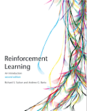

# 说明

因为官方翻译版本已经出版，本项目进入不定期更新维护。
请前往查看食用官方翻译版本：[强化学习](https://book.douban.com/subject/34809689/)。

# reinforcement-learning-an-introduction-chinese

本项目为《Reinforcement Learning: An Introduction》（第二版）中文翻译，旨在帮助喜欢
强化学习（Reinforcement Learning）的各位能更好的学习交流。

中文在线阅读地址：《[强化学习导论](https://rl.qiwihui.com)》
英文原版地址：[Reinforcement Learning: An Introduction](http://incompleteideas.net/book/the-book-2nd.html)

翻译进度：

- [ ] 第二版前言
- [ ] 第一版前言
- [x] 符号说明
- [x] 第1章（粗译，粗校）
- [x] 第2章（粗译）
- [x] 第3章（粗译）
- [x] 第4章（粗译）
- [x] 第5章（粗译）
- [x] 第6章（粗译）
- [x] 第7章（粗译）
- [x] 第8章（粗译）
- [x] 第9章（粗译）
- [x] 第10章（粗译）
- [x] 第11章（粗译）
- [ ] 第12章
- [ ] 第13章
- [ ] 第14章
- [x] 第15章
- [ ] 第16章
- [ ] 第17章
