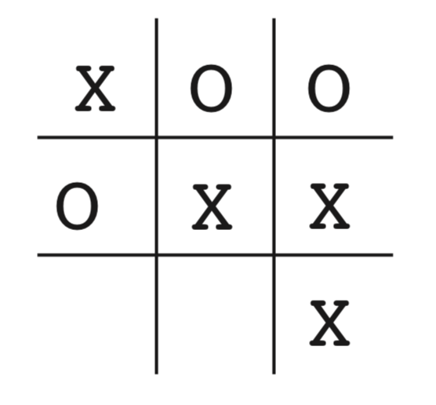

第1章 简介
===========

当我们思考学习的本质时，我们首先想到的是通过与环境互动来学习。
当一个婴儿玩耍，挥动手臂或环顾四周时，他没有明确的老师，但他确实通过直接的感觉与环境联系。
他可以通过这种联系获得大量关于因果关系、行动的结果以及如何实现目标的信息。
在我们的生活中，这种互动无疑是我们环境和自身知识的主要来源。
无论我们是学习驾驶汽车还是进行交谈，我们都敏锐地意识到我们的环境如何响应我们的行为，并且我们试图通过我们的行为来影响所发生的事情。
从互动中学习是几乎所有学习和智能理论的基本思想。

在本书中，我们探索了一种从交互中学习的 *计算* 方法。
我们主要探索理想化的学习情境并评估各种学习方法的有效性，而不是直接理解人或动物的学习方式 [#学习方式]_ 。也就是说，我们采用人工智能研究员或工程师的观点。
我们探索在解决科学或经济利益的学习问题方面有效的机器设计，通过数学分析或计算实验评估设计。
我们探索的方法称为 *强化学习*，更侧重于从交互中进行目标导向的学习，而不是其他机器学习方法。

.. [#学习方式] 第14章和第15章总结了心理学和神经科学的关系。

1.1 强化学习
------------

强化学习是一种学习如何将状态映射到动作，以获得最大奖励的学习机制。
学习者不会被告知要采取哪些行动，而是必须通过尝试来发现哪些行动会产生最大的回报。
在最有趣和最具挑战性的案例中，行动不仅可以影响直接奖励，还可以影响下一个状态，并通过下一个状态，影响到随后而来的奖励。
这两个特征 - 试错法和延迟奖励 - 是强化学习的两个最重要的可区分特征。

强化学习，就像许多名称以“ing”结尾的主题一样，例如机器学习和登山，同时也是一个问题，一类能够很好地解决问题的解决方法，以及研究这个问题及其解决方法的领域。
为所有三件事情使用单一名称是方便的，但同时必须保持三者（问题，方法，领域）在概念上的分离。
特别的，在强化学习中，区分问题和解决问题的方法是非常重要的；没有做出这种区分是许多混乱的根源。

我们使用动态规划理论的思想来规范化强化学习的问题，具体地说，是不完全已知的马尔可夫决策过程的最优控制。
这种规范化的详细描述将在第3章，但是最基本的思想是：采样实际问题最重要的方面，训练一个智能体多次与环境交互去达到一个目标。
智能体必须能够在某种程度上感知其环境状态，并且能够采取行动影响环境的状态。
智能体还必须具有与环境状态相关的一个或多个目标。
马尔科夫决策过程基本概念无差别的包含感知，行动和目标三个方面。
我们认为任何非常适合解决此类问题的方法都是一种强化学习方法。

强化学习不同于 *监督学习*。
监督学习是目前机器学习领域中研究最多的一种学习方式，它从知识渊博的教练所提供的有标记的训练集中学习。
每一个样例都是一种情况的描述，都带有标签，标签描述的是系统在该情况下的应该采取的正确动作，每一个样例用来区别这种情况应该属于哪一类。
这种学习的目的是让系统推断或概括它应有的反馈机制，使它可以对未知样本作出正确回应。
这是一种重要的学习方式，但单凭它并不足以从交互中学习。
在交互问题中，找到期待的既正确又典型的例子通常都是不切实际的。
在一个未知的领域，若要使收益最大化，智能体必须能够从自己的经验中学习。

强化学习也与机器学习研究人员所谓的 *无监督学习* 不同，后者通常是寻找隐藏在未标记数据集合中的结构。
监督学习和无监督学习这两个术语似乎对机器学习范式进行了详尽的分类，但事实却并非如此。
尽管人们可能会试图将强化学习视为一种无监督学习，因为它不依赖于正确行为的样例，强化学习试图最大化奖励信号而不是试图找到隐藏的结构。
在智能体的经验数据中揭示结构确实对强化学习特别有用，但是它本身并没有解决最大化奖励信号的强化学习问题。
因此，我们认为强化学习是第三种机器学习范式，除此之外还有监督学习和无监督学习，也许还有其他范式。

在强化学习中出现的其他类型的学习中未出现的挑战之一，是如何权衡探索与开发之间的关系。
为了获得大量奖励，强化学习智能体必须倾向于过去已经尝试过并且能够有效获益的行动。
但是要发现这样的行为，它必须尝试以前没有选择的行为。
智能体必须充分 *利用* 它既有经验以获得收益，但它也必须 *探索*，以便在未来做出更好的行动选择。
困境在于，任何探索和开发都难以避免失败。
智能体必须尝试各种行动，逐步地选择那些看起来最好的行动。
在随机任务中，每一个动作必须经过多次尝试才能得到可靠的预期收益。
几十年来，数学家一直在深入研究探索开发困境，但仍未得到解决。
就目前而言，在监督和无监督的学习中，至少在这些范式的最纯粹的形式中，完全平衡探索和开发的项目尚未出现。

强化学习的另一个关键特征是它明确地考虑了目标导向的智能体与不确定环境相互作用的 *整个* 问题。
这与许多考虑子问题但没有解决它们如何融入更大的图景的方法形成对比。
例如，我们已经提到很多机器学习研究都关注监督学习而没有明确说明这种能力最终如何有用。
其他研究人员已经制定了具有总体目标的规划理论，但没有考虑规划在实时决策中的作用，也没有考虑规划所需的预测模型来自何处的问题。
尽管这些方法已经产生了许多有用的结果，但它们一个重要的限制在于过于关注孤立子问题。

强化学习采取相反的策略，它具有一个完整的、交互式的、寻求目标的智能体。
所有强化学习智能体都有明确的目标，可以感知环境的各个方面，并可以选择影响其环境的行为。
此外，通常从一开始就假设智能体必须必须操作，尽管它面临的环境有很大的不确定性。
当强化学习涉及规划时，它必须解决规划和实时行动选择之间的相互作用，以及如何获取和改进环境模型的问题。
当强化学习涉及监督学习时，它要确定决定哪些能力是关键的，哪些是不重要的原因
为了学习研究以取得进步，必须隔离和研究重要的子问题，但它们应该是在完整的、交互式的、寻求目标的智能体中有明确功能的子问题，即使不能体现所有完整的细节。

一个完整的、交互式的、寻求目标的智能体，并不总是意味着像是一个完整的有机体或机器人
这里有许多明显的例子，但是一个完整的、交互式的、寻求目标的智能体也可以是更大行为系统的一个组成部分。
在这种情况下，智能体直接与较大系统的其余部分交互，并间接与较大系统的环境交互。
一个简单的例子是一个智能体，它监控机器人电池的充电水平并向机器人的控制架构发送命令。
这个智能体的环境是机器人的其余部分以及机器人的环境。
人们的眼光应超越最明显的智能体及其环境的例子，才能理解强化学习框架的普遍性。

现代强化学习最激动人心的一个方面是与其他工程和科学学科的实质性和富有成效的互动。
强化学习是人工智能和机器学习领域长达数十年的一个趋势，它与统计学、最优化和其他数学学科更紧密地结合在一起。
例如，某些强化学习方法学习参数的能力解决了运筹学与控制论中的经典“维数灾难”。
更有特色的是，强化学习也与心理学和神经科学有着紧密的联系，双方都有很大的好处。
在所有形式的机器学习中，强化学习最接近人类和其他动物所做的学习，而强化学习的许多核心算法最初都受到生物学习系统的启发。
通过动物学习的心理模型返回更符合经验数据的结果，以及通过一部分大脑奖励系统的有影响力的模型，强化学习也得到了反馈。
本书正文介绍了与工程和人工智能相关的强化学习的思想，并在第14章和第15章中总结了与心理学和神经科学的联系。

最后，强化学习也在某种程度上符合人工智能回归简单的一般性原则的一个大趋势。
自20世纪60年代后期以来，许多人工智能研究人员认为普遍性的原则是不存在的，而智能则归因于拥有大量特殊用途的技巧，过程和启发式方法。
有人说，如果我们能够将相关的事实充分地提供给一台机器，比如一百万或十亿，那么它就会变得聪明起来。
基于一般原则（如搜索或学习）的方法被定性为“弱方法”，而基于特定知识的方法被称为“强方法”。
这种观点在今天仍然很普遍，但并不占优势。
从我们的观点来看，这只是一个不成熟的过程：寻找一般原则的努力太少，以至于没有结论。
现代人工智能现在包括许多研究，寻找学习，搜索和决策的一般原则。
目前还不清楚钟摆会摆动多远，但强化学习研究肯定是摆向更简单和更少的人工智能一般原则的钟摆的一部分。

1.2 例子
--------

理解强化学习的一个好方法是思考其发展中的一些例子和可能的应用。

- 国际象棋大师落子。这个决定既通过计划 - 期待的回复和逆向回复，也出于对特定位置和移动及时直觉的判断。
- 自适应控制器实时调节炼油厂操作的参数。控制器在指定的边际成本的基础上优化产量/成本/质量交易，而不严格遵守工程师最初建议的设定点。
- 一头瞪羚在出生后几分钟挣扎着站起来。半小时后，它以每小时20英里的速度奔跑。
- 移动机器人决定是否应该进入新房间以寻找和收集更多垃圾来，或尝试回到充电站充电。
  它根据电池的当前充电水平，以及过去能够快速轻松地找到充电器的程度做出决定。
- 菲尔准备他的早餐。仔细检查，即使是这个看似平凡的活动，也会发现一个复杂的条件行为网和互锁的目标-子目标关系：
  走到橱柜，打开它，选择一个谷物盒，然后伸手去拿，抓住并取回盒子。
  需要其他复杂的，调整的，交互的行为序列来获得碗，勺子和牛奶盒。每个步骤都涉及一系列眼球运动，以获取信息并指导到达和运动。
  它们需要对于如何拿住物品或者在拿其他物品之前将它们中的一些运送到餐桌上做出快速判断。
  每个步骤都以目标为指导并为其他目标服务，例如抓勺子或走到冰箱，比如一旦谷物准备好就那勺子吃以最终获得营养。
  无论他是否意识到这一点，菲尔都在获取有关他身体状况的信息，这些信息决定了他的营养需求，饥饿程度和食物偏好。

这些示例共享的功能非常基本，很容易被忽略。
所有这些都涉及积极的决策智能体与其环境之间的 *互动*，智能体在存在不确定性的环境中寻求实现 *目标*。
智能体的行为能影响未来的环境状态（例如，下一个国际象棋位置，炼油厂的水库水位，机器人的下一个位置以及其电池的未来充电水平），从而影响智能体之后可以采取的行动和机会。
正确的选择需要考虑到行动的间接延迟后果，因此可能需要预见或规划。

同时，在所有这些例子中，行动的效果都无法完全预测; 因此，智能体必须经常监控其环境并做出适当的反应。
例如，菲尔必须观察他倒入谷物碗中的牛奶以防止溢出。
所有这些例子都涉及明确的目标，即智能体可以根据其直接感知的内容判断实现目标的进度。
国际象棋选手知道他是否获胜，炼油厂控制员知道生产了多少石油，瞪羚小牛知道它何时落下，移动机器人知道它的电池何时耗尽，菲尔知道他是否正在享用他的早餐。

在所有这些示例中，智能体可以使用其经验来改善其性能。
国际象棋选手改进了他用来评估位置的直觉，从而改善了他的发挥; 瞪羚小牛提高了它的活力; 菲尔学会精简他的早餐。
智能体在任务开始时所具有的的知识 - 无论是之前的相关任务经验还是通过设计或演变带来的 - 都会影响有用或易于学习的内容，
但与环境的交互对于调整行为以利用任务的特性更加至关重要。

1.3 强化学习的要素
------------------

在智能体和环境之外，强化学习系统一般有四个主要元素：*一个策略*，*奖励信号*，*价值函数*，和一个可选的环境 *模型*。

*策略* 定义了学习智能体在给定时间内的行为方式。
简单来说，策略是从感知的环境状态到在这些状态下要采取的行动的映射。
它对应于心理学中所谓的一组刺激-反应规则或关联。
在某些情况下，策略可以是简单的函数或查找表，而在其他情况下，它可能涉及广泛的计算，例如搜索过程。
策略是强化学习智能体的核心，因为它本身就足以确定行为。一般来说，策略对指定每个动作的概率而言可以是随机的。

*奖励信号* 定义了强化学习问题的目标。
在每个时间步骤，环境向强化学习智能体发送的单个数字称为奖励。
智能体的唯一目标是最大化其长期收到的总奖励。
因此，奖励信号定义了相对智能体而言的好事和坏事。
在生物系统中，我们可能会认为奖励类似于快乐或痛苦的经历。
它们是智能体所面临的问题的直接和明确特征。
奖励信号是改变政策的主要依据; 如果策略选择的操作之后是低奖励，则可以更改策略以在将来选择该情况下的某些其他操作。
通常，奖励信号可以是环境状态和所采取的动作的随机函数。

虽然奖励信号表明了直接意义上的好处，但 *价值函数* 指定了长期利益。
粗略地说，一个状态的价值是智能体从该状态开始在未来可以预期累积的收益总额。
虽然奖励决定了环境状态的直接，内在的价值，但价值表明了在考虑到可能遵循的状态和这些状态下可获得的奖励之后各状态的长期价值。
例如，一个状态可能总是会产生较低的即时奖励，但仍然具有较高的价值，因为其他状态经常会产生高回报。
或者正相反。
以人类作类比，奖励有点像快乐（如果是高的奖励）和痛苦（如果是低的奖励），而价值则对应于我们对环境处于特定状态的高兴或不满的更精确和有远见的判断。

奖励在某种意义上是主要的，而作为奖励预测的价值是次要的。
没有奖励就没有价值，估算价值的唯一目的就是获得更多回报。
然而，在制定和评估决策时，我们最关心的是价值。
行动选择基于价值判断。
我们寻求带来最高价值状态的行动，而不是最高回报状态的行动，因为从长远来看，这些行动会为我们带来最大的回报。
不幸的是，确定价值要比确定奖励要困难得多。
奖励基本上由环境直接给出，但必须根据智能体在其整个生命周期中所做的观察序列来估计和重新估计价值。
事实上，我们考虑的几乎所有强化学习算法中最重要的组成部分是一种有效估计价值的方法。
价值估计的核心作用可以说是过去六十年中有关强化学习的最重要的事情。

一些强化学习系统具有第四个也是最后一个要素，既环境 *模型*。
这是对环境的模拟，或者更一般地说，它对环境的行为做出推断。
例如，给定状态和动作，模型可以预测结果的下一状态和下一个奖励。
模型用于 *规划*，我们指的是在实行动前对未来进行预判。
使用模型和规划解决强化学习问题的方法被称为 *基于模型* 的方法，而不是更简单的 *无模型* 方法，
无模型方法几乎被看作是规划的 *反面*，它通过试错进行学习。
在第8章中，我们将探索强化学习系统，它们通过反复尝试来学习，学习环境模型，并使用模型进行规划。
现代强化学习已经从低级、尝试和错误学习跨越到高层次的、有计划的学习。

1.4 局限性和范围
----------------

强化学习在很大程度上依赖于状态的概念 - 作为策略和价值函数的输入，以及模型的输入和输出。
非正式地，我们可以将状态视为向智能体传达某种特定时间“环境如何”的信号。
我们在这里使用的状态的正式定义由第3章中提出的马尔可夫决策过程的框架给出。
然而，更一般地，我们鼓励读者遵循非正式意义并将状态视为智能体对其环境所能获得的任何信息。
实际上，我们假设状态信号是由某些预处理系统产生的，而预处理系统是智能体环境的一部分。
在本书中，我们没有讨论构造、改变或学习状态信号的问题（除了第17.3节中的简要说明）。
我们采用这种方法并不是因为我们认为状态不重要，而是为了完全关注决策问题。
换句话说，我们在本书中的关注不是设计状态信号，而是设计行为函数以应对各种状态。

我们在本书中所考虑的大部分强化学习方法都是围绕估计价值函数构建的，但它对于解决强化学习问题而言并不是必须的。
例如，诸如遗传算法，遗传规划，模拟退火和其他优化方法的解决方法已被用于研究强化学习问题，而不必求助于值函数。
这些方法应用多个静态策略，每个策略在较长时间内与单独的环境实例进行交互。
获得最多奖励的策略及其随机变化将延续到下一代政策，并重复该过程。
我们称这些进化方法是因为它们的操作类似于生物进化方式，这种方式产生具有熟练行为的生物，即使它们在个体生命期间内不学习。
如果策略空间足够小，或者容易被构造，或者如果有大量的时间可用于搜索，那么进化方法可能是有效的。
此外，进化方法在学习智能体不能感知环境的完整状态的问题上具有优势。

我们的重点是强化学习方法，这些方法在与环境交互时学习，而进化方法则不然。
在许多情况下，能够利用个体行为交互细节的方法比进化方法更有效。
进化方法忽略了对大量的强化学习问题的有用结构：他们没有利用策略是从状态到行动的映射这一事实；他们并没有注意到个体生命周期中所经历的状态和采取的行动。
在某些情况下，这些信息可能会产生误导（例如，当状态不确定的时候），但更经常的是它能使搜索更有效率。
虽然进化和学习有许多共同的特性并且自然地协同工作，但我们并不认为进化方法本身特别适合强化学习问题，因此，我们不在本书中讨论它们。

1.5 拓展例子：井字棋
--------------------

为了说明强化学习的一般概念并将其与其他方法进行对比，我们接下来将更详细地考虑一个简单的例子。

考虑熟悉的孩子玩的井字棋游戏。两名棋手轮流在一个三乘三的棋盘上比赛。
一个棋手画叉，另一个画圈，若叉或圈的连续三个棋子落于一行或一列或同一斜线上则获胜；若棋盘被填满也不能决出胜负则为平局。
因为熟练的棋手可以从不丢失棋，让我们假设我们正在与一个不完美的棋手对战，他的战术有时是不正确的，并且允许我们获胜。
而且，让我们考虑平局和亏损对我们同样不利。
我们如何构建一个能够在比赛中发现对手的漏洞并且学会最大化获胜机会的棋手？

虽然这是一个简单的问题，但是通过传统方法不能以令人满意的方式解决。
例如，来自博弈论的经典“极小极大（minimax）”解决方案在这里是不正确的，因为它假定了对手的特定玩法。
例如，“极小极大”棋手永远不会达到可能失去的游戏状态，即使事实上它总是因为对手的错误游戏而从该状态获胜。
经典的连续决策问题的最优方法，例如动态规划，可以为任何对手 *计算* 最优解，但需要输入该对手的完整规范，包括对手在每个棋盘状态下进行每次移动的概率。
让我们假设在这个问题中无法获得这些先验信息，因为它不适用于大多数实际问题。
另一方面，可以根据经验来估计这样的信息，在这个例子上就是和对手下许多盘棋。
关于在这个问题上可以做的最好的事情是首先学习对手的行为模型，达到某种程度的置信度，然后应用动态规划来计算近似对手模型的最优解。
最后，这与我们在本书后面讨论的一些强化学习方法没有什么不同。

应用于该问题的进化方法将直接搜索可能策略的空间，以找到取胜对手的高概率。
在这里，策略是一个规则，告诉玩家为每个游戏状态做出什么样的动作，即在三乘三的棋盘上所有可能的叉和圈的摆放位置。
对于所考虑的每个策略，通过与对手进行一些比赛来获得其获胜概率的估计。
然后，该评估将指导接下来考虑哪些策略。
一种典型的进化方法是将在策略空间中进行爬坡，然后在尝试进步的过程中依次生成和评估策略。
或者，也许可以使用遗传式算法来维护和评估一系列策略。
实际上，我们有上百种不同的优化方法。

以下是使用值函数的方法来解决井字棋问题的方法。
首先，我们将建立一个数字表，每个数字对应一个可能的游戏状态。
每个数字都是我们从该状态获胜的概率的最新估计。
我们将此估计视为状态 *价值*，整个表是学习的价值函数。
如果我们从A获胜的概率的当前估计值高于从B开始的概率，我们就认为状态A的价值高于状态B，或被认为比状态B“更好”。
假设我们总是玩叉，那么对于所有三个叉居于一行的状态的获胜概率是1，因为我们已经赢了。
类似地，对于连续三个圈居于一行或棋盘全部填满的所有状态，获胜的概率为0，因为我们无法从中获胜。
我们将所有其他状态的初始值设置为0.5，表示我们有50％的获胜机会。

我们和对手打了许多场比赛。为了选择我们的动作，我们检查每个动作可能产生的状态（在棋盘上的每个空格中有一个），并在表中查找它们当前的值。
大多数时候，我们贪婪地移动，选择最有价值的运动，也就是说，以最高的获胜概率。然而，偶尔我们会从其他动作中随机选择。
这些被称为探索性的行动，因为它们使我们体验到我们可能从未见过的状态。在游戏中移动和考虑的序列可绘制成图1.1。

我们与对手进行了很多场比赛。
为了选择我们的动作，我们检查每个可能动作（在棋盘上的每个空格中有一个）将产生的状态，并在表格中查找它们当前的值。
大多数时候，我们 *贪婪地* 行动，选择具有最大价值的状态的动作，即具有最高的估计获胜概率。
然而，偶尔我们会从其他动作中随机选择。
这些被称为 *探索性* 动作，因为它们使我们体验到我们可能永远不会看到的状态。
在游戏中移动和考虑的一系列动作可以如图1.1所示。

.. _figure_1.1:
.. figure:: _static/images/chapter1/figure-1.1.png

  图1.1：一系列井字游动。黑色实线代表游戏中所采取的动作; 虚线表示我们（我们的强化学习者）考虑但未做出的动作。
  我们的第二步移动是一次探索性的举动，这意味着e*所表示的移动在等级上优于当前举动。
  探索性移动不会导致任何学习，但是我们的其他每个移动都会导致更新，如红色箭头弧线所示，其估计值自下而上移动到早期节点，如文中详述。

在我们比赛期间，我们按游戏中的发现不断改变状态的值。
我们试图让他们更准确地估计获胜的可能性。
为此，在贪婪移动后，我们重写前一状态的值，如图1.1中的箭头所示。
更准确地说，前一状态的当前值被更新为更接近后续状态的值。
这可以通过将先前状态的值移动到稍后状态的值的一小部分来完成。
如果我们让 :math:`S_t` 表示贪婪移动之前的状态，而 :math:`S_{t+1}` 表示移动之后的状态，
那么将 :math:`S_t` 的估计值的更新表示为 :math:`V(S_t)`，可以写为

.. math::
    V(S_t) \leftarrow V(S_t) + \alpha \left[ V(S_{t+1}) - V(S_t) \right]

其中 :math:`\alpha` 是小正分数，称为 *步长*，它影响学习速度。
此更新规则是 *时序差分* 学习方法的示例，之所以称为时序差分，
是因为其变化基于两个连续时间的估计之间的差，即 :math:`V(S_{t+1}) - V(S_t)`。

上述方法在此任务上表现良好。例如，如果步长参数随着时间的推移而适当减小，那么对于任何固定的对手，该方法会收敛于在给定玩家最佳游戏的情况下从每个状态获胜的真实概率。
此外，采取的动作（探索性动作除外）实际上是针对这个（不完美的）对手的最佳动作。
换句话说，该方法收敛于针对该对手玩游戏的最佳策略。
如果步长参数没有随着时间的推移一直减小到零，那么这个玩家也可以很好地对抗那些慢慢改变他们的比赛方式的对手。

这个例子说明了进化方法和学习价值函数的方法之间的差异。
为了评估策略，进化方法保持策略固定并且针对对手进行多场游戏，或者使用对手的模型模拟多场游戏。
胜利的频率给出了对该策略获胜的概率的无偏估计，并且可用于指导下一个策略选择。
但是每次策略进化都需要多场游戏来计算概率，而且计算概率只关心最终结果，*每场游戏内* 的信息被忽略掉了，。
例如，如果玩家获胜，那么游戏中的 *所有* 行为都会被认为是正确的，而不管具体移动可能对获胜至关重要。
甚至从未发生过的动作也会被认为正确！相反，值函数方法允许评估各个状态。
最后，进化和价值函数方法都在搜索策略空间，但价值函数学习会利用游戏过程中可用的信息。

这个简单的例子说明了强化学习方法的一些关键特征。
首先，强调在与环境交互时学习，在这里就是与对手玩家下棋。
其次，有一个明确的目标，正确的行为需要计划或前瞻，考虑到选择的延迟效果。
例如，简单的强化学习玩家将学习为短视的对手设置多行动陷阱。
强化学习解决方案的一个显着特征是它可以在不使用对手模型的情况下实现规划和前瞻的效果，并且无需对未来状态和动作的可能序列进行明确搜索。

虽然这个例子说明了强化学习的一些关键特征，但它很简单，它可能给人的印象是强化学习比实际上更有限。
虽然井字游戏是一个双人游戏，但强化学习也适用于没有外部对手的情况，即在“对自然的游戏”的情况下。
强化学习也不仅限于行为分解为单独步骤的问题，如井字棋游戏，仅在每步结束时奖励。
当行为无限持续并且可以随时接收各种大小的奖励时，它也是适用的。
强化学习也适用于甚至不能分解为像井字棋游戏这样的离散时间步骤的问题。
一般原则也适用于连续时间问题，虽然理论变得更加复杂，我们在这份简介中省略了。

井字棋游戏具有相对较小的有限状态集，而当状态集非常大或甚至无限时，也可以使用强化学习。
例如，Gerry Tesauro（1992,1995）将上述算法与人工神经网络相结合，学习玩西洋双子棋，其具有大约 :math:`10^20` 个状态。
在这么多状态中，只能经历一小部分。Tesauro的规划学得比以前的任何规划都要好得多，最终比世界上最好的人类队员更好（第16.1节）。
人工神经网络为程序提供了从其经验中范化的能力，以便在新状态下，它根据从其网络确定的过去面临的类似状态保存的信息来选择移动。
强化学习系统在如此大型状态集的问题中如何运作，与它从过去的经验中范化程度密切相关。
正是在这个角色中，我们最需要有强化学习的监督学习方法。
人工神经网络和深度学习（第9.6节）并不是唯一或最好的方法。

在这个井字棋游戏的例子中，学习开始时没有超出游戏规则的先验知识，但强化学习绝不需要学习和智能的白板视图（a tabula rasa view）。
相反，先验信息可以以各种方式结合到强化学习中，这对于有效学习是至关重要的（例如，参见第9.5，17.4和13.1节）。
我们也可以在井字棋游戏示例中访问真实状态，而强化学习也可以在隐藏部分状态时应用，或者当学习者看到不同状态相同时也可以应用强化学习。

最后，井字棋游戏玩家能够向前看并知道每个可能移动所产生的状态。
要做到这一点，它必须拥有一个游戏模型，使其能够预见其环境如何随着它可能永远不会发生的动作变化而变化。
许多问题都是这样的，但在其他问题上，甚至缺乏行动效果的短期模型。
在任何一种情况下都可以应用强化学习。不需要模型，但如果模型可用或可以学习，则可以轻松使用模型（第8章）。

另一方面，也有根本不需要任何环境模型的强化学习方法。
无模型系统甚至无法预测其环境如何响应单一操作而发生变化。
对于对手来说，井字棋游戏玩家没有任何类型的对手的模型，则他是无模型的。
因为模型必须合理准确才有用，所以当解决问题的真正瓶颈是构建足够精确的环境模型时，无模型方法可以优于更复杂的方法。
无模型方法同时也是基于模型的方法的重要构建模块。
在我们讨论如何将它们用作更复杂的基于模型的方法的组件之前，我们在本书中将用几个章节专门介绍无模型方法。

强化学习可以在系统的高级和低级层次中使用。
虽然井字游戏玩家只学习游戏的基本动作，但没有什么可以阻止强化学习在更高层次上工作，其中每个“动作”本身可能是一个复杂的问题解决方法的应用。
在分层学习系统中，强化学习可以在几个层面上同时工作。

练习1.1：*自我对弈* 假设上面描述的强化学习算法不是与随机对手对抗，而是双方都在学习。在这种情况下你认为会发生什么？是否会学习选择不同的行动策略？

练习1.2：*对称性* 由于对称性，许多井字位置看起来不同但实际上是相同的。我们如何修改上述学习过程以利用这一点？
这种变化会以何种方式改善学习过程？现在再想一想。假设对手没有利用对称性。在那种情况下，我们应该吗？那么，对称等价位置是否必须具有相同的价值？

练习1.3：*贪婪的游戏* 假设强化学习玩家是 *贪婪的*，也就是说，它总是选择使其达到最佳评分的位置。
它可能会比一个不贪婪的玩家学得更好或更差吗？可能会出现什么问题？

练习1.4：*从探索中学习* 假设在 *所有* 动作之后发生了学习更新，包括探索性动作。
如果步长参数随时间适当减小（但不是探索倾向），则状态值将收敛到不同的概率集。
从探索性动作中的学习，我们行动和不行动的两组计算的概率（概念上）是什么？
假设我们继续做出探索性的动作，哪一组概率可能更好学习？哪一格会赢得更多？

练习1.5：*其他改进* 你能想到其他改善强化学习者的方法吗？你能想出更好的方法来解决所提出的井字棋游戏问题吗？

1.6 小结
--------

强化学习是一种理解和自动化目标导向学习和决策的计算方法。
它与其他计算方法的区别在于它强调智能体通过与环境的直接交互来学习，而不需要模范监督或完整的环境模型。
我们认为，强化学习是第一个认真解决从与环境互动中学习以实现长期目标时出现的计算问题的领域。

强化学习使用马尔可夫决策过程的正式框架来定义学习智能体与其环境之间在状态，行为和奖励方面的交互。
该框架旨在表示人工智能问题的基本特征。
这些特征包括因果性，不确定感和不确定性（a sense of uncertainty and nondeterminism），以及明确目标的存在。

价值和价值函数的概念是我们在本书中考虑的大多数强化学习方法的关键。
我们认为价值函数对于策略空间中的高效搜索非常重要。
价值函数的使用将强化学习方法与在整个策略评估指导下直接搜索策略空间的进化方法区分开来。

1.7 强化学习早期历史
--------------------

书目备注
--------

关于强化学习的其他一般性报道，我们建议读者参考阅读Szepesv ari（2010），Bertsekas和Tsitsiklis（1996），
Kaelbling（1993a）以及Sugiyama，Hachiya和Morimura（2013）的书籍。
从控制或操作研究角度出发的书籍包括Si，Barto，Powell和Wunsch（2004），Powell（2011），Lewis和Liu（2012）以及Bertsekas（2012）。
Cao（2009）的综述将强化学习置于其他学习和优化随机动力系统的背景下。
机器学习期刊的三个特刊专注于强化学习：Sutton（1992a），Kaelbling（1996）和Singh（2002）。
Barto（1995b）；Kaelbling，Littman和Moore（1996）以及Keerthi和Ravindran（1997）分别提供了有用的调查。
Weiring和van Otterlo（2012）编辑的卷提供了对最近发展的精彩概述。

1.2 本章菲尔早餐的例子灵感来自Agre（1988）。

1.5 第6章介绍了在井字棋示例中使用的时间差分方法。
