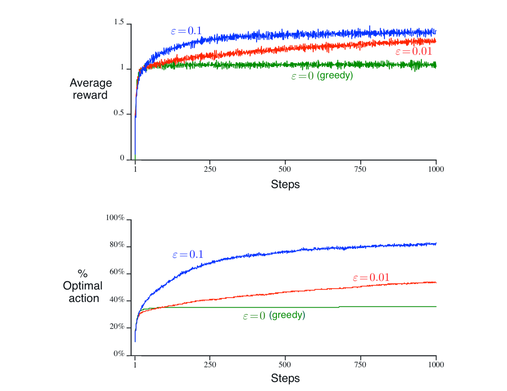
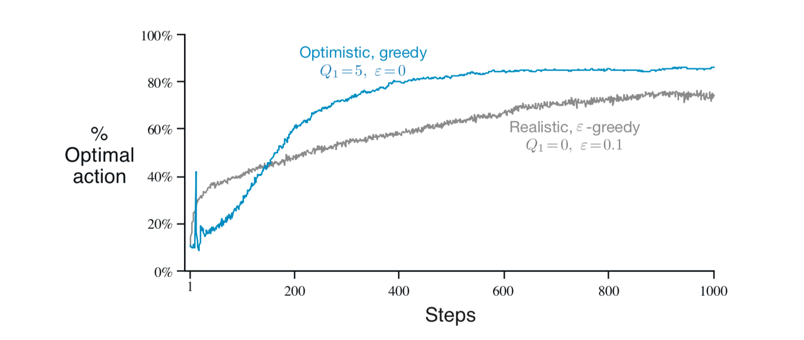

第2章 k臂老虎机问题
====================

区分强化学习与其他类型学习的最重要特征是，它使用训练信息来 *评估* 所采取的行动，而不是通过给予正确的行动来 *指导*。
这就是为了明确寻找良好行为而产生积极探索的需要。
纯粹的评价反馈表明所采取的行动有多好，但不表明它是最好还是最坏的行动。
另一方面，纯粹的指导性反馈表明采取的正确行动，与实际采取的行动无关。
这种反馈是监督学习的基础，包括模式分类，人工神经网络和系统识别的大部分。
在它们的纯粹形式中，这两种反馈是截然不同的：评价反馈完全取决于所采取的行动，而指导性反馈则与所采取的行动无关。

在本章中，我们在简化的环境中研究强化学习的评价方面，该方法不涉及学习如何在多种情况下行动。
这种 *非关联性* 设置是大多数先前涉及评估反馈的工作已经完成的，并且它避免了完整强化学习问题的大部分复杂性。
研究这个案例使我们能够最清楚地看到评价性反馈如何与指导性反馈的不同，但可以与之相结合。

我们探索的特定非关联评价性反馈问题是k臂老虎机问题的简单版本。
我们使用这个问题来介绍一些基本的学习方法，我们将在后面的章节中对其进行扩展，以应用于完全强化学习问题。
在本章的最后，我们通过讨论当老虎机问题变为关联时会发生什么，即在不止一种情况下采取行动，这种情况更接近完整的强化学习问题。

2.1 一个 :math:`k` 臂老虎机问题
-------------------------------

考虑以下学习问题。你可以反复面对 :math:`k` 种不同的选择或行动。在每次选择之后，你会收到一个数值奖励，该奖励取决于你选择的行动的固定概率分布。
你的目标是在一段时间内最大化预期的总奖励，例如，超过1000个操作选择或 *时间步骤*。

这是 :math:`k` 臂老虎机问题的原始形式，通过类比于老虎机或“单臂强盗”命名，除了它有k个拉杆而不是一个。
每个动作选择就像一个老虎机的拉杆游戏，奖励是击中累积奖金的奖金。
通过反复的行动选择，你可以通过将你的行动集中在最佳杠杆上来最大化你的奖金。
另一个类比是医生在一系列重病患者的实验治疗之间进行选择。每个动作都是治疗的选择，每个奖励都是患者的生存或幸福。
今天，“老虎机问题”一词有时用于上述问题的概括，但在本书中我们用它来指代这个简单的情况。

在我们的 :math:`k` 臂老虎机中，只要选择了该动作，:math:`k` 个动作的每一个都有预期的或平均的奖励，让我们称之为该行动的 *价值*。
我们将在时间步 :math:`t` 选择的动作表示为 :math:`A_t`，并将相应的奖励表示为 :math:`R_t`。
然后，对于任意动作 :math:`a` 的价值，定义 :math:`q_{*}(a)` 是给定 :math:`a` 选择的预期奖励：

.. math::

    q_{*}(a) \doteq \mathbb{E}[R_t|A_t=a]

如果你知道每个动作的价值，那么解决 :math:`k` 臂老虎机问题将是轻而易举的：你总是选择具有最高价值的动作。
我们假设你不确定地知道动作价值，尽管你可能有估计值。
我们将在时间步骤 :math:`t` 的动作 :math:`a` 的估计值表示为 :math:`Q_t(a)`。
我们希望 :math:`Q_t(a)` 接近 :math:`q_{*}(a)`。

如果你保持对动作价值的估计，那么在任何时间步骤中至少有一个其估计值最大的动作。我们把这些称为 *贪婪* 行为。
当你选择其中一个动作时，我们会说你正在 *利用* 你当前对动作价值的了解。
相反，如果你选择了一个非常规动作，那么我们就说你正在 *探索*，因为这可以让你提高你对非行动动作价值的估计。
利用是在一步中最大化预期的奖励的最好的方法，但从长远来看，探索可能会产生更大的总回报。
例如，假设贪婪行为的价值是确定的，而其他一些动作估计几乎同样好，但具有很大的不确定性。
不确定性使得这些其他行动中的至少一个实际上可能比贪婪行动更好，但你不知道哪一个。
如果你有很多时间步骤可以选择行动，那么探索非贪婪行动并发现哪些行动比贪婪行动可能会更好。
在短期内，奖励在探索期间较低，但从长远来看更高，因为在你发现更好的行动之后，你可以多次利用 *它们*。
因为无法探索和利用任何单一行动选择，人们通常会提到探索和利用之间的“冲突”。

在任何特定情况下，探索或利用是否更好在某种复杂方式上取决于估计的精确值，不确定性和剩余步骤的数量。
有许多复杂的方法可以平衡探索和利用 :math:`k` 臂老虎机的特定数学公式和相关问题。
然而，这些方法中的大多数都对关于平稳性和先验知识做出了强有力的假设，这些假设在应用程序中被违反或无法验证，
在随后的章节中我们会考虑完整的强化学习问题。当这些方法的假设不适用时，对这些方法的最优性或有限损失的保证并不太好。

在本书中，我们不担心以复杂的方式平衡探索和利用；我们只担心平衡它们。
在本章中，我们为 :math:`k` 臂老虎机提出了几种简单的平衡方法，并表明它们比总是利用的方法更好。
平衡探索和利用的需要是强化学习中出现的一个独特挑战；我们的 :math:`k` 臂老虎机问题的简单性使我们能够以一种特别清晰的形式展示这一点。

2.2 行动价值方法
------------------

我们首先仔细研究估算行动价值，并使用估算来做出行动选择决策的方法，我们统称为 *行动价值方法*。
回想一下，当选择该动作时，动作的真实价值就是平均奖励。估计这一点的一种自然方法是平均实际收到的奖励：

.. math::
    :label: 2.1

    Q_t(a) \doteq \frac{在t之前采取a动作的奖励总和}{在t之前采取a动作的次数}
    = \frac{\sum_{i=1}^{t-1}R_i \cdot \mathbb{1}_{A_i=a}}{\sum_{i=1}^{t-1}\mathbb{1}_{A_i=a}}

其中 :math:`\mathbb{1}_{谓词}` 表示随机变量，如果谓词为真，则为1，如果不是则为0。
如果分母为零，那么我们将 :math:`Q_t(a)` 定义为某个默认值，例如0。
当分母变为无穷大时，根据大数定律，:math:`Q_t(a)` 收敛于 :math:`q_*(a)`。
我们将其称为用于估计行动值的 *样本平均* 方法，因为每个估计值是相关奖励样本的平均值。
当然，这只是估算行动价值的一种方式，而不一定是最佳方法。
然而，现在让我们继续使用这种简单的估算方法，并转向如何使用估算来选择行动的问题。

最简单的动作选择规则是选择具有最高估计值的动作之一，即上一节中定义的贪婪动作之一。
如果存在多个贪婪动作，则可以以任意方式（可能是随机的）在它们之间进行选择。
我们把这个贪婪的动作选择方法写成

.. math::
    :label: 2.2

    A_t = \mathop{argmax} \limits_{a} Q_t(a)

其中 :math:`argmax_a` 表示随后的表达式最大时的动作a（再次，任意地断开关系）。
贪婪行动选择总是利用当前的知识来最大化立即奖励；它没有花时间采取明显劣质的行动来看看它们是否真的会更好。
一个简单的替代方案是在大多数情况下贪婪地行动，但每隔一段时间，以较小的概率 :math:`\varepsilon`，
从动作价值估计中独立地从具有相同概率的所有动作中随机选择。
我们称使用此近乎贪婪的行动选择规则的方法为 :math:`\varepsilon` *贪婪* 方法。
这些方法的一个优点是，在步数增加的限度内，每个动作将被无限次采样，从而确保所有 :math:`Q_t(a)` 收敛于 :math:`q_*(a)`。
这当然意味着选择最优动作的概率收敛于大于 :math:`1-\varepsilon` 的数，即接近确定。
然而，这些只是渐近保证，并且对方法的实际有效性几乎没有说明。

*练习2.1* 在 :math:`\varepsilon` 贪婪动作选择中，对于两个动作的情况和 :math:`\varepsilon=0.5`，
选择贪婪动作的概率是多少？

2.3 10臂老虎机试验
-------------------

为了粗略评估贪婪和 :math:`\varepsilon` 贪婪行动价值方法的相对有效性，
我们在一系列测试问题上对它们进行了数值比较。这是一组2000个随机生成的 :math:`k` 臂老虎机问题，:math:`k = 10`。
对于每个老虎机问题，如图2.1所示，动作价值 :math:`q_*(a)，a = 1 , \dots, 10`，
根据具有均值为0和方差为1的正态（高斯）分布来选择。

.. _figure_2.1:
.. figure:: images/figure-2.1.png

    **图2.1** 一个10臂的老虎机问题例子。根据具有均值和方差为0的正态分布选择十个动作的每一个的真值 :math:`q_*(a)`，
    然后根据平均 :math:`q_*(a)` 单位方差正态分布选择实际奖励，如这些灰色分布显示。

然后，当应用于该问题的学习方法选择动作 :math:`A_t` 时，
从具有均值 :math:`q_*(A_t)` 和方差1的正态分布中选择实际奖励 :math:`R_t`。
这些分布在图2.1中以灰色显示。我们将这套测试任务称为 *10臂老虎机试验*。
对于任何学习方法，我们可以测量其性能和行为，因为它在应用于其中一个老虎机问题时经历了超过1000个时间步骤。
这组成了一次 *运行*。重复这样的独立运行2000次，每次运行都有不同的老虎机问题，我们便获得了学习算法的平均行为的度量。

如上所述，图2.2比较了10臂老虎机试验上的贪婪方法和两个 :math:`\varepsilon` 贪婪方法
（:math:`\varepsilon=0.01` 和 :math:`\varepsilon=0.1`）。
所有方法都使用样本平均技术形成了它们的动作值估计。上图显示了带有经验的预期奖励的增加。
贪婪方法在开始时比其他方法改善略快，但随后在较低水平上稳定下来。
它只获得了大约1的每步奖励，在这个测试平台上，最好的约为1.55。
从长远来看，贪婪的方法表现得更糟，因为它经常被卡在执行欠佳的动作。
下图显示贪婪的方法只在大约三分之一的任务中找到了最佳动作，其他三分之二的最佳动作的初始样本令人失望，而且它从未回归过它。
:math:`\varepsilon` 贪婪方法最终表现得更好，因为他们会继续探索并提高他们识别最佳动作的机会。
:math:`\varepsilon=0.1` 的方法探索得更多，并且通常更早地发现了最佳动作，但它从未在91％的时间内选择该动作。
:math:`\varepsilon=0.01` 的方法改进得更慢，但最终，
在关于图中所示的两种性能指标上会比 :math:`\varepsilon=0.1` 的方法更好。
同时间，他还可以随着时间的推移减少 :math:`\varepsilon` 以试图获得最佳的高值和低值。

.. _figure_2.2:

    **图2.2** 10臂老虎机试验中的 :math:`\varepsilon` 贪婪行动价值方法的平均表现。
    这些数据是2000轮以上不同老虎机问题的平均值。所有方法都使用样本平均值作为其行动价值估计。

:math:`\varepsilon` 贪婪方法优于贪婪方法的优势取决于任务。例如，假设奖励方差较大，比如说10而不是1。
有了更嘈杂的奖励，需要更多的探索才能找到最佳动作，并且 :math:`\varepsilon` 贪婪相对于贪婪的方法，使用方法应该更好。
另一方面，如果奖励方差为零，则贪婪方法在尝试一次后就会知道每个动作的真实价值。
在这种情况下，贪婪方法实际上可能表现最佳，因为它很快就能找到最佳动作，然后再也不会探索。
但即使在确定性案例如果我们削弱其他一些假设，那么探索将是一个很大的优势。
例如，假设老虎机任务是非平稳的，即行动的真实价值随着时间而变化。
在这种情况下，即使在确定性案例中也需要进行探索，以确保其中一个非贪婪动作没有变得比贪婪动作更好。
正如我们将在接下来的几章中看到的那样，非平稳性是在强化学习中最常遇到的情况。
即使基础任务是固定的和确定的，学习者也面临着一系列类似老虎机的决策任务，随着学习的进行和个体的决策制定策略的变化，这些决策随着时间的推移而变化。
强化学习需要在探索和利用之间取得平衡。

*练习2.2* 老虎机示例 考虑具有 :math:`k=4` 动作的:math:`k` 臂老虎机问题，表示为1，2，3和4。
对于此问题，考虑使用 :math:`\varepsilon` 贪婪动作选择，样本平均动作值估计的老虎机算法，
对于所有a，初始估计为 :math:`Q_1(a)=0`。
假设动作和奖励的初始序列是 :math:`A_1 = 1`，:math:`R_1 = 1`，:math:`A_2 = 2`，
:math:`R_2 = 1`，:math:`A_3 = 2`，:math:`R_3 = 2`，:math:`A_4 = 2`，
:math:`R_4 = 2`，:math:`A_5 = 3`，:math:`R_5 = 0`。
在某些时间步骤中，:math:`\varepsilon` 情况可能已经发生，导致随机选择动作。
在哪个时间步骤确实发生了？在哪些时间步骤可能发生？

*练习2.3* 在图2.2所示的比较中，从累积奖励和选择最佳动作的概率来看，哪种方法在长期运行中表现最佳？会有多好？定量地表达你的答案。

2.4 增量实现
-------------

到目前为止我们讨论过的行动价值方法都将行动值估计为观察到的奖励的样本平均值。
我们现在转向如何以计算上有效的方式计算这些平均值的问题，特别是具有恒定内存和恒定的时间步长计算。

为了简化表示法，我们专注于单一动作。让 :math:`R_i` 现在表示在第i次选择 *此动作* 之后收到的奖励，
并且让 :math:`Q_n`表示在其被选择 :math:`n-1` 次之后其动作价值的估计，我们现在可以简单地将其写为

.. math::

    Q_n \doteq \frac{R_1 + R_2 + \dots + R_{n-1}}{n-1}

显而易见的实现是维护所有奖励的记录，然后在需要估计价值时执行该计算。
但是，如果这样做，那么随着时间的推移，内存和计算要求会随着更多的奖励而增长。
每个额外的奖励都需要额外的内存来存储它，并需要额外的计算来计算分子中的总和。

您可能怀疑，这不是必需的。通过处理每个新奖励所需的小的，恒定的计算，很容易设计用于更新平均值的增量公式。
给定 :math:`Q_n` 和第n个奖励 :math:`R_n`，所有n个奖励的新平均值可以通过以下计算得出

.. math::
    :label: 2.3

    \begin{align*}
    Q_{n+1} &= \frac{1}{n}\sum_{i=1}^{n}R_i \\
            &= \frac{1}{n}(R_n + \sum_{i=1}^{n-1}R_i) \\
            &= \frac{1}{n}(R_n + (n-1)\frac{1}{n-1} \sum_{i=1}^{n-1}R_i) \\
            &= \frac{1}{n}(R_n + (n-1)Q_n) \\
            &= \frac{1}{n}(R_n + nQ_n-Q_n) \\
            &= Q_n + \frac{1}{n}(R_n - Q_n)
    \end{align*}

即使对于 :math:`n=1` 也保持，对于任意 :math:`Q_1`，获得 :math:`Q_2 = R_1`。
该实现仅需要 :math:`Q_n` 和 n 的存储器，并且每个新的奖励仅需要小的计算（2.3）。
此更新规则（2.3）是本书中经常出现的一种形式。 一般形式是

.. math::
    :label: 2.4

    新估计 \leftarrow 旧估计 + 步长 [目标 - 旧估计]

表达式 :math:`[目标 - 旧估计]` 是估计中的误差。通过向“目标”迈出一步来减少它。
目标被假定为指示移动的理想方向，尽管它可能是嘈杂的。例如，在上述情况下，目标是第n个奖励。

请注意，增量方法（2.3）中使用的步长参数（StepSize）会从时间步长到时间步长变化。
在处理动作a的第n个奖励时，该方法使用步长参数 :math:`\frac{1}{n}`。
在本书中，我们使用 :math:`\alpha` 或者更一般地使用 :math:`\alpha_t(a)` 表示步长参数。

使用递增计算的样本平均值的完整老虎机算法的伪代码和 :math:`\varepsilon` 贪婪动作选择在下面的框中显示。
假设函数 :math:`bandit(a)` 采取行动并返回相应的奖励。

.. admonition:: 简单的老虎机算法
    :class: important

    初始化，a 从 1 到 k：

    .. math::

        \begin{aligned}
        &Q(a) \leftarrow 0 \\
        &N(a) \leftarrow 0
        \end{aligned}

    一直循环：

    .. math::

        \begin{aligned}
        &A \leftarrow
        \begin{cases}
        argmax_aQ(a) &  以 1-\varepsilon 概率 （随意打破关系）\\
        随机动作 & 以 \varepsilon 概率
        \end{cases} \\
        &R \leftarrow bandit(a) \\
        &N(A) \leftarrow N(A) + 1 \\
        &Q(A) \leftarrow Q(A) + \frac{1}{N(A)}\left[R-Q(A)\right]
        \end{aligned}

2.5 追踪非平稳问题
-------------------

到目前为止讨论的平均方法适用于固定老虎机问题，即对于其中奖励概率不随时间变化的老虎机问题。
如前所述，我们经常会遇到非常不稳定的强化学习问题。 在这种情况下，给予最近的奖励比给长期的奖励更重要。
最常用的方法之一是使用常量步长参数。例如，用于更新 :math:`n-1` 过去奖励的平均 :math:`Q_n` 的增量更新规则（2.3）被修改为

.. math::
    :label: 2.5

    Q_{n+1} \doteq Q_n + \alpha(R_n - Q_n)

步长参数 :math:`\alpha \in (0, 1]` 是常数。
这导致 :math:`Q_{n+1}` 是过去奖励和初始估计 :math:`Q_1` 的加权平均值：

.. math::
    :label: 2.6

    \begin{align*}
    Q_{n+1} &= Q_n + \alpha(R_n - Q_n) \\
    &= \alpha R_n + (1-\alpha)Q_n \\
    &= \alpha R_n + (1-\alpha)[\alpha R_{n-1} + (1-\alpha)Q_{n-1}] \\
    &= \alpha R_n + (1-\alpha)\alpha R_{n-1} + (1-\alpha)^2 \alpha R_{n-2} + \\
    & \qquad \qquad \dots + (1-\alpha)^{n-1}\alpha R_1 + (1-\alpha)^nQ_1 \\
    &= (1-\alpha)^nQ_1 + \sum_{i=1}^{n}\alpha(1-\alpha)^{n-i}R_i
    \end{align*}

我们称之为加权平均值，
因为权重之和为 :math:`(1-\alpha)^n + \sum_{i=1}^{n}\alpha(1-\alpha)^{n-i} = 1`，
你可以自行验证。注意，给予奖励 :math:`R_i` 的权重 :math:`\alpha(1-\alpha)^{n-i}`
取决于之前有多少奖励，可以观察到为 :math:`n-i`。
:math:`1-\alpha` 小于1，因此给予 :math:`R_i` 的权重随着介入奖励数量的增加而减少。
实际上，权重根据 :math:`1-\alpha` 的指数呈指数衰减。
（如果 :math:`1-\alpha=0`，则所有权重都在最后一个奖励 :math:`R_n` 上，因为我们预订 :math:`0^0 = 1`。）
因此，这有时被称为 *指数新近加权平均值*。

有时，逐步改变步长参数是很方便的。
让 :math:`\alpha_n(a)` 表示用于处理在第n次动作选择a之后收到的奖励的步长参数。
正如我们已经注意到的，选择 :math:`\alpha_n(a)=\frac{1}{n}` 导致样本平均方法，
保证通过大数定律收敛到真实的行动价值。但当然，对序列 :math:`\{\alpha_n(a)\}` 的所有选择都不能保证收敛。
随机逼近理论中的一个众所周知的结果为我们提供了确保收敛概率为1所需的条件：

.. math::
    :label: 2.7

    \sum_{n=1}^{\infty}\alpha_n(a) = \infty 和 \sum_{n=1}^{\infty}\alpha_n^2(a) < \infty

第一个条件是保证步骤足够大以最终克服任何初始条件或随机波动。第二个条件保证最终步骤变得足够小以确保收敛。

注意，对于样本平均情况，:math:`\alpha_n(a)=\frac{1}{n}` 都满足两个收敛条件，
但对于恒定步长参数的情况不符合，:math:`\alpha_n(a)=n`。
在后一种情况下，不满足第二个条件，表明估计值从未完全收敛，但是响应于最近收到的奖励而继续变化。
正如我们上面提到的，这在非平稳环境中实际上是可取的，并且在强化学习中最常见的是非常不稳定的问题。
另外，满足条件（2.7）的步长参数序列通常非常缓慢地收敛或需要相当大的微调以获得令人满意的收敛速率。
尽管满足这些收敛条件的步长参数序列通常用于理论工作，但它们很少用于应用和实证研究。

*练习2.4* 如果步长参数 :math:`\alpha(a)` 不是常数，则估计值 :math:`Q_n` 是先前收到的奖励的加权平均值，
其权重不同于（2.6）给出的权重。对于一般情况，类似于（2.6），就步长参数的顺序而言，每个先前奖励的权重是什么？

*练习2.5（编程）* 设计并进行实验，以证明样本平均方法对非平稳问题的困难。
使用10臂老虎机试验的修改版本，其中所有 :math:`q_*(a)` 开始相等，然后采取独立的随机游走
（比如在每一步通过向所有 :math:`q_*(a)` 添加均值为0且标准差为0.01的正态分布增量）。
使用样本平均值，增量计算和使用常量步长参数的另一个动作值方法，:math:`\alpha=0.1`，绘制如图2.2所示的动作值方法的图。
使用 :math:`\varepsilon=0.1` 和更长的运行，比如10000步。

2.6 乐观的初始值
-----------------

到目前为止我们讨论的所有方法在某种程度上都依赖于初始行动价值估计 :math:`Q_1(a)`。
在统计语言中，这些方法的初始估计存在偏差。对于样本平均方法，一旦所有动作至少被选择一次，偏差就会消失，
但对于具有常数 :math:`\alpha` 的方法，偏差是永久性的，尽管随着时间的推移逐渐减少，如（2.6）所示。
在实践中，这种偏差通常不是问题，有时可能非常有用。缺点是如果只是将它们全部设置为零，初始估计实际上变成了一组必须由用户选择的参数。
好处是，它们提供了一种简单的方法来提供关于可以预期的奖励水平的一些先验知识。

初始行动价值也可以用作鼓励探索的简单方法。
假设我们没有将初始动作值设置为零，就像我们在10臂老虎机试验中所做的那样，我们将它们全部设置为+5。
回想一下，该问题中的 :math:`q_*(a)` 是从具有均值0和方差1的正态分布中选择的。因此，初始估计值+5非常乐观。
但这种乐观主义鼓励采取行动价值方法进行探索。无论最初选择哪种行为，奖励都低于起始估计；
学习者转向其他行动，对其收到的奖励感到“失望”。结果是在值估计收敛之前，所有操作都会尝试多次。
即使一直选择贪婪的行为，系统也会进行大量的探索。

图2.3显示了对于所有a，使用 :math:`Q_1(a)=+5` 的贪婪方法的10臂老虎机试验的性能。
为了比较，还显示了一个 :math:`\varepsilon` 贪婪方法，其中 :math:`Q_1(a)= 0`。
最初，乐观方法表现更差，因为它探索更多，但最终它表现更好，因为它的探索随着时间的推移而减少。
我们称这种技术为鼓励探索 *乐观的初始值*。我们认为它是一个简单的技巧，对于静止问题非常有效，但它远不是一个鼓励探索的普遍有用的方法。
例如，它不适合非平稳问题，因为它的驱动对于探索本质上是暂时的。如果任务发生变化，再次需要探索，这种方法无法帮助。
实际上，任何以特殊方式关注初始条件的方法都不可能对一般的非平稳情况有所帮助。
时间的开始只出现一次，因此我们不应该过分关注它。
这种批评也适用于样本平均方法，它也将时间的开始视为一种特殊的方法事件，平均所有后续奖励的权重相等。
然而，所有这些方法都非常简单，其中之一，或者它们的一些简单组合，在实践中通常是足够的。
在本书的其余部分，我们经常使用其中一些简单的探索技术。

.. _figure_2.3:

    **图2.2** 乐观的初始行动价值估计对10臂老虎机试验的影响。两种方法都使用恒定的步长参数，:math:`alpha=0.1`。

*练习2.6：神秘的尖峰* 图2.3所示的结果应该非常可靠，因为它们是超过2000个随机选择的10臂老虎机任务的平均值。
那么，为什么乐观方法曲线的早期会出现振荡和峰值？换句话说，什么可能使这种方法在特定的早期步骤中表现得更好或更差？

*练习2.7：无偏恒定步长技巧* 在本章的大部分内容中，我们使用样本平均值来估计动作值，
因为样本平均值不会产生恒定步长的初始偏差（参见导致（2.6）的分析）。
然而，样本平均值并不是一个完全令人满意的解决方案，因为它们可能在非平稳问题上表现不佳。
是否有可能避免不变步长的偏差，同时保留其对非平稳问题的优势？一种方法是使用步长

.. math::
    :label: 2.8

    \beta_n \doteq \alpha / \overline{o}_n

处理特定动作的第n个奖励，其中 :math:`\alpha>0` 是常规常量步长，:math:`\overline{o}_n` 是从0开始的跟踪：

.. math::
    :label: 2.9

    \overline{o}_n \doteq \overline{o}_{n-1} + \alpha(1-\overline{o}_{n-1}) for n \ge 0, with \overline{o}_0 \doteq 0

进行如（2.6）中的分析，以表明 :math:`Q_n` 是指数的新近加权平均值，*没有初始偏差*。

2.7
----

.. math::
    :label: 2.10

    A_t \doteq \mathop{argmax} \limits_{a} \left[Q_t(a) + c \sqrt{\frac{\ln{t}}{N_t(a)}}\right]

2.8
----

.. math::
    :label: 2.11

    Pr\{A_t=a\} \doteq \frac{e^{H_t(a)}}{\sum_{b=1}^{k}e^{H_t(b)}} \doteq \pi_t(a)

.. math::
    :label: 2.12

    \begin{align*}
    H_{t+1}(A_t) &\doteq H_t(A_t) + \alpha(R_t-\overline{R}_t)(1-\pi_t(A_t))， &和 \\
    H_{t+1}(a) &\doteq H_t(a) - \alpha(R_t-\overline{R}_t)\pi_t(a)，&对所有 a \ne A_t
    \end{align*}

The Bandit Gradient Algorithm as Stochastic Gradient Ascent

.. math::
    :label: 2.13

    H_{t+1}(a) \doteq H_t(a) + \alpha\frac{\partial \mathbb{E}[R_t]}{\partial H_t(a)}

.. math::

    \mathbb{E}[R_t] = \sum_{x}\pi_t(x)q_*(x)

.. math::

    \begin{align*}
    \frac{\partial \mathbb{E}[R_t]}{\partial H_t(a)} &= \frac{\partial}{\partial H_t(a)}\left[\sum_{x}\pi_t(x)q_*(x)\right] \\
    &= \sum_{x}q_*(x)\frac{\partial \pi_t(x)}{\partial H_t(a)} \\
    &= \sum_{x}(q_*(x)-B_t)\frac{\partial \pi_t(x)}{\partial H_t(a)}
    \end{align*}

.. math::

    \frac{\partial \mathbb{E}[R_t]}{\partial H_t(a)} =
        \sum_{x}\pi_t(x)(q_*(x)-B_t)\frac{\partial \pi_t(x)}{\partial H_t(a)}/\pi_t(x)

.. math::

    \begin{align*}
    &= \mathbb{E}\left[ (q_*(A_t)-B_t)\frac{\partial \pi_t(A_t)}{\partial H_t(a)}/\pi_t(A_t) \right] \\
    &= \mathbb{E}\left[ (R_t-\overline{R}_t)\frac{\partial \pi_t(A_t)}{\partial H_t(a)}/\pi_t(A_t) \right]
    \end{align*}

.. math::

    \begin{align*}
    &= \mathbb{E}\left[ (R_t-\overline{R}_t) \pi_t(A_t) (\mathbb{1}_{a=A_t}-\pi_t(a))/\pi_t(A_t) \right] \\
    &= \mathbb{E}\left[ (R_t-\overline{R}_t)(\mathbb{1}_{a=A_t}-\pi_t(a)) \right]
    \end{align*}

.. math::

    H_{t+1}(a) = H_t(a) + \alpha(R_t-\overline{R}_t)(\mathbb{1}_{a=A_t}-\pi_t(a))，对于所有a

.. math::

    \frac{\partial}{\partial x} \left[ \frac{f{x}}{g{x}} \right] =
        \frac{ \frac{\partial f(x)}{\partial x}g(x) - f(x)\frac{\partial g(x)}{\partial x}}{g(x)^2}

.. math::

    \begin{align*}
    \frac{\partial \pi_t(x)}{\partial H_t(a)} &= \frac{\partial}{\partial H_t(a)}\pi_t(x) \\
    &= \frac{\partial}{\partial H_t(a)}\left[ \frac{e^{H_t(x)}}{\sum_{y=1}^{k}e^{H_t(y)}} \right] \\
    &= \frac{ \frac{\partial e^{H_t(x)}}{\partial H_t(a)} \sum_{y=1}^{k}e^{H_t(y)} - e^{H_t(x)}\frac{\partial \sum_{y=1}^{k}e^{H_t(y)}}{\partial H_t(a)} }{(\sum_{y=1}^{k}e^{H_t(y)})^2} \\
    &= \frac{ \mathbb{1}_{a=x}e_{H_t(x)}\sum_{y=1}^{k}e^{H_t(y)} - e^{H_t(x)}e^{H_t(a)} }{(\sum_{y=1}^{k}e^{H_t(y)})^2} (因为 \frac{\partial e^x}{\partial x}=e^x) \\
    &= \frac{\mathbb{1}_{a=x}e_{H_t(x)}}{\sum_{y=1}^{k}e^{H_t(y)}} - \frac{e^{H_t(x)}e^{H_t(a)}}{(\sum_{y=1}^{k}e^{H_t(y)})^2} \\
    &= \mathbb{1}_{a=x}\pi_t(x) - \pi_t(x)\pi_t(a) \\
    &= \pi_t(x)(\mathbb{1}_{a=x} - \pi_t(a)) &Q.E.D.
    \end{align*}

2.9
----

2.10
-----
