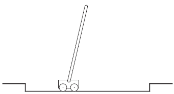
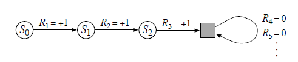
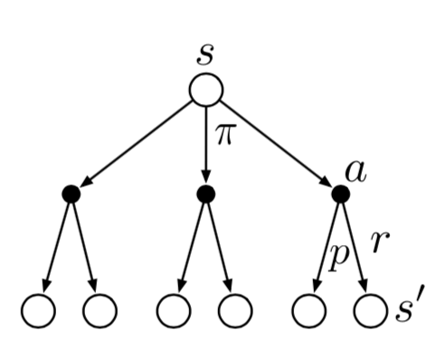
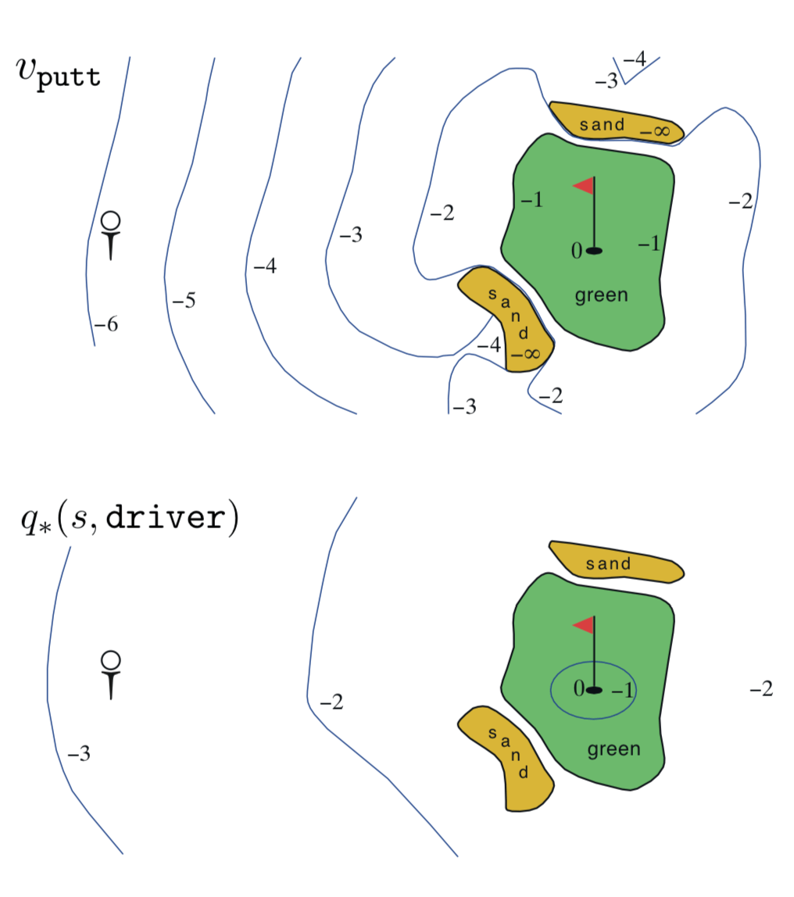
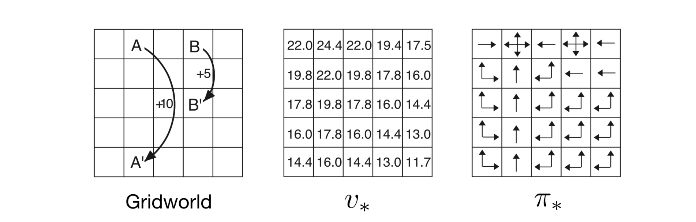

第3章 有限马尔可夫决策过程
==========================

在本章中，我们将介绍有限马尔可夫决策过程或有限MDP的形式问题，我们将在本书的其余部分尝试解决这些问题。
这个问题涉及评价反馈，如在赌博机问题中，但也涉及一个关联方面，即在不同情况下选择不同的行动。
MDP是顺序决策的经典形式化，其中行动不仅影响直接奖励，还影响后续情况或状态，以及贯穿未来的奖励。
因此，MDP涉及延迟奖励以及交换即时与延迟奖励的需要。
在赌博机问题中，我们估计每个动作a的价值 :math:`q_*(a)`，
在MDP中我们估计每个状态s中每个动作a的价值 :math:`q_*(s, a)`，
或者我们估计给出最佳行动选择的每个状态的价值 :math:`v_*(s)`。
这些依赖于状态的量对于准确地为个人行动选择的长期结果分配信用至关重要。

MDP是强化学习问题的数学理想化形式，可以对其进行精确的理论陈述。
我们介绍问题数学结构的关键元素，如回归，值函数和Bellman方程。
我们试图传达可能被用作有限MDP的各种可能的应用程序。
与所有人工智能一样，在适用范围和数学易处理性之间存在着一种矛盾。
在本章中，我们将介绍这种矛盾关系，并讨论它所暗示的一些权衡和挑战。
第17章介绍了在MDP之外进行强化学习的一些方法。

3.1 个体环境接口
^^^^^^^^^^^^^^^^^^

MDP旨在直接构建从交互中学习以实现目标的问题。
学习者和决策者被称为 *个体（agent）*。它与之交互的东西，包括个体之外的所有东西，被称为 *环境*。
这些交互持续不断，个体选择动作同时环境响应那些动作并向个体呈现新情况 [1]_。
环境还产生奖励，这是个体通过其行动选择寻求最大化的特殊数值。

.. figure:: images/figure-3.1.png

    图3.1：马尔可夫决策过程中的个体 - 环境交互。

更具体地，个体和环境在离散时间序列每一步相互作用，:math:`t = 0,1,2,3,\dots` [2]_。
在每个时间步t，个体接收环境 *状态* :math:`S_{t} \in \mathcal{S}` ，
并在此基础上选择一个 *动作*，:math:`A_{t}\in \mathcal{S}(s)` [3]_。
每一步后，作为它行动的结果，个体接收到一个 *奖励* 值，
:math:`R_{t+1} \in \mathcal{R} \subset \mathbb{R}`，
并且自身处于一个新状态，:math:`S_{t+1}` [4]_ ，
MDP和个体一起产生了一个如下所示的序列或 *轨迹*：

.. math::
    :label: 3.1

    S_0,A_0,R_1,S_1,A_1,R_2,S_2,A_2,R_3,\dots

在 *有限* MDP中，状态，动作和奖励
（:math:`\mathcal{S}`，:math:`\mathcal{A}` 和 :math:`\mathcal{R}`）的集合都具有有限数量的元素。
在这种情况下，随机变量 :math:`R_t` 和 :math:`S_t` 具有明确定义的离散概率分布，仅取决于先前的状态和动作。
也就是说，对于这些随机变量的特定值，:math:`s^\prime \in \mathcal{S}` 和 :math:`r \in \mathcal{R}`，
在给定前一状态和动作的特定值的情况下，存在这些值在时间t发生的概率：

.. math::
    :label: 3.2

    p(s^\prime,r|s,a) \doteq Pr\{S_t=s^\prime,R_t=r|S_{t-1}=s,R_{t-1}=a\}

对所有 :math:`s^\prime, s \in \mathcal{S}`，:math:`\mathcal{r} \in \mathcal{R}`
和 :math:`a \in \mathcal{A}(s)`。函数 :math:`p` 定义了MDP的 *动态*。
方程中等号上的点提醒我们它是一个定义（在这个例子中是函数 :math:`p`），而不是从先前定义得出的事实。
动力学函数 :math:`p : \mathcal{S} \times \mathcal{R} \times \mathcal{S} \times \mathcal{A} \to [0, 1]`
是四个参数的普通确定性函数。 中间的“|”来自条件概率的符号，
但这里只是提醒我们 :math:`p` 指定 :math:`s` 和 :math:`a` 的每个选择的概率分布，即

.. math::
    :label: 3.3

    \sum_{s^\prime \in \mathcal{S}}\sum_{r \in \mathcal{R}}p(s^\prime,r|s,a)=1，对所有 s \in \mathcal{S}，a \in \mathcal{A}(s)

在 *马尔可夫* 决策过程中，:math:`p` 给出的概率完全表征了环境的动态。
也就是说，:math:`S_t` 和 :math:`R_t` 的每个可能值的概率
仅取决于前一个状态和动作 :math:`S_{t-1}` 和 :math:`A_{t-1}`，
并且在给定它们的情况下，它们根本不依赖于先前的状态和动作。
最好将其视为对决策过程的限制，而不是对 *状态* 的限制。
状态必须包括有关过去的个体-环境交互的所有方面的信息，这些信息对未来有所影响。
如果确实如此，那么就说该状态拥有 *马尔可夫性*。我们将在本书中假设马尔可夫性，
尽管从第二部分开始我们将考虑不依赖它的近似方法，并且在第17章中我们考虑如何从非马尔可夫观察中学习和构造马尔可夫状态。

从四参数动力学函数p中，可以计算出人们可能想知道的关于环境的任何其他信息，例如状态转移概率（我们将其略微滥用符号表示为三参数函数
:math:`p : \mathcal{S} \times \mathcal{S} \times \mathcal{A} \to [0, 1]`），

.. math::
    :label: 3.4

    p(s^\prime|s,a) \doteq Pr\{S_t=s^\prime|S_{t-1}=s,A_{t-1}=a\}=\sum_{r\in\mathcal{R}}p(s^\prime,r|s,a)

我们还可以将状态 - 动作对的预期奖励计算为双参数函数 :math:`r : \mathcal{S} \times \mathcal{A} \to \mathbb{R}`，

.. math::
    :label: 3.5

    r(s,a)\doteq\mathbb{E}\left[R_t|S_{t-1}=s,A_{t-1}=a\right]=\sum_{r\in\mathcal{R}}r\sum_{s^\prime\in\mathcal{S}}p(s^\prime,r|s,a)

以及状态 - 行动 - 下一状态三元组的预期奖励作为三个参数函数
:math:`r : \mathcal{S} \times \mathcal{A} \times \mathcal{S} \to \mathbb{R}`，

.. math::
    :label: 3.6

    r(s,a,s^\prime)\doteq\mathbb{E}\left[R_t|S_{t-1}=s,A_{t-1}=a,S_t=s^\prime\right]=\sum_{r\in\mathcal{R}}r\frac{p(s^\prime,r|s,a)}{p(s^\prime|s,a)}

在本书中，我们通常使用四参数p函数（3.2），但这些其他符号中的每一个偶尔也很方便。

MDP框架是抽象和灵活的，可以以不同的方式应用在很多不同的问题上。
例如，时间步长不需要指固定的实时间隔；它们可以指任意连续的决策和行动阶段。
这些动作可以是低级控制，例如施加到机器人手臂的电动机的电压，或高级​​决策，例如是否要吃午餐或进入研究生院。
同样，状态也可以采取各种各样的形式。它们可以完全由低级感觉决定，例如直接传感器读数，
或者它们可以更高级和抽象，例如房间中物体的符号描述。
可以基于对过去的感觉的记忆，甚至是完全精神的或主观的来构成一个状态。
例如，个体可能处于不确定对象在哪里的状态，或者在某些明确定义的意义上感到惊讶的状态。
同样，某些行为可能完全是精神上的或可计算的。例如，某些操作可能会控制代理选择考虑的内容，或者它关注的重点。
一般而言，行动可以是我们想要学习如何制定的任何决定，而状态可以是我们可以知道的任何可能有助于制作它们的任何事物。

特别是，个体和环境之间的边界通常与机器人或动物身体的物理边界不同。
通常，边界更接近于个体。例如，机器人及其传感硬件的电动机和机械联动件通常应被视为环境的一部分而不是个体的一部分。
同样，如果我们将MDP框架应用于人或动物，肌肉，骨骼和感觉器官应被视为环境的一部分。
也许，奖励可以在自然和人工学习系统的物理体内计算，但被认为是个体的外部。​

我们遵循的一般规则是，任何不能被个体任意改变的东西都被认为是在它之外，因此也是其环境的一部分。
我们不假定个体对环境一无所知。例如，个体通常非常了解如何根据其动作及其所处的状态来计算奖励。
但是我们总是认为奖励计算是在个体之外的，因为它是根据个体的任务所定义的，因此不能由个体来随意改变。
事实上，在某些情况下，个体就算知道它的环境是如何运行的，并且仍然面临着艰难的强化学习任务，
正如我们可以知道一个魔方是如何运行的，但仍然无法解开它。
个体-环境的边界代表着对个体的绝对控制能力的限制，而不是限制它的知识。

个体-环境的边界可以位于不同的地方以用于不同的目的。在复杂的机器人中，许多不同的个体可能同时运行，每个个体都有自己的边界。
例如，一个个体可以做出高级决策，高级决策可由低级个体面临的状态组成，从而实现高层次的决策。
在实践中，一旦选择了特定的状态，动作和奖励，就确定个体-环境边界，从而确定了感兴趣的特定决策制定任务。

MDP框架是从相互作用的目标导向学习的问题中抽象出来的。
它提出无论传感，记忆和控制装置的细节，以及任何目标试图达到的目标，
学习目标导向行为的任何问题都可以减少为个体及其环境之间来回传递的三个信号：
一个信号表示个体做出的选择（动作），一个信号表示作出选择的基础（状态），以及另一个信号来定义个体的目标（奖励）。
这个框架可能不足以有效地代表所有决策学习问题，但它已被证明是广泛有用和适用的。

当然，特定的状态和操作因任务而异，并且它们的表示方式会对性能产生很大影响。
在强化学习中，与其他类型的学习一样，这种表征性选择目前更多的是艺术而非科学。
在本书中，我们提供了一些关于表达状态和行为的好方法的建议和例子，但我们主要焦点的是一旦表示被确定，如何学习行为的一般原则。

**例3.1：生物反应器** 假设强化学习用于确定生物反应器（用于生产有用化学品的大量营养物和细菌）的瞬间温度温度和搅拌速率。
这种应用中的动作可以是传递到下级控制系统的目标温度和目标搅拌速率，该控制系统又直接激活加热元件和马达以实现目标。
状态可能是有可能被过滤和延迟热电偶和其他传感器读数，加上代表大桶和目标化学品成分的符号输入。
奖励可能是生物反应器产生有用化学品的速率的逐时测量。
请注意，此处每个状态都是传感器读数和符号输入的列表或矢量，每个动作都是由目标温度和搅拌速率组成的矢量。
强化学习任务的典型特征是具有这种结构化表示的状态和动作。另一方面，奖励总是单个数字。

**例3.2：拾取和放置机器人** 考虑使用强化学习来控制机器人手臂在重复拾取和放置任务中的运动。
如果我们想要学习快速和平稳的运动，则当前个体将必须直接控制马达并且具有关于机械联动装置的当前位置和速度的低延迟信息。
在这种情况下的动作可能是每个关节处施加到每个电动机的电压，并且状态可能是关节角度和速度的最新读数。
对于成功拾取和放置的每个对象，奖励可能为+1。为了鼓励平稳移动，在每个时间步骤上，可以根据动作的瞬间“急动”给出小的负面奖励。

*练习3.1* 设计适合MDP框架的三个自己的示例任务，为每个任务确定其状态，动作和奖励。
尽可能使这三个例子彼此 *不同*。该框架是抽象和灵活的，可以以多种不同的方式应用。在至少一个示例中以某种方式扩展其限制。

*练习3.2* MDP框架是否足以有效地代表 *所有* 目标导向的学习任务？你能想到任何明显的例外吗？

*练习3.3* 考虑驾驶问题。你可以根据加速器，方向盘和制动器（即你的身体与机器接触的位置）来定义动作。
或者你可以将它们定义得更远，比如橡胶与道路相遇，考虑你的动作是轮胎扭矩。
或者你可以进一步定义它们，比如说，你的大脑掌控身体，肌肉抽搐的动作来控制你的四肢。
或者你可以达到一个更高的层次，说你的行动是你选择开车的地方。
什么是个体和环境之间合适的层次和位置分界？在什么基础上，该线的一个位置优先于另一个？
是否有任何根本原因选择一个位置而不是另一个位置，还是随意选择？

.. admonition:: 例3.3：环保机器人
    :class: important

    移动机器人的工作是在办公室环境中收集空的汽水罐。它有用于检测汽水罐的传感器，以及可以将它们拾起并放置在机箱中的臂和夹具；它使用可充电电池供电。
    机器人的控制系统具有用于解释传感器信息，用于导航以及用于控制手臂和夹具的部件。
    关于如何搜索汽水罐的高级决策是由强化学习个体根据电池的当前充电水平做出的。
    举一个简单的例子，我们假设只能区分两个电荷电平，包括一个小的状态集 :math:`\mathcal{S}=\{高，低\}`。
    在每个状态，个体可以决定是否（1）在一段时间内主动 **搜索** 汽水罐，（2）保持静止并 **等待** 某人给它汽水罐，或（3）返回其本垒为电池 **充电**。
    当能量水平很 **高** 时，充电总是愚蠢的，所以我们不会将其包含在为此状态设定的动作中。
    动作集是 :math:`\mathcal{A}(高)=\{搜索, 等待\}` 和 :math:`\mathcal{A}(低)=\{搜索, 等待, 充电\}`。

    奖励在大多数情况下为零，但是当机器人固定空罐时变为正值，或者如果电池完全耗尽则变为负值。
    找到汽水罐的最好方法是主动搜索它们，但这会耗尽机器人的电池电量，而等待则不会。
    每当机器人正在搜索时，存在其电池耗尽的可能性。在这种情况下，机器人必须关闭并等待获救（产生低回报）。
    如果电池电量水平 **高**，则可以始终完成一段主动搜索而没有耗尽电池的风险。
    以 **高** 电量水平开始的搜索周期使电量水平以概率 :math:`\alpha` 保持并且以概率 :math:`1-\alpha` 降低至 **低** 电量水平。
    另一方面，当电量水平 **低** 时进行的搜索周期使其以概率 :math:`\beta` 变 **低** 并且以概率 :math:`1-\beta` 消耗电池。
    在后一种情况下，必须拯救机器人，然后将电池重新充电至 **高** 电量水平。
    机器人收集的每个汽水罐都可以作为单位奖励计算，而每当机器人必须获救时，奖励为-3。
    用 :math:`r_{搜索}` 和 :math:`r_{等待}`，其中 :math:`r_{搜索}>r_{等待}`，分别表示机器人在搜索和等待时将收集的预期罐数（以及预期的奖励）。
    最后，假设在跑步回家期间不能收集罐头，并且在电池耗尽的过程中不能收集罐头。
    这个系统是一个有限的MDP，我们可以记下转移概率和预期的奖励，动态如左表所示：

    .. figure:: images/table_figure.png

    请注意，表中有一行代表当前状态 :math:`s`，动作 :math:`a`，:math:`a\in\mathcal{A}(s)`和下一个状态 :math:`s` 的每种可能组合。
    某些转换的概率为零，因此没有为它们指定预期的奖励。右侧所示是另一种有用的方法，可以总结有限MDP的动态，称为 *转换图*。
    有两种节点：*状态节点* 和 *动作节点*。每个可能的状态都有一个状态节点（由状态名称标记的大圆圈），
    以及每个状态-动作对的动作节点（由行动名称标记并由线连接的小实心圆圈）。
    从状态 :math:`s` 开始并采取动作 :math:`a`，你将沿着从状态节点 :math:`s` 到动作节点 :math:`(s,a)` 的线路移动。
    然后，环境通过离开动作节点 :math:`(s,a)` 的箭头之一转换到下一个状态的节点。
    每个箭头对应一个三元组 :math:`(s,s^\prime,a)`，其中 :math:`s^\prime` 是下一个状态，我们用转移概率 :math:`p(s^\prime|s,a)` 标记箭头，
    以及该转换的预期回报 :math:`r(s,a,s^\prime)`。请注意，标记离开动作节点的箭头的转移概率和总是为1。

*练习3.4* 给出一个类似于例3.3中的表，但是对于 :math:`p(s^\prime,r|s,a)`。
它应该有 :math:`s, a, s^\prime, r` 和 :math:`p(s^\prime,r|s,a)` 的列，
以及 :math:`p(s^\prime,r|s,a)>0` 的每个4元组的行。

3.2 目标和奖励
^^^^^^^^^^^^^^

在强化学习中，个体的目的或目标被形式化为从环境传递到个体的特殊信号（称为 *奖励*）。
在每个时间步骤，奖励是一个简单的数字，:math:`R_{t} \in \mathbb{R}`。非正式地，个体的目标是最大化其收到的总奖励。
这意味着最大化不是立即奖励，而是长期累积奖励。我们可以用 *奖励假说* 来清楚表达这个非正式的想法：

    所有我们所说的目标和目的都可以被认为是所接收的标量信号（称为奖励）的累积和的预期值的最大化。

使用奖励信号来形式化目标的想法是强化学习的最显着特征之一。

尽管根据奖励信号制定目标可能最初看起来有限，但在实践中它已被证明是可行的和广泛适用的。
看到这一点的最佳方法是考虑如何使用或可能使用它的示例。例如，为了让机器人学会走路，研究人员在每个时间步长上提供了与机器人向前运动成比例的奖励。
在让机器人学会如何逃离迷宫时，在逃脱前经过的每一步的奖励通常为-1；这鼓励代理人尽快逃脱。
为了让机器人学会找到并收集空的汽水罐进行回收利用，人们可能会在大多数情况下给予奖励零，然后每收集一次空罐给+1的回报。
人们可能还想在机器人碰到东西或者有人大喊大叫时给予机器人负面的奖励。
对于学习玩跳棋或国际象棋的代理人来说，获胜的自然奖励为+1，失败为-1，绘图和所有非终结位置为0。

您可以看到所有这些示例中发生的情况。个体总是学会最大化其奖励。
如果我们希望它为我们做点什么，我们必须以这样的方式为它提供奖励，即在最大化它们的同时，个体也将实现我们的目标。
因此，我们建立的奖励真正表明我们想要实现的目标至关重要。
特别是，奖励信号不是向个体提供关于 *如何* 实现我们想要做的事情的先验知识的地方 [5]_。
例如，国际象棋游戏个体应该仅仅因为实际获胜而获得奖励，而不是为了实现拿走对手的棋子或控制棋盘中心这样的子目标。
如果实现这些类型的子目标得到奖励，那么个体可能会找到一种方法来实现它们而不实现真正的目标。
例如，即使以失去游戏为代价，它也可能找到一种方法来获取对手的棋子。奖励信号是你与机器人沟通的 *方式*，而不是您希望 *如何* 实现 [6]_。

3.3 回报和情节
^^^^^^^^^^^^^^^^

到目前为止，我们已经讨论了非正式学习的目标。我们已经说过，个体的目标是获得从长远来看的最大累积奖励。
这如何正式定义？如果在时间步骤t之后接收的奖励序列表示为 :math:`R_{t + 1}, R_{t + 2}, R_{t + 3}, \dots`，
那么，我们希望最大化这个序列的具体什么方面？一般而言，我们寻求最大化 *预期收益*，其中收益 :math:`G_{t}` 被定义为奖励序列的某个特定函数。
在最简单的情况下，回报是奖励的总和：

.. math::
    :label: 3.7

    G_{t} \doteq R_{t+1} +R_{t+2} + R_{t+3} + \dots + R_{T}，

其中T是最后一步。这种方法在存在最终时间步骤的自然概念的应用中是有意义的，
也就是说，当个体-环境交互自然地分解为子序列时，我们称之为 *情节* [7]_，例如玩游戏，穿过迷宫，或任何形式的重复互动。
每个情节在称为 *终点* 状态的特殊状态结束，随后是重置到标准起始状态或从起始状态的标准分布的抽样。
即使你认为情节以不同的方式结束，例如输赢游戏，下一情节的开始也与上一情节的结束无关。
因此，所有这些情节都可以被认为是以相同的终点状态结束，对不同的结果有不同的奖励。具有这种情节的任务被称为 *情节任务*。
在情节任务中，我们有时需要将所有非终结状态的集合，表示为 :math:`\mathcal{S}` ，
与所有状态的集合加上终端状态，表示为 :math:`\mathcal{S^+}` ，区分开来。
终止时间T是随机变量，从情节到情节通常不同。

另一方面，在许多情况下，个体-环境交互不会自然地分解为可识别的事件，而是持续不断地进行。
例如，这将是一个自然的方式来制定一个持续的过程控制任务，或具有长寿命的机器人上的应用。我们将这些称之为 *持续任务*。
回报公式（3.7）对于连续的任务是有问题的，因为最终时间步长将是 :math:`T=\infty`，并且返回，这是我们试图最大化的，本身可以很容易是无限的。
（例如，假设个体在每个时间步都获得+1的奖励。）因此，在本书中，我们通常使用返回的定义，在概念上稍微复杂但在数学上更简单。

我们需要的另一个概念是 *衰减因子*。根据这种方法，个体尝试选择动作，以使其在未来接收的衰减的奖励的总和最大化。
特别是，它选择 :math:`A_{t}` 来最大化预期的 *衰减回报*：

.. math::
    :label: 3.8

    G_{t} \doteq R_{t+1} + \gamma R_{t+2} + \gamma^2 R_{t+3} + \dots = \sum_{k=0}^{\infty}\gamma^k R_{t+k+1}

其中 :math:`\gamma` 是参数，:math:`0 \leq\gamma \leq 1`，称为 *衰减因子*。

衰减率决定了未来奖励的现值：未来收到的k个时间步骤的奖励价值仅为立即收到的 :math:`\gamma^{k-1}` 倍。
如果奖励是立即被接收的则是值得的。
如果 :math:`\gamma < 1`，只要奖励序列 :math:`\{R_{k}\}` 有界，则（3.8）中的无限和具有有限值。
如果 :math:`\gamma = 0`，个体是“短视”的，只关注最大化立即奖励：
在这种情况下，其目标是学习如何选择 :math:`A_{t}` 以使 :math:`R_{t+1}` 最大化。
如果每个个体的行为恰好只影响即时奖励，而不影响未来的奖励，那么短视个体可以通过单独最大化每个即时奖励来最大化（3.8）。
但一般来说，最大化立即奖励的行为可以减少对未来奖励的获取，从而减少回报。
当 :math:`\gamma` 接近1时，回报目标更加强烈地考虑了未来的回报；个体变得更有远见。

连续时间步骤的回报以一种对强化学习的理论和算法很重要的方式相互关联：

.. math::
    :label: 3.9

    \begin{align*}
    G_{t} &\doteq R_{t+1} + \gamma R_{t+2} + \gamma^2 R_{t+3} + \gamma^3 R_{t+4} + \dots \\
    &= R_{t+1} + \gamma(R_{t+2} + \gamma R_{t+3} + \gamma^2 R_{t+4} + \dots) \\
    &= R_{t+1} + \gamma G_{t+1}
    \end{align*}

请注意，这适用于所有时间步骤 :math:`t<T`，即使终止发生在 :math:`t+1`，如果我们定义 :math:`G_T=0`，也是适用的。
这通常可以很容易地计算奖励序列的回报。

请注意，尽管回报公式（3.8）是无穷多个项的总和，但奖励非零并且为常数，如果 :math:`\gamma < 1`，则它仍然是有限的。
例如，如果奖励是常数+1，那么返回是

.. math::
    :label: 3.10

    G_t = \sum_{k=0}^{\infty}\gamma^k = \frac{1}{1-\gamma}

*练习3.5* 3.1节中的等式是针对连续的情况，需要进行修改（非常轻微）以应用于情节任务。通过给出（3.3）的修改版本，表明你知道所需的修改。

**示例3.4：杆平衡** 这项任务的目的是将力施加到沿着轨道移动的推车上，以便保持铰接在推车上的杆不会翻倒：
如果杆从垂直方向落下一个给定角度或者如果推车超过给定角度，则会发生故障离开赛道。
每次故障后，极点都会重置为垂直。这个任务可以被视为偶发事件，其中自然事件是重复平衡极点的尝试。
在这种情况下，对于没有发生故障的每个时间步骤，奖励可以是+1，因此每次返回将是直到失败的步骤数。
在这种情况下，永远成功的平衡将意味着无限的回报。或者，我们可以使用衰减将极点平衡视为一项持续性任务。
在这种情况下，每次失败时奖励为1，其他时间奖励为零。然后每次返回 :math:`1-\gamma^K` 与K相关，其中K是失败前的时间步数。
在任何一种情况下，通过尽可能长时间保持极点平衡来使回报最大化。

*练习3.5* 假设你将杆平衡作为一个情节性任务，但是也使用了衰减因子，除了-1是失败之外，所有奖励都是零。
那么每次回报是多少？这个回报与有衰减的持续任务有什么不同？

*练习3.7* 想象一下，你正在设计一个运行迷宫的机器人。你决定在逃离迷宫时奖励+1，在其他时候奖励零。
任务似乎自然地分解为情景，即连续贯穿迷宫的运行，所以你决定把它当作一个偶然的任务，其目标是最大化预期的总奖励（3.7）。
运行学习个体一段时间后，您会发现它从迷宫中逃脱没有任何改善。出了什么问题？你是否有意识地向个体传达了你希望它实现的目标？

*练习3.8* 假设 :math:`\gamma=0.5` 并且接收以下奖励序列 :math:`R_1=1`，:math:`R_2=2`，
:math:`R_3=6`，:math:`R_4=3`，并且 :math:`R_5=2`，其中 :math:`T=5`。
:math:`G_0，G_1，\dots，G_5` 是多少？ 提示：反向工作。

*练习3.9* 假设 :math:`\gamma=0.9` 并且奖励序列是 :math:`R_1=2`，接着是无限序列的7s。
:math:`G_1` 和 :math:`G_0` 是什么？

*练习3.10* 证明（3.10）中的第二个等式。

3.4 情节和持续任务的统一符号
^^^^^^^^^^^^^^^^^^^^^^^^^^^^

在上一节中，我们描述了两种强化学习任务，其中一种是个体-环境交互自然地分解为一系列单独的情节（情节任务），而另一种则不是（连续任务）。
前一种情况在数学上更容易，因为每个动作仅影响在情节期间随后收到的有限数量的奖励。
在本书中，我们有时会考虑一种问题，有时候会考虑另一种问题，但通常都会考虑。
因此，建立一种能够让我们同时准确地谈论这两种情况的符号是有用的。

准确地描述情节性任务需要一些额外的符号。我们需要考虑一系列情节，而不是一个长序列的时间步骤，每个情节都由有限的时间步骤序列组成。
我们从零开始重新编号每个情节的时间步长。因此，我们不仅要参考时间 :math:`t` 的状态表示  :math:`S_{t}`，
而且参考在情节 :math:`i` 和时间 :math:`t` 的状态表示 :math:`S_{t,i}`
（同样地，对于 :math:`A_{t,i}`，:math:`R_{t,i}`，:math:`\pi_{t,i}`，
:math:`T_{i}` 等符号意义相似）。
然而，事实证明，当我们讨论情节任务时，我们几乎从不必区分不同的情节。
我们几乎总是在考虑一个特定的情节，或者陈述对所有情节都适用的东西。
因此，在实践中，我们几乎总是通过省略情节编号的明确引用来使用符号。
也就是说，我们写 :math:`S_{t}` 来引指 :math:`S_{t,i}` 等等。

我们需要另一个约定来获得涵盖情节和持续任务的单一符号。
在一种情况下（3.7），我们将收益定义为有限数量的项的和，而在另一种情况下，将收益定义为无限数量的项（3.8）。
这两个可以通过考虑情节终止来统一，即进入一个特殊的吸收状态，该状态仅转换为自身并且仅产生零奖励。
例如，考虑状态转换图：

   state transition diagram

这里实心方块表示对应于情节结束的特殊吸收状态。从 :math:`S_{0}` 开始，我们得到奖励序列+1，+1，+1，0，0，0，...。
总结这些，我们得到相同的回报，无论我们是否在前 :math:`T` 个奖励求和（这里 :math:`T=3`）还是在整个无限序列上求和。
即使我们引入衰减因子这仍然成立。因此，我们可以根据（3.8），使用在不需要时忽略情节编号的惯例来定义回报，
并且包括如果总和仍然被定义时 :math:`\gamma = 1` 的可能性（例如，因为所有情节终止）。或者，我们也可以写回报如下

.. math::
    :label: 3.11

    G_t \doteq \sum_{k=t+1}^{T} \gamma^{k-t-1} R_t

包括 :math:`T = \infty` 或 :math:`\gamma = 1` （但不能同时存在）的可能性。
我们在本书的剩余部分中使用这些约定来简化符号，并表达情节和持续任务之间的近乎相似。
（之后，在第10章中，我们将介绍一个持续未衰减的形式。）

3.5 策略和价值函数
^^^^^^^^^^^^^^^^^^^^^^

几乎所有的强化学习算法都涉及估计状态（或状态-动作对）的 *价值函数*，
它们估计个体在给定状态下的 *好坏程度* （或者在给定状态下执行给定动作的程度有多好）。
这里的“有多好”的概念是根据未来的奖励来定义的，或者准确的的说是预期回报方面。
当然，个体未来可能获得的回报取决于它将采取的行动。因此，价值函数是根据特定的行为方式来定义的，称为策略。

形式上，*策略* 是从状态到选择每个可能动作的概率的映射。如果个体在时间 :math:`t` 遵循策略 :math:`\pi`，
则 :math:`\pi(a|s)` 是如果 :math:`S_t=s`，则 :math:`A_t=a` 的概率。
像 :math:`p` 一样，:math:`\pi` 是一个普通的函数；
:math:`\pi(a|s)` 中间的“|”仅提醒它为每个 :math:`s\in \mathcal{S}`
定义了 :math:`a\in \mathcal{A}(s)` 的概率分布。
强化学习方法指定了个体的策略如何因其经验结果而变化。

*练习3.11* 如果当前状态为 :math:`S_t`，并且根据随机策略 :math:`\pi` 选择动作，
则对于 :math:`\pi` 和四参数函数 :math:`p` （3.2），:math:`R_{t+1}` 的期望是多少？

在状态 :math:`s` 下，策略 :math:`\pi` 下的 *价值函数* 表示为 :math:`v_\pi(s)` ，
是从 :math:`s` 开始并且之后遵循策略 :math:`\pi` 的预期收益。
对于 **MDPs**，我们可以正式将 :math:`v_\pi(s)` 定义为

.. math::
    :label: 3.12

    v_\pi(s) \doteq \mathbb{E}_\pi\left[G_t|S_t=s\right]
    = \mathbb{E}_\pi\left[\sum_{k=0}^{\infty} \gamma^k R_{t+k+1}|S_t=s\right]，对所有 s\in \mathbb{S}

其中 :math:`\mathbb{E}[\dot]` 表示个体遵循策略 :math:`\pi` 的随机变量的期望值， :math:`t` 是任意的时间步长。
请注意，如果有终止状态的话，其值一直为0。我们称函数 :math:`v_\pi` 是 *策略* :math:`\pi` *的状态—价值函数*。

同样，我们定义在策略 :math:`\pi`，状态 :math:`s` 下采取动作 :math:`a` 的价值，
表示为 :math:`q_\pi(s,a)`，作为从 :math:`s` 开始的，采取行动` a :math:`，
此后遵循策略 :math:`\pi` 的预期回报：

.. math::
    :label: 3.13

    q_\pi(s,a) \doteq \mathbb{E}_\pi\left[G_t|S_t=s,A_t=a\right]
    = \mathbb{E}_\pi\left[\sum^{\infty}_{k=0}\gamma^kR_{t+k+1}|S_t=s,A_t=a\right]

我们称 :math:`q_\pi` 为策略 :math:`\pi` 的动作值函数。

*练习3.12* 用 :math:`q_\pi` 和 :math:`\pi` 给出 :math:`v_\pi` 的等式。
*练习3.13* 根据 :math:`v_\pi` 和四参数 :math:`p` 给出 :math:`q_\pi` 的等式。

价值函数 :math:`v_\pi` 和 :math:`q_\pi` 可以根据经验估计。
例如，如果个体遵循策略 :math:`\pi`并且对于遇到的每个状态保持平均值，
那么该状态之后的实际返回值将收敛到状态价值 :math:`v+\pi(s)`，作为遇到的状态的次数接近无穷大。
如果为每个状态采取的每项行动保留单独的平均值，那么这些平均值将同样收敛于行动价值 :math:`q_\pi(s,a)`。
我们称这种估计方法为 *蒙特卡洛方法*，因为它们涉及对实际收益的许多随机样本进行平均。
这些方法在第5章中介绍。当然，如果有很多状态，那么单独为每个状态保持单独的平均值可能是不切实际的。
相反，个体将必须维护 :math:`v_\pi` 和 :math:`q_\pi` 作为参数化函数（参数少于状态），并调整参数以更好地匹配观察到的返回。
这也可以产生准确的估计，尽管很大程度上取决于参数化函数逼近器的性质。这些可能性在本书的第二部分中讨论。

在强化学习和动态规划中使用的价值函数的基本属性是它们满足类似于我们已经为返回建立的递归关系（3.9）。
对于任何策略 :math:`\pi` 和任何状态 :math:`s`，:math:`s` 的值与其可能的后继状态的值之间保持以下一致性条件：

.. math::
    :label: 3.14

    \begin{align*}
    v_\pi(s) &\doteq \mathbb{E}_\pi[G_t|S_t=s] \\
    &= \mathbb{E}_\pi[R_{t+1} + \gamma G_{t+1}|S_t=s] (由 (3.9)) \\
    &= \sum_a\pi(a|s) \sum_{s^\prime}\sum_r p(s^\prime,r|s,a) \left[r+\gamma\mathbb{E}_\pi[G_{t+1}|S_{t+1}=s^\prime]\right] \\
    &= \sum_a\pi(a|s) \sum_{s^\prime,r}p(s^\prime,r|s,a)[r+\gamma v_\pi(s^\prime)], 对所有 s\in\mathcal{S}
    \end{align*}

其中隐含的动作 :math:`a` 取自集合 :math:`\mathcal{A}(s)`，
下一个状态 :math:`s^\prime` 取自集合 :math:`\mathcal{S}`
（或者在情节问题的情况下取自 :math:`\mathcal{S}+`），
并且奖励 :math:`r` 取自集合 :math:`\mathcal{R}`。
注意，在最后的等式中我们如何合并两个和，一个在 :math:`s^\prime` 的所有值上，
另一个在 :math:`r` 的所有值上，合并为所有可能值的一个和。
我们经常使用这种合并的和来简化公式。请注意最终表达式如何轻松作为期望值读取。
它实际上是三个变量 :math:`a`，:math:`s^\prime` 和 :math:`r` 的所有值的总和。
对于每个三元组，我们计算其概率 :math:`\pi(a|s)p(s^\prime,r|s,a)`，
用该概率对括号中的数量进行加权，然后对所有可能性求和得到预期值。

    :math:`v_\pi` 的备份图

公式（3.14）是 :math:`v_\pi` 的贝尔曼方程。它表达了状态价值与下一个状态价值之间的关系。
考虑从一个状态向可能的下一个状态的情况，如右图所示。每个空心圆表示状态，每个实心圆表示状态-动作对。
从状态 :math:`s` 开始，顶部的根节点，个体可以采取基于其策略 :math:`\pi` 的任何一组动作，图中显示了三个。
这些动作中的每一个，环境可以响应下一个状态中的其中一个，:math:`s^\prime` （图中显示两个），
以及奖励 :math:`r`，取决于函数  :math:`p` 给出的动态。
贝尔曼方程（3.14）对所有可能性进行平均，通过其发生概率对每个可能性进行加权。
它指出，开始状态的值必须等于预期的下一个状态的（衰减）值，加上沿途预期的奖励。

值函数 :math:`v_\pi` 是其贝尔曼方程的唯一解。
我们在后面的章节中展示了贝尔曼方程如何构成一些计算，近似和学习 :math:`v_\pi` 方法的基础。
我们称这样的图表为 *备份图*，因为它们是展示了作为强化学习方法核心的更新或 *备份* 操作的基础的联系。
这些操作将值信息从其后继状态（或状态—动作对） *传回* 状态（或状态-动作对）。
我们在本书中使用备份图来提供我们讨论的算法的图形摘要。
（注意，与转换图不同，备份图的状态节点不一定代表不同的状态；例如，一个状态可能是它自己的下一个状态）。

**示例3.5：网格世界** 图3.2（左图）显示了简单有限MDP的矩形网格世界表示。网格的单元格对应于环境的状态。
在每个单元格中，可以有四个动作：北，南，东，西，这明确让个体在网格上的相应方向上移动一个单元格。
使个体离开网格的操作会使其位置保持不变，但会导致-1的奖励。
除了将个体从特殊状态 :math:`A` 和 :math:`B` 移出的行为，其他行为奖励值为 :math:`0`。
在状态 :math:`A`，所有四个动作都会产生 :math:`+10` 的奖励，并将个体送到 :math:`A^\prime` 。
从状态 :math:`B`，所有动作都会获得 :math:`+5` 的奖励，并将个体转到 :math:`B^\prime` 。

.. figure:: images/figure-3.2.png
   :alt: figure-3.2

   **图3.2** 网格世界的例子：等概率随机随机策略的特殊奖励动态（左）和状态值函数（右）。

假设个体在所有状态中以相等的概率选择所有四个动作。图3.2（右）显示了该策略的值函数 :math:`v_\pi`，
对于这个策略，衰减因子 :math:`\gamma=0.9`。该值函数是通过求解线性方程（3.14）来计算的。
注意下边缘附近的负值；这些是在随机策略下高概率击中网格边缘的的结果。
状态 :math:`A` 是本策略下的最佳状态，但其预期收益低于即时奖励 :math:`10`，
由于个体从 :math:`A` 到 :math:`A^\prime` ，从而可能进入电网边缘。
另一方面，状态 :math:`B` 的当即奖励高于 :math:`5` ，
因为个体从 :math:`B` 被带到状态 :math:`B^\prime` ，具有正值。
从 :math:`B^\prime` 来看，进入边缘的预期惩罚（负回报）超过了困在 :math:`A` 或 :math:`B` 上的预期收益的补偿。

**练习3.14** 在练习3.5中，图3.2（右）所示的值函数 :math:`v_\pi` ，贝尔曼方程（3.12）必须保持函数中的每个状态。
以数字方式显示该等式的相对于其四个相邻状态，价值为 :math:`+2.3`，:math:`+0.4`，:math:`-0.4`
和 :math:`+0.7`，保持中心状态，值为 :math:`+0.7`。（这些数字只能精确到一位小数。）

**练习3.15** 在网格世界的例子中，奖励对于目标是正的奖励，对于走进世界的边缘是负的惩罚，而在其余的时间里是零。
这些奖励的符号是重要的吗，还是只是他们之间的间隔？请证明，使用（3.8），
向所有奖励添加常量 :math:`c` 会使所有状态的价值增加一个常数 :math:`v_c` ，因此不会影响任何策略下任何状态的相对值。
:math:`v_c` 关于 :math:`c` 和 :math:`\gamma` 是什么 ？

**练习3.16** 现在考虑在情节任务，例如走迷宫中给所有的奖励增加一个常量 :math:`c`。
这是否会有什么影响，还是会像以上那些连续任务那样保持不变？是或者否，为什么？ 举个例子。

**示例3.6：高尔夫** 为了将打高尔夫球作为强化学习任务，我们将每次击球的惩罚（负回报）计算为 :math:`-1` ，直到我们将球打入洞中。
状态是高尔夫球的位置。一个状态的值是从该位置到该洞的击球数量的负数。我们的动作是我们如何瞄准和摆球，当然还有我们选择的球杆。
让我们把前者视为给定的，只考虑球杆的选择，我们假设是推杆或打出去。
图3.3的上半部分显示了总是使用推杆的策略的可能的状态值函数 :math:`v_{putt}(s)` 。
最终 *入洞* 作为终结状态值为 :math:`0` 。
从绿色区域（球道的尽头）的任何地方，我们假设我们可以做一个推杆；这些地方状态值为 :math:`-1`。
离开绿色区域，我们不能通过推杆入洞，值越大。
如果我们可以通过推杆达到绿色区域状态，那么该状态必须具有比绿色区域小的值，即 :math:`-2`。
为了简单起见，让我们假设我们可以非常精确和准确地推杆，但范围有限。
这给了我们图中标有 :math:`-2` 的尖锐轮廓线；该线和绿色区域之间的所有位置都需要打两杆才能完成入洞。
类似地，:math:`-2` 轮廓线的投放范围内的任何位置必须具有 :math:`-3` 的值，依此类推，可以获得图中所示的所有轮廓线。
推杆不会让我们脱离沙地陷阱，所以它们的值为 :math:`-\infty` 。
总的说，通过推杆，我们需要六杆从球座入洞。

    **图3.3：** 高尔夫球示例：用于推杆（上面）的状态价值函数和使用挥杆的最佳动作价值函数（下图）。

.. figure:: images/q_pi_backup_diagram.png
    :align: right
    :width: 200px

    :math:`q_\pi` 的备份图

**练习3.17** 动作价值，即 :math:`q_\pi` 的贝尔曼方程是什么？
必须根据状态—动作对 :math:`(s,a)` 的可能后继的动作价值 :math:`q_\pi(s^\prime,a^\prime)`
给出动作值 :math:`q_\pi(s,a)`。
提示：对应于该方程的备用图在右图中给出。显示与（3.14）类似的方程序列，但用于动作价值。

**练习3.18** 状态的值取决于在该状态下可能的动作的值以及当前策略下每个动作的可能性。
我们可以根据状态的小的备份图来考虑这一点，并考虑到每个可能的操作：

.. figure:: images/exercise-3.18.png
    :alt: exercise-3.18

根据给定 :math:`S_t=s` 的预期叶节点 :math:`q_\pi(s,a)` 的值，
给出对根节点 :math:`v_\pi(s)` 的值的对应于该直觉和图表的方程。
这个方程式应该包含一个符合策略 :math:`\pi` 条件的预期。
然后给出第二个等式，其中期望值以 :math:`\pi(a|s)` 方式明确地写出，使得等式中不出现预期值符号。

**练习3.19** 动作值 :math:`q_\pi(s,a)` 取决于预期的下一个奖励和剩余奖励的预期总和。
再次，我们可以通过一个小的备份图来考虑这一点，这一个根源于一个动作（状态—动作对），并分支到可能的下一个状态：

.. figure:: images/exercise-3.19.png
    :alt: exercise-3.19

给定 :math:`St = s` 和 :math:`A_t= a`，
根据预期的下一个奖励 :math:`R_{t+1}` 和预期的下一个状态值 :math:`v_\pi(S_{t+1})`，
给出与这个直觉和图表对应的方程式的动作值 :math:`q_\pi(s,a)`。
这个方程式应该包括期望值，但 *不包括* 一个符合策略的条件。
然后给出第二个方程，用（3.2）定义的 :math:`p(s^\prime,r|s,a)` 明确地写出期望值，使得方程式中不会出现预期值符号。

3.6 最优策略和最优价值函数
^^^^^^^^^^^^^^^^^^^^^^^^^^^^

解决强化学习任务大概意味着要从长远的角度找到一个取得很大回报策略。
对于有限MDP，我们可以通过以下方式精确地定义一个最优策略。价值函数对策略进行部分排序。
如果策略 :math:`\pi` 所有状态的预期返回值大于或等于策略 :math:`\pi^\prime` 的值，
则该策略 :math:`\pi` 被定义为优于或等于策略 :math:`\pi^\prime`。
换句话说，对所有 :math:`s\in \mathcal{S}`，
当且仅当 :math:`v_\pi(s)\ge v_{\pi^{^\prime}}(s)` 时，:math:`\pi\ge\pi^\prime` 成立。
总是至少有一个策略优于或等于所有其他策略。这个策略称为 *最优策略*。
虽然可能有不止一个，我们用 :math:`\pi_*` 表示所有最优策略。
它们共享同样的状态值函数，称为 *最优状态价值函数*，表示为 :math:`v_*`，并定义为

.. math::
    :label: 3.15

    v_*(s) \doteq \max_\pi v_\pi(s)，

对所有 :math:`s\in \mathcal{S}`。

最优策略还具有相同的最优动作价值函数，表示为 :math:`q_*`，并定义为

.. math::
    :label: 3.16

    q_*(s,a) \doteq \max_\pi q_\pi(s,a)

对所有 :math:`s\in \mathcal{S}` 和 :math:`a\in\mathcal{A}(s)`。
对于状态—动作对 :math:`(s,a)`，此函数给出在状态 :math:`s` 中执行动作 :math:`a` 并且此后遵循最优策略的预期返回值。
因此，我们可以用 :math:`v_*` 来表示 :math:`q_*` ，如下所示：

.. math::
    :label: 3.17

    q_*(s,a) = \mathbb{E}\left[R_{t+1}+\gamma v_* (S_{t+1})|S_t=s,A_t=a\right]

**示例3.17：高尔夫的最优价值函数** 图3.3的下部展示了一个可能的最优动作价值函数 :math:`q_*(s,driver)` 的轮廓。
如果我们首先用一号木杆用力进行击球，然后选择挥杆或推杆，以值较大者为准，这些是每个状态的价值。
用力挥杆使我们能够把球打的更远，但精度较低。
只有当我们已经非常接近绿色区域的时候，我们才能使用挥杆一次就能入洞；
因此 :math:`q_*(s,driver)` 的 :math:`-1` 轮廓仅覆盖绿色区域的一小部分。
然而，如果我们有两次击球，那么我们可以从更远的距离到达洞，如 :math:`-2` 轮廓所示。
在这种情况下，我们不必挥杆以到达小 :math:`-1` 轮廓内，而只是挥杆到达绿色区域的任何地方；从那里我们可以使用推杆。
最优动作价值函数在提交给特定的 *第一* 动作（在这种情况下，挥杆）之后给出值，但之后使用最佳动作。
:math:`-3` 轮廓仍然更远，包括起始发球台。从发球台开始，最好的动作是两次挥杆和一次推杆，三次击球。

因为 :math:`v_*` 是策略的价值函数，它必须满足状态价值的贝尔曼方程（3.14）所给出的自洽条件。
因为它是最优价值函数，所以 :math:`v_*` 的一致性条件可以写成特殊形式，而不参考任何特定的策略。
这是 :math:`v_*` 的贝尔曼方程，或者说是 *贝尔曼最优方程*。
直观上地，贝尔曼最优方程式表达了这样一个事实，即最优策略下的状态价值必须等于来自该状态的最佳行动的预期收益：

.. math::

    \begin{align*}
    v_*(s) &= \max_{a\in\mathcal{A}(s)} q_{\pi_*}(s,a) \\
    &=\max_a \mathbb{E}_{\pi_*}[G_t|S_t=s,A_t=a] \\
    &=\max_a \mathbb{E}_{\pi_*}[R_{t+1}+\gamma G_{t+1}|S_t=s,A_t=a] &(由(3.9)式) \\
    &=\max_a \mathbb{E}[R_{t=1}+\gamma v_*(S_{t+1})|S_t=s,A_t=a] &(3.18) \\
    &=\max_{a\in \mathcal{A}(s)}\sum_{s^\prime,r} p(s^\prime,r|s,a)[r+\gamma v_*(s^\prime)] &(3.19)
    \end{align*}

最后两个方程是 :math:`v_*` 的贝尔曼最优方程的两种形式，:math:`q_*` 的贝尔曼最优方程为

.. math::
    :label: 3.20

    \begin{align*}
    q_*(s,a) &= \mathbb{E}\left[R_{t+1}+\gamma\sum_{a^\prime}q_*(S_{t+1,a^\prime})|S_t=s,A_t=a\right] \\
    &=\sum_{s^\prime,r}p(s^\prime,r|s,a)[r+\gamma \sum_{a^\prime}q_*(s^\prime,a^\prime)]
    \end{align*}

下图中的备份图以图像方式显示了在 :math:`v_*` 和 :math:`q_*` 的贝尔曼最优方程中考虑的未来状态和动作的跨度。
这些与 :math:`v_\pi` 和 :math:`q_\pi` 的备份图相同，只是在个体选择点添加了弧，以表示选择的最大值，而不是给定一些策略的期望值。
图3.4中，左图以图形方式表示贝尔曼最优方程（3.19），右图表示贝尔曼最优方程（3.20）。

.. figure:: images/figure-3.4.png
    :alt: figure-3.14

    **图3.4：** :math:`v_*` 和 :math:`q_*` 的备份图

对于有限的MDP，:math:`v_*` 的贝尔曼最优方程（3.19）具有唯一解。
贝尔曼最优方程实际上是一个方程组，每个状态一个方程，所以如果有 :math:`n` 个状态，
则有 :math:`n` 个未知数的 :math:`n` 个方程。
如果环境的动态 :math:`p` 是已知，则原则上可以使用解决非线性方程组的各种方法中的任何一种来求解该 :math:`v_*` 的方程组。
同样，可以求解 :math:`q_*` 的一组相关方程。

一旦有 :math:`v_*`，确定最优策略就比较容易了。对于每个状态，将在贝尔曼最优方程中获得最大价值的一个或多个动作。
任何仅为这些操作分配非零概率的策略都是最优策略。你可以将其视为一步步的搜索。
如果具有最优价值函数 :math:`v_*` ，则在一步搜索之后出现的动作将是最优动作。
另一种说法的方法是任何对最优评估函数 :math:`v_*` 贪婪的策略是最优策略。
计算机科学中使用术语 *贪婪* 来描述任何基于本地或直接考虑来选择替代搜索或决策程序的方法，
而不考虑这种选择可能阻止未来获得更好的替代方法的可能性。因此，它描述了根据其短期结果选择行动的策略。
:math:`v_*` 的美妙之处在于，如果用它来评估行动的短期结果，具体来说是一步到位的结果，
那么贪婪的策略在我们感兴趣的长期意义上实际上是最优的，因为 :math:`v_*` 已经考虑到所有可能的未来动作的奖励结果。
通过 :math:`v_*`，最佳预期的长期回报将变成在本地且立即可用于每个状态的量。
因此，一步一步的搜索产生长期的最佳动作。

有 :math:`q_*` 使选择最优动作更容易。
使用 :math:`q_*` ，个体甚至不需要进行一步一步的查询：
对于任何状态 :math:`s`，它可以简单地发现任何使 :math:`q_*(s,a)` 最大化的动作。
动作价值函数有效地缓存了所有一步一步搜索的结果。
它提供最优的期望长期回报作为本地并立即可用于每个状态—动作对的值。
因此，代表状态-动作对的功能而不仅仅是状态的代价，
最优动作-价值函数允许选择最优动作而不必知道关于可能的后继状态及其值的任何信息，即，不必要了解环境的动态。

**示例3.8：解决网格世界问题** 假设我们为示例3.5中介绍的简单网格任务解决关于 :math:`v_*` 的贝尔曼方程，并再次显示在图3.5（左图）中。
回想一下，状态 :math:`A` 之后是 :math:`+10` 的回报并转换到状态 :math:`A^\prime`，
而状态 :math:`B` 之后是 :math:`+5` 的回报并转换到状态 :math:`B^\prime`。
图3.5（中间）显示了最优价值函数，图3.5（右图）显示了相应的最优策略。
在单元格中有多个箭头，任何相应的动作都是最佳的。

   **图3.5：** 网格世界例子的最优解决方案。

**示例3.19：回收机器人的贝尔曼最优方程** 使用（3.19），我们可以明确地给出回收机器人示例的贝尔曼最优方程。
为了使事情变得更加紧凑，我们可以简单地描述 **高** 和 **低** 两种状态，
以及 **搜索**，**等待** 和 **充电** 三种动作，用 **h**，**l**，**s**，**w** 和 **re** 来分别表示。
由于只有两个状态，贝尔曼最优方程由两个方程组成。:math:`v_*(h)` 的方程可以写成如下：

.. math::

    \begin{align*}
    v_*(h)&=\max\left\{
        \begin{array}{lr}
            p(h|h,s)[r(h,s,h)+\gamma v_*(h)]+p(l|h,s)[r(h,s,l)+\gamma v_*(l)],\\
            p(h|h,w)[r(h,w,h)+\gamma v_*(h)]+p(l|h,w)[r(h,w,l)+\gamma v_*(l)]
        \end{array}\right\} \\
    &=\max\left\{
        \begin{array}{lr}
            \alpha[r_s + \gamma v_*(h)]+(1-\alpha)[r_s +\gamma v_*(l)],\\
            l[r_w+\gamma v_*(h)]+0[r_w+\gamma v_*(l)]
        \end{array}\right\} \\
    &=\max\left\{
        \begin{array}{lr}
            r_s+\gamma[\alpha v_*(h)+(1-\alpha)v_*(l)],\\
            r_w + \gamma v_*(h)
        \end{array}\right\}
    \end{align*}

按照与 :math:`v_*(l)` 相同的方式得到等式

.. math::

    v_*(l)=\max\left\{
        \begin{align*}
            &\beta r_s - 3(1-\beta)+\gamma[(1-\beta)v_*(h)+\beta v_*(l)], \\
            &r_w + \gamma v_*(l),\\
            &\gamma v_*(h)
        \end{align*}
    \right\}

对于任何 :math:`r_s`，:math:`r_w`，:math:`\alpha`，:math:`\beta` 和 :math:`\gamma` 的选择，
:math:`0 \le\gamma<1`，:math:`0 \le \alpha,\beta\le 1`；
正好有一对数字 :math:`v_*(h)` 和 :math:`v_*(l)` 同时满足这两个非线性方程。

明确解决贝尔曼最优方程提供了找到最优策略的一条途径，从而为解决强化学习问题提供了依据。但是，这个解决方案很少直接有用。
它类似于详尽的搜索，展望所有可能性，计算它们的发生概率以及它们在预期奖励方面的可取性。
这个解决方案依赖于至少三个假设，在实践中很少是这样的：
（1）我们准确地知道环境的动态；（2）我们有足够的计算资源来完成解决方案的计算；（3）马尔可夫性。
对于我们感兴趣的任务，通常不能完全实现这个解决方案，因为这些假设的各种组合不成立。
例如，虽然第一和第三个假设对于西洋双陆棋游戏没有任何问题，但第二个是主要的障碍。
因为游戏有 :math:`10^{20}` 个状态，所以今天最快的电脑需要数千年的时间才能计算出 :math:`v_*` 的贝尔曼方程式，
而找到 :math:`q_*` 也是如此。在强化学习中，通常需要计算近似解。

许多不同的决策方法可以被看作是近似解决贝尔曼最优方程的方法。
例如，启发式搜索方法可以被视为扩大（3.19）的右边，达到一定深度，形成可能性的“树”，然后使用启发式评估函数近似“叶”节点上的 :math:`v_*`。
（启发式搜索方法，如 :math:`A^*` 几乎总是基于情节案例）。动态规划的方法可以更加紧密地与贝尔曼最优方程相关联。
许多强化学习方法可以被明确地理解为大致解决贝尔曼最优方程的方案，使用实际的经验丰富的过渡代替预期转换的知识。
我们在以后章节中将考虑各种这样的方法。

**练习3.20** 绘制或描述高尔夫球示例的最佳状态价值函数。

**练习3.21** 绘制或描述用于高尔夫球示例的推杆 :math:`q_*(s,putter)` 的最佳动作价值函数的轮廓 。

.. figure:: images/exercise-3.22.png
    :align: right
    :width: 150px

**练习3.22** 考虑右侧显示的持续MDP。唯一的决定是在顶点状态，有 **左** **右** 两个动作可选。
数字显示每次行动后收到的确定奖励。有两个确定性的策略，:math:`\pi_{左}` 和 :math:`\pi_{右}`。
如果 :math:`\gamma=0`，哪一种策略是最优的？如果 :math:`\gamma=0.9`？如果 :math:`\gamma=0.5` 呢？

**练习3.23** 给出回收机器人的 :math:`q_*` 贝尔曼方程。

**练习3.24** 图3.5给出了网格世界问题的最优状态的最优价值为 :math:`24.4`，保留小数点后一位。
以你对最优策略的了解和（3.8），以符号方式表示此值，然后将其计算为小数点后三位。

**习题3.25** 用 :math:`q_*` 给出 :math:`v_*` 的方程。

**练习3.26** 用 :math:`v_*` 和四参数 :math:`p`给出 :math:`q_*` 的方程。

3.7 优化和近似
^^^^^^^^^^^^^^

我们已经定义了最优价值函数和最优策略。显然，学习最优策略的个体会做得很好，但在实践中却很少发生。
对于我们感兴趣的各种任务，只能以极高的计算成本才能生成最优策略。
一个明确定义的最优化概念组织了我们在本书中描述的学习方法，并提供了一种了解各种学习算法的理论属性的方法，
但个体只能不同程度的接近理想值。正如我们上面讨论的，即使我们有一个完整和准确的环境动态模型，
通常不可能通过求解贝尔曼最优方程来简单地计算最优策略。
例如，像西洋棋这样的棋盘游戏是人类经验的一小部分，即使是大型的定制计算机仍然无法计算出最优的动作。
个体面临的一个关键问题一直是可用的计算能力，特别是在单个时间步长中可以执行的计算量。

可用的内存也是一个重要的限制。
通常需要大量内存来建立价值函数，策略和模型的近似值。
在具有小的有限状态集的任务中，可以使用对于每个状态（或状态-动作对）具有一个条目的数组或表来形成这些近似。
这个我们称之为 *表格* 的情况，相应的方法称之为表格方法。
然而，在许多实际感兴趣的情况下，还有更多的状态不可能在一个表格中完整表达。
在这些情况下，必须使用某种更紧凑的参数化函数表示来近似函数。

我们强化学习问题的框架迫使我们解决近似问题。然而，它也为我们提供了一些独特的机会来实现有用的近似。
例如，在逼近最优行为时，可能存在许多状态，个体面临的这样一个低概率，即为他们选择次优动作对个体收到的奖励数量几乎没有影响。
例如， *Tesauro* （人名，TD-Gammon西洋双陆棋游戏程序作者）的西洋双陆棋玩家具有卓越的技能，
也可能会在棋盘上做出非常糟糕的决定，但是从来没有在与专家的对抗时发生。
事实上，*TD-Gammon* （西洋双陆棋游戏程序）可能对游戏的大部分状态设置做出不好的决定。
强化学习的在线性质使得其有可能以更多的方式来近似最优策略，以便为经常遇到的状态作出良好的决策，而不用花费很少的努力来处理不经常遇到的状态。
这是将强化学习与其他方法区分开来，近似解决MDP问题的一个关键属性。

3.8 总结
^^^^^^^^^

我们总结一下我们在本章中提出的强化学习问题的要素。强化学习是从互动中学习如何行动从而实现目标。
强化学习 *个体* 及其 *环境* 通过一系列离散的时间步长进行交互。
其接口的规范定义了一个特定的任务：*动作* 是由个体所做的选择；*状态* 是做出选择的基础；*奖励* 是评估选择的基础。
个体内的一切都是由个体完全知晓和控制的；外面的一切都是不完全可控的，可能完全知道也可能不完全知道的。
*策略* 是随机规则，个体通过该规则选择动作作为状态的函数。
个体的目标是随着时间的推移最大限度地获得奖励。

当上述强化学习设置用明确定义的转移概率表示时，它构成马尔可夫决策过程（MDP）。
有限MDP是具有有限状态，动作和（当我们在此处制定）奖励集的MDP。
当前的强化学习理论大多局限于有限的MDP，但方法和思想更为普遍。

*返回值* 是个体寻求最大化（预期价值）的未来奖励的功能。
它有几个不同的定义，取决于任务的性质，以及是否希望 *衰减* 延迟奖励。
无衰减的公式适用于 *情节* 任务，其中个体—环境相互作用自然地分解在 *情节* 中；
衰减的方案适用于 *持续任务*，其中互动本身并不会自然地分解在情节中，而是无限制的持续下去。

在给定个体使用策略的情况下，策略的 *价值函数* 为每个状态或状态-动作对分配该状态或状态-动作对的预期回报。
*最优价值函数* 为每个状态或状态-动作对分配任何策略可实现的最大预期回报。价值函数最优的策略是 *最优策略*。
尽管状态和状态-动作对的最优价值函数对于给定的MDP是唯一的，但是可以存在许多最优策略。
任何对最优价值函数贪婪的策略都必须是最优策略。*贝尔曼最优方程* 是最佳价值函数必须满足的特殊一致性条件，
并且原则上可以针对最优价值函数求解，从中可以相对容易地确定最优策略。

根据对个体最初可用的知识水平的假设，可以以各种不同的方式提出强化学习问题。
在 *完全知识* 的问题中，个体拥有完整而准确的环境动态模型。
如果环境是MDP，那么这样的模型由完整的四参数动力学函数 :math:`p` （3.2）组成。
在 *知识不完整* 的问题中，没有完整而完美的环境模型。

即使个体具有完整和准确的环境模型，个体通常也无法在每个时间步长充分利用这个模型执行足够的计算。
而可用的内存也是一个重要的限制。可能需要内存来建立价值函数，策略和模型的精准近似。
在大多数具有实际意义的情况下，表中的条目远远多于可能是条目的状态，并且必须进行近似。

我们在本书中描述的学习方法是通过一个明确定义的最优化概念来组织的，并提供了一种了解各种学习算法的理论属性的方法，
但是强化学习个体只能不同程度的接近理想值。
在强化学习中，我们非常关心虽然无法找到最优解决方案但必须能以某种方式得到近似的情况。

书目和历史评论
^^^^^^^^^^^^^^

强化学习问题深深地受到来自最优控制领域的马尔可夫决策过程（MDP）的思想的影响。
这些历史影响和心理学的其他主要影响在第1章给出的简要历史中有所描述。
强化学习增加了MDP关注现实大问题的近似和不完整信息。
MDP和强化学习问题与人工智能中的传统学习和决策问题只有微弱的联系。
然而，人工智能现在正在从各种角度大力探索MDP公式的规划和决策。
MDP比人工智能中使用的先前公式更通用，因为它们允许更一般的目标和不确定性。

MDP理论通过例如Bertsekas（2005），White（1969），Whittle（1982，1983）和Puterman（1994）来处理。
Ross（1983）给出了对有限情况的特别紧凑的处理。MDP也在随机最优控制的标题下进行研究，
其中自适应最优控制方法与强化学习最密切相关（例如，Kumar，1985；Kumar和Varaiya，1986）。

MDP理论从一系列发展而来，以理解在不确定性下制定决策序列的问题，每个决策都取决于先前的决策及其结果。
它有时被称为多阶段决策过程或顺序决策过程的理论，并且源于关于顺序抽样的统计文献，
从Thompson（1933,1934）和Robbins（1952）的论文开始，我们在第2章中引用了有赌博机问题（如果制定为多情况问题，则是典型的MDP）。

我们知道使用MDP形式主义讨论强化学习的最早实例是Andreae（1969b）对学习机器统一视图的描述。
Witten和Corbin（1973）尝试使用MDP形式主义后来由Witten（1977,1976a）分析的强化学习系统。
尽管他没有明确提到MDP，但Werbos（1977）提出了与现代强化学习方法相关的随机最优控制问题的近似解法
（参见Werbos，1982,1987,1988,1989,1992）。
虽然Werbos的想法当时并未得到广泛认可，但他们在强调近似解决各种领域（包括人工智能）中的最优控制问题的重要性方面具有先见之明。
强化学习和MDP最有影响力的整合归功于Watkins（1989）。

**3.1** 我们用 :math:`p(s^\prime,r|s,a)` 表征MDP的动力学有点不寻常。
在MDP文献中更常见的是根据状态转移概率 :math:`p(s^\prime|s,a)` 和预期的下一个奖励 :math:`r(s,a)` 来描述动态。
然而，在强化学习中，我们更多时候必须参考个人的实际或样本奖励（而不仅仅是他们的期望值）。
我们的符号也使得 :math:`S_t` 和 :math:`R_t` 通常共同确定更加平稳，因此必须具有相同的时间索引。
在强化学习教学中，我们发现我们的概念在概念上更直接，更容易理解。

有关系统理论概念的直观讨论，请参见Minsky（1967）。

生物反应器实例基于Ungar（1990）和Miller and Williams（1992）的工作。
回收机器人的例子受到Jonathan Connell（1989）建造的罐头收集机器人的启发。
Kober和Peters（2012）提出了强化学习的机器人应用集合。

**3.2** 奖励假设由Michael Littman（个人通信）提出。

**3.3-4** *情节* 和 *连续* 任务的术语与MDP文献中常用的术语不同。
在该文献中，通常区分三种类型的任务：（1）有限时间任务，其中交互在特定固定数量的时间步骤之后终止；
（2）无限期任务，其中交互可以持续任意长，但最终必须终止；（3）无限期任务，其中交互不会终止。
我们的情节和持续任务分别类似于不定限期和无限期任务，但我们更倾向于强调交互性质的差异。
这种差异似乎比通常术语强调的目标函数的差异更为重要。情节任务经常使用不定时间目标函数和持续任务无限期目标函数，
但我们认为这是一个常见的巧合，而不是根本的差异。

极点平衡的例子来自Michie和Chambers（1968）以及Barto，Sutton和Anderson（1983）。

**3.5-6** 从长远来看，基于好的或坏的分配价值具有古老的根源。
在控制理论中，将状态映射到代表控制决策的长期结果的数值是最优控制理论的关键部分，
最优控制理论是在20世纪50年代通过扩展19世纪经典力学的状态函数理论而开发的（参见，例如，Schultz和Melsa，1967年）。
在描述计算机如何编程下棋时，Shannon（1950）考虑到国际象棋位置的长期优势和劣势，建议使用评估功能。

Watkins（1989）用于估计 :math:`q_*` 的Q学习算法（第6章）使得动作-价值函数成为强化学习的重要部分，
因此这些函数通常被称为“Q函数”。但是动作-价值函数的概念比这更古老了。
Shannon（1950）提出，国际象棋游戏程序可以使用函数 :math:`h(P,M)` 来确定位置 :math:`P` 中的移动 :math:`M` 是否值得探索。 
Michie（1961,1963）的MENACE系统和Mi​​chie and Chambers（1968）的BOXES系统可以理解为估算行动价值函数。
在经典物理学中，汉密尔顿的主要功能是行动价值函数；关于这个函数，牛顿动力学是贪婪的（例如，Goldstein，1957）。
行动价值函数在Denardo（1967）关于收缩映射的动态规划理论处理中也发挥了核心作用。
贝尔曼最优性方程（对于 :math:`v_*`）由Richard Bellman（1957a）推广，他将其称为“基本函数方程”。
连续时间和状态问题的贝尔曼最优方程的对应物被称为Hamilton-Jacobi-Bellman方程式（或通常只是Hamilton-Jacobiequation），
表明其在经典物理学中的根源（例如，Schultz和Melsa，1967）。高尔夫的例子是克里斯沃特金斯建议的。

.. [1]
   我们使用术语个体，环境和动作，而不是工程师术语控制器，受控系统（或工厂）和控制信号，因为它们对更广泛的受众有意义。

.. [2]
   我们将注意力限制在离散时间以使事情尽可能简单，即使许多想法可以延伸到连续时间情况
   （例如，参见Bertsekas和Tsitsiklis，1996；Werbos，1992；Doya，1996）。

.. [3]
   我们使用 :math:`R_{t+1}` 而不是 :math:`R_{t}` 来表示归因于 :math:`A_{t}` 的奖励，
   因为它强调下一个奖励和下一个状态 :math:`R_{t+1}` 和 :math:`S_{t+1}` \ 共同确定。
   不幸的是，这两种惯例在文献中都被广泛使用。

.. [4]
   更好的方式是传授这种先验知识是最初的策略或价值功能，或对这些的影响。
   参见Lin（1992），Maclin和Shavlik（1994）和Clouse（1996）。

.. [5]
    传授这种先验知识的更好的地方是初始策略或初始价值功能，或影响这些。

.. [6]
    第17.4节进一步探讨了设计有效奖励信号的问题。

.. [7]
    情节有时在文献中被称为“试验”。
