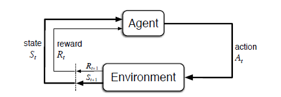
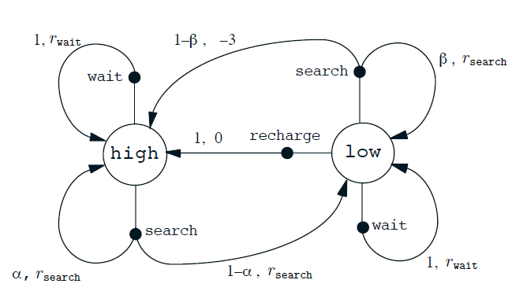
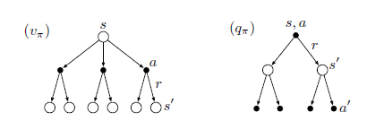
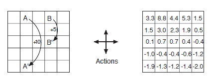
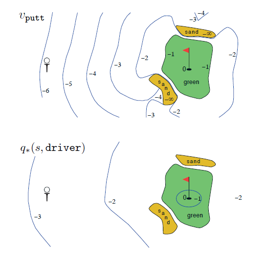
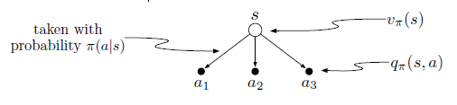
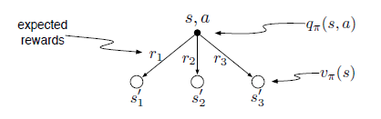
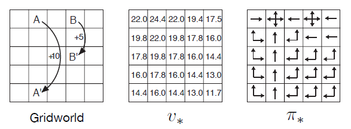
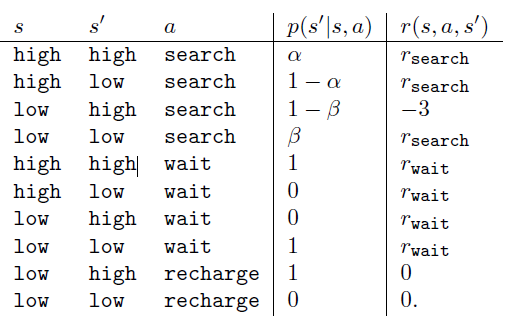
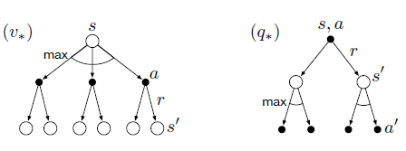

第3章 有限马尔科夫决策过程
==========================

在本章中，我们将介绍有限马尔可夫决策过程或有限MDP的形式问题，我们将在本书的其余部分尝试解决这些问题。
这个问题涉及评价反馈，如在老虎机问题中，但也涉及一个关联方面，即在不同情况下选择不同的行动。
MDP是顺序决策的经典形式化，其中行动不仅影响直接奖励，还影响后续情况或状态，以及贯穿未来的奖励。
因此，MDP涉及延迟奖励以及交换即时与延迟奖励的需要。
在老虎机问题中，我们估计每个动作a的价值 :math:`q_*(a)`，
在MDP中我们估计每个状态s中每个动作a的价值 :math:`q_*i(s, a)`，
或者我们估计给出最佳行动选择的每个状态的价值 :math:`v_*(s)`。
这些依赖于状态的量对于准确地为个人行动选择的长期结果分配信用至关重要。

MDP是强化学习问题的数学理想化形式，可以对其进行精确的理论陈述。
我们介绍问题数学结构的关键元素，如回归，值函数和Bellman方程。
我们试图传达可能被用作有限MDP的各种可能的应用程序。
与所有人工智能一样，在适用范围和数学易处理性之间存在着一种矛盾。
在本章中，我们将介绍这种矛盾关系，并讨论它所暗示的一些权衡和挑战。
第17章介绍了在MDP之外进行强化学习的一些方法。

3.1 智能体环境接口
^^^^^^^^^^^^^^^^^^^^
​
强化学习问题意味着从交互学习到实现目标的问题的直接框架。智能体在其中进行学习和决策。除了智能体本身，智能体与之交互的一切，称之为环境。它们不断地交互，智能体选择动作同时环境响应那些动作并向智能体呈现新的情况 [1]_，智能体试图随着时间最大化环境所反馈的奖励数值。一个完整规范的环境，包括如何确定奖励，定义一个强化学习问题的实例作为任务。

   pic3.1

图3.1：强化学习中智能体与环境交互图
                                   

​ 具体来说，智能体和环境在离散时间序列每一步相互作用，t =
0,1,2,3,…. [2]_
在每一步t，智能体感应到环境状态，\ :math:`S_{t}\in \mathcal{S}`,$
:raw-latex:`\mathcal{S}`\ :math:`是所有可能状态的集合，并在此基础上选择动作，`\ A_{t}
:raw-latex:`\in`:raw-latex:`\mathcal{A}`(S_{t}) $
，\ :math:`\mathcal{A}(S_{t})`\ 是在状态\ :math:`S_{t}`\ 上所有动作的集合。每一步后，作为它行动的结果，智能体接收到一个奖励值，\ :math:`R_{t+1} \in \mathcal{R} \subset \mathbb{R}`\ ，并且自身处于一个新状态，\ :math:`S_{t+1}`
 [3]_ ，图3.1展示了智能体- 环境交互过程。

​ 在每一步，智能体实现从状态到选择每个可能动作的概率的映射。
此映射称为智能体的策略，并表示为\ :math:`\pi _{t}`\ ，当\ :math:`S_{t} =s`\ 时，\ :math:`A_{t}=a`\ 的概率是\ :math:`\pi _{t}(a|s)`\ ，强化学习方法指定智能体根据经验改变其策略的方式。智能体的目标，大致来说，是最大化的获得它的长期总收益。

​
这个框架是灵活而抽象的，可以以不同的方式应用在很多不同的问题上。例如，时间步长不需要参考实时的固定间隔；它们可以指任意连续的决策和行动阶段。动作可以是低级控制，例如施加到机器人臂的电机的电压，或者高级决策，例如是否吃午饭或去研究生院。类似地，状态也可以采取各种各样的形式。它们可以完全由低级感应（例如直接传感器读数）来确定，或者它们可以是更高级的和抽象的，例如房间里的物体符号表示。可以基于对过去的感觉的记忆，甚至是完全精神的或主观的来构成一个状态。例如，智能体可能处于不能确定物体在哪里，或者在某种明确定义的意义上感到惊讶。类似地，一些动作可以是完全精神的或可计算的。例如，某些操作可能会控制智能体选择思考的内容，或者注意力集中在哪里。一般来说，动作可以是我们想要学习如何做的任何决定，而状态可以是任何我们可以知道，可能有用的。

​
特别的，智能体和环境之间的边界通常不像机器人或动物身体的物理边界。通常，边界更接近于智能体。例如，机器人及其感测硬件的电动机和机械联动件通常应被认为是环境的部分而不是智能体的部分。同样，如果我们将框架应用于人或动物，肌肉，骨骼和感觉器官应被视为环境的一部分。奖励也可以在自然和人工学习系统的物理体内计算，但被认为是智能体外部的。

​
我们遵循的一般规则是，任何不能由智能体任意改变的东西被认为是在它之外，因此是它的环境的一部分。我们不假定智能体对环境一无所知。例如，智能体一直知道如何用它的动作和它所在的状态的函数来计算奖励。但是我们总是认为奖励计算是在智能体之外的，因为它是根据智能体的任务所定义的，因此不能由智能体来随意改变。事实上，在一些情况下，智能体就算知道它的环境是如何运行的，但是所面临增强学习任务仍然很困难的，正如我们可以知道一个魔方是如何运行的，但仍然无法解开它。智能体-环境的边界代表着对智能体的绝对控制能力的限制，而不是限制它的知识。

​
智能体-环境的边界可以根据需要设置在不同的地方。在复杂的机器人中，许多不同的智能体可以一次操作，每个具有其自己的边界。例如，一个智能体可以做出高级决策，高级决策可由低级智能体面临的状态组成，从而实现高层次的决策。在实践中，一旦已经选择了特定状态，动作和奖励，就确定智能体
- 环境边界，并且因此已经识别感兴趣的特定决策任务。

​
强化学习框架大部分是从相互作用的目标导向学习的问题中抽象出来的。它提出，无论传感，记忆和控制装置的细节以及任何目标尝试实现的目标，学习目标指向行为的任何问题可以减少到在智能体与其环境之间来回传递的三个信号中：一个信号表示智能体做出的选择（动作），一个信号表示做出选择的基础（状态），以及另一个信号来定义智能体的目标（奖励）。这个框架可能不足以有效地代表所有的决策学习问题，但它已被证明是广泛有用和适用的。

​
当然，特定的状态和动作因任务而异，并且它们如何被表示可以极大地影响性能。在强化学习中，和其他类型的学习一样，这种表示的选择目前相比科学更多可说是艺术。在本书中，我们提供了一些关于状态和动作的表示建议和示例的好方法，但我们的主要焦点是一旦表示被确定，如何学习行为的一般原则。

​ **例3.1：生物反应器**
假设强化学习用于确定生物反应器（用于生产有用化学品的大量营养物和细菌）的力矩温度和搅拌速率。

这种应用中的动作可以是传递到下级控制系统的目标温度和目标搅拌速率，其进而直接激活加热元件和马达以实现目标。状态可能是有可能被过滤和延迟热电偶和其他感觉读数，加上代表大桶和目标化学品中的成分的符号输入。奖励可以是逐时测量由生物反应器产生有用化学品的速率。注意，这里每个状态是传感器读数和符号输入的列表或向量，并且每个动作是由目标温度和搅拌速率组成的向量。强化学习任务通常具有具有这种结构化表示的状态和动作。
另一方面，奖励总是单数。

​
**例3.2：拾取和放置机器人**\ 考虑使用强化学习来控制机器人手臂在重复性拾取和放置任务中的运动。如果我们想要学习快速且平滑的运动，则当前智能体将必须直接控制马达并且具有关于机械联动装置的当前位置和速度的低延迟信息。在这种情况下的动作可以是施加到每个接头处的每个电动机的电压，而状态可以是关节角度和速度的最新读数。对于成功完成拾取和放置的每个目标，奖励可以是+1。为了鼓励平滑移动，在每个时间步长上，可以给出作为运动的瞬间“急动”的函数一个小的负的奖励。

​
**例3.3：环保机器人**\ 移动机器人能在办公环境里进行收集空的汽水罐。它具有用于检测罐的传感器，以及可拾取并将它们放置在机载箱中的臂和夹具;
它依靠可充电电池运行。机器人的控制系统具有用于解释感觉信息，用于导航以及用于控制臂和夹具的部件。关于如何搜索罐的高级决定由强化学习智能体基于电池的当前电量进行判断。该智能体必须决定机器人是否应该（1）在一定时间内主动搜索罐，（2）保持静止，并等待某人给它罐，或者（3）回到其原始基地电池充电。这个决定必须定期或每当某些事件发生时做出，例如发现一个空罐。因此，这个智能体有三个动作，其状态由电池的状态决定。奖励在大多数时间可能为零，但是当机器人获得一个空罐时变为正，或者如果电池一直运行则是大的负值。在这个例子中，强化学习智能体不是整个机器人。它监视的状态描述机器人本身内在的条件，而不是机器人的外部环境的条件。
智能体的环境包括机器人的其余部分，其可能包含其他复杂的决策系统，以及机器人的外部环境。

​
**练习3.1**\ 将你自己的三个示例任务设计到强化学习框架中，识别每个状态，动作和奖励。使这三个示例尽可能彼此不同。该框架是抽象灵活的，

可以以许多不同的方式应用。 至少在你的一个例子中以某种方式扩展它的极限。

​ **练习3.2**\ 强化学习框架是否足以有效地代表所有目标导向的学习任务？
你能想到任何明显的例外吗？

​ **练习3.3** 考虑驾驶的问题。
你可以定义加速器，方向盘和制动器的动作，也就是说，你的身体接触到的机器。或者你可以把它们考虑更多一点
-
比如，再橡胶路上，考虑你的动作是轮胎扭矩。或者你可以考虑更多，例如，你的大脑掌控身体，动作是肌肉抽搐控制你的四肢。或者你可以去一个真正高的层次，你的动作是选择去那里开车。什么是智能体和环境之间合适的层次和位置分界？
在什么基础上，该分界的一个位置是优先于另一个？
有什么根本原因选择一个而不选择另一个，或者是随意的选择？

3.2 目标和奖励
^^^^^^^^^^^^^^

​
在强化学习中，智能体的目的或目标被形式化为从环境传递到智能体的特殊奖励信号。在每一步，奖励是一个简单的数字，\ :math:`R_{t} \in \mathbb{R}`\ 。非正式地，智能体的目标是最大化它收到的总奖励。这意味着不是立即奖励的最大化，而是长期的累积奖励。
我们可以用奖励假说来清楚表达这个非正式的想法：

*我们通过目标和目的时意味着是接收到的标量信号（称为奖励）的累积和的期望值的最大化。*

使用奖励信号来形式化目标的想法是强化学习的最显着的特征之一。

​
尽管在奖励信号方面制定目标可能首先会出现限制，但在实践中它已被证明是可行的和广泛适用的。
看到这一点的最好方法是考虑它已经或可能被使用的例子。例如，为了让机器人学会走路，研究人员在与机器人的前进运动成比例的每个时间步长上提供了奖励。在使机器人学习如何从迷宫中逃脱时，对于在成功逃脱之前经过的每个时间步长，奖励通常为-1;这鼓励智能体尽快逃离。为了使机器人学会找到并收集空罐用于回收，可以在大多数时间给予它零回报，然后每收集一次空罐给+1的回报。人们可能也想给机器人负面的奖励，如在当它撞到东西或当有人叫它时候。对于一个学习玩棋的智能体，自然奖励是+1获胜，-1为失败，0用来表示所有非终止的位置。

​ 你可以看到所有这些例子中发生了什么。
智能体总是学会最大化其奖励。如果我们希望它为我们做某事，我们必须提供奖励给它，最大化奖励这样智能体也将实现我们的目标。

因此，我们建立的奖励真正表明我们想要完成的是至关重要的。特别地，奖励信号不是传授给智能体如何实现我们想要做的事情的先验知识。 [4]_
例如，下棋玩家应该仅奖励实际获胜，而不是用于实现子目标，例如获取对手的棋子或获得棋盘中心的控制。如果实现这些子目标被奖励，那么智能体可能会找到一种方法来实现它们，而不实现真正的目标。
例如，它可能找到一种方式来赢得对手的棋子，即使付出输掉游戏的代价。
奖励信号是你与机器人沟通的方式，你想要它实现的，而不是你想要它如何实现的方式。

​ 强化学习的新手有时惊讶这些，奖励 - 它是学习目标的定义 -
是在环境中而不是在智能体中计算的。当然，动物的最终目标通过在身体内发生的计算来识别，例如通过用于识别食物，饥饿，疼痛和快感的感觉。然而，正如我们在上一节中讨论的，可以重新确定智能体
-
环境接口，使得身体的这些部分被认为在智能体之外（并且因此是智能体的环境的一部分）。例如，如果目标涉及机器人的内部能量储存器，则这些被认为是环境的一部分;如果目标涉及机器人的肢体的位置，则这些也被认为是环境的一部分
-
也就是说，智能体的边界被确定在肢体及其控制系统之间的接口处。这些东西被认为是机器人内部的，但在学习智能体的外部。为了我们的目的，方便的办法不是将学习智能体的边界放置在其物理体的极限处，而是放在处于其控制的极限处。

​
我们这样做的原因是，智能体的最终目标应该是它不完全控制的东西：它也不应该能被控制，例如，简单地命令，奖励已被收到，以同样的方式，它可以任意改变其行为
。 因此，我们将奖励源放在智能体之外。
这并不排除智能体为自己定义一种内部奖励，或一系列内部奖励。
事实上，这正是许多强化学习方法所做的。

3.3 回归
^^^^^^^^

到目前为止，我们已经讨论了非正式学习的目标。
我们已经说过，智能体的目标是获得从长远来看的最大累积奖励。
这如何正式定义？如果在时间步骤\ *t*\ 之后接收的奖励序列表示为\ :math:`R_{t + 1}`,\ :math:`R_{t + 2}`,
:math:`R_{t + 3}`,……，那么我们希望最大化这个序列的具体什么地方？一般来说，我们寻求最大化预期回报，其中回报\ :math:`G_{t}`\ 被定义为回报序列的一些特定函数。

在最简单的情况下，回报是奖励的总和：

:math:`G_{t} \doteq R_{t+1} +R_{t+2} +R_{t+3}+...+R_{T},`

其中\ *T*\ 是最后一步。这种方法在其中存在最终时间步长的自然概念的应用中是有意义的，也就是说，当智能体
-
环境交互自然地断裂成子序列，我们称之为\ *情节*\  [5]_，诸如玩游戏，通过迷宫的旅程，
或任何种类的重复交互。每个情节在称为终端状态的特殊状态结束，随后是重置到标准起始状态或从起始状态的标准分布的抽样。即使你认为情节以不同的方式结束，例如获胜和失败的游戏，下个情节也会独立于前情节的结束。因此，情节可以被认为在相同的终点状态中结束，对于不同的结果给予不同的奖励。这种类型的任务被称为\ *情景*\ 任务。在情景任务中，我们有时需要区分所有非终结状态的集合，表示为\ :math:`\mathcal{S}`\ ，从所有状态的集合加上终端状态，表示为\ :math:`\mathcal{S+}`\ 。

​ 另一方面，在许多情况下，智能体 -
环境交互不会自然地分开成可识别的情节，而是连续的无限制地发生着。例如，这将是一个自然的方式来制定一个持续的过程控制任务，或具有长寿命的机器人上的应用。我们称之为这些持续的任务。返回公式（3.1）对于连续的任务是有问题的，因为最终的时间步长将是T
=
1，并且返回，这是我们试图最大化的，但其本身可以是无限的。（例如，假设智能体在每个时间步骤接收到+1的奖励。）因此，在本书中，我们通常使用返回的定义，它在概念上略微更复杂，但在数学上更简单。

​ 我们需要的另一个概念是衰减因子。
根据该方法，智能体尝试选择动作，使得它在未来接收的衰减的奖励的总和被最大化。
特别地，它选择\ :math:`A_{t}`\ 以最大化得到预期衰减的回报：

$ G_{t} :raw-latex:`\doteq `R_{t+1} + :raw-latex:`\gamma `R_{t+2} +
:raw-latex:`\gamma `^ 2 R_{t+3}+…=
:raw-latex:`\sum`\ *{k=0}:raw-latex:`\infty `:raw-latex:`\gamma`\ k
R*\ {t+k+1}, $(3.2)

其中\ :math:`\gamma`\ 是参数，\ :math:`0 \leq\gamma \leq 1`\ ，称为\ *衰减因子*\ 。

​
衰减率决定了未来奖励的现值：在将来接收的k时间步长的奖励是值得的，如果\ :math:`\gamma ^{k-1}`\ 的奖励是立即被接收的。如果\ :math:`\gamma`\ <1，则无穷总和具有有限值，只要奖励序列{:math:`R_{k}`}是有界的。如果\ :math:`\gamma`
=
0，智能体是“近视”，只关心最大即时奖励：其目标是在这种情况下学习如何选择\ :math:`A_{t}`\ 以便最大化仅\ :math:`R_{t+1}`\ 。如果每个智能体的行为仅影响即时奖励，而不影响未来奖励，则近视智能体可以通过分别最大化每个即时奖励来最大化公式（3.2）。但一般来说，最大化立即报酬可以减少获得未来奖励的机会，从而实际上会减少回报。至于方法1，更加强烈地考虑未来的奖励目标：智能体变得更加有远见。

.. figure:: images/figure3.2.png
   :alt: figure3.2

   figure3.2

图3.2：杆平衡任务。
                   

​
示例3.4：杆平衡图3.2显示了一个作为强化学习的早期示例的任务。这里的目的是向沿着轨道移动的手推车施加力，以便保持铰接到手推车的杆不会掉落。故障是杆从垂直或在轨道的车运行时发生掉落。每次故障后，极点复位为垂直。
这个任务可以被当作情节，其中自然情节是反复尝试来平衡杆。在这种情况下的奖励是+1对于没有发生故障，使得每次的返回将是直到失败的步骤的数量。或者，我们可以将杆平衡作为持续的任务，使用衰减因子。在这种情况下，奖励将在每个故障为-1，在所有其他时间为零。每次的返回将\ :math:`-\gamma^K`\ 相关，其中K是失效之前的时间步数。
在任一情况下，通过保持杆平衡尽可能长的时间来得到最大化奖励。

​ 练习3.4
假设你将杆平衡作为一个情节性任务，但是也使用了衰减因子，除了-1是失败之外，所有奖励都是零。
那么每次回报是多少？ 这个回报与有衰减的持续任务有什么不同？

​ 练习3.5想象你正在设计一个走迷宫的机器人。
你决定给它一个+1的奖励，从迷宫逃脱，并在其他时间奖励零。这个任务似乎自然地被分解成情节——连续的穿过迷宫——所以你决定把它当作一个情节的任务，目标是最大化预期的总奖励（3.1）。
运行学习智能体一段时间后，你会发现从迷宫中逃脱没有达到预期效果。
出了什么问题？ 你有没有真正地向智能体传达你想要的指令？

3.4 情节和持续任务的统一符号
^^^^^^^^^^^^^^^^^^^^^^^^^^^^

​
在上一节中，我们描述了两种强化学习任务，一种是其中智能体—环境交互自然地分解成一系列单独的情节（情节性的任务），另一种则不会（持续任务））。前一种在数学上更容易计算，因为每个动作只影响随后在情节中收到的有限数量的奖励。在这本书中，我们有时考虑前一种问题，有时候会考虑另一种问题，但往往两者都需要考虑。因此，提出一个使我们能够同时精确地讨论这两种情况的符号是有用的。

​
为了准确的描述情节任务需要一些额外的符号。不再是一连串的时间步长，我们需要考虑一系列的情节，每一个情节都由一系列时间步长组成。我们从零开始重新开始编号每个情节的时间步长。因此，我们不仅要使用\ :math:`S_{t}`\ 表示在时间\ :math:`t`\ 的状态，而且需要使用\ :math:`S_{t,i}`\ ，在情节\ :math:`i`\ 的时间\ :math:`t`\ 的状态表示（\ :math:`A_{t,i}`\ ，\ :math:`R_{t,i}`\ ，\ :math:`\pi_{t,i}`\ ，
:math:`T_{i}`\ 等符号意义相似）。然而，事实证明，当我们讨论情节任务时，我们几乎不必区分不同的情节。我们总是会考虑一个特定的情节，或者说出所有情节都是如此。因此，在实践中，我们总是通过省略情节的明确引用符号。
也就是说，我们将用\ :math:`S_{t}`\ 来指\ :math:`S_{t,i}`\ ，等等。

​
我们需要另外一个约定来定义一个涵盖情节和连续性任务的单一符号。在一例（3.1）中，我们将返回归结于有限数量的步数的总和，另一个是无限数量的总和（3.2）。这些可以通过考虑情节终止来进行统一，这是一个特殊的吸收状态的转换，只转换到自己，只产生零的奖励。
例如，考虑状态转换图

.. figure:: images/state_transition_diagram.png
   :alt: state transition diagram

   state transition diagram

这里的实心方块表示与情节结束对应的特殊吸收状态。从\ :math:`S_{0}`\ 开始，我们得到奖励序列+1，+1，+1，0，0，0，……总结这些，我们得到相同的返回值，无论我们是否相加第一个\ *T*\ 奖励（这里\ *T*
=
3）或以上整个无限序列。即使我们引入折扣，这仍然是成立的。因此，我们可以根据（3.2）来定义回报，按照省略不必要情节编号的惯例，并且包括如果总和仍然被定义为\ :math:`\gamma = 1`\ 的可能性（例如，所有情节终止
）。 或者，我们也可以写回报如下

$ G_{t} :raw-latex:`\doteq  `:raw-latex:`\sum`\ *{k=0}^{T-t-1}
:raw-latex:`\gamma`^k R*\ {t+k+1}, $ (3.3)

包括\ :math:`T = \infty`\ 或\ :math:`\gamma = 1`\ （不能同时存在）的可能性。我们在本书的其余部分中使用这些约定来简化符号，并表达情节和持续任务之间的接近相似。
（后来，在第10章中，我们将介绍一个持续不变的形式。）

\*3.5马尔科夫属性
^^^^^^^^^^^^^^^^^

在强化学习框架中，智能体根据来自环境\ *状态*\ 的信号作出决定。在本节中，我们将讨论什么是状态信号，什么样的信息是我们应该或不应该期望的。特别是，我们正式将一种特别感兴趣的环境属性和它的状态信号称为马尔可夫属性。

​
在这本书中，“状态”是指智能体可以使用的任何信息。我们假设状态由一些预处理系统给出作为环境的一部分。本书不讨论构建，变更或学习状态信号的问题。我们采取这种做法不是因为我们认为状态表示不重要，而是为了充分关注决策问题。换句话说，我们的主要关注不是设计状态信号，而是作为任何状态信号情况下决定采取的行动。根据惯例，奖励信号不是状态的一部分，但它的副本当然可以是。

​ 当然，状态信号应该包括立即的感觉，如感官感知，但它可以包含更多的。
状态表示可以是原始感觉的高级处理版本，或者它们可以是从感觉序列随时间推移的复杂结构。
例如，我们可以在一个场景中移动我们的眼睛，只有一个对应于中央凹的细微点，就可以在任何一个时间看到，而且建立一个丰富而详细的场景表示。
或者，更明显地，我们可以看一个对象，然后移开目光，但是知道它仍然存在。我们可以听到“是”一词，并认为自己处于完全不同的状态，这取决于以前的问题，不再是可听见的。在更平凡的水平上，控制系统可以在两个不同的时间测量位置，以产生包括关于速度的信息的状态表示。在所有这些情况下，状态根据当时的感觉和以前的状态或过去感觉的一些其他记忆，构建和维护。
在这本书中，我们不会探讨如何做到这一点，但肯定这是可以的而且已经完成的。
没有理由将状态表示限制在瞬时感觉之中;
在典型的应用中，我们应该期望状态表示能够通知智能体。

​
另一方面，不应该期望状态信号向智能体通报有关环境的一切，甚至是在作出决定时对其有用的一切。
如果智能体在玩二十一点，我们不应该期望它知道甲板上的下一张卡是什么。
如果智能体正在接听电话，我们不应该期望它提前知道呼叫者是谁。
如果智能体是一名叫做道路交通事故的医护人员，我们不应该期望它立即知道不省人事的受害者的内伤。
在所有这些情况下，环境中都有隐藏的状态信息，这是对智能体有用的信息，但智能体不应该知道，因为它从未收到过相关的反馈。
简而言之，我们不会为了不知道重要事项的智能体，而只是为了知道某事，然后忘记它！我们不会让智能体不知道重要的事情，而只是为了知道某事，然后忘记它！

​
理想情况下，我们想要的是一个状态信号，它精简地表达了过去的反馈，保留着所有相关信息。这通常需要比直接的反馈更多，但不能超过所有过去完整反馈。能成功保留所有相关信息的状态信号称为\ *马尔科夫*\ ，或者是\ *马尔可夫属性*\ （我们在下面正式定义）。例如，棋子位置——棋盘上所有棋子的当前为止位置——将作为马尔科夫状态，因为它总结了变成现在完整的位置序列重要的一切。关于序列的大部分信息都会丢失，但是对于游戏的未来来说真的很重要。同样，炮弹的当前位置和速度对于未来的战斗来说都是很重要的。这个位置和速度怎么来的是不重要的。
这有时也被称为“路径独立性”，因为所有重要的都是当前的状态信号;
它的意义是独立于导致它的信号的“路径”或历史。

​
我们现在正式为强化学习问题定义马尔可夫属性。为了保持计算的简单，我们假设这里是有限数量的状态和奖励值。这使得我们能够在总和和概率方面计算，而不是积分和概率密度，但是这个论证可以容易地被扩展到包括连续的状态和奖励（或无限的离散空间）。考虑一般环境下在时间\ *t
+
1*\ 对时间\ *t*\ 采取的行动作出反应。在最普遍的因果情况下，这种反应可能取决于之前发生的一切。
在这种情况下，只能通过指定完整的联合概率分布来定义动态：

:math:`P_r \{ S_{t+1} =s^ \prime ,R_{t+1} = r | S_0,A_0,R_1,…,S_{t-1},A_{t-1},R_t,S_t,A_t\}`,
(3.4)

对于所有\ *r*\ ，\ :math:`s^ \prime`\ ，以及过去事件的所有可能值：$
S_0,A_0,R_1,…,S_{t-1},A_{t-1},R_t,S_t,A_t$。另一方面，如果状态信号具有马尔科夫属性，那么环境在\ *t
+
1*\ 处的响应仅取决于\ *t*\ 处的状态和动作表示，在这种情况下，可以通过仅指定环境的动态

:math:`p(s^\prime,r|s,a)\doteq P_r\{S_{t+1}=s^\prime ,R_{t=1}=r|S_t=s,A_t=a\}`
, (3.5)

对于所有的\ *r*\ ，\ :math:`s^\prime`\ ，和\ *a*\ 。换句话说，状态信号具有马尔科夫属性，并且是马尔科夫状态，当且仅当（3.4）等于\ :math:`p(s^\prime,r|S_t,A_t)`\ 在所有\ :math:`s^\prime`\ ，\ *r*\ 和所有之前的$
S_0,A_0,R_1,…,S_{t-1},A_{t-1},R_t,S_t,A_t$。
在这种情况下，整个环境和任务也被称为拥有马可夫属性。

如果一个环境具有马尔可夫属性，那么它的动态递推公式（3.5）使我们能够根据当前的状态和行动来预测下一个状态和预期的下一个奖励。可以看出，通过迭代这个方程，可以预测所有将来的状态，并且仅从当前状态的知识中获得预期的回报，并且在给出迄今为止的完整历史的情况下都是可以预见的。马尔可夫状态也提供了选择行动的最佳依据。
也就是说，通过马尔可夫状态最佳策略来选择行动就像通过完整历史的最佳策略来选择一样好。

​
即使状态信号是非马尔科夫，仍然认为强化学习中的状态是马尔科夫状态的近似值。特别是，我们一直希望状态是预测未来的回报和选择行动的良好基础。在环境模型被学习的情况下（见第8章），我们也希望状态成为预测后续状态的良好基础。马尔科夫状态提供了实现所有这些事情的无与伦比的基础。把状态看成接近马尔科夫状态这种方式，人们将从强化学习系统获得更好的表现。基于以上原因，将每一步中的状态视为马尔可夫状态的近似值是有用的，但是应该记住，它可能不能完全满足马尔可夫属性。

​
马尔可夫属性在强化学习中是重要的，因为假定判断和值仅仅是当前状态的函数。为了使这些有效和翔实，状态的表示必须是资料丰富的。本书中提出的所有理论都假定马尔科夫状态信号。这意味着并不是所有的理论都严格适用于不严格定义马尔可夫属性的例子。然而，为马尔可夫案例开发的理论仍然有助于我们了解算法的行为，并且算法可以成功应用于不严格马尔科夫的状态的许多任务。充分理解马尔科夫理论例子是将其扩展到更复杂和更现实的非马尔可夫例子的重要基础。最后，我们注意到，马尔可夫状态表示的假设并不是强化学习的唯一性，而是在人工智能的大多数（如果不是全部）其他方法中也存在。

​ **示例3.5：杆平衡状态**
在前面介绍的杆平衡任务中，如果它能精确地指定，或者可以准确地重建车沿轨道的位置和速度，
车和杆，以及角度变化的速度（角速度），状态信号是马尔可夫的。在理想化的车
-
杆系统中，鉴于控制器采取的行动，这些信息将足以准确预测车和杆的未来行为。然而在实际上，绝对不可能知道这些信息，因为任何真正的传感器都会在其测量中带来一些失真和延迟。此外，在任何真正的车
-
杆系统中，总是存在其他影响，例如杆的弯曲，车轮和杆轴承的温度以及各种形式的间隙，其稍微影响系统的行为。这些因素将导致违反马尔可夫属性，
如果状态信号只是推车和极点的位置和速度。

​ 然而，往往是位置和速度是很好状态定义。
一些学习解决极平衡任务的早期研究使用粗略状态信号，一些学习解决极平衡任务的早期研究使用粗略状态信号，将推车位置分为三个区域：右侧，左侧和中部（以及其他三个内在状态变量的类似粗略量化）。
这个明显的非马尔可夫状态足以使通过强化学习方法轻松解决任务。
事实上，这种粗略的表示可能通过强迫学习智能体忽略在解决任务中没用的细微区别来促进快速学习。

​ **示例3.6：德州扑克**
在德州扑克牌游戏中，每位玩家手中拿着五张牌。在每一轮投注，每个玩家交换一些新牌，然后投注。每一轮，每位玩家必须匹配或超过其他玩家的最高投注，否则退出（折叠）。
在第二轮投注后，没有被折叠且有最好的的牌玩家是获胜者并且获得所有的赌注。

​ 德州扑克的状态信号对于每个玩家而言是不同的。
每个玩家都只知道自己掌握的牌，但能猜测其他玩家手中的牌。
一个常见的错误是认为马尔科夫状态信号应包括所有玩家的牌和剩余在案板上的牌的内容。
然而，在公平的比赛中，我们假设玩家原则上无法从过去的观察中确定这些事情。
如果玩家知道那些，那么她就可以通过记住所有过去的观察结果来更好预测一些未来的事件（如可以交换的牌）。

​ 除了知道自己的牌，扑克牌的状态还应包括其他玩家所得的赌注和牌数。
例如，如果其他玩家之一画了三张新卡，你可能怀疑他保留了一双，并相应地调整了你对他的牌的猜测。
玩家的投注也会影响你对一手牌的评估。
事实上，你过去与这些特定玩家的历史很多是马尔科夫状态的一部分。
艾伦喜欢虚张声势，还是保守地玩？ 她的脸色或风度是否为一手牌提供了线索？
当到了深夜，或者当他已经赢得了很多钱时，乔伊的玩法会如何变化？

​
虽然有关其他玩家表现的一切都可能对他们持有各种手牌的可能性产生影响，但在实践中，这些太多了不能记住和分析，大部分内容对于预测和决策都不会有明确的影响。好的扑克玩家擅长记住关键线索，并迅速调整新玩法，但没有人会记得所有相关的内容。因此，人们用来做扑克决定的状态表示无疑是非马尔可夫，这样的决定本身也是不完美的。然而，人们仍然在这样的任务中做出很好的决定。
我们得出结论，无法获得完美的马尔科夫状态表示可能不是强化学习智能体的严重问题。

​ **练习3.6：破裂的视觉系统** 想像你是一个视觉系统。
当你某天第一次打开的时候，一个图像会涌入你的镜头。
你可以看到很多东西，但不是所有的东西。你看不到被遮挡的物体，当然你看不到身后的物体。
在看到第一幕之后，你是否可以访问马尔可夫状态的环境？
假设当天你的镜头坏了，整天都没有收到图像。
那么你可以访问马尔可夫状态吗？

3.6马尔可夫决策过程
^^^^^^^^^^^^^^^^^^^

满足马尔可夫属性的强化学习任务称为\ *马尔可夫决策过程*\ ，或MDP。如果状态和动作空间是有限的，则称之为有限的马尔可夫决策过程（有限的MDP）。
有限的MDP对于强化学习的理论特别重要。 我们在这本书中广泛的讨论它们;
它们是你需要了解的现代强化学习90%的内容。

​ 特定的有限MDP由其状态和动作集以及环境的每步动态定义。
给定任何状态s和动作a，每个可能的下一个状态\ :math:`s^\prime`\ 和奖励\ *r*\ 的概率表示：

​ :math:`p(s,a) \doteq Pr\{ S_(t+1)=s^\prime,R_{t+1} =r|S_t=s,A_t=a\}`
(3.6)

​ 这些等式完全指定了有限\ **MDP**\ 的动态。
我们在本书其余部分提出的大部分理论都隐含地假设环境是有限的\ **MDP**\ 。

​
考虑到（3.6）规定的动态，人们可以计算出可能想要了解的关于环境的其他任何事物，例如状态—动作对的预期回报，

​
:math:`r(s,a)\doteq \mathbb{E}[R_{t+1}|S_t =s,A_t=a]=\sum_{r \in \mathcal{R}} r \sum_{s^\prime \in \mathcal{S}}p(s^\prime,r|s,a),`
(3.7)

​ 状态转移概率，

​
:math:`p(s^\prime|s,a)\doteq P_r\{S_{t+1}=s^\prime|S_t=s,A_t=a \}=\sum_{r\in \mathcal R}p(s^\prime,r|s,a)`
(3.8)

​ 以及状态—动作—下一个状态三元组的期望奖励，

​
:math:`r(s,a,s^\prime)\doteq\mathbb{E}[R_{t+1}|S_t=s,A_t=a,S_{t+1}=s^\prime]=\frac{\sum_{r\in \mathcal{R}r p(s^\prime,r|s,a)}}{p(s^\prime|s,a)}`
(3.9)

​
在本书的第一版中，动态仅用后面两个变量表示，分别为\ :math:`\mathcal{P}_{ss^\prime}^a`\ 和\ :math:`\mathcal{R}_{ss^\prime}^a`\ 。该符号的一个缺点是它仍然没有完全表征奖励的动态，只给出他们的期望。
另一个缺点是下标和上标过多。
在这个版本中，我们将主要使用（3.6）的显式符号，有时直接指向转换概率（3.8）。

​ **示例3.7： 环保机器人MDP**
环保机器人（示例3.3）可以通过简化MDP并提供一些更多的细节成为MDP的简单示例。
（我们的目标是实现一个简单的例子，而不是特别符合实际的例子）。回想一下，智能体检测到外部事件时（或机器人控制系统的其他部分）做出决定。
在每个这样的时刻，机器人决定是否应该（1）主动搜索一个空罐，（2）保持静止，等待有人给它罐子，或者（3）回到家中为电池充电。假设环境如下。
找到空罐的最好方法是积极搜索它们，但这会耗尽机器人的电池，而等待不会。

每当机器人正在搜索时，存在电池耗尽的可能性。
在这种情况下，机器人必须关闭电池并等待被救出（产生低报酬）。

​
智能体仅仅根据电池的能量水平作出决定。它可以区分\ **高低**\ 两个级别，使状态集合为\ :math:`\mathcal{S}=\{high,low\}`
。让我们假设可能的决策—智能体的动作—\ **等待**\ ，\ **搜索**\ 和\ **充电**\ 。当电量足时，充电总是愚蠢的，所以我们不把它算在这个状态的动作中。
智能体的动作集是

:math:`\mathcal{A}(high)\doteq \{search,wait\}`

:math:`\mathcal{A}(low)\doteq \{search,wait,recharge\}`

​
如果电量高，则可以完整的完成主动搜索的过程，而不会有耗尽电池的风险。以高电量开始的搜索周期以\ :math:`\alpha`\ 的概率保持高电量，并以\ :math:`1-\alpha`\ 的概率降低到低电量。另一方面，当在电量低时进行的搜索时，以\ :math:`\beta`\ 概率保持在低电量，并以\ :math:`1-\beta`\ 的概率消耗电池电量。在后一种情况下，机器人必须被救援，然后把电池再充电回到高电量。机器人收集的每一个空罐都可以作为一个单位奖励，而当机器人必须得到救援时，得到-3的奖励值。研究等待，研究>等待，分别表示机器人在搜索和等待期间将收集的罐的预期数量（因此预期的奖励）。使用\ :math:`r_{search}`\ 和\ :math:`r_{wait}`,以及\ :math:`r_{search}>r_{wait}`
，分别表示机器人在搜索和等待期间将收集的罐的预期数量（因此预期的报酬）。最后，为了方便，假设在运行回去充电时不能收集空罐，并且在电池耗尽的一步中也不能收集空罐。这个系统就是一个有限的\ **MDP**\ ，我们可以写出它的转移概率和预期的回报，如表3.1所示。

​ |Table3.1|

**表3.1**\ ：环保机器人示例的有限\ **MDP**\ 的转换概率和预期回报。每行分别是：当前状态，\ :math:`s`
，下一状态，\ :math:`s^\prime`
，和当前状态中可能的动作\ :math:`a\in\mathcal{A} (s)`\ 。

​
*转换图*\ 是总结有限MDP动态的有用方式。图3.3显示了环保机器人示例的转换图。

   Figure3.3

​ 图3.3：环保机器人示例的转换图

有两种节点：状态节点和动作节点。每个可能状态有一个状态节点（一个由状态名称标记的大开环），每个状态动作对的一个动作节点（由状态节点的线标记的小实心圆）。从状态\ :math:`s`\ 开始并采取动作\ :math:`a`\ 将沿着县从状态节点\ :math:`s`\ 到行动节点的\ :math:`(s,a)`\ 。然后，环境通过离开动作节点\ :math:`(s,a)`\ 的箭头之一转换到下一个状态的节点。每个箭头对应一个三元组\ :math:`(s,s^\prime,a)`\ ，其中\ :math:`s^\prime`\ 是下一个状态，我们用转移概率\ :math:`p(s^\prime|s,a)`\ 标注箭头，并且该转换的预期奖励\ :math:`r(s,a,s^\prime)`\ 。请注意，标记离开动作节点的箭头的转换概率总是等于1。

3.7 价值函数
^^^^^^^^^^^^

​ 几乎所有的强化学习算法都涉及估计在状态（或状态 -
动作对）价值函数的功能，如估计智能体处于给定状态有多好（或者在给定的状态下执行给定动作有多好）。这里的“多么好”的概念是根据预期的未来奖励来确定的，或者准确的的说是预期回报方面。
当然，智能体希望在未来收到的奖励取决于将采取的动作。因此，价值函数是针对特定策略而定义的。

​
回想一下，策略\ :math:`\pi`\ 是来自\ :math:`s\in \mathcal{S}`\ 中的每个状态的映射，以及在\ :math:`a\in \mathcal{A}(s)`\ 中的动作，在状态\ :math:`s`\ 中采取动作\ :math:`a`\ 的概率\ :math:`\pi(a|s)`\ 。非正式地，在\ :math:`s`\ 状态下，策略\ :math:`\pi`\ 下的值表示为\ :math:`v_\pi(s)`\ ，是从\ :math:`s`\ 开始并且之后\ :math:`\pi`\ 策略时的预期收益。对于\ **MDPs**\ ，我们可以正式将\ :math:`v_\pi(s)`\ 定义为

:math:`v_\pi(s)\doteq \mathbb{E}_\pi[G_t|S_t=s]=\mathbb{E}_\pi[\sum^{\infty}_{k=0} \gamma^k R_{t+k+1}|S_t=s]`
，（3.10）

其中\ :math:`\mathbb{E}[.]`\ 表示智能体遵循策略\ :math:`\pi`\ 的随机变量的期望值，\ :math:`t`\ 是任意的时间步长。
请注意，终端状态的值，如果有的话，一直为0。我们称函数\ :math:`v_\pi`\ 是策略\ :math:`\pi`\ 的状态—价值函数。

​
类似地，我们定义在状态\ :math:`s`\ 下采取动作\ :math:`a`\ 的值，在策略\ :math:`\pi`\ 下表示为$q\_:raw-latex:`\pi`(s,a)
:math:`，作为从`\ s\ :math:`开始的预期回报，采取行动`\ a\ :math:`，此后遵循策略`\ :raw-latex:`\pi`$：

​
:math:`q_\pi(s,a)\doteq\mathbb{E}_\pi[G_t|S_t=s,A_t=a]=\mathbb{E}_\pi[\sum^{\infty}_{k=0}\gamma^kR_{t+k+1}|S_t=s,A_t=a]`
. （3.11）

我们称\ :math:`q_\pi`\ 为策略\ :math:`\pi`\ 的动作值函数。

​ 值函数\ :math:`v_\pi`\ 和\ :math:`q_\pi`\ 可以从经验中估计。
例如，如果一个智能体遵循策略pi并且维护一个平均值，对于遇到的每个状态，跟随该状态的实际返回的平均值将会收敛到状态的值\ :math:`v_\pi(s)`\ ，作为遇到的状态的次数接近无穷大。如果在一个状态下为每个动作保持单独的平均值，那么这些平均值将类似地收敛到动作值\ :math:`q_\pi(s, a)`\ 。我们称这种\ *蒙特卡罗方法*\ 的估计方法，因为它们涉及对实际收益的许多随机样本进行平均。这些方法在第5章中介绍。当然，如果状态非常多，那么单独保持每个状态的单独平均值可能是不实际的。相反，智能体将必须维护\ :math:`v_\pi`\ 和\ :math:`q_\pi`\ 作为参数化函数（参数少于状态），并调整参数以更好地匹配观察到的返回值。这也可以产生准确的估计，尽管这取决于参数化函数近似的性质。
这些可能性将在本书的第二部分讨论。

​ 整个强化学习和动态规划中使用的价值函数的基本属性是满足特定的递归关系。
对于任何策略\ :math:`\pi`\ 和任何状态\ :math:`s`\ ，\ :math:`s`\ 的值与其可能的后继状态的值之间保持以下一致性条件：

:math:`v_\pi(s)\doteq\mathbb{E}_\pi[G_t|S_t=s]\\ \quad\quad=\mathbb{E}_\pi[\sum^{\infty}_{k=0}\gamma^kR_{t+k+1}|S_t=s] \\\quad\quad= \mathbb{E}_\pi[R_{t+1}+\gamma\sum^{\infty}_{k=0}\gamma^kR_{t+k+2}|S_t=s]\\\quad\quad=\sum_a\pi(a|s)\sum_{s^\prime}\sum_rp(s^\prime,r|s,a)[r+\gamma\mathbb{E}[\sum^{\infty}_{k=0}\gamma^kR_{t+k+2}|S_{t+1}=s^\prime]]\\\quad\quad=\sum_a\pi(a|s)\sum_{s^\prime,r}p(s^\prime,r|s,a)[r+\gamma v_\pi(s^\prime)], \forall s\in\mathcal{S}`
（3.12）

其中隐含的动作\ :math:`a`\ 取自集合\ :math:`\mathcal{A}(s)`\ ，下一个状态\ :math:`s^\prime`\ 取自集合\ :math:`\mathcal{S}`\ （或在情节问题的情况下来自\ :math:`\mathcal{S}+`\ ），而奖励\ :math:`r`
，取自集合\ :math:`\mathcal{R}`\ 。注意，在最后一个方程中，我们合并了两个和，一个是所有的\ :math:`s^\prime`\ 值的和，另一个所有\ :math:`r`\ 值的和，

   figure3.4

​ 图3.4：\ :math:`v_\pi`\ 和\ :math:`q_\pi`\ 的备份图。

两者的所有可能值之和。我们将经常使用这种合并的总和来简化公式。请注意，最终表达式可以非常容易地读取为期望值。这真的是三个变量\ :math:`a`\ ，\ :math:`s^\prime`\ 和\ :math:`r`\ 的所有值的总和。对于每个三元组，我们计算其概率\ :math:`\pi(a|s)p(s^\prime,r|s,a)`\ ，通过该概率对括号中的数量进行加权，然后求和所有可能性获得预期值。

​
方程（3.12）是\ :math:`v_\pi`\ 的\ *贝尔曼方程*\ 。它表达了状态值与下一个状态值之间的关系。考虑从一个状态向可能的下一个状态的情况，如图3.4（左图）所示。每个空心圆代表下一个状态，每个实心圆代表一个状态{动作对。
从状态s开始，根节点在顶部，智能体可以采取任何一组动作 —
三个动作组成如图3.4所示（左）。从这些中任一个动作，环境可以响应多个下一个状态之一,\ :math:`s^\prime`\ ，以及一个奖励，\ :math:`r`\ 。贝尔曼方程（3.12）对所有可能性进行平均，每个可能性均以其发生的概率加权。它指出，开始状态的价值必须等于预期下一个状态的（打折）值，加上在途中预期的奖励值。

​
值函数\ :math:`v`\ 是其贝尔曼方程的唯一解。我们在后面的章节中展示了贝尔曼方程如何构成一些计算方法的基础，近似和学习\ :math:`v_\pi`\ 。我们称之为图3.4\ *备份图*\ 中所示的图表，因为它们是展示了作为强化学习方法核心的更新或备份操作的基础的联系。这些操作将值信息从其后继状态（或状态—动作对）传回状态（或状态
-
动作对）。我们在本书中使用备份图来提供我们讨论的算法的图形摘要。（注意，与转换图不同，备份图的状态节点不一定代表不同的状态；例如，一个状态可能是它自己的下一个状态，我们也省略了明确的箭头，因为时间总是在备份图中向下流动）。

**示例3.8：网格世界**
图3.5（左图）显示了简单有限MDP的矩形网格世界表示。网格的单元格对应于环境的状态。在每个单元格中，可以有四个动作：北，南，东，西，这明确让智能体在网格上的相应方向上移动一个单元格。使智能体离开网格的操作会使其位置保持不变，但也会导致-1的回报。除了将智能体从特殊状态\ :math:`A`\ 和\ :math:`B`\ 移出的行为，其他行为奖励值为\ :math:`0`\ 。在状态\ :math:`A`\ ，

   Figure3.5

​
图3.5：网格世界的例子：等权随机政策的特殊奖励动态（左）和状态值函数（右）。

所有四个动作都会产生\ :math:`+10`\ 的奖励，并将智能体送到\ :math:`A^\prime`\ 。
从状态\ :math:`B`\ ，所有动作都会获得\ :math:`+5`\ 的奖励，并将智能体转到\ :math:`B^\prime`\ 。

​
假设智能体在所有状态中以相等的概率选择所有四个动作。图3.5（右）显示了该策略的值函数\ :math:`v_\pi`\ ，对于这个策略，衰减因子\ :math:`\gamma=0.9`\ 。该值函数是通过求解线性方程组（3.12）来计算的。注意下边缘附近的负值;
这些是在随机策略下高概率击中网格边缘的的结果。\ :math:`A`\ 状态是根据本策略下的最佳状态，但其预期收益低于\ :math:`10`\ ，收益为当即奖励，由于智能体从\ :math:`A`\ 到\ :math:`A^\prime`\ ，从而可能进入电网边缘。另一方面，状态\ :math:`B`\ 的当即奖励高于\ :math:`5`\ ，，因为智能体从\ :math:`B`\ 被带到状态\ :math:`B^\prime`\ ，具有正值。从\ :math:`B^\prime`\ 来看，进入边缘的预期惩罚（负回报）超过了困在\ :math:`A`\ 或\ :math:`B`\ 上的预期收益的补偿。

**示例3.9：高尔夫**
为了将打高尔夫球作为强化学习任务，我们将每次击球的惩罚（负回报）计算为\ :math:`-1`\ ，直到我们将球打入洞中。状态是球的位置。一个状态的值是从该位置到该洞的击球数量的负数。我们的动作是我们如何瞄准和摆球，当然还有我们选择的球杆。
让我们把前者视为给定的，只考虑球杆的选择，我们假设是推杆或打出去。图3.6的上半部分显示了总是使用推杆的策略的可能的状态值函数\ :math:`v_{putt}(s)`\ 。最终入洞作为终端状态值为\ :math:`0`\ 。从果岭（球道的尽头）的任何地方，我们假设我们可以做一个推杆；这状态的值为\ :math:`-1`\ 。离开果岭，我们不能通过推杆入洞，值越大。如果我们可以通过推杆达到果岭状态，那么该状态必须具有比果岭小的值，即\ :math:`-2`\ 。为了简单起见，让我们假设我们可以非常精确和确定地推杆，但范围有限。
这给了我们图中标有\ :math:`-2`\ 的尖锐轮廓线；该线和果岭之间的所有位置都需要打两杆才能完成入洞。
类似地，\ :math:`-2`\ 轮廓线的投放范围内的任何位置必须具有\ :math:`-3`\ 的值，依此类推，以获得图中所示的所有轮廓线。推杆不会让我们脱离陷阱，所以它们的值为\ :math:`-\infty`\ 。
总的说，通过推杆，我们需要六杆从球座入洞。

   Figure3.6

图3.6：高尔夫球示例：用于推杆（上面）的状态值函数和使用驱动程序的最佳动作值函数（下图）。

**练习3.7**
什么是贝尔曼方程的动作值，即\ :math:`q_\pi`\ ？必须根据状态—动作对\ :math:`(s,a)`\ 的可能后继的动作值\ :math:`q_\pi(s^\prime,a^\prime)`\ 给出动作值\ :math:`q_\pi(s,a)`\ 。
注意，对应于该方程的备用图在图3.4（右）中给出。
显示与（3.12）类似的方程序列，但用于动作值。

**练习3.8**\ 对于图3.5（右）所示的值函数\ :math:`v_\pi`\ ，贝尔曼方程（3.12）必须保持每个状态。
作为一个例子，数值显示该方程的有中心状态，值为\ :math:`+0.7`\ ，相对于其四个相邻状态，价值为\ :math:`+2.3`\ ，\ :math:`+0.4`\ ，\ :math:`-0.4`\ ，和\ :math:`+0.7`\ 。
（这些数字只能精确到一位小数。）

**练习3.9**\ 在网格世界的例子中，奖励对于目标是积极的，对于走进世界的边缘是负的惩罚，而在其余的时间里是零。
这些奖励的迹象是重要的吗？还是只是他们之间的间隔？
请证明，使用（3.2），向所有奖励添加常量\ :math:`c`\ 将所有状态的值添加一个常数\ :math:`v_c`\ ，因此不会影响任何策略下任何状态的相对值。
C和 gamma是什么V？关于\ :math:`c`\ 和\ :math:`\gamma`\ 是什么\ :math:`v_c`\ ？

**练习3.10** 现在考虑在情节任务中给所有的奖励增加一个常量c，例如走迷宫。
这是否会有什么影响，还是不会像以上那些持续任务那样保持不变？
是或者否，为什么？ 举个例子。

**练习3.11**\ 状态的值取决于在该状态下可能的动作的值以及当前策略下每个动作的可能性。
我们可以通过根据状态的小型备份图来考虑这一点，并考虑到每个可能的操作：

   exercise3.11

根据给定\ :math:`S_t=s`\ 的预期叶节点\ :math:`q_\pi(s,a)`\ 的值，给出对根节点\ :math:`v_\pi(s)`\ 的值的对应于该直觉和图表的方程。
这个方程式应该包含一个符合策略\ :math:`\pi`\ 条件的预期。
然后给出第二个等式，其中期望值以 pi（ajs）方式明确地写出，使得等式中不出现预期值符号。然后给出第二个等式，其中期望值以\ :math:`\pi(a|s)`\ 明确地写出，使得在等式中不出现期望值符号。

**练习3.12**\ 动作值\ :math:`q_\pi(s,a)`\ 取决于预期的下一个奖励和剩余奖励的预期总和。
再次，我们可以通过一个小的备份图来考虑这一点，这一个根源于一个动作（状态—动作对），并分支到可能的下一个状态：

   exercise3.12

给出与这个直觉和图表对应的方程式的动作值\ :math:`q_\pi(s,a)`\ ，考虑到\ :math:`St = s`\ 和\ :math:`A_t= a`\ ，根据预期的下一个奖励\ :math:`R_{t+1}`\ 和预期的下一个状态值\ :math:`v_\pi(S_{t+1})`\ 。这个方程式应该包括期望值，但不包括一个条件符合策略条件。
然后给出第二个方程，用（3.6）定义的\ :math:`p(s^\prime,r|s,a)`\ 明确地写出期望值，使得方程式中不会出现预期值符号。

3.8最优值函数
^^^^^^^^^^^^^

解决强化学习任务大概意味着要从长远的角度找到一个取得很大回报策略。
对于有限的MDP，我们可以通过以下方式精确地定义一个最优策略。价值函数对策略进行部分排序。如果策略\ :math:`\pi`\ 的预期返回值大于或等于所有状态的\ :math:`\pi^\prime`\ 值，则该策略\ :math:`\pi`\ 被定义为优于或等于策略\ :math:`\pi^\prime`\ 。换句话说，当且仅当\ :math:`v_\pi(s)\geqslant v_{\pi^{^\prime}}(s)`\ ，在所有\ :math:`s\in \mathcal{S}`\ 下\ :math:`\pi\geqslant\pi^\prime`\ 成立。总是至少有一项策略优于或等于所有其他策略。
称为\ **最优策略**\ 。
虽然可能有不止一个，我们用\ :math:`\pi_*`\ 表示所有最优策略。它们共享称为最优状态值函数的同样的状态值函数，表示为\ :math:`v_*`\ ，并定义为

​ :math:`v_*(s)\doteq \max_\pi v_\pi(s)` （3.13）

在所有 :math:`s\in\mathcal{S}`\ 条件下。

​ 最优策略还具有相同的最佳动作值函数，表示为\ :math:`q_*`\ ，并定义为

​ :math:`q_*(s,a)\doteq\max_\pi q_\pi(s,a)` ， （3.14）

在所有
:math:`s\in\mathcal{S}`\ 和\ :math:`a\in\mathcal{A}(s)`\ 的条件。对于状态—动作对\ :math:`(s,a)`\ ，此函数给出在状态\ :math:`s`\ 中执行动作\ :math:`a`\ 的预期返回值，然后遵循最优策略。
因此，我们可以用\ :math:`v_*`\ 来表示\ :math:`q_*`\ ，如下所示：

​
:math:`q_*(s,a)=\mathbb{E}[R_{t+1}+\gamma v_* (S_{t+1})|S_t =s,A_t=a]`.
（3.15）

**示例3.10：高尔夫球的最优值函数**
图3.6的下部示出了一个可能的最佳动作—值函数\ :math:`q_*(s,driver)`\ 的轮廓。这些是每个状态的值，如果我们首先用一号木杆用力进行击球，然后选择挥杆或推杆，以值较大者为准。用力挥杆使我们能够把球打的更远，但精度较低。
只有当我们已经非常接近的时候，我们才能使用挥杆一次就能入洞；因此\ :math:`q_*(s,driver)`\ 的\ :math:`-1`\ 轮廓仅覆盖果岭的一小部分。然而，如果我们有两次击球，那么我们可以从更远的距离到达洞，如\ :math:`-2`\ 轮廓所示。在这种情况下，我们不必一直在小\ :math:`-1`\ 轮廓内，而只能在果岭的任何地方；从那里我们可以使用推杆。最优动作值—函数在提交给特定的第一动作（在这种情况下）给出挥杆给出值，但之后使用最佳动作。\ :math:`-3`\ 轮廓仍然更远，包括起始发球台。
从发球台开始，最好的动作是两个挥杆和一个推杆，三次击球。因为\ :math:`v_*`\ 是策略的值函数，它必须满足贝尔曼方程（3.12）的状态值所给出的自我一致性条件。因为它是最优值函数，所以\ :math:`v_*`\ 的一致性条件可以写成特殊形式，而不参考任何特定的策略。
这是\ :math:`v_*`\ 的贝尔曼方程，或者说是\ *贝尔曼最优方程*\ 。直观上地，贝尔曼最优方程式表达了这样一个事实，即最优策略下的状态值必须等于来自该状态的最佳行动的预期收益：

:math:`v_*(s) = \max_{a \in \mathcal{A}(s)} q_{\pi_*}(s,a)\\\quad\quad=\max_a \mathbb{E}_{\pi{^*}}[G_t|S_t=s,A_t=a]\\\quad\quad=\max_a \mathbb{E}_{\pi{^*}}[\sum^{\infty}_{k=0}\gamma^kR_{t+k+1}|S_t=s,A_t=a]\\\quad\quad=\max_a \mathbb{E}_{\pi{^*}}[R_{t+1}+\gamma\sum^{\infty}_{k-0}\gamma^k R_{t+k+2}|S_t=s,A_t=a]\\\quad\quad=\max_a \mathbb{E}[R_{t=1}+\gamma v_*(S_{t+1})|S_t=s,A_t=a]\quad\quad\quad\quad(3.16)\\\quad\quad=\max_{a\in \mathcal{A}(s)}\sum_{s^\prime,r} p(s^\prime,r|s,a)[r+\gamma v_*(s^\prime)]\quad\quad\quad\quad\quad(3.17)`

最后两个方程是\ :math:`v_*`\ 的贝尔曼最优方程的两种形式，\ :math:`q_*`\ 的贝尔曼最优方程为

:math:`q_*(s,a) = \mathbb{E}[R_{t+1}+\gamma\sum_{a^\prime}q_*(S_{t+1,a^\prime})|S_t=s,A_t=a]\\\quad\quad\quad=\sum_{s^\prime,r}p(s^\prime,r|s,a)[r+\gamma \sum_{a^\prime}q_*(s^\prime,a^\prime)] .`

​
图3.7中的备份图以图像方式显示了在\ :math:`v_*`\ 和\ :math:`q_*`\ 的贝尔曼最优方程中考虑的未来状态和动作的跨度。这些与\ :math:`v_\pi`\ 和\ :math:`q_\pi`\ 的备份图相同，只是在智能体选择点添加了弧，以表示选择的最大值，而不是给定一些策略的期望值。
图3.7（左图）以图形方式表示贝尔曼最优方程（3.17）。

​
对于有限的MDP，贝尔曼最优方程（3.17）具有独立于策略的独特解。贝尔曼最优方程实际上是一个方程组，每个状态一个，所以如果有N个状态，那么在N个未知数中有N个方程。如果环境的动态是已知的\ :math:`(p(s^\prime,r|s,a))`\ ，则原则上可以使用解决非线性方程组的各种方法中的任何一种来求解该\ :math:`v_*`\ 方程组。
可以求解\ :math:`q_*`\ 的一组相关方程。

​ |Figure3.7|

​ 图3.7：\ :math:`v_*`\ 和\ :math:`q_*`\ 的备份图

​
一旦有\ :math:`v_*`\ ，确定最优策略就比较容易了。对于每个状态，将在贝尔曼最优方程中获得最大值的一个或多个动作。
任何将非零概率分配给这些操作的策略是一个最佳策略。
你可以将其视为一步步的搜索。如果具有最优值函数\ :math:`v_*`\ ，则在一步之后搜索出现的动作将是最佳动作。
另一种说法的方法是任何关于最优评估函数\ :math:`v_*`\ 的策略是最优策略。计算机科学中使用术语\ *贪婪*\ 来描述任何基于本地或直接考虑选择替代搜索或决策程序的方法，而不考虑这种选择可能阻止未来获得更好的替代方法的可能性。因此，它描述了根据其短期后果选择行动的策略。
:math:`v_*`\ 的美丽之处在于，如果用它来评估行动的短期后果—具体来说是一步步的后果—那么一个贪婪的策略在我们感兴趣的长期意义上实际上是最佳的，因为\ :math:`v_*`\ 已经考虑到所有可能的采取未来动作的奖励后果。
通过\ :math:`v_*`\ ，最佳预期的长期回报变成在本地是立即可用于每个状态的量。
因此，一步步的搜索产生长期的最佳动作。

​ 有\ :math:`q_*`\ 使选择最佳动作更容易。
使用\ :math:`q_*`\ ，智能体甚至不需要进行一步步的查询：对于任何状态，它可以简单地发现任何使\ :math:`q_*(s,a)`\ 最大化的动作。动作值函数有效地缓存了所有一步步搜索的结果。
它提供最佳的期望长期回报作为本地并立即可用于每个状态—动作对的值。
因此，以代表状态—动作对的功能为代价，代替状态的最佳动作值函数，可以选择最佳动作，而无需知道有关可能的后继状态及其值的任何内容，也就是说，不需要知道环境的动态。

**示例3.11：环保机器人的贝尔曼最优方程**
使用（3.17），我们可以明确地给出回收机器人示例的贝尔曼最优方程。
为了使事情变得更加紧凑，我们可以简单地描述\ **高低**\ 的两种状态,搜索，等待和充电动作，并且分别通过\ **h，l，s，w**\ 和\ **re**\ 来表示。
由于只有两个状态，贝尔曼最优方程由两个方程组成。
:math:`v_*(h)`\ 的方程可以写成如下：

:math:`v_*(h)\quad=\quad \max\{{p(h|h,s)[r(h,s,h)+\gamma v_*(h)]+p(l|h,s)[r(h,s,l)+\gamma v_*(l)]},\\\quad\quad\quad\quad\quad\quad\quad\quad{p(h|h,w)[r(h,w,h)+\gamma v_*(h)]+p(l|h,w)[r(h,w,l)+\gamma v_*(l)]}\}\\\quad\quad\quad=\quad\max\{\alpha[r_s + \gamma v_*(h)]+(1-\alpha)[r_s +\gamma v_*(l)],l[r_w+\gamma v_*(h)]+0[r_w+\gamma v_*(l)]\}\\\quad\quad\quad=\quad \max\{r_s+\gamma[\alpha v_*(h)+(1-\alpha)v_*(l)],r_w + \gamma v_*(h)\}`

按照与\ :math:`v_*(l)`\ 相同的程序得到等式

:math:`v_*(l)=\max \left \{ \begin{aligned} \beta r_s - 3(1-\beta)+\gamma[(1-\beta)v_*(h)+\beta v_*(l)] \\r_w + \gamma v_*(l),\\\gamma v_*(h)\end{aligned} \right\} .`

对于任何\ :math:`r_s`\ ，\ :math:`r_w`\ ，\ :math:`α`\ ，\ :math:`β`\ 和\ :math:`γ`\ 的选择，\ :math:`0 \leqslantγ<1,0 \leqslantα,β\leqslant1`;
正好有一对数字\ :math:`v_*(h)`\ 和\ :math:`v_*(l)`\ 同时满足这两个非线性方程。

**示例3.12：解决网格世界问题**
假设我们为实例3.8中介绍的简单网格任务解决了\ :math:`v_*`\ 的贝尔曼方程，并再次显示在图3.8（左图）中。
回想一下，状态\ :math:`A`\ 之后是\ :math:`+10`\ 的回报并转换到状态\ :math:`A^\prime`\ ，而状态\ :math:`B`\ 之后是\ :math:`+5`\ 的回报并转换到状态\ :math:`B^\prime`\ 。
图3.8（中间）显示了最优值函数，图3.8（右图）显示了相应的最优策略。
在单元格中有多个箭头的情况下，任何相应的动作都是最佳的。

   figure3.8

​ 图3.8：网格世界示例的最佳解决方案。

​
明确解决贝尔曼最优方程提供了找到最优策略的一条途径，从而为解决强化学习问题提供了依据。但是，这个解决方案很少直接有用。
它类似于详尽的搜索，展望未来的各种可能性，在预期的回报方面计算其发生概率及其可取性。这个解决方案依赖于至少三个假设，在实践中很少是这样的：（1）我们准确地知道环境的动态；（2）我们有足够的计算资源来完成值的计算；和（3）马尔科夫属性。
对于我们感兴趣的任务，通常不能完全实现这个解决方案，因为这些假设的各种组合不成立。
例如，虽然第一和第三个假设对于西洋双陆棋游戏没有任何问题，但第二个是主要的问题。
由于游戏有\ :math:`10^{20}`\ 个状态，所以今天最快的电脑需要数千年的时间才能计算出\ :math:`v_*`\ 的贝尔曼方程式，而找到\ :math:`q_*`\ 也是如此。
在强化学习中，通常需要计算近似解。

​ 许多不同的决策方法可以被看作是近似解决贝尔曼最优方程的方法。
例如，启发式搜索方法可以被视为扩大（3.17）的右边，达到一定深度，形成“树”的可能性，然后使用启发式评估函数近似“叶”上的\ :math:`v_*`
“节点。
（启发式搜索方法，如\ :math:`A_*`\ 几乎总是基于情节案例）。动态规划的方法可以更加紧密地与贝尔曼最优方程相关联。
许多强化学习方法可以被明确地理解为大致解决贝尔曼最优方程的方案，使用实际的经验过渡代替预期转换的知识。
我们在以下章节中考虑了各种这样的方法。

**练习3.13** 绘制或描述高尔夫球示例的最佳状态值函数。

**练习3.14**
绘制或描述用于高尔夫球示例的最佳动作值函数的轮廓，用于推杆，\ :math:`q_*(s,putter)`\ 。

**练习3.15** 为环保机器人贝尔曼方程\ :math:`q_*`\ 。

**练习3.16**
图3.8给出了网格世界最佳状态的最佳值为\ :math:`24.4`\ ，小数点后一位。
以你对最优策略的了解，以符号表示值（3.2），然后将其计算为三位小数。

3.9 优化和近似
^^^^^^^^^^^^^^

我们定义了最优值函数和最优策略。显然，学习最优策略的智能体会做得很好，但在实践中很少发生。对于我们感兴趣的各种任务，只能以极高的计算成本才能生成最优策略。一个明确定义的最优化概念组织了我们在本书中描述的学习方法，并提供了一种了解各种学习算法的理论属性的方法，但智能体只能一定程度的接近理想值。正如我们上面讨论的，即使我们有一个完整和准确的环境动态模型，通常不可能通过求解贝尔曼最优方程来简单地计算最优策略。例如，像棋这样的棋类游戏是人类经验的一小部分，即使是大型的定制计算机仍然无法计算出最佳的动作。智能体面临的关键问题一直是可用的计算能力，特别是在单个时间步长中可以执行的计算量。

​ 可用的内存也是一个重要的限制。
通常需要大量内存来建立价值函数，策略和模型的近似值。
在具有小的有限状态集的任务中，可以使用对于每个状态（或状态 -
动作对）具有一个条目的数组或表来形成这些近似。
这个我们称之为\ *表格*\ 的情况，我们称之为表格方法的相应方法。
然而，在许多实际感兴趣的情况下，还有更多的状态不可能表达完整在一个表格中。
在这些情况下，必须使用某种更紧凑的参数化函数表示来近似函数。

​
我们强化学习问题的框架迫使我们解决近似问题。然而，它也为我们提供了一些独特的机会来实现有用的近似。例如，在逼近最佳行为时，可能存在许多状态，智能体面临的这样一个低概率，即为他们选择次优动作对智能体收到的奖励数量几乎没有影响。例如，\ *Tesauro*\ （人名，TD-Gammon西洋双陆棋游戏程序作者）的西洋双陆棋玩家具有卓越的技能，也可能会在棋盘上做出非常糟糕的决定，因为从来没有在与专家的对抗时发生。事实上，\ *TD-Gammon*\ (西洋双陆棋游戏程序)可能对游戏的大部分状态设置做出不好的决定。加强学习的在线性质使得有可能以更多的努力来近似最佳策略，以便为经常遇到的状态作出良好的决策，牺牲不经常遇到的状态为代价。这是将强化学习与其他方法区分开来，近似解决MDP问题的一个关键属性。

3.10 摘要
^^^^^^^^^

我们总结一下我们在本章中提出的强化学习问题的要素。强化学习是从互动中学习如何行为从而实现目标。
强化学习\ *智能体*\ 及其\ *环境*\ 通过一系列离散的时间步长进行交互。
其接口的规范定义了一个特定的任务：\ *动作*\ 是由智能体所做的选择;
*状态*\ 是做出选择的基础; *奖励*\ 是评估选择的基础。
智能体内的一切都是由智能体完全知晓和控制的;
外面的一切都是不完全可控的，可能也可能不完全知道的。
一种\ *策略*\ 是智能体通过状态函数随机的选择动作。
智能体的目标是随着时间的推移最大限度地获得收益。

​ *返回值*\ 是智能体寻求最大化的未来奖励的功能。
它有几个不同的定义，取决于任务的性质，以及是否希望打折延迟奖励。
无衰减的公式适用于情节任务，其中智能体—环境相互作用自然地发生在情节中；
衰减的方案适用于持续的任务，其中互动本身并不会自然地陷入情节中，而是无限制的继续。

​
如果其状态信号紧密地总结了过去，而不降低对未来的预测能力，则环境满足马尔可夫属性。
这很少是这样的，但往往是接近的；
应该选择或构造状态信号，以尽可能接近使马尔可夫属性。
在这本书中，我们假设已经完成了这一工作，并将重点放在了决策问题上：作为一个功能，当任意状态信号提供时该如何做决定。如果马尔科夫属性确实成立，那么环境称为马尔可夫决策过程（MDP）。有限的MDP是具有有限状态和动作集的MDP。

目前大多数强化学习理论仅限于有限的MDP，但是这些方法和想法更普遍适用。

​
考虑到智能体使用该策略，策略的值函数将分配给每个状态或状态—动作对，该状态或状态—动作对的预期返回。
最优值函数分配给每个状态或状态—动作对，成为任何策略都可实现的最大预期回报。
价值函数最优的策略是最优策略。 而状态和状态
—动作对的最优值函数对于给定的MDP是唯一的，可以有许多最优策略。
任意关于最优值函数的贪婪策略都一定是最优策略。
贝尔曼最优方程是最优值函数必须满足的特殊一致性条件，原则上可以解出最优值函数，从而可以相对容易地确定最优策略。

​
根据对智能体最初可用的知识水平的假设，可以以各种不同的方式提出强化学习问题。
在元素完整的问题上，智能体有一个完整而准确的环境动态模型。
如果环境是MDP，那么这样一个模型就包括所有状态的一步转移概率和预期的回报及其允许的动作。
问题元素不完整的时候，一个完整而完美的环境模型是不可用的。

​
即使智能体具有完整和准确的环境模型，智能体通常也无法在每个时间步长充分利用这个模型执行足够的计算。
而可用的内存也是一个重要的限制。
可能需要内存来建立精准近似的价值函数，策略和模。
在大多数实际感兴趣的情况下，有更多的状态可能是表中的条目，并且要求它近似这些状态。

​ 我们在本书中描述的学习方法是通过
一个明确定义的最优化概念来组织的，并提供了一种了解各种学习算法的理论属性的方法，但是强化学习智能体只能不同程度的接近理想值。
在强化学习中，我们非常关心虽然无法找到最佳解决方案但必须能以某种方式得到近似的情况。

书目和历史评论（略）
^^^^^^^^^^^^^^^^^^^^

​

.. [1]
   我们使用术语智能体，环境和动作，而不是工程师术语控制器，受控系统（或工厂）和控制信号，因为它们对更广泛的受众有意义。

.. [2]
   我们将注意力限制在离散时间以使事情尽可能简单，即使许多想法可以延伸到连续时间情况（例如，参见Bertsekas和Tsitsiklis，1996;
   Werbos，1992; Doya，1996）。

.. [3]
   我们使用\ \ :math:`R_{t+1}`\ \ 而不是\ \ :math:`R_{t}`\ \ 来表示归因于\ \ :math:`A_{t}`\ \ 的奖励，因为它强调下一个奖励和下一个状态\ \ :math:`R_{t+1}`\ \ 和
   :math:`S_{t+1}`\ \ 共同确定。
   不幸的是，这两种惯例在文献中都被广泛使用。

.. [4]
   更好的方式是传授这种先验知识是最初的政策或价值功能，或对这些的影响。
   参见Lin（1992），Maclin和Shavlik（1994）和Clouse（1996）。

.. [5]
   情节有时在文献中称为“试验”。

