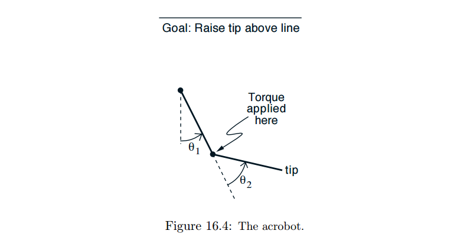
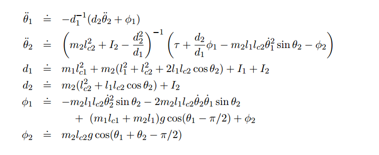

##16.3 体操机器人
增强学习已经被应用在很多种类的物理控制任务中（例，一系列的机器人应用参考Connell和Mahadevan,1993）。一种这样的任务是*体操机器人*，一种两个关节，欠驱动的机器人，大致类似体操运动员在一个高杆上做摆动（如图 16.4）。第一个关节（对应于体操运动员的手）不能施加力矩，但是第二个关节（对应于体操运动员腕部的弯曲）可以。系统有四个连续状态变量：两个关节位置和两个关节速度。运动方程在图16.5中给出。这个系统已经被控制工程师广泛研究过（例，Spong,1997）。
控制体操机器人的一个目的是在最短的时间内摆起机器人末端（“脚”）高于第一个关节大致一个连杆的距离。在这个任务中，加载到第二个关节的力矩受限于三个选择：固定大小的正力矩，同样大小的负力矩，或者没有力矩。在没有达到目标之前每一步的奖励都是-1，达到目标则结束该回合。没有折扣（$\gamma=1$）。因此，任何状态，$s$，的最优值，$v_*(s)$是从$s$出发到达目标的最小时间（步数的整数值）。

图16.5： 仿真体操机器人的运动方程。仿真的时间间隔为0.05秒，每四个时间间隔之后选择一次动作。第二个关节处施加的力矩由$\tau\in${+1,-1,0}来表示。关节位置没有约束，角速度有限制，$ \overset{\cdot}{\theta_1}\in[-4\pi,4\pi]$，$\overset{\cdot}{\theta_2}\in[-9\pi,9\pi]$。常量$m_1=m_2=1$（连杆的质量），$l_1=l_2=1$（连杆的长度），$l_c1=l_c2=0.5$（到质心的距离），$I_1=I_2=1$（连杆的转动惯量），$g=9.8$（重力）。
Sutton(1996)提出了在线无模型的体操机器人起摆任务。虽然体操机器人是仿真的，仿真器并不能被智能体/控制器利用。训练和迭代就像是使用一个真的物理的体操机器人。每个回合从两个连杆都竖直向下处于自然状态开始。增强学习的智能体对机器人施加力矩知道目标达到。然后体操机器人恢复初始自然位置，新的回合开始。
使用Sarsa($\lambda$)算法以及线性方程近似，代码和替换的轨迹如??页所示。有一个小的离散的动作集，很自然地每个动作会用到不同的tilings。下一个选择是用来表示状态的连续变量。一个聪明的设计者会用角度和第二个连杆的质心速度作为状态，这样做会使得解更加简洁并且能够泛化。但是因为这只是一个测试问题，直接用连杆的角度和和角速度：${\theta_1}$,$\overset{\cdot}{\theta_1}$,${\theta_2}$,$\overset{\cdot}{\theta_2}$。两个角度受限于机器人的物理活动范围（参照图16.5）并且角度自然受限于范围$[0,2\pi]$。因此，这个任务的状态空间是一个在四个维度上的有界矩形范围。
这就出现了一个问题，用什么tilings？有很多种可能性，就如第九章中所讨论的。一种方法是用一个完整的网格，在每个维度上滑动四维空间，就会得到很多小的四维度的tiles。另外，也可以仅仅沿着一个维度滑动，形成超平面的条纹。在这种情况下，需要选择在哪个维度上滑动。当然所有的情形都需要选择滑块的宽度，每种tiling的数量，如果有多种tilings如何偏移。还可以沿着两个或者三个维度滑动得到其他的tilings。例如，如果希望两个连杆的速度交互的多些，那么就多一些tilings沿着这两个维度滑动。如果零附近速度值需要更加精确，那么就应该在这个空间滑动多些。
Sutton用可以以多种简单的方式滑动的tilings。四个维度中的每一个都分为六个相等的区间。为角速度添加第七个区间如此一来tilings可以在所有的维度上被偏移随机的间隔分之一（参考第九章，“Ti了Coding”那一章）。所有的48个tilings，12个如上所述在所有四个维度上进行滑动，每个将空间分为$6\times7\times6\times7=1764$tiles。另外12个tilings沿着三个维度滑动（4个三维度集合中每个都有3个随机偏移的tilings）。最终每个动作总共有25000个tiles。数量很小，所以哈希没有必要。所有的tilings都被在所有相关维度上偏移了一个间隔随机分之一。
学习算法剩余的参数是$\alpha=0.2/48$，$\lambda=0.9$，$\epsilon=0$，$\theta_0=0$。在这个任务中使用贪婪策略$(\varepsilon=0)$比较合理因为需要长序列的正确的动作。一个探索性的动作可能会导致整个很长序列的正确动作都无用。通过选择好的起始动作值（一个较低的0值）来达到探索的目的。如2.7节和例9.2所述，这使得智能体持续的得到负反馈不管初始得到什么奖励，从而驱使它尝试新的策略。

图16.7 :体操机器人的一个典型的学习行为。每一组都是一系列连续的位置，细一点的线是开始的时候。箭头表明加载在关节上的力矩。

图16.6 展示了体操机器人任务和上面提到的学习算法的学习曲线。从单一运行曲线可以看到单一的回合有时候太长。这些回合，体操机器人通常只是来回摆动第二个关节，第一个关节只在竖直方向上改变一小点。虽然这种情况发生在很多步上，最终总是使得动作值变低。所有的运行过程最终都会得到这个问题的一个高效的策略，通常持续75步。图16.7是一个典型的最终解。起初体操机器人前后对称地移动几次，第二个连杆总是朝下。然后，一旦加载了足够的能量，第二个连杆向右上方摆起并且达到目标高度。