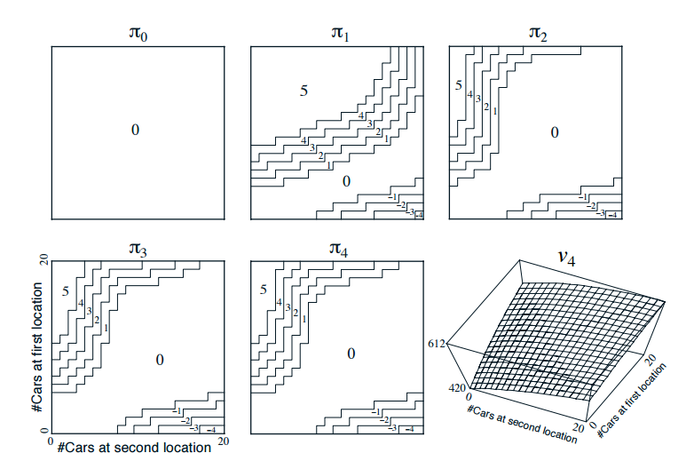
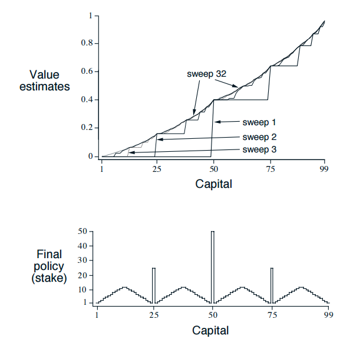

第4章 动态规划
===============

动态规划（DP）这个术语是指可以用于在给定完整的环境模型是马尔可夫决策过程（MDP）的情况下计算最优策略的算法集合。
传统的DP算法在增强学习领域应用十分有限，因为它们不仅要求理想的模型，同时计算量也非常大，但是在理论方面依然非常重要。
DP算法为本书后面章节的理解提供了必要的基础。事实上，那些方法都可以被看作是取得与DP算法相同的效果的尝试，
所不同的是这些算法需要比较少的计算量，并且不用假设理想的环境模型。

我们通常假设环境是有限马尔可夫决策过程。也就是说，我们假设环境的状态，动作，和奖励集合，
:math:`\cal{S}`，:math:`\cal{A(s)}` 和 :math:`\cal{R}` 是有限的，
并且它的动态由一组概率 :math:`p(s^\prime,r|s,a)` 给出，对所有 :math:`\cal{s}\in\cal{S}`，
:math:`a\in\cal{A(s)}`，:math:`r\in\cal{R}` 和 :math:`\cal{S}'\in\mathcal{S}^+`
(如果是片段式的问题，那么 :math:`\cal{S}^+` 是 :math:`\mathcal{S}` 加上终止状态)。
虽然DP思想可以被用到连续状态和动作空间的问题中，但是只有少数特殊的例子能得到确切的答案。
想要获得连续状态和动作空间的近似解，通常的解决方法是量化状态和动作空间然后应用有限状态的DP方法。
我们在第II部分探索的方法是可以应用到连续问题中的，并且是对这种方法的非常重要的扩展。

DP和增强学习思想的核心通常说来是用价值函数去组织构建一种搜索从而找到好的策略。
本章我们向读者展示DP怎么被用来计算第3章中定义的价值函数。
在第3章中讨论过的，一旦我们找到最优价值函数 :math:`v_*` 或者 :math:`q_*`，我们就可以很容易的获得最优策略，这符合贝尔曼最优方程：

.. math::
    :label: 4.1

    \begin{align*}
    v_*(s) &= \max_a\mathbb{E}[R_{t+1}+\gamma v_*(S_{t+1}) | S_t=s,A_t=a] \\
    &= \max_a\sum_{s',r}p(s',r|s,a)[r+\gamma v_*(s')]
    \end{align*}

或者

.. math::
    :label: 4.2

    \begin{align*}
    q_*(s,a)& = \mathbb{E}[R_{t+1}+\gamma \max_{a'} q_*(S_{t+1},a') | S_t=s,A_t=a]\\
    &=\sum_{s',r}p(s',r|s,a)[r+\gamma\max_{a'} q_*(s',a')],
    \end{align*}

对于所有的 :math:`s\in\mathcal{S}`，:math:`a\in\mathcal{A}(s)`，
以及 :math:`s^\prime\in\mathcal{S^+}` 。
我们可以看到，DP算法其实是将贝尔曼方程转换为更新规则以此来提升价值函数的近似效果。

4.1 策略评估（预测）
---------------------

首先我们考虑给定任意策略 :math:`\pi` 怎样计算状态值函数 :math:`v_\pi`。
这在DP文献中被称作 *策略评估*。我们把它当作 *预测问题*。回想第三章，对于所有的 :math:`s\in\mathcal{S}`，

.. math::

    \begin{align}
    v_\pi(s) & \doteq \mathbb{E_\pi}[G_t | S_t=s] \\
    &= \mathbb{E_\pi}[R_{t+1} + \gamma G_{t+1} | S_t=s]  &(从(3.9)) \\
    &= \mathbb{E_\pi}[R_{t+1}+\gamma v_\pi(S_{t+1}) | S_t=s] & \tag{4.3} \\
    &= \sum_a\pi(a|s)\sum_{s',r}(s',r|s,a)[r+\gamma v_\pi(s')]，& \tag{4.4}
    \end{align}

在这里 :math:`\pi(a|s)` 是在状态 :math:`s` 时使用策略 :math:`\pi` 采取动作 :math:`a` 的概率，
期望下标 :math:`\pi` 用来表明是在策略 :math:`\pi` 的条件下。
只要 :math:`\gamma<1` 或者所有的状态在策略 :math:`\pi(a|s)` 下都能达到最终状态，
就能保证 :math:`v_\pi` 存在且唯一。

如果环境动力学模型完全已知，那么 :math:`(4.4)` 就是一个同时存在 :math:`|\mathcal{S}|` 个线性方程与
:math:`|\mathcal{S}|` 个未知数（:math:`v_\pi(s),s\in\mathcal{S}`）的系统。
原则上，它的解决方案是一种简单易懂的计算方法。对我们而言，迭代解的方法最合适。
考虑一系列的近似值函数，:math:`v_0,v_1,v_2,...`，
每个都是从 :math:`S^+` 到 :math:`\mathbb{R}` （实数）的映射。
初始的近似值 :math:`v_0` 是任意选取的（除了终止状态，如果有的话，需要被赋值为0），
并通过使用 :math:`v_\pi (3.12)` 的贝尔曼方程作为更新规则来获得每个逐次逼近：

.. math::
    :label: 4.5

    \begin{align}
    v_{k+1}(s)& \overset{\cdot}{=}\mathbb{E}[R_{t+1}+\gamma v_k(S_{t+1}) | S_t=s] \\
    &= \sum_{a}\pi(a|s)\sum_{s',r}p(s',r|s,a)[r+\gamma{v_k(s')}],
    \end{align}

对于所有的 :math:`s\in\mathcal{S}`。很明显， :math:`v_k=v_\pi` 是这种更新规则下的不动点，
因为关于 :math:`v_\pi` 贝尔曼方程可以保证等号的成立。实际上，只要在相同的条件下保证 :math:`v_\pi` 的存在，
随着 :math:`k\rightarrow\infty`，:math:`\{v_k\}` 序列可以保证在广泛意义下收敛到 :math:`v_\pi`。
这个算法被称为 *迭代策略评估*。

在执行每次值近似的过程中，从 :math:`v_k` 得到 :math:`v_{k+1}`，迭代策略评估对每个状态 :math:`s` 采取相同的操作：
它将状态 :math:`s` 的后继状态的旧值获得的新值替换旧的状态 :math:`s` 的值，以及期望的即时回报，
以及在所评估的策略下可能的所有一步转换。我们把这种操作叫做一次 *完全回溯*。
每次迭代策略评估的迭代过程都回溯每个状态的值得到新的方程 :math:`v_{k+1}` 的近似值。
有几种不同类型的完全回溯，取决于一个状态或者状态-动作对是否被回溯，而且取决于结合后继状态的估计值的精确方式。
由于是基于所有可能的下一个状态而不是基于采样一次得到的下一个状态，所以所有的DP算法中的回溯都叫做 *完全回溯*。
上面的方程或者第三章介绍的回溯图可以描述回溯的特性。例如，上一章中“ :math:`v_\pi` 的备份图”就是对应于应用在迭代策略评估中的完全回溯图。

如果要写出 :math:`(4.5)` 中的迭代策略评估的序列程序需要用两个数组，一个用来存放前一次的值， :math:`v_k(s)`，
一个用来存放本次的新值， :math:`v_{k+1}(s)`。这样一来，新的值可以用旧的值一个一个计算出来并且不改变旧的值。
当然，可以用一个数组来更新更加容易，也就是每一个新的回溯值被计算出来立刻覆盖原有的旧值。
取决于状态回溯的顺序，有时候 :math:`(4.5)` 等式右边新的值会被采用而不是采用旧的值。
这种些微不同的算法也能收敛到 :math:`v_\pi`；事实上，这样做收敛速度通常会快过两个数组的版本，
试想，因为这种方法一产生新数据就会得到应用。我们认为这种回溯是对整个状态空间的 *搜索*。
对于一个数组的算法，在一次搜索中状态被回溯的顺序对收敛速度有非常大的影响。
提起DP算法通常我们想到是一个数组的版本。

迭代策略评估的完整版本在下面的框中以伪代码显示。另外一种实现方式关注于算法的终止。
一般而言，迭代策略评估仅仅在极限的情况下，但是实际中必须要在这之前停止。
迭代策略评估的一种典型停止条件是每次搜索过后计算 :math:`\max_{s\in\mathcal{S}}|v_{k+1}(s)-v_k(s)|`，
当这个值足够小的时候就停止。

.. admonition:: 迭代策略评估，用于估算 :math:`V \approx v_\pi`
    :class: important

    输入将要被评估的策略 :math:`\pi`

    算法参数：小阈值 :math:`\theta > 0` 确定估计的准确性

    初始化一个数组 :math:`V(s)=0` ，所有的 :math:`s\in\mathcal{S}^+`，除了 :math:`V(终点) = 0`

    循环
        :math:`\Delta \leftarrow 0`

        对于每个 :math:`s \in \mathcal{S}`:

            :math:`v \leftarrow V(s)`

            :math:`V(s) \leftarrow \sum_{a}\pi(a|s)\sum_{s',r}p(s',r|s,a)[r+\gamma V(s')]​`

            :math:`\Delta \leftarrow \max(\Delta,|v-V(s)|)`

    直到 :math:`\Delta < \theta` （一个小的正数）

**例4.1** 考虑 :math:`4\times 4` 的棋盘格如下所示。

.. figure:: images/figure-4.0.png
   :alt: RL

非终止状态 :math:`S=\{1,2,...14\}`。每个状态有四个可能的动作， :math:`\cal{A}={上, 下, 右, 左}`，
明确地决定了相应的状态转移，那些会导致个体走出棋盘格的动作实际上保持状态不变。
因此，比如，对于所有的 :math:`r\in\cal{R}`， :math:`p(6,-1|5,右)=1`，
:math:`p(7,-1|7,右)=1`， :math:`p(10,r|5,右)=0`。
这是没有衰减因子的，回合式的任务。所有的转移回报都是-1直到终止状态。
图中的终止状态被打上阴影（虽然有两个部位有阴影，其实是一个终止状态）。
因此对于所有的状态 :math:`s，s'` 和动作 :math:`a`，期望回报方程是 :math:`r(s,a,s')=-1`。
假设个体遵从等概率随机策略（所有的状态等可能）。图4.1的左边展示了一系列用迭代策略评估计算出的值函数 :math:`\{v_k\}`。
最终的估计实际上是 :math:`v_{\pi}`，这种情况下赋予每个状态直到终止状态的期望步数的相反数。

**练习4.1** 在例4.1中，如果 :math:`\pi` 是等概率随机策略，
求 :math:`q_\pi(11,下)`？以及 :math:`q_\pi(7,下)`？

**练习4.2** 在例4.1中，假设新状态15被添加到棋盘格状态13的正下方，
此状态执行动作 **左**， **上**， **右** 和 **下** 后个体分别到达12，13，14和15。
假设 *从* 初始状态的转移保持不变。那么在等概率策略下求 :math:`v_\pi(15)` 是多少？
现在假设状态13的动力学也发生了改变，如此一来智能体在状态13执行 **下** 动作会到达新状态15。
求这种情况下的 :math:`v_\pi(15)` ？

**练习4.3** 对于动作-值函数 :math:`q_\pi` 和用一系列函数 :math:`q_0,q_1,q_2,\dots`
近似得到的 :math:`q_\pi`，求类似于 :math:`(4.3)，(4.4)和(4.5)` 的方程？

4.2 策略提升
---------------

我们计算某个策略价值函数的目的是找到一个更好的策略。假设我们已经确定了一个任意确定性的策略 :math:`\pi` 价值函数 :math:`v_\pi`。
对于某些状态 :math:`s` 我们想知道是否应该改变策略来明确的选择一个动作 :math:`a\not=\pi(s)`。
我们知道在当前状态 :math:`s` 遵从当前的策略有多好——也就是 :math:`v_\pi(s)`——但是改变为一个新的状态会更好还是坏呢？
一种解决这个问题的方法是考虑从状态 :math:`s` 下选择动作 :math:`a`，然后遵从现有的策略 :math:`\pi`。

.. figure:: images/figure-4.1.png
    :alt: figure-4.1

    **图4.1：** 迭代策略评估在一个小的棋盘格游戏上收敛。左边一列是对于随机策略（所有的动作执行概率相等）下的状态值函数的一系列近似。
    右边一列是一系列相对于估计的价值函数（箭头代表所有能够取得最大值的动作）的贪婪策略。
    上一个策略仅仅保证了是对随机策略的提升，但是在这种情况下，所有的策略在经过第三次迭代后都是最优的。

这种的方式的值是：

.. math::
    :label: 4.6

    \begin{align*}
    q_\pi(s,a)& \doteq \mathbb{E}[R_{t+1}+\gamma v_\pi(S_{t+1}) | S_t=s,A_t=a] \\
    &= \sum_{s',r}p(s',r|s,a)[r+\gamma v_\pi(s')]
    \end{align*}

关键的标准是这等式是大于还是小于 :math:`v_{\pi}`。如果是大于——也就是说，
在状态 :math:`s` 选择执行一次动作 :math:`a` 然后遵从策略 :math:`\pi`
是否会比一直遵从策略 :math:`\pi` 好——然后我们当然愿意每次到达状态 :math:`s` 选择动作 :math:`a` 都会比较好。
那么新的策略事实上总体来说也会比较好。

这种方法是正确的，只是 *策略提升理论* 的一种特殊情况。:math:`\pi` 和 :math:`\pi'` 是任意一对确定性的策略，
这样一来，对于所有的 :math:`s\in\mathcal{S}`，

.. math::
    :label: 4.7

    q_\pi(s,\pi'(s)) \geq v_\pi(s)
    \tag{4.7}

那么策略 :math:`\pi'` 必须与策略 :math:`\pi` 同样好或者比策略 :math:`\pi` 更好。
也就是说，必须从所有的状态 :math:`s\in\mathcal{S}` 取得更好或者相等的期望回报:

.. math::
    :label: 4.8

    v_\pi'(s) \geq v_\pi(s)
    \tag{4.8}

另外，如果 :math:`(4.7)` 在任意状态严格不等，那么 :math:`(4.8)` 也应该至少在一个状态严格等。
这个结果尤其适用于我们在之前考虑的两种策略，一个最初的确定的策略 :math:`\pi` 和一个改变的策略 :math:`\pi'`，
除了 :math:`\pi'(s)=a\not=\pi(s)`，都与 :math:`\pi` 相同。
显然，:math:`(4.7)` 在所有状态都成立除了 :math:`s`。
因此，如果 :math:`q_\pi(s,a) > v_\pi(s)`，那么有变化的策略就会比策略 :math:`\pi` 要好。

策略提升理论的证明过程很容易理解。从 :math:`(4.7)` 开始，
我们一直扩展 :math:`q_\pi` 那一边并且再次应用 :math:`(4.7)` 直到我们得到 :math:`v_\pi'(s)`：

.. math::

   \begin{align}
   v_\pi(s)& \leq q_\pi(s,\pi'(s))\\
   &= \mathbb{E}[R_{t+1}+\gamma v_\pi(S_{t+1}) | S_t=s,A_t=\pi'(s)]  & (由(4.6))\\
   &= \mathbb{E}_{\pi'}[R_{t+1}+\gamma v_\pi(S_{t+1}) | S_t=s]  \\
   & \leq\mathbb{E}_{\pi'}[R_{t+1}+\gamma q_\pi(S_{t+1},\pi'(S_{t+1})) | S_t=s] & (由(4.7))\\
   &= \mathbb{E}_{\pi'}[R_{t+1}+\gamma \mathbb{E}_{\pi'}[R_{t+2}+\gamma v_\pi(S_{t+2})| S_{t+1},A_t=\pi'(s+1) ] | S_t=s] \\
   &= \mathbb{E}_{\pi'}[R_{t+1}+\gamma R_{t+2}+\gamma^2 v_\pi(S_{t+2}) | S_t=s] \\
   & \leq\mathbb{E}_{\pi'}[R_{t+1}+\gamma R_{t+2}+\gamma^2 R_{t+3}+\gamma^3 v_\pi(S_{t+3}) | S_t=s] \\
   &  \vdots \\
   & \leq \mathbb{E}_{\pi'}[R_{t+1}+\gamma R_{t+2}+\gamma^2R_{t+3}+\gamma^3R_{t+4}+\cdots | S_t=s]  \\
   &=v_{\pi'}(s)
   \end{align}

目前为止我们看到当给定一个策略和它的价值函数后，我们可以很容易地对在某个状态的动作改变进行评估。
很自然就会扩展到考虑所有状态和所有可能的动作，根据 :math:`q_\pi(s,a)` 选择在每个状态最好的动作。
换句话说，考虑新的 *贪婪* 策略 :math:`\pi'`，如下

.. math::
    :label: 4.9

    \begin{align*}
    \pi'(s)& \doteq \arg\max_a q_\pi(s,a) \\
    & =\arg \max_a\mathbb{E}[R_{t+1}+\gamma v_\pi(S_{t+1}) | S_t=s,A_t=a]\\
    &=\arg\max_a\sum_{s',r}p(s',r|s,a)[r+\gamma v_\pi(s')],
    \end{align*}

其中 :math:`\arg\max_a` 表示随后的表达式最大化（随意打破关系）的 :math:`a` 的值。
贪婪策略采取短期内看起来最好的动作——向前展望一步——根据 :math:`v_\pi`。
通过构造，贪婪策略满足策略提升理论 :math:`(4.7)` 的条件，所以我们知道这个策略和初始策略一样或者更好。
通过根据初始策略的值函数使策略变贪婪的方式来制定一个新的策略提升初始策略的过程，叫做 *策略提升*。

假定新的贪婪策略 :math:`\pi'`，与旧的策略 :math:`\pi` 一样好。那么 :math:`v_\pi=v_{\pi'}`，
根据 :math:`(4.9)` 对于所有的 :math:`s\in\mathcal{S}`：

.. math::

   \begin{aligned}
   v_{\pi'}(s)& =\max_a\mathbb{E}[R_{t+1}+\gamma v_{\pi'}(S_{t+1}) | S_t=s,A_t=a]\\
   &=\max_a\sum_{s',r}p(s',r|s,a)[r+\gamma v_{\pi'}(s')].
   \end{aligned}

但是这与贝尔曼最优方程 :math:`(4.1)` 一致，所以，:math:`v_{\pi'}` 必须是 :math:`v_*`，
:math:`\pi` 和 :math:`\pi'` 必须都是最优策略。因此策略提升一定会得到一个更好的策略除非初始的策略就是最优的。

目前为止在这一章节中我们我们考虑了确定策略的特殊情况。普遍情况下，一个随机策略 :math:`\pi`
通过在每一个状态 :math:`s` 采取每一个动作 :math:`a` 来指定概率 :math:`\pi(a|s)`。
我们不会讨论细节，但是实际上，这一章节的所有的方法都可以很容易的扩展到随机策略。
特别的，策略提升理论贯穿如前所述的随机策略例子。另外，如果策略提升步骤比如 :math:`(4.9)` 之间
有联系——也就是说，如果有几个动作都能得到最大值——那么在随机策略的例子中我们不需要从中选择一个单独的动作。
取而代之的是，每一个取得最大值的动作在新的贪婪策略中有一定的概率被选择。只要非最大动作的概率为零，任何分摊的方案都可以。

图4.1的最后一行给出了随机策略提升的例子。这里初始策略 :math:`\pi` 是等概率随机策略，
新策略 :math:`\pi'` 是关于 :math:`v_\pi` 的贪婪策略。
图的左下角是价值函数 :math:`v_\pi`，右下角是可能的策略 :math:`\pi'` 的集合。
在策略 :math:`\pi'` 图中的那些有多个箭头的状态就是在 :math:`(4.9)` 中几个动作能够同时取得最大的状态。
对于那些动作，任何概率分配方式都是允许的。任一个这种策略的价值函数 :math:`v_{\pi'}(s)`
在所有的状态 :math:`s\in\mathcal{S}`，可以看到是-1,-2或者是-3，然而 :math:`v_\pi(s)` 至多是-14。
因此，对于所有的状态 :math:`s\in\mathcal{S}`，:math:`v_{\pi'}(s)\geq v_\pi(s)`，说明策略进行了提升。
虽然在这种情况下新的策略 :math:`\pi'` 偶然成为最优策略，在更广泛的意义下，这只能保证策略的提升。

4.3 策略迭代
----------------

一旦策略 :math:`\pi`，已经用 :math:`v_\pi` 提升为更好的策略  :math:`\pi'`，
我们可以计算 :math:`v_{\pi'}` 再次提升策略得到更好的策略 :math:`\pi''`。
我们可以得到一系列单调提升的策略和价值函数：

.. math::

   \pi_0 \overset{E}{\rightarrow} v_{\pi_0} \overset{I}{\rightarrow} \pi_1 \overset{E}{\rightarrow} v_{\pi_1} \overset{I}{\rightarrow} \pi_2 \overset{E}{\rightarrow} \cdots \overset{I}{\rightarrow} \pi_* \overset{E}{\rightarrow} v_{*}

其中，:math:`\overset{E}{\rightarrow}` 表示策略评估，
:math:`\overset{I}{\rightarrow}` 表示策略提升。
每个策略都能保证在原先策略的基础上严格提升（除非该策略已经是最优）。
因为有限MDP只有有限个数量的策略，这个过程一定会在有限次的迭代中收敛到最优策略和最优价值函数。

这种发现一个最优策略的方法叫做 *策略迭代*。完整的算法在以下算法框中给出。
注意每个策略评估，从前一次的策略开始，本身就是迭代计算的过程。
这就造成策略评估收敛速度的大幅度提升（可能是因为价值函数在不同的策略之间改变很小）。

.. admonition:: 策略迭代（使用迭代策略评估）估计 :math:`\pi \approx \pi_*`
    :class: important

    1. 初始化

        对于所有的 :math:`s\in\mathcal{S}`，任意 :math:`V(s)\in\mathbb{R}`，:math:`\pi(s)\in\cal{A}(s)`

    2. 策略评估

        循环
            :math:`\Delta{\leftarrow}0`

            对每个 :math:`s\in{S}` 循环:

                :math:`v\leftarrow{V(s)}`

                :math:`V(s){\leftarrow}\sum_{s',r}p(s',r|s,\pi(s))[r+\gamma{V(s')}]`

                :math:`\Delta{\leftarrow}{\max(\Delta,|v-V(s)|)}`

        直到 :math:`\Delta<\theta` (确定估计准确性的一个小的正数)

    3. 策略提升

        *策略-稳定* :math:`\leftarrow` *真*

        对于每个 :math:`s\in\mathcal{S}`:

            :math:`上一次动作\leftarrow {\pi(s)}`

            :math:`\pi(s)\leftarrow{\arg\max_a\sum_{s',r}p(s',r|s,a)[r+\gamma V(s')]}`

            如果 :math:`上一次动作\not=\pi(s)` ，那么 策略-稳定 :math:`\leftarrow` *假*

        如果 *策略-稳定* 为真 ，那么停止并且返回 :math:`V \approx{v_*}` 以及 :math:`\pi \approx{\pi_*}`；否则返回2

**例4.2: 杰克租车** 杰克管理着一个全国汽车租赁公司的两个地点。每天，一些顾客到每个地点租车。
如果杰克有一辆车可以用来出租，那么他将车租出去并且得到租车公司的10美元报酬。
如果他在这个地点没有车，那么这次生意机会就失去了。汽车被送回来之后就可以被租出去。
为了确保人们需要车子的时候有车可以租，杰克可以在晚上将车子在两个地点之间转移，每转移一辆车需要花费2美元。
我们假设需要车子的数量与返回车子的数量是泊松随机变量，也就是说数量 :math:`n` 的概率
是 :math:`\frac{\lambda^n}{n!}e^{-\lambda}`，:math:`\lambda` 是期望值。
假设第一个和第二个地点对于租借需求 :math:`\lambda` 是3和4，返回数量是3和2。
为了简化问题，我们假设每个位置不会超过20辆车（任何多余的车都将会被返回租赁公司，从问题中消失），
并且最多五辆车可以在同一晚上从一个地点转移到另一个地点。
我们将衰减因子设置为 :math:`\gamma=0.9`，将这个问题当作连续有限MDP，时间步骤是天数，
状态是每天结束是在每个位置剩余车子的数量，动作是每晚将车子在两个地点转移的净数量。
图4.2展示的是从不转移任何车子的策略出发通过策略迭代找到的一系列策略。

    图4.2: 通过策略迭代找到的一系列关于杰克租车问题的策略，和最终的状态价值函数。
    前五个图表明，每天结束时在每个地点的车数量以及需要从第一个位置转移到第二个位置的车子的数量
    （负数意味着从第二个位置转移到第一个位置）。每一个成功的策略都是在之前策略基础上严格的提升，
    并且最终的策略是最优的。

策略迭代经常在非常少的几次迭代中收敛，图4.1中的例子阐明了这一点。
图4.1中，左下角的图展示了等概率随机策略的价值函数，右下角的图展示了一个对应于这个价值函数的贪婪策略。
策略提升理论保证了这些策略比初始的策略要好。在这个例子中，然而，这些策略不仅仅是比较好，而是最优的，
使得到达终点状态的步数最少。在这个例子中，策略迭代可以在一步迭代之后就能找到最优策略。

**练习4.4** 本节中的策略迭代算法中有一个微妙的错误，如果策略在两个或多个同样好的策略之间不断切换，
它可能永远不会终止。这适用于教学，但不适用于实际使用。修改伪代码以保证收敛。

**练习4.7（编程）** 编写一个策略迭代的程序重新解决做出如下改动后的杰克租车问题。
杰克第一个地点的一个员工每晚乘公共汽车回家，并且住在第二个地点附近。
她希望能够免费搭一辆要转移的车到第二个地点。每一辆多余的车还是要花费2美元，转移到另一个方向也一样。
另外，杰克在每个位置的停车位有限。如果一个位置每天晚上多于10辆车要停放（当车子转移完之后），
那么需要花费额外的4美元去另外一个停车场（与多少辆车停放独立）。
这种现实问题经常掺杂非线性和未知动力学，除了动态规划，优化方法不容易解决。
为了核验程序，你首先需要复现初始问题的结果。

**练习4.5** 关于动作价值的策略迭代如何定义？提供一个完整的算法计算 :math:`q_*`，
类似于策略迭代算法中计算 :math:`v_*` 的过程。要特别关注这个练习，因为这里的思想将贯穿这本书。

**练习4.7** 假设只限于考虑 :math:`\epsilon-soft` 策略，
意味着在每一个状态 :math:`s` 选择每个动作的概率都至少是 :math:`\frac{\epsilon}{|\cal{A(s)}|}`。
定性地描述计算 :math:`v_*` 的策略迭代算法中按照3，2，1的顺序的每一步所需要的改变。

4.4 价值迭代
--------------

策略迭代的一个缺点是每一次迭代过程都包含策略评估，策略评估本身就可能是需要多次对整个状态集迭代计算的过程。
如果策略评估需要迭代计算，那么只能在极限处准确收敛到 :math:`v_\pi`。
我们一定要等到准确的收敛吗？是否可以中途停止？图4.1中的例子显然表明截断策略评估是可行的。
在那个例子中，策略评估超过三次迭代后对相应的贪婪策略没有影响。

实际上，策略迭代过程中的策略评估步骤可以用几种方法截断而不会失去收敛性。
一个重要的特例就是策略评估在一次迭代之后就停止（每个状态只有一个回溯）。这个算法就叫做 *价值迭代* 。
可以被写成一个特殊的结合策略提升和截断之后的策略评估步骤的简单回溯操作：

.. math::
    :label: 4.10

    \begin{aligned}
    v_{k+1}(s)&\doteq \max_a\mathbb{E}[R_{t+1}+\gamma v_{k}(S_{t+1}) | S_t=s,A_t=a] \\
    &= \max_a\sum_{s',r}p(s',r|s,a)[r+\gamma v_{k}(s')],
    \end{aligned}

对所有的 :math:`s\in\mathcal{S}`。
对于任意的 :math:`v_0`，在保证 :math:`v_*` 存在的同样的条件下:math:`\{v_k\}` 序列可以收敛到 :math:`v_*`。

另一种理解价值迭代的方法参考贝尔曼方程(4.1)。注意价值迭代仅仅是将贝尔曼最优方程转变为更新规则。
另外注意到价值迭代的回溯过程是如何与策略评估的回溯(4.5)等价，它需要采取所有动作中能够达到最大值的那一个。
另外一种看待这个相近关系的方法是比较这些算法的回溯图：
价值评估算法展示了策略评估的回溯图，图3.4中左图展示了价值迭代的回溯图。
这两个是计算 :math:`v_\pi` 和 :math:`v_*` 的本质回溯操作。

最后，让我们考虑价值迭代如何终止。类似策略评估，价值迭代一般需要无穷次的迭代才能准确的收敛到 :math:`v_*` 。
实际操作中，只要价值函数在一次更新中只改变一小点我们就停止价值迭代。如下是在这种停止条件下的完整的算法。

.. admonition:: 价值迭代，用于估算 :math:`\pi \approx \pi_*`
    :class: important

    算法参数：小的阈值 :math:`\theta > 0` 确定估计的准确性

    对所有 :math:`s\in\mathcal{S}`，初始化 :math:`V(s)` 为任意值，其中 :math:`V(终点)=0`

    循环：

        :math:`v\leftarrow{V(s)}`

        :math:`V(s){\leftarrow}\max_a\sum_{s',r}p(s',r|s,a)[r+\gamma{V(s')}]​`

        :math:`\Delta{\leftarrow}{\max(\Delta,|v-V(s)|)}`

    直到 :math:`\Delta<\theta` (一个小的正数)

    输出确定的策略 :math:`\pi\approx{\pi_*}` ，满足 :math:`\pi(s)=\arg\max_a\sum_{s',r}p(s',r|s,a)[r+\gamma{V(s')}]`

价值迭代在更新过程中高效地结合了一轮策略评估更新和一轮策略提升更新。
在每一轮的策略提升过程中插入多轮的策略评估更新往往能够取得更加快速的收敛效果。
通常情况下，被截断的策略迭代算法的整个类可以被认为是一系列的更新，这些更新有的用策略评估回溯方法，有的用价值迭代回溯方法。
既然（4.10）那些回溯的唯一不同是最大化操作，这就意味着最大化操作加到了策略评估的操作中。
基于有衰减的有限MDP，所有这些算法都收敛到一个最优策略。

**例4.3：赌徒问题** 一个赌徒对掷硬币的游戏进行下注。如果硬币正面朝上，他将赢得押在这一掷上的所有赌注，
如果是反面朝上，他将输掉所押的赌注。如果赌徒赢得100美元或者输光了钱那么游戏结束。
每一次掷硬币，赌徒要决定押多少钱，这些钱必须是整数美元。
这个问题可以被建模为一个无衰减，回合式的有限MDP。
状态是赌徒的资本，:math:`s\in \{1,2,\dots,99\}`，
动作是押注多少，:math:`a\in \{0,1,\dots,\min(s,100-s)\}`。
赌徒达到目标时奖励是+1，其他转移过程都为0。状态价值函数给出了从每个状态出发能够赢得的概率。
策略是从资本多少到押注的一个映射。最优策略最大化达到目标的概率。
:math:`p_h` 代表硬币正面朝上的概率。如果 :math:`p_h` 知道了，那么整个问题都清楚了，并且可以被解决，比如用价值迭代方法。
图4.3展示出了价值函数经过成功的价值迭代更新后的变化，并且找到了 :math:`p_h=0.4` 情况下最终的策略。
这个策略是最优的，但不是唯一的。实际上，有很多最优策略，都取决于相对于最优价值函数选取的argmax动作。
你能想象出所有的最优策略是什么样的吗？

    **图4.3：** :math:`p_h=0.4` 情况下赌徒问题的解。上面的图是经过价值迭代成功地更新找到的价值函数。
    下面是最终的策略。

**练习4.8** 为什么赌徒问题的最优策略有这样奇怪的形式？
尤其是，在资本剩余50美元的时候需要押注所有在一次投掷上，但是对于资本剩余51美元的时候却没有这样做。
为什么这会是一个好的策略？

**练习4.9（编程）** 实现赌徒问题的价值迭代算法并且求解 :math:`p_h=0.25` 和 :math:`p_h=0.55` 的情况。
在编程的时候，设置两个对应于终止状态资本剩余为0和100情况的虚拟状态可能会比较方便，分别赋予0和1。
像图4.3那样用图展示出你的结果。随着 :math:`\theta\leftarrow 0` 你的结果是否稳定？

**练习4.10** 类似于（4.10）的值迭代的回溯图，写出动作价值 :math:`q_{k+1}(s,a)`。

4.5 异步动态规划
------------------

到目前为止我们所讨论的DP方法一个主要的缺点是他们涉及整个MDP状态集合，也就是说，需要对整个状态集合进行更新。
如果状态集非常大，即使一次更新也会代价很大。例如，五子棋有多于 :math:`10^20` 个状态。
即使我们能够一秒钟执行一百万个状态的价值迭代更新，也会花费一千年才能完成一次更新。

*异步* DP算法是就地迭代DP算法，并没有按照规则的状态集更新步骤进行组织。
这些算法以任何顺序更新状态值，使用恰好可用的其他状态值。某些状态的值可能会在其他状态的值更新一次之前被更新多次。
为了收敛到准确值，异步算法需要持续的回溯所有的状态值：在一定量的计算之后不能忽视任何状态。
异步DP算法在选择回溯更新状态时有极大的灵活性。

例如，一种版本的异步价值迭代回溯更新值的时候，用（4.10）的值迭代回溯更新方法就地更新，
并且在每一步 :math:`k` 只更新一个状态 :math:`s_k`。如果 :math:`0\leq \gamma <1`，
只要所有的状态都在序列 :math:`\{s_k\}` 中出现无限次就能保证渐进收敛到 :math:`v_*` （序列也可以是随机的）。
（在无衰减回合式的例子中，有些顺序的回溯更新很可能不能够收敛，但是避免这些顺序相对而言还是比较容易的。）
类似地，也可以混合策略评估和价值迭代回溯更新来生成一种异步截断策略迭代。
虽然这种和其他不常用的DP算法超出了本书的讨论范围，很显然一些不同的更新搭建的模块可以灵活的应用在多种多样的少量更新次数的DP算法中。

当然，避免多次更新并不能保证计算量减少。仅仅意味着一个算法没必要陷入无法提升策略的很长的更新中去。
我们可以利用这种灵活性，选择应用更新之后能够提升算法进度的状态。
我们可以试着整理回溯更新的顺序让价值信息在状态之间高速传播。
有些状态价值不需要像其他状态价值那样频繁更新。
我们甚至可以在整个过程中避免更新某些与最优行为无关的状态。这种思想我们将在第八章中详细讨论。

异步算法也使得与实时交互计算的结合更加容易。解决一个MDP问题，我们可以 *在个体真正经历MDP的同时* 运行迭代DP算法。
个体的经验可以用来决定DP算法将回溯更新应用到哪个状态上。同时，来自DP算法的最新值和策略信息可以用来指导个体的决策。
例如，我们可以在个体访问状态时更新个体状态。这样可以 *集中* DP算法的回溯更新到到个体更加相关的状态集上。
这种集中方法在强化学习中经常用到。

4.6 广义策略迭代
------------------

策略迭代包含两个同时进行的交互过程，一个使得价值函数与当前策略一致（策略评估），另一个使得策略在当前价值函数下变得贪婪（策略提升）。
在策略迭代过程中，这两个过程相互交替，一个完成了另一个才开始，但是这并不是必须的。
在价值迭代过程中，例如，在每两次策略提升的过程中只进行一次策略评估的迭代。
异步DP方法中，评估和提升过程以一种更加精细的方式交替。在某些例子中一个状态在转移到其他状态之前就在一个过程中更新。
只要两个过程持续更新所有的状态，最终的结果就会一致，即收敛到最优价值函数和最优策略。

.. figure:: images/generalized_policy_iteration.png
    :align: right
    :width: 150px

我们用术语 *广义策略迭代* （GPI）这个词来指代策略评估和策略提升相互交互的一般概念，而不依赖于两个过程的粒度和其他细节。
几乎所有的强化学习方法都可以被描述为GPI。也就是说，都有可识别的策略和价值函数，
策略总是被价值函数进行更新，价值函数用来计算出相应策略下的价值函数，如右图所示。
很容易看到，如果评估过程和提升过程都稳定了，也就是说，不会再有变化，那么价值函数和策略一定是最优的。
价值函数仅在与当前策略一致时才稳定，并且策略仅在相对于当前价值函数贪婪时才稳定。
因此，只有当一个策略在它自己的评估函数下保持贪婪时，两个过程才能都稳定下来。
这预示着贝尔曼最优方程（4.1）成立，因此这个策略和价值函数是最优的。

GPI中的评估和提升的过程可以认为是既存在竞争又存在合作。在竞争这个意义上他们走向相反的方向。
使价值函数的策略贪婪通常会使更改的策略的价值函数不正确，使价值函数与策略一致通常会导致该策略不再贪婪。
然而，从长远来看，这两个过程相互作用以找到单一的联合解：最优价值函数和最优策略。

.. figure:: images/two_lines.png
    :align: right
    :width: 250px

我们可能还会考虑GPI中评估和提升过程的约束和目标的交互，例如，如右图所示两维空间中的两条线。
虽然实际的几何比这更加复杂，这个图表明了实际情况中会发生的情况。
每一个过程驱使价值函数或者策略朝向一条代表这两个目标的一个解的线前进。
目标会交互是因为两条线并不互相垂直。直接驱使向一个目标发展会导致偏离另一个目标。
然而，不可避免地，联合的过程越来越趋近整体的最优目标。
图中的箭头对应于策略迭代的行为过程，每个箭头都使系统完全达到两个目标中的一个。
在GPI过程中可以采取更小不完全的步骤去达到每个目标。
任一种情况，这两个过程一起会达到整体的最优目标，即使每一个单独都不能达到最优。

4.7 动态规划的效率
--------------------

对于非常大的问题，DP可能不实用，但与其他解决MDP的方法相比，DP方法实际上非常有效。
如果我们忽略一些技术细节，那么（最坏的情况）DP方法找到最优解的时间是状态和动作数量的多项式。
如果 :math:`n` 和 :math:`k` 指代状态和动作的数量，这意味着DP方法需要大量的计算操作，
这些操作小于 :math:`n` 和 :math:`k` 的某个多项式函数。
即使策略(确定的)的总数是 :math:`k^n`，DP方法保证能够在多项式时间内找到最优策略。
从这个意义上讲，DP方法比策略空间的任何直接搜索的方法都要快得多，因为直接搜索必须详尽地检查每个策略以提供相同的保证。
线性规划方法也可以用来解决MDPs，并且在某些案例中他们最差的收敛保证也比DP方法好。
但是线性规划方法在比较小数量的状态（大约100倍）情况下不如DP方法实用。对于非常大的问题，只有DP方法是可行的。

DP有时候被认为应用有限，因为 *维数灾难* ，状态的数量随着状态变量的增加成指数增长。
非常大的状态集合的确会带来困难，但是这些是问题的固有困难，并不是DP作为一个解决问题的算法本身带来的困难。
实际上，DP方法比相关的直接搜索和线性规划方法在解决大状态空间的问题上要更加合适。

在实际应用中，使用如今的计算机，DP方法可以被用来解决数百万状态的MDP问题。
策略迭代和价值迭代都有广泛应用，一般来说，还不清楚哪一个更好。
在实际应用中，这些方法通常都要比理论最差的时间收敛得快，尤其是有好的初始值函数或者策略的时候。

在大状态空间的问题上，通常优先选择 *异步* DP方法。为了完成一次同步方法的更新需要计算和存储所有的状态。
对于一些问题，即使这么多的存储和计算也是不现实的，但是这个问题还是可以解决的，因为在寻找最优解的过程中只有一小部分状态出现。
异步方法和其他GPI的一些变种可以被应用在这些例子中，并且可能比同步方法更快地找到好的或者最优的策略。

4.8 总结
-----------

在这一章节中我们熟悉了动态规划的基本思想和算法，它可以用来解决有限MDP。
*策略评估* 指的是（通常）迭代计算一个给定策略的价值函数。*策略提升* 指的是给定一个策略的价值函数计算一个提升的策略。
将这两种计算放在一起，就会得到策略迭代和价值迭代这两个最流行的DP方法。
在完全了解MDP的情况下，任何一个都能可靠地计算有限MDP的最优策略和价值函数。

经典的DP方法在状态集中进行更新，对每个状态进行 *完全回溯* 操作。
基于所有可能被选取的状态和他们出现的可能性，每次回溯更新一个状态的价值。
完全回溯更新与贝尔曼方程紧密相关：他们更像是这些状态转变为分配状态。
当回溯价值不再变化，满足相应贝尔曼方程的价值已经收敛。
正如有四个主要值函数（:math:`v_\pi`，:math:`v_*`，:math:`q_\pi` 和 :math:`q_*`）一样，
有四个相应的贝尔曼方方程和四个相应的完全回溯。
*回溯图* 给出了一种DP回溯操作的直观看法。

深入DP方法，应该是几乎所有强化学习的方法，可以将他们看作是 *广义策略迭代* （GPI）。
GPI是一个关于两个交互过程围绕一个近似策略和一个近似价值函数的一般的思想。
一个过程使用给定的策略进行某种策略评估，使价值函数更加趋近这个策略的真实价值函数。
另外一个过程在假定当前价值函数是它的真实价值函数并使用给定的价值函数进行某种策略提升，使得策略更好。
虽然每个过程改变另外一个过程的基础，但总体而言，他们一起合作找到一个联合的解：
一个策略和价值函数，并且它们不受两个过程的影响，并且是最优的。
在某些情形中，GPI已经被证明收敛，特别是我们之前在本章提及的经典DP方法。
在其他情形中，收敛性还没有被证明，但是GPI的思想依旧帮助我们理解这些方法。

DP方法在整个状态集中进行更新并没有必要。
*异步* DP方法是用任意顺序进行回溯的就地迭代方法，可能是随机确定的并且使用过时的信息。
很多这些方法可以被看作是更加细粒度的GPI。

最后，我们说明DP方法的最后一条特殊性质。所有这些方法基于对后继状态价值的估计来更新状态价值的估计。
也就是说，他们根据其他估计更新估计数。我们把这种广义的思想叫做 *自助法*。
许多强化学习的方法都会用到自助法，即使那些不像DP方法需要完全准确的环境模型的方法。
下一章我们探索不需要模型但是进行自助的方法。这些关键特征和特性是分离的，当然可以以一种有趣的方式来混合。

书目和历史评论
--------------

“动态规划”这个词可以追溯到贝尔曼（1957a），他展示了这个方法可以被用到很多问题中。
在很多教材中都有对于DP的扩充，包括Bertsekas(2005,2012)，Bertsekas和Tsitsiklis(1996)，
Dreyfus和Law(1977)，Ross(1983)，White(1969)，还有Whittle(1982,1983)。
我们对于DP的兴趣仅限于用它来解决MDPs，但是DP也可以用在其他类型的问题中。Kumar和Kanal(1988)提出了一种更加一般的看法。

据我们所知，第一次将DP和强化学习联系起来的是Minsky(1961)在Samuel的跳棋手问题中给出的。
在一个脚注中，Minsky提到可以将DP应用在Samuel的回溯过程可以以近似分析的形式处理的问题中。
这个批注可能误导了人工智能学者使他们认为DP只能严格用在可以理论分析的问题中，因此与人工智能大不相干。
Andreae(1969b)在强化学习中提到DP，尤其是策略迭代，虽然他并没有给出DP和学习算法之间的特殊联系。
Werbos(1977)建议一种近似DP的方法叫做“启发式动态规划”，这种方法强调在连续状态空间问题上应用梯度下降方法(Werbos,1982,1987,1988,1989,1992)。
这些方法与我们在本书中讨论的强化学习算法很相近，刻画了这一类强化学习方法叫做“递增的动态规划”。

**4.1-4** 这些章节很好的建立了DP算法，这些算法在上述的引用中都被提及。
策略提升理论和策略迭代算法起源于Bellman(1957a)和Howard(1960)。策略提升受到Watkins(1989)看法的影响。
我们的对于作为一个截断的策略迭代的价值迭代的讨论是基于Puterman和Shin(1978)的看法，
他们提出了一类算法叫做 *修正的策略迭代* ，策略迭代和价值迭代是其中的特例。
Bertsekas(1987)给出了如何在有限的时间内用价值迭代找到一个最优策略的理论分析。

迭代策略评估是经典的用来解决一系列的线性方程的成功近似算法的一个例子。
一个版本的算法用两个数组，一个用来记录旧的值，另一个用来更新，在雅克比用过这个经典方法之后被叫做 *雅克比式* 算法。
有时也被叫做 *同步* 算法因为可以并行执行，从其他进程得到输入，不同的进程同步更新每个状态的值。
第二个数组用来有序地模拟这个并行计算。在用来解决一系列的线性方程的高斯-赛德尔算法之后就地更新版本算法被叫做 *高斯-赛德尔-形式* 算法。
除了迭代策略评估，其他DP算法可以用这些不同的版本实现。Bertsekas和Tsitsiklis(1989)给出了这些变种可以很好的收敛，并且给出了他们性能的不同之处。

**4.5** 异步DP算法起源于Bersekas(1982,1983)，他起名为分布式DP算法。
异步DP算法的最初动机是在不同进程之间存在通讯延迟并且没有全局同步时钟的多进程系统之间实现时提出的。
这些算法被Bertsekas和Tsitsiklis(1989)进行了扩充。雅克比-形式和高斯-赛德尔-形式DP算法是异步版本的一个特例。
Williams和Baird(1990)提出了一种更加细化的异步DP算法，我们之前已经讨论过：回溯操作本身被分解为多步，可以异步进行。

**4.7** 这一章节，与Michael Littman合作完成，并且基于Littman，Dean，和Kaelbling(1995)。
短语“维数灾难”起源于Bellman(1957)。
