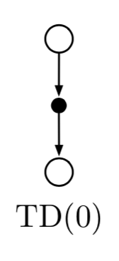
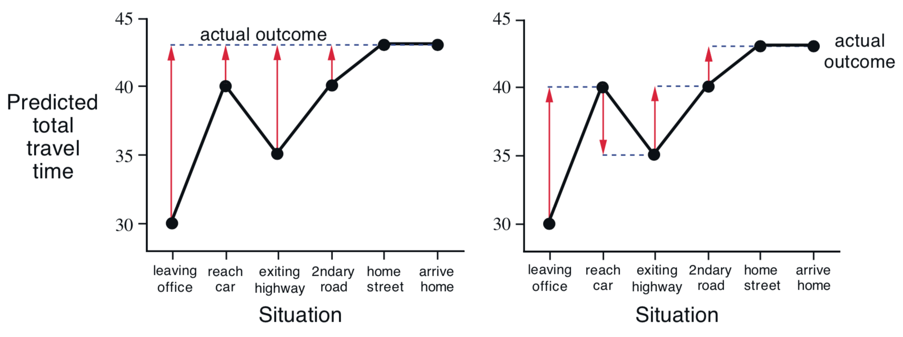
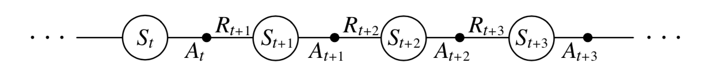
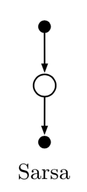
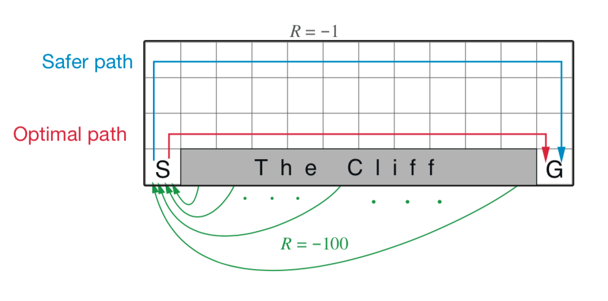
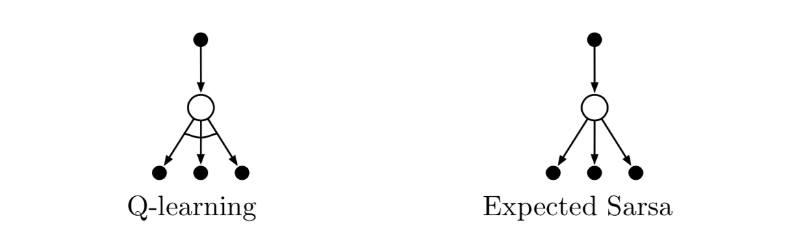
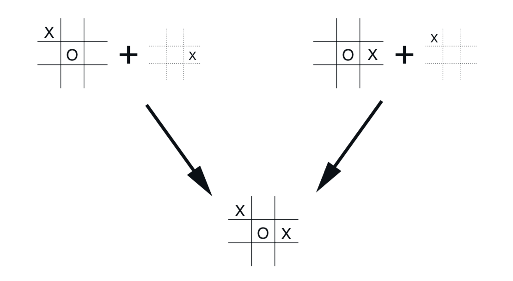

第6章 时序差分学习
==================

如果必须将一个想法确定为强化学习的核心和新颖，那么毫无疑问它将是 *时序差分* （TD）学习。
TD学习是蒙特卡洛思想和动态规划（DP）思想的结合。与蒙特卡洛方法一样，TD方法可以直接从原始经验中学习，而无需环境动态模型。
与DP一样，TD方法部分基于其他学习估计更新估计，而无需等待最终结果（它们是自举）。
TD，DP和蒙特卡洛方法之间的关系是强化学习理论中反复出现的主题；本章是我们开始探索这个关系。
在我们完成之前，我们将看到这些想法和方法相互融合，并且可以以多种方式组合。
特别是，在第7章中，我们介绍了n步算法，它提供了从TD到蒙特卡洛方法的桥梁，
在第12章中我们介绍了 TD(:math:`\lambda`) 算法，它无缝地统一了它们。

像往常一样，我们首先关注策略评估或 *预测* 问题，即估算给定策略 :math:`\pi` 的价值函数 :math:`v_\pi` 的问题。
对于控制问题（找到最优策略），DP、TD和蒙特卡洛方法都使用广义策略迭代（GPI）的一些变体。
方法的差异主要在于它们对预测问题的方法的差异。

6.1 TD预测
-------------

TD和蒙特卡罗方法都使用经验来解决预测问题。对于基于策略 :math:`\pi` 的一些经验，
两种方法都更新了他们对该经验中发生的非终结状态 :math:`S_t` 的 :math:`v_\pi` 的估计 :math:`V`。
粗略地说，蒙特卡罗方法一直等到访问后的回报已知，然后使用该回报作为 :math:`V(S_t)` 的目标。
适用于非平稳环境的简单的每次访问蒙特卡罗方法是

.. math::

    V(S_{t}) \leftarrow V(S_{t})+\alpha\left[ G_{t}-V(S_{t})\right]
    \tag{6.1}

其中 :math:`G_t` 是跟随时间t的实际回报，:math:`\alpha` 是一个恒定的步长参数（参见方程2.4）。
我们将此方法称为恒定 :math:`\alpha` MC。
蒙特卡罗方法必须等到回合结束才能确定 :math:`V(S_t)` 的增量（这时只有 :math:`G_t` 已知），
TD方法需要等到下一个时间步。 在时间 :math:`t+1`，它们立即形成目标并
使用观察到的奖励 :math:`R_{t+1}`和估计 :math:`V(S_{t+1})` 进行有用的更新。
最简单的TD方法立即进行更新

.. math::

    V(S_{t}) \leftarrow V(S_{t})+\alpha\left[R_{t+1}+\gamma V(S_{t+1})-V(S_{t})\right]
    \tag{6.2}

过渡到 :math:`S_{t+1}` 并接收 :math:`R_{t+1}`。
在实际中，蒙特卡洛更新的目标是 :math:`G_t`，而TD更新的目标是 :math:`R_{t+1} + \gamma V(S_{t+1})`。
这种TD方法称为 *TD(0)* 或 *一步TD*，因为它是第12章和第7章中开发的 TD(:math:`\lambda`)和n步TD方法的特例。
下面的方框完全以程序形式给出了TD(0)。

.. admonition:: 表格TD(0)估计 :math:`v_\pi`
    :class: important

    输入：要评估策略 :math:`\pi`

    算法参数：步长 :math:`\alpha in (0,1]`

    对所有 :math:`s \in \mathbb{S}^{+}`，除了 :math:`V(终点)=0`，任意初始化 :math:`V(s)`

    对每个回合循环：

        初始化 :math:`S`

        对回合的每一步循环：

            :math:`A \leftarrow` 由 :math:`\pi` 给出 :math:`S` 的动作

            采取动作 :math:`A`，观察 :math:`R`，:math:`S^{\prime}`

            :math:`V(S) \leftarrow V(S)+\alpha\left[R+\gamma V(S^{\prime})-V(S)\right]`

            :math:`S \leftarrow S^{\prime}`

        直到 :math:`S` 是终点

因为TD(0)部分基于现有估计进行更新，所以我们说它是一种 *自举（bootstrapping）* 方法，就像DP一样。
我们从第3章知道

.. math::

    \begin{align}
    v_{\pi}(s) & \doteq \mathbb{E}_{\pi}\left[G_{t} | S_{t}=s\right]  \tag{6.3}\\
    &=\mathbb{E}_{\pi}\left[R_{t+1}+\gamma G_{t+1} | S_{t}=s\right] & (由(3.9))\\
    &=\mathbb{E}_{\pi}\left[R_{t+1}+\gamma v_{\pi}\left(S_{t+1}\right) | S_{t}=s\right] \tag{6.4}
    \end{align}

粗略地说，蒙特卡罗方法使用（6.3）的估计作为目标，而DP方法使用（6.4）的估计作为目标。
蒙特卡洛目标是估计，因为（6.3）中的预期值未知；使用样本回报来代替实际预期回报。
DP目标是一个估计，不是因为完全由环境模型提供的预期值，而是因为 :math:`v_{\pi}(S_{t+1})` 未知，
且使用当前估计值 :math:`V(S_{t+1})` 来代替。
TD目标是估计原因有两个：它在（6.4）中对预期值进行采样，*并* 使用当前估计值 :math:`V` 而不是真实 :math:`v_\pi`。
因此，TD方法将蒙特卡罗的采样与DP的自举相结合。
正如我们将要看到的那样，通过谨慎和想象，这将使我们在获得蒙特卡罗和DP方法的优势方面走得很远。

右侧是表格TD(0)的备份图。
备份图顶部的状态节点的值估计基于从它到紧接的状态的一个样本转换而更新。
我们将TD和蒙特卡洛更新称为样本更新，因为它们涉及展望样本后继状态（或状态-动作对），
使用后继值和相应的奖励来计算备份值（?），然后相应地更新原始状态（或状态-动作对）的值。
*样本* 更新与DP方法的 *预期* 更新不同，因为它们基于单个样本后继，而不是基于所有可能后继的完整分布。

最后，请注意在TD(0)更新中，括号中的数量是一种误差，
衡量 :math:`S_t` 的估计值与更好的估计 :math:`R_{t+1} + \gamma V(S_{t+1})` 之间的差异。
这个数量称为 *TD误差*，在整个强化学习过程中以各种形式出现：

.. math::

    \delta_{t} \doteq R_{t+1}+\gamma V\left(S_{t+1}\right)-V\left(S_{t}\right)
    \tag{6.5}

请注意，每次TD误差都是 *当时估算* 的误差。因为TD误差取决于下一个状态和下一个奖励，所以直到一个步骤之后才可用。
也就是说，:math:`\delta_{t}` 是 :math:`V(S_{t+1})` 中的误差，在时间 :math:`t+1` 可用。
还要注意，如果列表 :math:`V` 在回合期间没有改变（因为它不是蒙特卡罗方法(?)），那么蒙特卡罗误差可以写成TD误差的和：

.. math::

    \begin{align}
    G_{t}-V\left(S_{t}\right) &=R_{t+1}+\gamma G_{t+1}-V\left(S_{t}\right)+\gamma V\left(S_{t+1}\right)-\gamma V\left(S_{t+1}\right) & (由(3.9)) \\
    &=\delta_{t}+\gamma\left(G_{t+1}-V\left(S_{t+1}\right)\right) \\
    &=\delta_{t}+\gamma \delta_{t+1}+\gamma^{2}\left(G_{t+2}-V\left(S_{t+2}\right)\right) \\
    &=\delta_{t}+\gamma \delta_{t+1}+\gamma^{2} \delta_{t+2}+\cdots+\gamma^{T-t-1} \delta_{T-1}+\gamma^{T-t}\left(G_{T}-V\left(S_{T}\right)\right) \\
    &=\delta_{t}+\gamma \delta_{t+1}+\gamma^{2} \delta_{t+2}+\cdots+\gamma^{T-t-1} \delta_{T-1}+\gamma^{T-t}(0-0) \\
    &=\sum_{k=t}^{T-1} \gamma^{k-t} \delta_{k} \tag{6.6}
    \end{align}

如果在回合期间更新 :math:`V` （因为它在TD(0)中），则此恒等式不准确，但如果步长很小，那么它可能仍然保持近似。
这种恒等式的一般化在时序差分学习的理论和算法中起着重要作用。

*练习6.1* 如果 :math:`V` 在回合中发生变化，那么（6.6）只能保持近似；等式两边的区别是什么？
设 :math:`V_t` 表示在TD误差（6.5）和TD更新（6.2）中在时间 :math:`t` 使用的状态值列表。
重做上面的推导以确定必须添加到TD误差总和的额外量，以便等于蒙特卡罗误差。

**例 6.1 开车回家** 每天下班回家后，你都会尝试预测回家需要多长时间。
当你离开办公室时，你会记下时间，星期几，天气以及其他可能相关的内容。
这个星期五你正好在6点钟离开，你估计要回家需要30分钟。当你到达你的车是6:05，你注意到开始下雨了。
在雨中交通通常较慢，所以你需要花费35分钟，或者总共40分钟。十五分钟后，你及时完成了旅程的高速公路部分。
当你驶出高速进入第二部分道路时，你将总旅行时间的估计值减少到35分钟。
不幸的是，此时你被困在一辆慢卡车后面，而且道路太窄而无法通过。
你最终不得不跟随卡车，直到6:40你转到住的小街。三分钟后你就回家了。因此，状态，时间和预测的顺序如下：

======================= ==================== ================= ===============
状态                      经过时间（分钟）        预测到的时间       预计总时间
======================= ==================== ================= ===============
周五6点离开办公室            0                      30              30
到达车，下雨                 5                      35              40
驶出高速公路                 20                     15              35
第二条路，在卡车后面          30                     10              40
进入家的街道                 40                     3              43
到家                        43                     0              43
======================= ==================== ================= ===============

这个例子中的奖励是旅程每一段的经过时间 [1]_。我们不打折（:math:`\gamma=1`），因此每个状态的回报是从该状态开始的实际时间。
每个状态的价值是 *预期的* 时间。第二列数字给出了遇到的每个状态的当前估计值。

查看蒙特卡罗方法操作的一种简单方法是绘制序列上预测的总时间（最后一列），如图6.1（左）所示。
红色箭头表示常量 :math:`\alpha` MC方法（6.1）推荐的预测变化，其中 :math:`\alpha=1`。
这些正是每个状态的估计值（预测的行走时间）与实际返回（实际时间）之间的误差。
例如，当你离开高速公路时，你认为回家仅需15分钟，但实际上需要23分钟。
公式6.1适用于此点，并确定驶出公路后的估计时间的增量。
误差 :math:`G_t - V(S_t)` 此时为8分钟。假设步长参数 :math:`\alpha` 为 :math:`1/2`。
然后，由于这种经验，退出高速公路后的预计时间将向上修改四分钟。
在这种情况下，这可能是一个太大的变化；卡车可能只是一个不幸的中断。
无论如何，只有在你到家之后才能进行变更。只有在这一点上你才知道任何实际的回报。

    **图6.1** 通过蒙特卡罗方法（左）和TD方法（右）在开车回家示例中推荐的变化。

在学习开始之前，是否有必要等到最终结果已知？
假设在另一天你再次估计离开你的办公室时需要30分钟才能开车回家，但是你会陷入大规模的交通堵塞之中。
离开办公室后二十五分钟，你仍然在高速公路上等待。你现在估计还需要25分钟才能回家，共计50分钟。
当你在车流中等待时，你已经知道你最初估计的30分钟过于乐观了。
你必须等到回家才增加对初始状态的估计吗？根据蒙特卡罗的方法，你必须，因为你还不知道真正的回报。

另一方面，根据TD方法，你可以立即学习，将初始估计值从30分钟转移到50分。
事实上，每个估计值都会转移到紧随其后的估计值。
回到驾驶的第一天，图6.1（右）显示了TD规则（6.2）推荐的预测变化
（如果 :math:`\alpha=1`，这些是规则所做的更改）。
每个误差与预测随时间的变化成比例，即与预测的 *时序差分* 成比例。

除了在车流中等待你做点什么之外，还有几个计算原因可以解释为什么根据你当前的预测学习是有利的，
而不是等到你知道实际回报时才终止。我们将在下一节简要讨论其中的一些内容。

*练习6.2* 这是一个练习，以帮助你发展直觉，了解为什么TD方法通常比蒙特卡罗方法更有效。
考虑开车回家示例以及如何通过TD和蒙特卡罗方法解决它。你能想象一个TD更新平均比蒙特卡罗更新更好的情景吗？
举一个示例场景 - 过去经验和当前状态的描述 - 你期望TD更新更好。这里有一个提示：假设你有很多下班开车回家的经验。
然后你搬到一个新的建筑物和一个新的停车场（但你仍然在同一个地方进入高速公路）。现在你开始学习新建筑的预测。
在这种情况下，你能看出为什么TD更新可能会好得多，至少初始是这样吗？在原始场景中发生同样的事情可能吗？

6.2 TD预测方法的优势
---------------------

TD方法部分基于其他估计更新其估计。他们通过猜测来学习猜测 - 他们 *引导*。这是一件好事吗？
TD方法与蒙特卡罗和DP方法相比有哪些优势？开发和回答这些问题将涉及本书的其余部分以及更多内容。
在本节中，我们简要地预测一些答案。

显然，TD方法比DP方法具有优势，因为它们不需要环境模型，其奖励和下一状态概率分布。

TD方法相对于蒙特卡罗方法的下一个最明显的优势是它们自然地以在线，完全递增的方式实现。
使用蒙特卡罗方法，必须等到回合的结束，因为只有这样才能知道回报，而使用TD方法，只需要等待一个时间步。
令人惊讶的是，这通常是一个重要的考虑因素。一些应用程序有很长的回合，所以延迟所有学习直到回合结束太慢。
其他应用程序是持续的任务，根本没有回合。最后，正如我们在前一章中所提到的，
一些蒙特卡罗方法必须忽略或折扣采取实验行动的事件，这可能会大大减慢学习速度。
TD方法不太容易受到这些问题的影响，因为无论采取何种后续行动，它们都会从每次转变中学习。

但TD方法听起来有效吗？当然，从下一个中学习一个猜测是方便的，而不是等待实际的结果，
但我们仍然可以保证收敛到正确的答案吗？令人高兴的是，答案是肯定的。
对于任何固定策略 :math:`\pi`，已经证明TD(0)收敛到 :math:`v_{\pi}`，
如果它足够小，则表示恒定步长参数，如果步长参数按照通常随机近似条件（2.7）减小，则概率为1（译者注：这句没太明白）。
大多数收敛证明仅适用于上面（6.2）所述算法的基于表格的情况，但是一些也适用于一般线性函数逼近的情况。
这些结果将在9.4节的更一般性设置中讨论。

如果TD和蒙特卡罗方法渐近地收敛到正确的预测，那么自然下一个问题是“哪个首先收敛到那里？”
换句话说，哪种方法学得更快？哪种方法使得有限数据的使用更加有效？目前，这是一个悬而未决的问题，
即没有人能够在数学上证明一种方法比另一种方法收敛得更快。事实上，甚至不清楚说出这个问题的最恰当的正式方式是什么！
然而，在实践中，通常发现TD方法比常数- :math:`\alpha` MC方法在随机任务上收敛得更快，如例6.2所示。

.. admonition:: 例6.2 随机行走
    :class: important

    在这个例子中，我们在应用于以下马尔可夫奖励过程时，凭经验比较TD(0)和常数- :math:`alpha` MC的预测能力：

    .. figure:: images/random_walk_markov_reward_process.png

    *马尔可夫奖励过程* （MRP）是没有行动的马尔可夫决策过程。我们经常在关注预测问题时使用MRP，
    其中不需要将由环境引起的动态与由个体引起的动态区分开来。
    在该MRP中，所有回合以中心状态 :math:`C` 开始，然后以相同的概率在每一步上向左或向右前进一个状态。
    回合终止于最左侧或最右侧。当回合在右边终止时，会产生 :math:`+1` 的奖励；所有其他奖励都是零。
    例如，典型的回合可能包含以下状态和奖励序列：:math:`C, 0, B, 0, C, 0, D, 0, E, 1`。
    因为此任务是未折扣的，所以每个状态的真实价值是从该状态开始在右侧终止的概率。
    因此，中心状态的真值是 :math:`v_\pi(C)=0.5`。所有状态 :math:`A` 到 :math:`E` 的
    真实价值都是 :math:`\frac{1}{6}`，:math:`\frac{2}{6}`，:math:`\frac{3}{6}`，
    :math:`\frac{4}{6}` 和 :math:`\frac{5}{6}`。

    .. figure:: images/random_walk_comparison.png

    上面的左图显示了在TD(0)的单次运行中在不同数量的回合之后学习的价值。
    100回合之后的估计值与它们的真实值接近 - 具有恒定的步长参数（在此示例中 :math:`\alpha=0.1`），
    这些值随着最近一个回合的结果而无限地波动。右图显示了两种方法对于各种 :math:`\alpha` 值的学习曲线。
    显示的性能度量是学习的值函数和真值函数之间的均方根（RMS）误差，在五个状态上取平均值，
    然后在超过100次运行上平均。在所有情况下，对于所有 :math:`s`，近似值函数被初始化为中间值 :math:`V(s)=0.5`。
    在这项任务中，TD方法始终优于MC方法。

*练习6.3* 从随机游走示例的左图中显示的结果看来，第一回合仅导致 :math:`V(A)` 的变化。
这告诉你第一回合发生了什么？为什么只有这一状态的估计值发生了变化？确切地说它改变了多少？

*练习6.4* 随机游走示例右图中显示的特定结果取决于步长参数 :math:`\alpha` 的值。
如果使用更广范围的 :math:`\alpha` 值，您认为关于哪种算法更好的结论是否会受到影响？
是否存在不同的固定值 :math:`\alpha`，其中任何一种算法的表现都要比显示的好得多？为什么或者为什么不？

*\*练习6.5* 在随机游走示例的右图中，TD方法的RMS误差似乎下降然后再上升，特别是在 :math:`\alpha` 高时。
可能是什么导致了这个？你认为这总是会发生，或者它可能是近似值函数初始化的函数吗？

*练习6.6* 在例6.2中，我们说状态 :math:`A` 到 :math:`E` 随机游走示例的
真实值是 :math:`\frac{1}{6}`，:math:`\frac{2}{6}`，:math:`\frac{3}{6}`，
:math:`\frac{4}{6}` 和 :math:`\frac{5}{6}`。描述至少两种不同的方式相说明这些可以计算出来。
您认为我们实际使用哪个？为什么？

6.3 TD(0)的最优性
------------------

假设只有有限的经验，比如10个回合或100个时间步。在这种情况下，使用增量学习方法的常见方法是重复呈现经验，直到该方法收敛于答案。
给定近似值函数 :math:`V`，对于访问非终结状态的每个时间步长 :math:`t` 计算由（6.1）或（6.2）指定的增量，
但是值函数仅通过所有增量的总和改变一次。
然后，使用新的值函数再次处理所有可用的经验，以产生新的整体增量，依此类推，直到值函数收敛。
我们将此称为 *批量更新*，因为只有在处理完每 *批* 完整的训练数据后才会进行更新。

在批量更新中，TD(0)确定性地收敛到与步长参数 :math:`\alpha` 无关的单个答案，只要选择 :math:`\alpha` 足够小。
常数- :math:`\alpha` MC方法也在相同条件下确定性地收敛，但是收敛到不同的答案。
理解这两个答案将有助于我们理解两种方法之间的差异。在正常更新下，方法不会一直移动到各自的批次答案，
但在某种意义上，他们会在这些方向上采取措施。在尝试理解一般的两个答案之前，对于所有可能的任务，我们首先看一些例子。

**例6.3 批量更新下的随机行走** 如下将TD(0)和常数- :math:`\alpha` MC的批量更新版本应用于随机行走预测示例（示例6.2）。
在每一新回合之后，到目前为止所见的所有回合都被视为一个批量。它们被重复地呈现给算法 TD(0)或常数- :math:`\alpha` MC，
其中 :math:`\alpha` 足够小，使得价值函数收敛。然后将得到的价值函数与 :math:`v_\pi` 进行比较，
绘制五个状态（以及整个实验的100次独立重复）的平均均方根误差，得到图6.2所示的学习曲线。
请注意，批处理TD方法始终优于批量蒙特卡罗方法。

.. figure:: images/figure-6.2.png
    :align: right
    :width: 400px

    **图6.2** 在随机行走任务的批量训练下TD(0)和常数- :math:`\alpha` MC的性能。

在批量训练中，常数- :math:`\alpha` MC收敛于值 :math:`V(s)`，这是在访问每个状态之后经历的实际回报的样本平均值。
这些是最佳估计，因为它们最小化了训练集中实际回报的均方误差。从这个意义上来说，令人惊讶的是，
批量TD方法能够根据右图所示的均方根误差测量得到更好的效果。批量TD如何能够比这种最佳方法表现更好？
答案是蒙特卡罗方法仅以有限的方式是最优的，而TD以与预测回报更相关的方式是最优的。

**例6.4 你是预测者** 现在把自己置于未知马尔可夫奖励过程的回报预测者的角色。假设你观察了以下八个回合：

======== =====
A,0,B,0   B,1
B,1       B,1
B,1       B,1
B,1       B,0
======== =====

这意味着第一个回合在状态A开始，转换为B，奖励为0，然后从B终止，奖励为0。其他七个回合甚至更短，从B开始并立即终止。
鉴于这批数据，您认为估计 :math:`V(A)` 和 :math:`V(B)` 的最佳预测最佳值是什么？
每个人都可能会同意 :math:`V(B)` 的最佳值是 :math:`\frac{3}{4}`，
因为在状态B的8次中有6次过程立即终止，回报为1，而在B中另外两次过程终止于回报0。

.. figure:: images/you_are_the_predictor.png
    :align: right
    :width: 150px

但是，根据这些数据，估算 :math:`V(A)` 的最佳值是多少？这里有两个合理的答案。
一个是观察到过程处于状态A会100％立即到达B（奖励为0）；
因为我们已经确定B的值为 :math:`\frac{3}{4}`，所以A的值也必须为 :math:`\frac{3}{4}`。
查看这个答案的一种方法是它首先建立马尔可夫过程的建模，在这种情况下如右图所示，
然后计算给定模型的正确估计，在这种情况下确实给出 :math:`V(A)=\frac{3}{4}`。
这也是批量TD(0)给出的答案。

另一个合理的答案就是注意到我们已经看过A一次，其后的回报是0；因此，我们估计 :math:`V(A)` 为0。
这是批量蒙特卡罗方法给出的答案。请注意，它也是给出训练数据最小平方误差的答案。
实际上，它给数据带来零误差。但我们仍然希望第一个答案会更好。如果该过程是马尔可夫的，
我们预计第一个答案将对 *未来* 数据产生较低的误差，即使蒙特卡罗对现有数据的回答更好。

实施例6.4说明了批次TD(0)和批量蒙特卡罗方法发现的估计值之间的一般差异。
批量蒙特卡罗方法总是找到最小化训练集上的均方误差的估计，
而批量TD(0)总是找到对马尔可夫过程的最大似然模型完全正确的估计。
通常，参数的 *最大似然估计* 是其生成数据的概率最大的参数值。
在这种情况下，最大似然估计是从观察到的事件中以明显方式形成的马尔可夫过程的模型：
从 :math:`i` 到 :math:`j` 的估计转移概率是从 :math:`i` 到 :math:`j` 的观察到的转变的分数，
以及相关联的预期奖励是在这些转变中观察到的奖励的平均值。
给定此模型，如果模型完全正确，我们可以计算值函数的估计值，该估计值将完全正确。
这被称为 *确定性等价估计*，因为它等同于假设潜在过程的估计是确定的而不是近似的。
通常，批量TD(0)收敛于确定性等价估计。

这有助于解释为什么TD方法比蒙特卡罗方法更快收敛。在批量形式中，TD(0)比蒙特卡罗方法更快，
因为它计算真实的确定性等价估计。这解释了随机行走任务中批量结果显示的TD(0)的优势（图6.2）。
与确定性等价估计的关系也可以部分解释非批量TD(0)的速度优势（例如，例6.2，第125页，右图）。
尽管非批量方法没有达到确定性等效或最小平方误差估计，但它们可以被理解为大致在这些方向上移动。
非批量TD(0)可能比常数- :math:`\alpha` MC更快，因为它正朝着更好的估计方向发展，即使它没有完全到达那里。
目前，关于在线TD和蒙特卡罗方法的相对效率，没有更明确的说法。

最后，值得注意的是，尽管确定性等价估计在某种意义上是最优解，但直接计算它几乎是不可行的。
如果 :math:`n=|\mathcal{S}|` 是状态的数量，然后仅形成过程的最大似然估计可能需要 :math:`n^2` 个存储器的量级，
并且如果按常规方式完成，则计算相应的值函数需要 :math:`n^3` 个计算步骤的量级。
在这些术语中，确实令人惊讶的是TD方法可以使用不超过 :math:`n` 阶的存储器和训练集上的重复计算来近似相同的解。
在具有大状态空间的任务中，TD方法可能是近似确定性等价解的唯一可行方法。

*\*练习6.7* 设计TD（0）更新的非策略版本，可以与任意目标策略⇡一起使用并覆盖行为策略b，在每个步骤t使用重要性采样率（5.3）。

6.4 Sarsa：在策略TD控制
------------------------

我们现在转向使用TD预测方法来解决控制问题。像往常一样，我们遵循广义策略迭代（GPI）的模式，这次只使用TD方法解决评估或预测部分。
与蒙特卡罗方法一样，我们面临着对探索和利用进行权衡的需要，并且再次采用的方法分为两大类：在策略和离策略。
在本节中，我们将介绍在策略上的TD控制方法。

第一步是学习动作价值函数而不是状态价值函数。特别是，对于在策略的方法，
我们必须估计当前行为策略 :math:`\pi` 和所有状态 :math:`s` 和行动 :math:`a` 的 :math:`q(s, a)`。
这可以使用基本上与上述用于学习 :math:`v_\pi` 的相同的TD方法来完成。
回想一下，回合由一系列状态和状态-动作对组成：

在上一节中，我们考虑了从状态到状态的转变，并学习了状态的价值。
现在我们考虑从状态-动作对转换到状态-动作对，并学习状态-动作对的价值。
这些案例在形式上是相同的：它们都是具有奖励过程的马尔可夫链。
确保TD(0)下状态价值收敛的定理也适用于相应的动作价值算法：

.. math::

    Q\left(S_{t}, A_{t}\right) \leftarrow Q\left(S_{t}, A_{t}\right)+\alpha\left[R_{t+1}+\gamma Q\left(S_{t+1}, A_{t+1}\right)-Q\left(S_{t}, A_{t}\right)\right].
    \tag{6.7}

在从非终点状态 :math:`S_t` 的每次转换之后完成该更新。
如果 :math:`S_{t+1}` 是终点，则 :math:`Q(S_{t+1}, A_{t+1})` 被定义为零。
此规则使用五元组事件的每个元素 :math:`\left(S_{t}, A_{t}, R_{t+1}, S_{t+1}, A_{t+1}\right)`，
它们构成从一个状态-动作对到下一个状态-动作对的转换。这个五元组产生了算法的名称Sarsa。
Sarsa的备份图如右图所示。

可以直接设计基于Sarsa预测方法的在策略控制算法。
正如在所有策略方法中一样，我们不断估计行为策略 :math:`\pi` 的 :math:`q_\pi`，
同时将 :math:`\pi` 改为 :math:`q_\pi` 的贪婪。Sarsa控制算法的一般形式在下面的框中给出。

Sarsa算法的收敛属性取决于策略对 :math:`Q` 的依赖性。
例如，可以使用 :math:`\varepsilon` -贪婪或 :math:`\varepsilon` -soft 策略。
只要所有状态-动作对被无限次访问并且策略收敛于贪婪策略的限制
（可以控制，例如，设置 :math:`\varepsilon` -贪婪时的 :math:`\varepsilon=1/t`），
Sarsa就以概率1收敛到最优策略和动作-价值函数。

*练习6.8* 显示（6.6）的动作价值适用于TD误差的动作值形式
:math:`\delta_{t}=R_{t+1}+\gamma Q\left(S_{t+1}, A_{t+1}\right)-Q\left(S_{t}, A_{t}\right)`，
再次假设值不会逐步变化。

.. admonition:: Sarsa （在策略TD控制）估计 :math:`Q \approx q_*`
    :class: important

    算法参数：步长 :math:`\alpha \in (0,1]`，小值 :math:`\varepsilon > 0`

    对所有 :math:`s \in \mathcal(S)^+`，:math:`a \in \mathcal(A)(s)`，任意初始 :math:`Q(s, a)`，除了 :math:`Q(终点, \cdot)=0`

    对每一个回合循环：

        初始化 :math:`S`

        使用从 :math:`Q` 派生的策略从 :math:`S` 中选择 :math:`A`（例如，:maht:`\varepsilon` -贪婪）

        对回合的每一步循环：

            采取动作 :math:`A`，观察 :math:`R`, :math:`S^{\prime}`

            使用从 :math:`Q` 派生的策略从 :math:`S^{\prime}` 中选择 :math:`A^{\prime}`（例如，:maht:`\varepsilon` -贪婪）

            :math:`Q(S, A) \leftarrow Q(S, A)+\alpha\left[R+\gamma Q\left(S^{\prime}, A^{\prime}\right)-Q(S, A)\right]`

            :math:`S \leftarrow S^{\prime}`；:math:`A \leftarrow A^{\prime}`；

        直到 :math:`S` 是终点

**例6.5：有风网格世界** 下面的插图是一个标准的网格世界，有开始和目标状态，
但有一个差异：在网格中间有一个向上运行的侧风。
动作是标准的四个── **上**，**下**，**右** 和 **左**，但在中间区域，
结果的下一个状态向上移动一个“风”，其强度因列而异。
在每列下方给出风的强度，向上移动的格子数量。
例如，如果你是目标右侧的一个单元格，则左侧的操作会将你带到目标上方的单元格。
这是一个没有折扣的回合任务，在达到目标状态之前回报恒定为 :math:`-1`。

.. figure:: images/sarsa_for_windy_gridworld.png
    :width: 350px
    :align: right

右边的图表显示了将 :math:`\varepsilon` -贪婪Sarsa应用于此任务的结果，
其中 :math:`\varepsilon=0.1`，:math:`\alpha=0.5`，
并且所有 :math:`s, a` 初始化价值 :math:`Q(s,a)=0`。
图表的斜率增加表明目标随着时间的推移更快地达到。经过8000个时间步骤，贪婪的策略早已是最优的（它的轨迹显示在图中）；
继续的 :math:`\varepsilon` -贪婪探索将平均回合长度保持在17步左右，比最低值15更多两步。
请注意，蒙特卡罗方法在这里不能轻易使用，因为所有策略都不能保证终止。
如果发现某项策略导致个体保持相同的状态，然后下一回合就永远不会结束。
Sarsa等在线学习方法没有这个问题，因为他们很快就会在这一回合中说这些策略很差，并转而使用其他策略。

*练习6.9：带有对角移动的有风网格世界（编程）* 重新解决有风的网格世界，假设有八种可能的动作，
包括对角线移动，而不是通常的四种动作。额外行动能使你做得好多少？除了由风引起的第九次动作之外，你能做到更好吗？

*练习6.10：随机风（编程）* 用对角移动重新解决有风网格世界任务，假设风的效果（如果有的话）是随机的，
有时从每列给出的平均值变化1。也就是说，三分之一的时间里你完全按照这些值移动，如上一个练习中所示，
但也有三分之一的时间将在该单元格一个单元格之上移动，另外三分之一的时间在一个单元格之下移动。
例如，如果你是目标右侧的一个单元格并向 **左** 移动，那么三分之一的时间将移动到目标上方一个单元格，
三分之一的时间将移动到目标上方两个单元格，最后三分之一的时间你移动到目标。

6.5 Q-learning：离策略TD控制
-----------------------------

强化学习的早期突破之一是开发了一种名为 *Q-learning* （Watkins，1989）的离策略TD控制算法，由以下定义：

.. math::

    Q\left(S_{t}, A_{t}\right) \leftarrow Q\left(S_{t}, A_{t}\right)+\alpha\left[R_{t+1}+\gamma \max _{a} Q\left(S_{t+1}, a\right)-Q\left(S_{t}, A_{t}\right)\right].
    \tag{6.8}

在这种情况下，学习的动作-价值函数 :math:`Q` 直接近似 :math:`q_*`，即最佳动作-价值函数，与所遵循的策略无关。
这极大地简化了算法的分析并实现了早期的收敛证明。该策略仍然具有一个效果，即它确定访问和更新哪些状态-动作对。
但是，正确收敛所需的只是所有动作-价值对继续更新。正如我们在第5章中所观察到的那样，这是一个最小要求，
因为在一般情况下保证找到最佳行为的任何方法都必须要求它。
在该假设和步长参数序列的通常随机近似条件的变体下，:math:`Q` 已经显示出以概率1收敛到 :math:`q_*`。
Q-learning算法以程序形式显示如下。

.. admonition:: Q-learning （离策略TD控制）估计 :math:`\pi \approx \pi_*`
    :class: important

    算法参数：步长 :math:`\alpha \in (0,1]`，小值 :math:`\varepsilon > 0`

    对所有 :math:`s \in \mathcal(S)^+`，:math:`a \in \mathcal(A)(s)`，任意初始 :math:`Q(s, a)`，除了 :math:`Q(终点, \cdot)=0`

    对每一个回合循环：

        初始化 :math:`S`

        对回合的每一步循环：

            使用从 :math:`Q` 派生的策略从 :math:`S` 中选择 :math:`A`（例如，:maht:`\varepsilon` -贪婪）

            采取动作 :math:`A`，观察 :math:`R`, :math:`S^{\prime}`

            :math:`Q(S, A) \leftarrow Q(S, A)+\alpha\left[R+\gamma \max _{a} Q\left(S^{\prime}, a\right)-Q(S, A)\right]`

            :math:`S \leftarrow S^{\prime}`

        直到 :math:`S` 是终点

Q-learning的备份图是什么？规则（6.8）更新状态-动作对，因此顶点（更新的根）必须是一个小的，填充的动作节点。
更新也 *来自* 动作节点，最大化在下一个状态下可能执行的所有操作。因此，备份图的底部节点应该是所有这些动作节点。
最后，请记住，我们指出将这些“下一个动作”节点的最大值放在它们之间（图3.4-右）。你能猜出现在的图是什么样吗？
如果能，请在转到图6.4中的答案之前进行猜测。

**例6.6：悬崖行走** 这个网格世界示例比较了Sarsa和Q-learning，突出了在策略（Sarsa）和离策略（Q-learning）方法之间的区别。
考虑右边显示的网格世界。这是一个标准的未折扣的，偶然的任务，具有开始和目标状态，以及向上，向下，向右和向左移动的常见操作。
所有过渡的奖励都是 :math:`1`，除了那些标记为“悬崖”的区域。进入该区域会产生 :math:`-100` 的奖励，并且会立即回到起点。

.. figure:: images/performance_of_Sarsa_and_Q-learning.png
    :width: 350px
    :align: right

右图显示了具有 :math:`\varepsilon` -贪婪动作选择的Sarsa和Q-learning方法的性能，:math:`\alpha=0.1`。
在初始瞬态之后，Q-learning会学习最优策略的价值，这些策略沿着悬崖边缘行进。
不幸的是，由于“:math:`\varepsilon` -贪婪动作选择”，这导致它偶尔从悬崖上掉下来。
另一方面，Sarsa将动作选择考虑在内，并学习通过网格上部的更长但更安全的路径。
虽然Q-learning实际上学习了最优策略的价值，其在线表现比学习迂回策略的Sarsa差。
当然，如果 :math:`\varepsilon` 逐渐减少，那么两种方法都会渐近地收敛到最优策略。

*练习6.11* 为什么Q-learning被认为是一种 *离策略* 控制方法？

*练习6.12* 假设动作选择是贪婪的。Q-learning与Sarsa的算法完全相同吗？他们会做出完全相同的动作选择和权重更新吗？

6.6 预期的Sarsa
---------------

考虑与Q-learning一样的学习算法，区别在于其考虑到当前策略下每个动作的可能性，使用预期值而不是最大化下一个状态-动作对。
也就是说，考虑具有如下更新规则的算法

.. math::

    \begin{aligned}
    Q\left(S_{t}, A_{t}\right) & \leftarrow Q\left(S_{t}, A_{t}\right)+\alpha\left[R_{t+1}+\gamma \mathbb{E}_{\pi}\left[Q\left(S_{t+1}, A_{t+1}\right) | S_{t+1}\right]-Q\left(S_{t}, A_{t}\right)\right] \\
    & \leftarrow Q\left(S_{t}, A_{t}\right)+\alpha\left[R_{t+1}+\gamma \sum_{a} \pi\left(a | S_{t+1}\right) Q\left(S_{t+1}, a\right)-Q\left(S_{t}, A_{t}\right)\right] & \text{(6.9)}
    \end{aligned}

但这遵循Q-learning的模式。给定下一个状态 :math:`S_{t+1}`，
该算法 *确定地* 在与Sarsa *期望* 移动的方向相同的方向上移动，
因此它被称为 *预期的Sarsa*。其备份图如图6.4右边所示。

预期的Sarsa在计算上比Sarsa更复杂，但作为回报，它消除了由于随机选择 :math:`A_{t+1}` 而导致的差异
基于相同的经验，我们可能期望它的表现略好于Sarsa，实际上它通常也是如此。
图6.3显示了预期Sarsa与Sarsa，Q-learning的悬崖行走任务的总结。
预期的Sarsa在这个问题上保留了Sarsa对Q-learning的显着优势。
此外，对于广泛得步长参数 :math:`\alpha`的值，预期Sarsa显示出相对于Sarsa的显着改善。
在悬崖行走中，状态转换都是确定性的，所有随机性都来自策略。
在这种情况下，预期的Sarsa可以安全地设置 :math:`\alpha=1` 而不会导致渐近性能的任何退化，
而Sarsa只能在长期运行时以小的 :math:`\alpha` 值表现良好，短期表现较差。
在这个和其他例子中，预期的Sarsa相对于Sarsa具有一致的经验优势。

.. figure:: images/figure-6.3.png

    图6.3：TD控制方法对悬崖行走任务的临时和渐近性能是关于 :math:`\alpha` 的函数。
    所有算法都使用 :math:`\varepsilon` -贪婪策略，其中 :math:`\varepsilon=1`。
    渐近性能是超过100,000回合的平均，而临时性能是前100回合的平均值。
    这些数据分别是临时和渐近情况的超过50,000回合和10次运行的平均。
    实心圆圈标志着每种方法的最佳临时性能。改编自van Seijen et al.(2009)。

    图6.4：Q-learning和预期Sarsa的备份图。

在这些悬崖行走任务结果中，预期的Sarsa被用于策略，但总的来说，它可能使用与目标策略 :math:`\pi` 不同的策略来产生行为，
在这种情况下，它成为一种离策略算法。例如，假设 :math:`\pi` 是贪婪的策略，而行为更具探索性；
然后预期Sarsa正是Q-learning。在这个意义上，预期的Sarsa包含并概括了Q-learning，同时可靠地改善了Sarsa。
除了额外的计算成本之外，预期的Sarsa可能完全支配其他更著名的TD控制算法。

6.8 最大化偏差和双学习
-------------------------

到目前为止，我们讨论的所有控制算法都涉及最大化其目标策略的构建。
例如，在Q-learning中，目标策略是给定当前操作值的贪婪策略，其中使用max定义，
而在Sarsa中，策略通常是 :math:`\varepsilon` -贪婪，这也涉及最大化操作。
在这些算法中，最大估计值被隐含地用作最大值的估计值，这可能导致显着的正偏差。
要了解原因，请考虑单个状态 :math:`s`，其中有许多动作 :math:`a` 的真值 :math:`q(s, a)` 都是零，
但其估计值 :math:`Q(s, a)` 是不确定的，因此分布在零的上方和下方。
真值的最大值为零，但估计的最大值为正，一个正偏差。我们称之为 *最大化偏差*。

**例6.7 最大化偏差例子** 图6.5中显示的小型MDP提供了一个简单的示例，说明最大化偏差如何影响TD控制算法的性能。
MDP有两个非终端状态 **A** 和 **B**，回合总是从 **A** 开始，可以选择 **左** **右** 两个动作。
**右** 动作立即转换到终止状态，奖励和返回为零。**左** 动作转换为 **B**，同时奖励为零，
之后有许多可能的动作，所有动作都会导致立即终止，奖励来自正态分布，平均值为 :math:`-0.1`，方差为 :math:`1.0`。
因此，从 **左** 开始的任何轨迹的预期回报是 :math:`-0.1`，因此在状态 **A** 中向 **左** 移动总是错误的。
然而，我们的控制方法可能有利于 **左** 动作，因为最大化偏差使 **B** 看起来具有正值。
图6.5显示，带有 :math:`\varepsilon` -贪婪动作选择的Q-learning最初学会强烈支持 **左** 动作。
即使在渐近线上，Q-learning也比我们的参数设置
（:math:`\varepsilon=0.1`，:math:`\alpha=0.1` 和 :math:`\gamma=0.1`）
中的 **左** 动作大约多5％。

.. figure:: images/figure-6.5.png

    **图6.5** 在简单的情节MDP上进行Q-learning和双Q-learning的比较（显示插图）。
    Q-learning最初学习比 **右** 动作更经常地学习 **左** 动作，并且总是比 :math:`\varepsilon=0.1`
    的 :math:`\varepsilon` -贪婪动作选择强制执行的最小概率的5％更经常地学习。
    相比之下，双Q-learning基本上不受最大化偏差的影响。这些数据是超过10,000次运行的平均。
    初始动作价值估计为零。:math:`\varepsilon` -贪婪动作选择中的任何关系都是随机打破的。

是否存在避免最大化偏差的算法？首先，考虑一个赌博机例子，其中我们对许多行为中的每一个的价值进行噪声估计，
获得作为每个行动的所有游戏所获得的奖励的样本平均值。如上所述，如果我们使用估计的最大值作为真值的最大值的估计，
那么将存在正的最大化偏差。查看问题的一种方法是，由于使用相同的样本（游戏）来确定最大化动作和估计其值。
假设我们将游戏划分为两组，并用它们来学习两个独立的估计，称之为 :math:`Q_1(a)` 和 :math:`Q_1(a)`，
对 :math:`a\in\mathcal{A}`，每个都是真值 :math:`q(a)` 的估计。
我们可以使用一个估计值，比如 :math:`Q_1`，确定最大化动作 :math:`A^{*}=\arg \max _{a} Q_{1}(a)`，
另一个 :math:`Q_2` 提供其价值的估计 :math:`Q_{2}(A^{*})=Q_2(\arg \max _{a} Q_{1}(a))`。
在 :math:`\mathcal{E}[Q_2(A^{*})]=q(A^{*})` 的意义上，该估计将是无偏的。
我们也可以重复这个过程，两个估计的作用相反，产生第二个无偏估计 :math:`Q_{1}(\arg \max _{a} Q_{2}(a))`。
这是 *双Q-learning* 的思想。请注意，虽然我们学习了两个估计值，但每次游戏只会更新一个估算值；
双学习使内存要求加倍，但不会增加每步的计算量。

双学习的想法自然地延伸到完整MDP的算法。例如，类似于Q-learning的双学习算法，称为双Q-learning，
将时间步长分为两步，可能通过在每一步上投硬币。如果硬币为正面，那么更新就是

.. math::

    Q_{1}(S_{t}, A_{t}) \leftarrow Q_{1}(S_{t}, A_{t})+\alpha\left[R_{t+1}+\gamma Q_{2}\left(S_{t+1}, \underset{a}{\arg \max } Q_{1}(S_{t+1}, a\right))-Q_{1}(S_{t}, A_{t})\right]
    \tag{6.10}

如果硬币出现反面，则在 :math:`Q_1` 和 :math:`Q_2` 切换时进行相同的更新，以便更新 :math:`Q_2`。
两个近似值函数完全对称地处理。行为策略可以使用行为价值估计。
例如，双Q-learning的 :math:`\varepsilon` -贪婪策略可以基于两个动作价值估计的平均值（或总和）。
下面的框中给出了完整的双Q-learning算法。这是用于产生图6.5中结果的算法。
在这个例子中，双学习似乎消除了最大化偏见造成的伤害。
当然还有Sarsa和预期的Sarsa的双学习版本。

.. admonition:: 双Q-learning，估计 :math:`Q_1 \approx Q_2 \approx q_*`
    :class: important

    算法参数：步长 :math:`\alpha \in (0,1]`，小值 :math:`\varepsilon > 0`

    对所有 :math:`s\in\mathcal(S)^+`，:math:`a\in\mathcal(A)(s)`，初始化 :math:`Q_1(s,a)` 和 :math:`Q_2(s,a)`，使得 :math:`Q(终点, \cdot)=0`

    对每一个回合循环：

        初始化 :math:`S`

        对回合的每一步循环：

            依据在 :math:`Q_1+Q_2` 中策略 :math:`\varepsilon` -贪婪，从 :math:`S` 中选择 :math:`A`

            采取动作 :math:`A`，观察 :math:`R`, :math:`S^{\prime}`

            有0.5的概率：

                :math:`Q_{1}(S, A) \leftarrow Q_{1}(S, A)+\alpha\left(R+\gamma Q_{2}\left(S^{\prime}, \arg \max _{a} Q_{1}\left(S^{\prime}, a\right)\right)-Q_{1}(S, A)\right)`

            否则：

                :math:`Q_{2}(S, A) \leftarrow Q_{2}(S, A)+\alpha\left(R+\gamma Q_{1}\left(S^{\prime}, \arg \max _{a} Q_{2}\left(S^{\prime}, a\right)\right)-Q_{2}(S, A)\right)`

            :math:`S \leftarrow S^{\prime}`

        直到 :math:`S` 是终点

*\*练习6.13* 具有 :math:`\varepsilon` -贪婪目标策略的双预期Sarsa的更新方程是什么？

6.9 游戏，Afterstates和其他特殊情况
------------------------------------

在本书中，我们尝试对一系列任务提出统一的方法，但当然总是有一些特殊的任务可以通过专门的方式得到更好的处理。
例如，我们的一般方法涉及学习一个 *动作* -价值函数，
但是在第一章中我们提出了一种学习玩井字棋的TD方法，它学到的东西更像是一个 *状态* -价值函数。
如果我们仔细观察那个例子，很明显，在那里学到的函数通常意义上既没有动作价值函数也没有状态价值函数。
传统的状态价值函数评估个体可以选择操作的状态，但是在个体移动 *之后*，井字棋游戏中使用的状态价值函数评估棋盘位置。
让我们称这些为 *afterstates*，相应得价值函数为 *afterstate价值函数*。
当我们了解环境动态的初始部分但不一定了解完整的动态时，afterstates是有用的。
例如，在游戏中我们通常知道移动的直接影响。我们知道每次可能的棋子移动会产生什么样的位置，而不是我们的对手将如何应对。
afterstate价值函数是利用这种知识的自然方式，从而产生更有效的学习方法。

从井字棋示例中可以明显看出，根据afterstates设计算法更为有效。传统的动作价值函数将从位置 *和* 移动映射到价值的估计值。
但是许多位置-移动对产生相同的结果位置，如下例所示：

在这种情况下，位置-移动对是不同的，但产生相同的“结果位置”，因此必须具有相同的夹子。
传统的行动-价值函数必须分别评估两个对，而afterstate价值函数将立即同等地评估两个对。
任何关于左侧位置-移动对的学习都会立即转移到右侧的位置-移动对。

Afterstates出现在许多任务中，而不仅仅是游戏。例如，在排队任务中，有一些操作，例如将客户分配给服务器，拒绝客户或丢弃信息。
在这种情况下，行动实际上是根据其直接影响来定义的，这些影响是完全已知的。

不可能描述所有可能的专业问题和相应的专业学习算法。但是，本书中提出的原则应该广泛应用。
例如，仍然可以根据广义策略迭代恰当地描述afterstate方法，其中策略和（afterstate）价值函数以基本相同的方式交互。
在许多情况下，人们仍将面临在策略和离策略方法之间的选择，以管理持续探索的需要。

*练习6.14* 描述杰克汽车租赁（例4.2）的任务如何用afterstates重写。就这一具体任务而言，为什么这样的重写可能会加速收敛？

6.10 总结
-----------

在本章中，我们介绍了一种新的学习方法，即时序差分（TD）学习，并展示了如何将其应用于强化学习问题。
像往常一样，我们将整体问题分为预测问题和控制问题。TD方法是用于解决预测问题的蒙特卡罗方法的替代方法。
在这两种情况下，控制问题的扩展都是通过我们从动态规划中抽象出来的通用策略迭代（GPI）的概念。
这就是近似策略和价值函数应该以朝着最优价值移动这样一种方式相互作用的想法。

构成GPI的两个过程之一驱使用价值函数准确地预测当前策略的回报；这是预测问题。
另一个过程推动策略对于当前价值函数在局部地（例如，:math:`\varepsilon` -贪婪）进行改进。
当第一个过程基于经验时，出现了关于保持足够的探索的问题。我们可以对TD控制方法进行分类，
根据他们是否通过使用在策略或者离策略的方法处理这个问题。
Sarsa是一种在策略的方法，而Q-learning是一种离策略的方法。预期的Sarsa也是一种离策略的方法。
第三种方法可以扩展TD方法来控制，我们在本章中没有包含，称为演员-评论家方法。这些方法在第13章中详细介绍。

本章介绍的方法是目前使用最广泛的强化学习方法。这可能是由于它们非常简单：
它们可以在线应用，只需极少的计算量，就可以通过与环境的交互来经历；
它们可以通过用小型计算机程序实现的单个方程几乎完全表达。
在接下来的几章中，我们扩展了这些算法，使它们更复杂，功能更强大。
所有新算法将保留这里介绍的算法的本质：它们将能够在线处理经验，计算相对较少，并且它们将由TD误差驱动。
本章介绍的TD方法的特殊情况应正确地称为 *一步法*，*表格式*，*不基于模型* TD方法。
在接下来的两章中，我们将它们扩展为 :math:`n` 步形式（蒙特卡罗方法的链接）和包含环境模型的形式（计划和动态规划的链接）。
然后，在本书的第二部分，我们将它们扩展到用各种形式的函数逼近而不是表格（深度学习和人工神经网络的链接）。

最后，在本章中，我们完全在强化学习问题的背景下讨论了TD方法，但TD方法实际上比这更普遍。
它们是学习对动力系统进行长期预测的一般方法。
例如，TD方法可能与预测财务数据，寿命，选举结果，天气模式，动物行为，发电站需求或客户购买有关。
只有当TD方法被分析为纯粹的预测方法时，不管它们在强化学习中的用途如何，它们的理论性质才能得到很好的理解。
即便如此，TD学习方法的这些其他潜在应用尚未得到广泛探索。

书目和历史评论
---------------

正如我们在第1章中所概述的那样，TD学习的概念早期源于动物学习心理学和人工智能，
最着名的是Samuel（1959）和Klopf（1972）的工作。
Samuel的工作被描述为第16.2节中的案例研究。与TD学习有关的还有Holland（1975,1976）早期关于价值预测一致性的想法。
这些影响了作者之一（Barto），他是1970年至1975年在Holland教授的密歇根大学的研究生。
Holland的想法引发了许多TD相关系统，
包括Booker（1982）和Holland斗式旅（bucket brigade）（1986）的工作，这与Sarsa有关，如下所述。

**6.1-2** 这些部分的大部分具体材料来自Sutton（1988），包括TD(0)算法，随机行走示例和术语“时序差分学习”。
动态规划和蒙特卡罗方法的关系受到Watkins（1989），Werbos（1987）和其他人影响。备份图的使用对于本书的第一版来说是新的。

基于Watkins和Dayan（1992）的工作，表格TD(0)被Sutton（1988）证明收敛和Dayan（1992）以概率为1证明。
Jaakkola，Jordan和Singh（1994）以及Tsitsiklis（1994）通过使用强大的现有随机近似理论的扩展，扩展和加强了这些结果。
其他扩展和一般化将在后面的章节中介绍。

**6.3** Sutton（1988）建立了批量训练下TD算法的最优性。
照亮这一结果的是Barnard（1993）推导的TD算法，它是用于学习马尔可夫链模型的增量方法的一个步骤和
用于从模型计算预测的方法的一个步骤的组合。术语 *确定性等价* 来自自适应控制文献（例如，Goodwin和Sin，1984）。

**6.4** Sarsa算法由Rummery和Niranjan（1994）引入。
他们结合人工神经网络对其进行了探索，称之为“修改连接Q-learning”。
Sutton（1996）引入了“Sarsa”这个名字。
Singh，Jaakkola，Littman和Szepesv ari（2000）证明了一步表格Sarsa（本章所述形式）的收敛性。
Tom Kalt提出了“有风网格世界”的例子。

Holland（1986）斗式旅的想法演变成与Sarsa密切相关的算法。斗式旅的最初想法涉及相互触发的规则链；
它专注于将信用从当前规则传递回触发它的规则。随着时间的推移，
斗式旅更像是TD学习，将信用归还给任何暂时的先前规则，而不仅仅是触发当前规则的规则。
斗式旅的现代形式，以各种自然方式简化，几乎与一步法Sarsa相同，如Wilson（1994）所详述。

**6.5** Watkins（1989）引入了Q-learning，Watkins和Dayan（1992）对收敛证明的概述进行了严格的描述。
Jaakkola，Jordan和Singh（1994）以及Tsitsiklis（1994）证明了更一般的收敛性结果。

**6.6** 预期的Sarsa算法由George John（1994）引入，他称之为“:math:`\overline{Q}` -learning”，
并强调其作为一种离策略算法优于Q-learning。当我们在本书的第一版中将预期的Sarsa作为练习，
或者对于van Seijen，van Hasselt，Whiteson和Weiring（2009），
他们建立了预期的Sarsa的收敛性和条件将胜过常规的Sarsa和Q-learning时，John的工作并不为我们所知。
我们的图6.3是根据他们的结果改编的。Van Seijen等人将“预期的Sarsa”定义为一种独立的策略方法（正如我们在第一版中所做的那样），
而现在我们将此名称用于目标和行为策略可能不同的通用算法。
van Hasselt（2011）注意到了预期的Sarsa的一般离策略视角，他称之为“一般Q学习”。

**6.7** 最大化偏差和双学习被van Hasselt引入并进行了广泛的研究（2010年，2011年）。
图6.5中的示例MDP改编自图4.1中的示例（van Hasselt，2011）。

**6.8** Afterstate的概念与“决策后的状态”的概念相同
（Van Roy，Bertsekas，Lee和Tsitsiklis，1997; Powell，2011）。

.. [1]
    如果这是一个控制问题，目的是最大限度地缩短旅行时间，那么我们当然会将奖励作为经过时间的 *负* 影响。
    但是因为我们只关注预测（策略评估），所以我们可以通过使用正数来保持简单。
