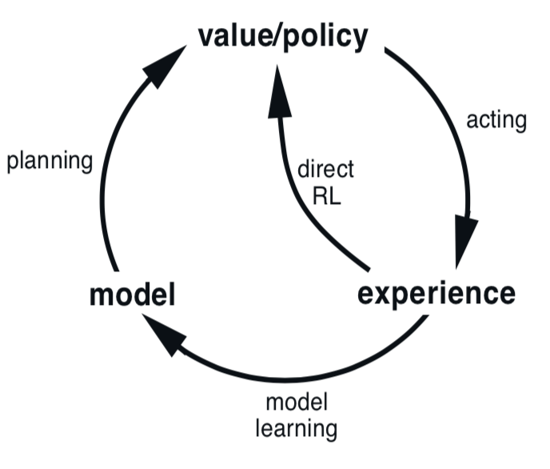
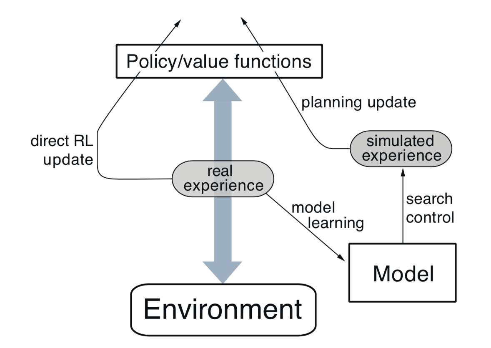
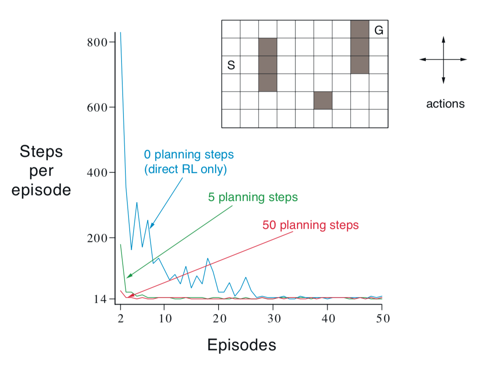
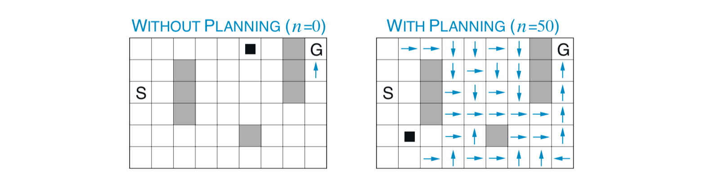
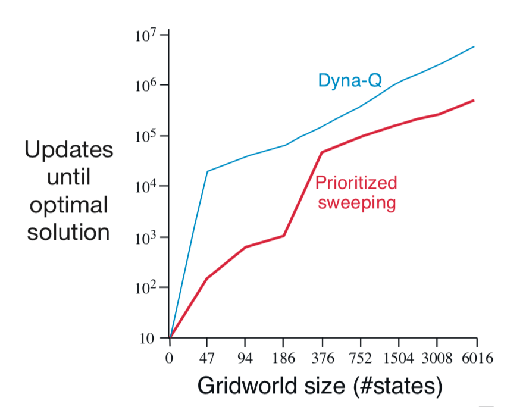
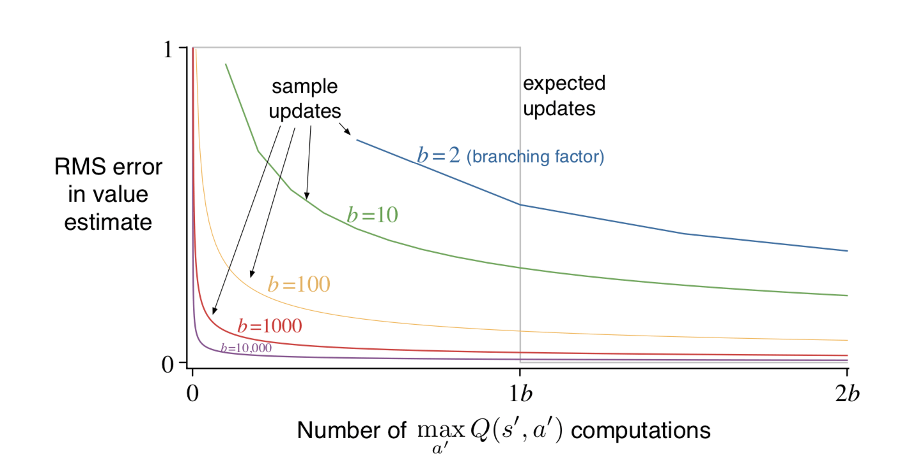
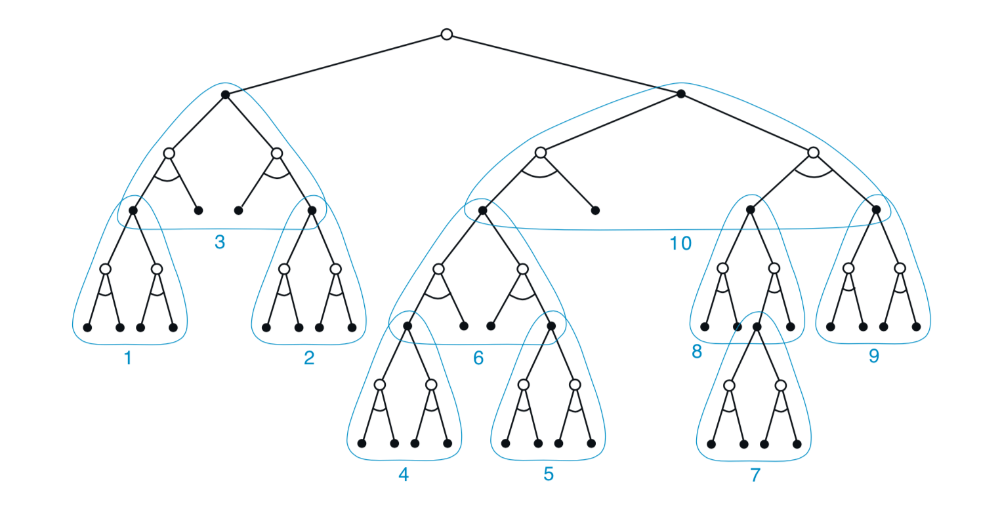

第8章 表格方法规划和学习
========================

在本章中，我们开发了强化学习方法的统一视图，这些方法需要环境模型，例如动态规划和启发式搜索，
以及可以在没有模型的情况下使用的方法，例如蒙特卡罗和时序差分方法。
这些分别称为 *基于模型（model-based）* 和 *不基于模型（model-free）*的强化学习方法。
基于模型的方法依赖于 *规划（planning）* 作为其主要组成部分，而不基于模型方法主要依赖于 *学习（learning）*。
虽然这两种方法之间存在着真正的差异，但也存在很大的相似之处。
特别是，这两种方法的核心是价值函数的计算。此外，所有方法都基于展望未来事件，计算备份值，然后将其用作近似值函数的更新目标。
在本书的前面，我们将蒙特卡洛和时序差分方法作为不同的替代方法，然后展示了如何通过n步方法统一它们。
我们在本章中的目标是基于模型和不基于模型方法的类似集成。
在前面的章节中已经确定了这些不同之处，我们现在探讨它们可以混合的程度。

8.1 模型和规划
-----------------

通过环境 *模型*，我们指的是个体可以用来预测环境如何响应其行为的任何事物。
给定状态和动作，模型产生对结果下一状态和下一奖励的预测。
如果模型是随机的，那么有几种可能的下一个状态和下一个奖励，每个都有一定的发生概率。
一些模型描述了所有可能性及其概率；这些我们称之为 *分布模型*。
其他模型只产生一种可能性，根据概率进行采样；这些我们称之为 *采样模型*。
例如，考虑对十几个骰子的总和进行建模。
分布模型将产生所有可能的总和及其发生的概率，而样本模型将产生根据该概率分布绘制的单个总和。
在动态规划中假设的模型──MDP动力学的估计 :math:`p\left(s^{\prime}, r | s, a\right)` ──是分布模型。
第5章中二十一点示例中使用的模型是一个采样模型。分布模型比样本模型更强大，因为它们可以始终用于产生样本。
但是，在许多应用中，获取样本模型比分布模型容易得多。十几个骰子就是一个简单的例子。
编写一个计算机程序来模拟骰子滚动并返回总和是很容易的，但是找出所有可能的总和及其概率更难且更容易出错。

模型可用于模仿或模拟体验。给定起始状态和动作，样本模型产生可能的转换，分布模型生成由其发生概率加权的所有可能转换。
给定起始状态和策略，样本模型可以产生整个回合，分布模型可以生成所有可能的回合及其概率。
在这两种情况下，我们都说模型用于 *模拟* 环境并产生 *模拟经验*。

在不同领域中，*规划* 这个词以几种不同的方式使用。
我们使用该术语来指代将模型作为输入并生成或改进与建模环境交互的策略的任何计算过程：

.. math::

    \text{模型} \stackrel{规划}{\longrightarrow} \text{策略}

在人工智能中，根据我们的定义，有两种不同的规划方法。*状态空间规划*，包括我们在本书中采用的方法，
主要被视为通过状态空间搜索最优策略或目标的最佳路径。动作导致从状态到状态的转换，并且价值函数在状态上计算。
在我们所说的 *规划空间规划* 中，规划是通过规划空间进行搜索。
操作将一个规划转换为另一个规划，并在规划空间中定义价值函数（如果有）。
规划空间规划包括演化方法和“偏序规划”，这是人工智能中的一种常见规划，其中步骤的排序在规划的所有阶段都没有完全确定。
规划空间方法难以有效地应用于强化学习中关注的随机序列决策问题，我们不会进一步考虑它们（但参见，例如，Russell和Norvig，2010）。

我们在本章中提出的统一观点是，所有的状态空间规划方法都有一个共同的结构，这种结构也存在于本书所介绍的学习方法中。
本章的其余部分将开发此视图，但有两个基本思想：
（1）所有状态空间规划方法都将计算价值函数作为改进策略的关键中间步骤，
（2）它们通过应用于模拟经验的更新或备份操作计算价值函数。
这种通用结构可以表示如下：

.. math::

    \text{模型} \longrightarrow \text{模拟经验} \stackrel{备份}{longrightarrow} \text{价值} \longrightarrow \text{策略}

动态规划方法显然适合这种结构：它们扫描状态空间，为每个状态生成可能的转换分布。
然后，每个分布用于计算备份值（更新目标）并更新状态的估计值。
在本章中，我们认为各种其他状态空间规划方法也适合这种结构，
各种方法的区别仅在于它们的更新类型，它们的执行顺序以及备份信息的保留时间。

以这种方式查看规划方法强调了它们与我们在本书中描述的学习方法的关系。
学习和规划方法的核心是通过备份更新操作来估计价值函数。
不同之处在于，规划使用模型生成的模拟经验，而学习方法则使用环境产生的实际经验。
当然，这种差异导致了许多其他差异，例如，如何评估性能以及如何灵活地产生经验。
但是，共同的结构意味着许多想法和算法可以在规划和学习之间转移。
特别地，在许多情况下，学习算法可以代替规划方法的关键更新步骤。
学习方法仅需要经验作为输入，并且在许多情况下，它们可以应用于模拟经验以及真实经验。
下面的框显示了基于一步表格Q-learning的规划方法和来自样本模型的随机样本的简单示例。
这种方法，我们称之为 *随机样本一步表格Q-planning*，
在一步表格Q-learning收敛于真实环境的最优政策的相同条件下，收敛到模型的最优策略
（必须在步骤1中无限次地选择每个状态-动作，并且 :math:`\alpha` 必须随时间适当减小）。

.. admonition:: 随机样本一步表格Q-planning
    :class: important

    一直循环：

        1. 随机选择一个状态 :math:`S\in\mathcal{S}` 和动作 :math:`A\in\mathcal{A}`

        2. 将 :math:`S, A` 发送到样本模型，并获得样本下一个奖励 :math:`R` 和样本下一个状态 :math:`S^{\prime}`

        3. 对 :math:`S,A,R,S^{\prime}` 应用一步表格Q-learning：

            :math:`Q(S, A) \leftarrow Q(S, A)+\alpha\left[R+\gamma \max _{a} Q\left(S^{\prime}, a\right)-Q(S, A)\right]`

除了统一的规划和学习方法之外，本章的第二个主题是以小的渐进步骤进行规划的好处。
这使规划能够在几乎没有浪费的计算的情况下随时中断或重定向，这似乎是将规划与行为和学习模型有效混合的关键要求。
如果问题太大而无法准确解决，即使在纯粹的规划问题上，以非常小的步骤进行规划也可能是最有效的方法。

8.2 Dyna：集成规划，行动和学习
--------------------------------

当规划在线完成时，在与环境交互时，会出现许多有趣的问题。
从交互中获得的新信息可能会改变模型，从而与规划相互作用。
可能需要以某种方式定制规划过程以适应当前正在考虑或在不久的将来预期的状态或决定。
如果决策制定和模型学习都是计算密集型过程，则可能需要在它们之间划分可用的计算资源。
为了开始探索这些问题，我们在本节中介绍了Dyna-Q，这是一个集成了在线规划个体所需的主要函数的简单架构。
每个函数都以简单，几乎无关紧要的形式出现在Dyna-Q中。
在后面的章节中，我们详细介绍了实现每个函数的一些替代方法以及它们之间的交易。
目前，我们只是为了说明这些想法并激发你的直觉。

在规划个体中，实际经验至少有两个角色：它可以用于改进模型（使其更准确地匹配真实环境），
并且它可以用来直接改进价值函数和政策，使用前面章节中讨论的各种强化学习方法。
前者称为模型学习，后者称为 *直接强化学习* （直接RL）。
右图中总结了经验，模型，价值和策略之间可能存在的关系。
每个箭头显示影响和推测改善的关系。请注意，经验如何通过模型直接或间接地改进价值函数和策略。
后者，有时被称为 *间接强化学习*，参与规划。

直接和间接方法都有优点和缺点。间接方法通常可以更充分地利用有限的经验，从而以更少的环境互动实现更好的策略。
另一方面，直接方法更简单，并且不受模型设计中的偏差影响。
有些人认为间接方法总是优于直接方法，而另一些方法则认为直接方法是大多数人类和动物学习的原因。
心理学和人工智能方面的相关辩论关心认知的相对重要性而不是试错学习，以及审议规划而不是被动决策
（参见第14章，从心理学的角度讨论其中的一些问题）。
我们的观点是，所有这些辩论中的替代方案之间的对比被夸大了，通过认识到这两方之间的相似性而不是反对它们，可以获得更多的洞察力。
例如，在本书中，我们强调了动态规划和时序差分方法之间的深刻相似性，即使一个是为规划而另一个是为不基于模型学习而设计的。

Dyna-Q包括上图中显示的所有过程──规划，行为，模型学习和直接RL──所有持续发生的过程。
规划方法是上一节的随机样本一步表格Q-planning方法。直接RL方法是一步表格Q-learning。
模型学习方法也是基于表格的，并假设环境是确定性的。
每次转换 :math:`S_{t}, A_{t} \rightarrow R_{t+1}, S_{t+1}` 之后，
模型在表格条目中记录 :math:`S_{t}, A_{t}` 的预测，:math:`S_{t+1}, A_{t+1}` 将确定性地跟随。
因此，如果使用之前经历过的状态-动作对查询模型，则它仅返回最后观察到的下一状态和下一个奖励作为其预测。
在规划期间，Q-planning算法仅从先前已经经历过的状态-动作对中随机采样（在步骤1中），
因此永远不会使用它没有信息的状态-动作对来查询模型。

Dyna个体的整体架构，其中Dyna-Q算法就是一个例子，如图8.1所示。
中间栏代表了个体与环境之间的基本互动，从而产生了真实经验的轨迹。
图左侧的箭头表示根据实际经验进行的直接强化学习，以改善价值函数和策略。
右边是基于模型的流程。该模型从实际经验中学习，并产生模拟经验。
我们使用术语 *搜索控件* 来指代为模型生成的模拟经验选择起始状态和动作的过程。
最后，通过将强化学习方法应用于模拟经验来实现规划，就像它们确实发生过一样。
通常，如在Dyna-Q中，相同的强化学习方法既用于从真实经验中学习，也用于从模拟经验中进行规划。
因此，强化学习方法是学习和规划的“最终共同路径”。
学习和规划是深深融合的，因为他们分享几乎所有相同的机制，只区别于他们的经验来源。

    **图8.1：** 一般Dyna架构。在环境和策略之间来回传递的真实经验会影响策略和价值函数，
    其方式与环境模型生成的模拟经验非常相似。

从概念上讲，规划，行动，模型学习和直接RL在Dyna个体中同时并行地发生。
但是，为了在串行计算机上具体化和实现，我们完全指定它们在一个时间步长内发生的顺序。
在Dyna-Q中，行动，模型学习和直接RL过程几乎不需要计算，我们假设它们只消耗了一小部分时间。
每个步骤中的剩余时间可用于规划过程，这本身就是计算密集型过程。
我们假设在行动，模型学习和直接RL之后的每个步骤中有时间来完成Q-plainning算法的n次迭代（步骤1-3）。
在下面框中的Dyna-Q的伪代码算法中，
:math:`Model(s,a)` 表示状态-动作对 :math:`(s,a)` 的（预测的下一状态和奖励）的内容。
直接强化学习，模型学习和规划分别通过步骤（d），（e）和（f）实施。如果省略（e）和（f），则剩余算法将是一步表格Q-learning。

.. admonition:: 表格Dyna-Q
    :class: important

    对 :math:`s\in\mathcal{S}` 和 :math:`a\in\mathcal{A}`，初始化 :math:`Q(s,a)` 和 :math:`Model(s,a)`

    一直循环：

        （a） :math:`S \leftarrow` 当前（非终端）状态

        （b） :math:`A \leftarrow \varepsilon\text{-贪婪}(S, Q)`

        （c）执行动作 :math:`A`；观察结果奖励 :math:`R` 和状态 :math:`S^{\prime}`

        （d） :math:`Q(S, A) \leftarrow Q(S, A)+\alpha\left[R+\gamma \max _{a} Q\left(S^{\prime}, a\right)-Q(S, A)\right]`

        （e） :math:`Model(S, A) \leftarrow R, S^{\prime}` （假设确定性环境）

        （f）循环 :math:`n` 次：

            :math:`S \leftarrow` 随机先前观察到的状态

            :math:`A \leftarrow` 先前在 :math:`S` 中采取的随机动作

            :math:`R, S^{\prime} \leftarrow Model(S, A)`

            :math:`Q(S, A) \leftarrow Q(S, A)+\alpha\left[R+\gamma \max _{a} Q\left(S^{\prime}, a\right)-Q(S, A)\right]`

**例8.1：Dyna迷宫** 考虑图8.2中的简单迷宫。在47个状态中的每个状态中，有四个动作，**上**，**下**，**右** 和 **左**，
它们将个体确定性地带到相应的相邻状态，除非移动被障碍物或迷宫的边缘阻挡，在这种情况下个体仍然在那里。
所有过渡的奖励都是零，除了那些进入目标状态的过程，奖励是 :math:`+1`。
在达到目标状态（**G**）之后，个体返回到开始状态（**S**）以开始新的回合。
这是一个折扣的，偶然的任务，:math:`\gamma=0.95`。

图8.2的主要部分显示了将Dyna-Q个体应用于迷宫任务的实验的平均学习曲线。
初始动作价值为零，步长参数为 :math:`\alpha=0.1`，探测参数为 :math:`\varepsilon=0.1`。
当在动作中贪婪地选择时，关系（ties）随机被破坏。个体的规划步骤 :math:`n` 数量各不相同，他们按每个实际步骤执行。
对于每个 :math:`n`，曲线显示个体在每一回合中达到目标所采取的步数，对超过30次重复实验平均。
在每次重复中，随机数发生器的初始种子被保持。
因此，第一回合对于 :math:`n` 的所有值都是完全相同的（约1700步），并且其数据未在图中显示。
在第一回合之后，所有 :math:`n` 值的性能都得到改善，但是对于更大的值，性能改善更快速。
回想一下 :math:`n=0` 个体是一个非规划个体，只使用直接强化学习（一步表格式Q-learning）。
这是迄今为止这个问题上最慢的个体，尽管事实上参数值（:math:`\alpha` 和 :math:`\varepsilon`）为它进行了优化。
非规划个体花了大约25回合来达到（:math:`\varepsilon` -）最佳表现，
而 :math:`n=5` 的代理人大约需要5个回合，而 :math:`n=50` 的代理人只花了3个回合。

    **图8.2：** 一个简单的迷宫（插图）和Dyna-Q个体的平均学习曲线，每个实际步骤的规划步骤数（:math:`n`）不同。
    任务是尽快从 **S** 旅行到 **G**。

图8.3显示了规划个体发现解决方案的速度比非规划个体快得多的原因。
显示了在第二回合中途由 :math:`n=0` 和 :math:`n=50` 个体发现的策略。
如果没有规划（:math:`n=0`），每回合只会为策略添加一个额外的步骤，因此到目前为止只学习了一步（最后一步）。
通过规划，在第一回合中再次只学习一步，但是在第二回合中，已经开发了一个广泛的策略，在该回合结束时将几乎回到开始状态。
此策略由规划过程构建，而个体仍然在启动状态附近徘徊。到第三回合结束时，将找到完整的最优政策并获得完美的表现。

    **图8.3：** 在第二回合中途通过规划和非规划Dyna-Q个体找到的策略。
    箭头表示每个状态的贪婪行为；如果没有显示状态的箭头，则其所有动作价值都相等。
    黑色方块表示个体的位置。

在Dyna-Q中，学习和规划是通过完全相同的算法完成的，根据真实的学习经验和模拟的规划经验进行操作。
由于规划逐步进行，因此混合规划和行动是微不足道的。两者都尽可能快地进行。
个体总是被动并始终是审慎的，立即响应最新的感官信息，但总是在后台进行规划。后台中还有模型学习过程。
随着新信息的获得，模型会更新以更好地匹配现实。
随着模型的变化，正在进行的规划过程将逐渐计算出与新模型匹配的不同行为方式。

*练习8.1* 图8.3中的非规划方法看起来特别差，因为它是一步法；使用多步引导的方法会做得更好。
你认为第7章中的多步引导方法之一可以和Dyna方法一样吗？解释为什么能或者为什么不能。

8.3 当模型错误时
--------------------

在上一节中介绍的迷宫示例中，模型中的更改相对适中。模型开始是空的，然后只填充完全正确的信息。
一般来说，我们不能指望如此幸运。模型可能是不正确的，因为环境是随机的，
并且只观察到有限数量的样本，或者因为模型是使用不完全推广的函数逼近来学习的，
或者仅仅是因为环境已经改变并且尚未观察到其新的行为。当模型不正确时，规划过程可能会计算次优策略。

在某些情况下，通过规划快速计算的次优策略会导致建模错误的发现和纠正。
当模型在预测更大的奖励或更好的状态转换的意义上比实际可能更容易发生这种情况。
规划的策略试图利用这些机会并在此过程中发现它们不存在。

**例8.2：阻塞迷宫** 图8.4显示了一个迷宫示例，说明了这种相对较小的建模错误并从中恢复。
最初，从开始到目标，到屏障右侧有一条短路径，如图的左上角所示。
在1000个时间步之后，短路径被“阻挡”，并且沿着屏障的左侧打开更长的路径，如图的右上方所示。
该图显示了Dyna-Q个体和增强型Dyna-Q+个体的平均累积奖励，将在稍后描述。
图表的第一部分显示两个Dyna个体都在1000步内找到了短路径。
当环境发生变化时，图表变得平坦，这是个体没有获得奖励的时期，因为他们在屏障后面徘徊。
然而，过了一段时间，他们能够找到新的开口和新的最佳行为。

当环境变得比以前变得 *更好* 时，会出现更大的困难，但以前正确的策略并未显示出改善。
在这些情况下，如果有的话，可能无法长时间检测到建模错误。

.. figure:: images/figure-8.4.png

    **图8.4：** Dyna个体在阻塞任务上的平均性能。左侧环境用于前1000个步骤，右侧环境用于剩下的步骤。
    Dyna-Q+是带有鼓励探索的探索奖金的Dyna-Q。

**例8.3：捷径迷宫** 由这种环境变化引起的问题由图8.5中所示的迷宫示例说明。
最初，最佳路径是绕过障碍物的左侧（左上角）。然而，在3000步之后，沿着右侧打开较短的路径，而不会干扰较长的路径（右上方）。
该图显示常规Dyna-Q个体从未切换到捷径。事实上，它从未意识到它存在。
它的模型表示没有捷径，所以规划得越多，向右走并发现它的可能性就越小。
即使采用 :math:`\varepsilon` -贪婪策略，个体也不太可能采取如此多的探索性行动来发现捷径。

.. figure:: images/figure-8.5.png
    :width: 350px
    :align: right

    **图8.5：** Dyna个体在捷径任务上的平均性能。左边的环境用于前3000个步骤，右边的环境用于剩下的步骤。

这里的一般问题是探索和利用之间冲突的另一种形式。在规划环境中，探索意味着尝试改进模型的行动，
而利用意味着在给定当前模型的情况下以最佳方式行事。
我们希望个体进行探索以查找环境中的更改，但不要太多，以至于性能会大大降低。
与早期的探索/利用冲突一样，可能没有完美和实用的解决方案，但简单的启发式方法往往是有效的。

解决了捷径迷宫的Dyna-Q+个体使用了一种这样的启发式方法。
此个体程序会跟踪每个状态-动作对自上次尝试与环境进行真正交互以来已经经过的时间步长。
经过的时间越长，这一对的动态变化的可能性就越大（我们可以推测），并且它的模型是不正确的。
为了鼓励测试长期未尝试的行为，对涉及这些行为的模拟经验给出了特殊的“奖金奖励”。
特别是，如果转换的建模奖励是 :math:`r`，并且没有在 :math:`\tau` 时间步骤中尝试转换，
那么规划更新就好像转换产生 :math:`r+\kappa\sqrt{\tau}` 的奖励，对于一些小 :math:`\kappa`。
这样可以鼓励个体继续测试所有可访问的状态转换，甚至可以找到很长的动作序列，以便进行测试 [1]_。
当然，所有这些测试都有其成本，但在很多情况下，就像在捷径迷宫中一样，这种计算的好奇心是非常值得额外的探索。

*练习8.2* 为什么具有探索奖励Dyna-Q+的Dyna个体在第一阶段以及阻塞和捷径实验的第二阶段表现更好？

*练习8.3* 仔细检查图8.5可以发现Dyna-Q+和Dyna-Q之间的差异在实验的第一部分略有缩小。这是什么原因？

*练习8.4（编程）* 上述探索奖励实际上改变了状态和动作的估计值。这有必要吗？
假设奖金 :math:`\kappa\sqrt{\tau}` 不是用于更新，而是仅用于行动中。
也就是说，假设所选择的动作始终是 :math:`Q(S_{t}, a)+\kappa \sqrt{\tau(S_{t}, a)}` 最大的动作。
进行一个网格世界实验，测试并说明这种替代方法的优点和缺点。

*练习8.5* 如何修改8.2节上显示的表格Dyna-Q算法来处理随机环境？这种修改如何在不断变化的环境中表现不佳，如本节所述？
如何修改算法以处理随机环境 *和* 变化的环境？

8.4 优先扫描
------------------

在前面部分中介绍的Dyna个体中，模拟转换是从所有先前经历过的状态-动作对中随机均匀选择的状态-动作对开始的。
但统一的选择通常不是最好的；如果模拟转换和更新专注于特定的状态-动作对，则规划可以更加有效。
例如，考虑在第一个迷宫任务的第二回合中发生的情况（图8.3）。
在第二回合开始时，只有直接进入目标的状态-动作对具有正值；所有其他对的价值仍为零。
这意味着对几乎所有转换执行更新毫无意义，因为它们将个体从一个零值状态转移到另一个零值状态，因此更新将不起作用。
只有在目标之前或之后转换到状态的更新才会更改任何价值。
如果统一生成模拟转换，那么在遇到其中一个有用转换之前，将会进行许多浪费的更新。
随着规划的进展，有用更新的区域也在增长，但如果重点放在能够做到最好的地方，那么规划的效果仍然远远不够。
在作为我们真正目标的更大问题中，状态的数量如此之大，以至于没有重点的搜索将极其低效。

这个例子表明，通过从目标状态 *向后* 工作，可以有效地集中搜索。
当然，我们并不真的想使用任何特定于“目标状态”概念的方法。我们希望方法适用于一般奖励函数。
目标状态只是一种特殊情况，便于刺激直觉。一般而言，我们希望不仅从目标状态而且从任何价值已发生变化的状态g开展工作。
假设在给定模型的情况下这些价值最初是正确的，因为它们在发现目标之前处于迷宫示例中。
现在假设个体发现环境中的变化并改变其一个状态的估计值，向上或向下。
通常，这意味着还应该更改许多其他状态的值，但唯一有用的一步更新是直接导致其价值已更改的一个状态的动作。
如果更新了这些动作的价值，则可以依次更改先前状态的价值。
如果是这样，那么导致它们的行为需要更新，然后 *它们的* 前任状态可能已经改变。
通过这种方式，可以从价值发生变化的任意状态向后工作，执行有用的更新或终止传播。
这个总体思路可能被称为规划计算的 *后向聚焦（backward focusing）*。

随着有用更新的前沿向后传播，它经常快速增长，产生许多可以有用地更新的状态-动作对。但并非所有这些都同样有用。
一些状态的价值可能已经发生了很大变化，而其他状态的变化可能很小。
那些已经发生了很大变化的前任对也更有可能发生很大变化。
在随机环境中，估计转移概率的变化也会导致变化大小的变化以及需要更新状态-动作对的紧迫性。
根据紧急程度的衡量标准对更新进行优先级排序是很自然的，并按优先级顺序执行。这是优先扫描背后的思想。
维护每个状态-动作对的队列，如果更新，其估计值将变化为非平凡的，由变化的大小区分优先级。
更新队列中的头部状态-动作对时，将计算对其每个前任状态-动作对的影响。
如果效果大于某个小阈值，则将该对插入具有新优先级的队列中
（如果队列中存在该状态-动作对的先前条目，则插入导致队列中仅剩余的较高优先级条目）。
通过这种方式，变化的影响被有效地向后传播直到静止。确定性环境的完整算法在下面框中给出。

.. admonition:: 确定环境优先扫描
    :class: important

    对所有 :math:`s, a`，初始化 :math:`Q(s,a)` 和 :math:`Model(s,a)`，初始化 :math:`PQueue` 为0

    一直循环：

        （a） :math:`S \leftarrow` 当前（非终端）状态

        （b） :math:`A \leftarrow \text{策略}(S, Q)`

        （c）执行动作 :math:`A`；观察结果奖励 :math:`R` 和状态 :math:`S^{\prime}`

        （d） :math:`Model(S, A) \leftarrow R, S^{\prime}`

        （e） :math:`P \leftarrow\left|R+\gamma \max _{a} Q\left(S^{\prime}, a\right)-Q(S, A)\right|`

        （f）如果 :math:`P>\theta`，则将 :math:`S, A` 插入 :math:`PQueue`，优先级为 :math:`P`

        （g）循环 :math:`n` 次，当 :math:`PQueue` 不为空时：

            :math:`S, A \leftarrow \text { first }(PQueue)`

            :math:`R, S^{\prime} \leftarrow Model(S, A)`

            :math:`Q(S, A) \leftarrow Q(S, A)+\alpha\left[R+\gamma \max _{a} Q\left(S^{\prime}, a\right)-Q(S, A)\right]`

            循环所有预计导向 :math:`S` 的 :math:`\overline{S], \overline{A}`：

                :math:`\overline{R} \leftarrow` :math:`\overline{S}, \overline{A}, S` 的预测奖励

                :math:`P \leftarrow\left|\overline{R}+\gamma \max _{a} Q(S, a)-Q(\overline{S}, \overline{A})\right|`

                如果 :math:`P>\theta`，则将 :math:`\overline{S}, \overline{A}` 插入 :math:`PQueue`，优先级为 :math:`P`

**例8.4：迷宫优先扫描** 已发现优先扫描可显着提高在迷宫任务中找到最佳解决方案的速度，通常为5到10倍。
右侧显示了典型示例。这些数据用于一系列与图8.2所示结构完全相同的迷宫任务，只是它们的网格分辨率不同。
优先扫描比未优先的Dyna-Q保持了决定性的优势。两个系统在每次环境交互中最多进行 :math:`n=5` 次更新。
改编自Peng和Williams（1993）。

将优先扫描扩展到随机环境是直截了当的。通过保持每个状态-动作对经历的次数和下一个状态的计数来维持该模型。
然后很自然地更新每一对，而不是像我们迄今为止使用的样本更新，而是考虑到所有可能的下一个状态及其发生的概率，进行预期的更新。

.. admonition:: 例8.5 杆机动优先扫描
    :class: important

    .. figure:: images/example-8.5-prioritized-sweeping-for-rod-maneuvering.png
        :width: 350px
        :align: right

    该任务的目的是在有限的矩形工作空间内围绕一些笨拙放置的障碍物操纵杆，以最少的步数到达目标位置。
    杆可沿其长轴或垂直于该轴平移，或者可沿其中心的任一方向旋转。
    每次运动的距离约为工作空间的1/20，旋转增量为10度。
    解答（Translations）是确定性的，并量化为 :math:`20\times20` 个位置之一。
    右图显示了从优先扫描发现的障碍和从开始到目标的最短解决方案。
    这个问题是确定性的，但有四个动作和14,400个潜在状态（其中一些由于障碍而无法到达）。
    这个问题可能太大，无法用非优先级方法解决。图重印自Moore和Atkeson（1993）。

优先扫描只是分配计算以提高规划效率的一种方式，可能不是最好的方法。
优先扫描的限制之一是它使用 *预期的* 更新，这在随机环境中可能会浪费大量的计算在低概率转换上。
正如我们在下一节中所示，尽管采样引入了方差，但在许多情况下，样本更新可以更接近真值函数，但计算量更少。
样本更新可以获胜，因为它们将整体备份计算分解为更小的部分──与单个转换相对应的部分──然后使其能够更集中地关注在将产生最大影响的部分上。
这个想法被认为是van Seijen和Sutton（2013）引入的“小备份”中的逻辑限制。
这些是沿着单个转换的更新，例如样本更新，但是基于没有采样的转换概率，如预期的更新。
通过选择进行小更新的顺序，可以大大提高规划效率，超越优先扫描的可能性。

我们在本章中建议，可以将所有类型的状态空间规划视为价值更新的序列，仅在更新类型，预期或样本，大或小以及更新的顺序方面有所不同。
在本节中，我们强调了后向聚焦，但这只是一种策略。
例如，另一种方法是关注于根据在当前策略下经常访问的状态可以轻松地达到的状态，这可被称为 *前向聚焦*。
Peng和Williams（1993）以及Barto，Bradtke和Singh（1995）已经探索了前向聚焦不同版本，接下来几节中介绍的方法将其转化为极端形式。

8.5 预期与样本更新
---------------------

前面章节中的示例给出了组合学习和规划方法的可能性的一些概念。
在本章的其余部分，我们分析所涉及的一些组件思想，从预期和样本更新的相对优势开始。

.. figure:: images/figure-8.6.png
    :width: 350px
    :align: right

    **图8.6：** 本书中考虑的所有一步更新的备份图。

本书的大部分内容都是关于不同类型的价值函数更新，我们已经考虑了很多种类。
目前关注一步更新，它们主要沿三个二进制维度变化。前两个维度是它们是更新状态价值还是动作价值，
以及它们是否估计最优策略或任意给定策略的价值。
这两个维度产生四类更新，用于近似四个值函数 :math:`q_*`，:math:`v_*`，:math:`q_\pi` 和 :math:`v_\pi`。
另一个二进制维度是，更新是考虑所有可能发生的事件的 *预期* 更新，还是考虑可能发生的事件的单个样本的 *样本* 更新。
这三个二进制维度产生八种情况，其中七种对应于特定算法，如右图所示。（第八种情况似乎与任何有用的更新都不对应。）
这些一步更新中的任何一种都可用于规划方法。前面讨论的Dyna-Q个体使用 :math:`q_*` 样本更新，
但他们也可以使用 :math:`q_*` 预期更新，或预期或样本 :math:`q_\pi` 更新。
Dyna-AC系统使用 :math:`v_\pi` 样本更新和学习策略结构（如第13章所述）。
对于随机问题，优先扫描总是使用预期更新之一完成。

当我们在第6章介绍一步样本更新时，我们将它们作为预期更新的替代品。
在没有分布模型的情况下，不可能进行预期的更新，但可以使用来自环境或样本模型的样本转换来完成样本更新。
从这个角度来看，隐含的是，如果可能的话，预期更新比样本更新更可取。
但是他们是这样的吗？预期的更新肯定会产生更好的估计，因为它们不受采样误差的影响，
但它们也需要更多的计算，而计算通常是规划中的限制资源。
为了正确评估预期和样本更新的相对优点，我们必须控制其不同的计算要求。

具体来说，考虑近似 :math:`q_*` 的预期和样本更新，离散状态和动作的特殊情况，近似值函数 :math`Q` 的表查找表示，
以及估计动态形式的模型 :math:`\hat{p}\left(s^{\prime}, r | s, a\right)`。
状态-动作对 :math:`s, a` 的预期更新是：

.. math::

    Q(s, a) \leftarrow \sum_{s^{\prime}, r} \hat{p}\left(s^{\prime}, r | s, a\right)\left[r+\gamma \max _{a^{\prime}} Q\left(s^{\prime}, a^{\prime}\right)\right]
    \tag{8.1}

对于 :math:`s, a` 的相应样本更新，给定样本下一状态和奖励 :math:`S_0` 和 :math:`R` （来自模型），
是类似Q-learning的更新：

.. math::

    Q(s, a) \leftarrow Q(s, a)+\alpha\left[R+\gamma \max _{a^{\prime}} Q\left(S^{\prime}, a^{\prime}\right)-Q(s, a)\right]
    \tag{8.2}

其中 :math:`\alpha` 通常是正步长参数。

这些预期和样本更新之间的差异在环境是随机的程度上是显着的，
具体地，在给定状态和动作的情况下，可能以各种概率发生许多可能的下一状态。
如果只有一个下一个状态是可能的，那么上面给出的预期和样本更新是相同的（取 :math:`\alpha=1`）。
如果有许多可能的下一个状态，则可能存在重大差异。支持（In favor of）预期更新的是它是精确计算，
导致新的 :math:`Q(s,a)` 的正确性仅受后继状态下 :math:`Q(s_{\prime},a_0)` 的正确性的限制。
样本更新还受到采样误差的影响。
另一方面，样本更新在计算上更便宜，因为它只考虑一个下一个状态，而不是所有可能的下一个状态。
实际上，更新操作所需的计算通常由评估 :math:`Q` 的状态-动作对的数量决定。
对于特定的起始对，:math:`s, a`，令 :math:`b` 是 *分支因子（branching factor）*
（即 :math:`\hat{p}(s^{\prime} | s, a)>0` 的可能的下一状态 :math:`s_{\prime}` 的数量）。
然后，状态-动作对的预期更新需要大约样本更新计算的 :math:`b` 倍。

如果有足够的时间来完成预期更新，那么由于没有采样误差，所得到的估计通常优于 :math:`b` 样本更新。
但是，如果没有足够的时间来完成预期更新，那么样本更新总是更可取的，
因为它们至少会使用少于 :math:`b` 更新的价值估算进行一些改进。
在许多状态-动作对的大问题中，我们经常处于后一种情况。
有这么多的状态-动作对，所有这些状态-动作对的预期更新将花费很长时间。
在此之前，我们可能会在许多状态-动作对中进行一些样本更新，而不是在几对中预期更新。
给定计算单元，投入到一些预期的更新是否更好，或 :math:`b` 倍的样本更新更好？

图8.7显示了分析结果，提供了这个问题的答案。
它将估计误差显示为各种分支因子 :math:`b` 的预期和样本更新的计算时间的函数。
考虑的情况是所有 :math:`b` 后继状态同样可能并且初始估计中的误差为1。
下一个状态的值假定是正确的，因此预期更新在完成时将误差减少到零。
在这种情况下，样本更新根据 :math:`\sqrt{\frac{b-1}{b t}}` 减少误差，
其中 :math:`t` 是已经执行的样本更新的数量（假设样本平均值，即 :math:`\alpha=\frac{1}{t}`）。
关键的观察结果是，对于中等大小的 :math:`b`，误差会随着 :math:`b` 更新的一小部分而急剧下降。
对于这些情况，许多状态-动作对可以使其值显着改善，在预期更新的效果的几个百分点内，同时单个状态-动作对可以经历预期更新。

    **图8.7：** 预期更新和样本更新的效率比较。

图8.7中显示的样本更新的优点可能是低估了实际效果。在实际问题中，后继状态的值将是自身更新的估计值。
通过使估算更快更准确，样本更新将具有第二个优势，即从后继状态备份的值将更准确。
这些结果表明，样本更新可能优于大型随机分支因子问题的预期更新，并且要解决的状态太多。

*练习8.6* 上面的分析假设所有 :math:`b` 可能的下一个状态都可能同样发生。
相反，假设分布是高度偏斜的，那么 :math:`b` 状态中的一些比大多数状态更可能发生。
这是否会加强或削弱样本更新超过预期更新的情况？支持你的答案。

8.6 轨迹采样
-----------------

在本节中，我们将比较两种分布更新的方法。
来自动态规划的经典方法是在整个状态（或状态-动作）空间中执行扫描，每次扫描更新每个状态（或状态-动作对）一次。
这对于大型任务来说是有问题的，因为可能没有时间来完成甚至一次扫描。
在许多任务中，绝大多数状态都是无关紧要的，因为只有在非常糟糕的策略或极低概率下才能访问它们。
详尽的扫描隐含地将相等的时间用于状态空间的所有部分，而不是集中在需要它的地方。
正如我们在第4章中所讨论的那样，详尽的扫描以及它们所暗示的所有状态的平等处理不是动态规划的必要属性。
原则上，更新可以以任何方式分布（为了确保收敛，所有状态或状态-动作对必须在限制中无限次访问；
尽管在下面的第8.7节中讨论了此例外），但是在实际中经常使用详尽的扫描。

第二种方法是根据某种分布从状态或状态-动作空间进行采样。
可以像在Dyna-Q个体中那样均匀地采样，但是这会遇到与穷举扫描相同的一些问题。
更有吸引力的是根据在策略的分布来分发更新，即根据遵循当前策略时观察到的分布。
这种分布的一个优点是它易于生成；只是按照当前的政策略与模型进行交互。
在一个回合的任务中，在一个开始状态（或根据起始状态分布）开始并模拟直到终止状态。
在一个持续的任务中，从任何地方开始，只是不断模拟。
在任何一种情况下，模型都会给出样本状态转换和奖励，并且当前策略会给出样本动作。
换句话说，模拟明确的单独轨迹，并在沿途遇到的状态或状态-动作对上执行更新。
我们称这种产生经验并更新的方式为 *轨迹采样*。

除了轨迹采样之外，很难想象根据在政策分布分配更新的任何有效方法。
如果明确表示了在策略分布，那么就可以扫描所有状态，根据在政策分布对每个状态的更新进行加权，
但这会让我们再次得到穷举扫描的所有计算成本。
可能有人可以从分布中对各个状态-动作对进行采样和更新，但即使这可以有效地完成，这将提供哪些优于模拟轨迹的好处？
即使以明确的形式了解在策略分布也不太可能。当策略发生变化时，分布会发生变化，计算分布需要与完整策略评估相媲美的计算。
考虑到这些其他可能性使得轨迹采样看起来既有效又优雅。

更新的在策略分布是否良好？直觉上它似乎是一个不错的选择，至少比均匀分布更好。
例如，如果你正在学习下棋，你可以学习真实游戏中可能出现的位置，而不是棋子的随机位置。
后者可能是有效状态，但是能够准确地评估它们与评估真实游戏中的位置是不同的技能。
我们还将在第二部分中看到，当使用函数逼近时，策略上的分布具有显着的优势。
无论是否使用函数逼近，人们都可能期望策略关注能够显着提规划的速度。

专注于在策略分布可能是有益的，因为它会导致空间中巨大的，无趣的部分被忽略，
或者它可能是有害的，因为它会导致空间的相同旧部分一次又一次地更新。
我们进行了一项小型实验，以根据经验评估效果。为了隔离更新分布的影响，我们使用完全一步预期的表格更新，如（8.1）所定义。
在 *统一* 的情况下，我们循环遍历所有状态-动作对，更新每个状态，并且在在策略情况下我们模拟回合，
所有回合都以相同的状态开始，
更新当前 :math:`\varepsilon` -贪婪的策略（:math:`\varepsilon=0.1`）下发生的每个状态-动作对。
任务是无折扣的回合任务，随机生成如下。从 :math:`|\mathcal{S}|` 的每个状态，两个动作是可能的，
每个动作都导致 :math:`b` 个下一个状态中的一个，都是同样可能的，每个状态-动作对的 :math:`b` 个状态的随机选择不同。
对于所有状态-动作对，分支因子 :math:`b` 是相同的。此外，在所有过渡中，有0.1概率转换到终止状态，结束这一回合。
每个过渡的预期奖励是从高斯分布中选择的，均值为0，方差为1。
在规划过程中的任何一点，人们都可以停止并详尽地计算 :math:`v_{\tilde{\pi}}\left(\mathcal{S}_{0}\right)`，
即贪婪策略 :math:`\tilde{\pi}` 下的起始状态的真实值，由当前的动作-价值函数 :math:`Q` 给出，
作为个体在贪婪行动的新回合中的表现（一直假设模型是正确的）。

.. figure:: images/figure-8.8.png
    :width: 350px
    :align: right

    图8.8：更新的相对效率在整个状态空间内均匀分布，而不是侧重于模拟的策略轨迹，每个轨迹都以相同的状态开始。
    结果是随机生成的两种大小和各种分支因子 :math:`b` 的任务。

右图的上半部分显示了200个样本任务的平均结果，其中有1000个状态和分支因子为1,3和10。
所找到的策略的质量被绘制为预期更新完成的数量的函数。
在所有情况下，根据在策略分布进行抽样导致最初的规划更快，从长远来看延迟了规划。
效果更强，更快规划的初始阶段更长，分支因子更小。
在其他实验中，我们发现随着状态数量的增加，这些效应也变得更强。
例如，图的下半部分显示了具有10,000个状态，分支因子为1的任务的结果。
在这种情况下，在策略关注的优势是巨大而持久的。

所有这些结果都有意义。在短期内，根据策略分布进行抽样有助于关注接近起始状态后代的状态。
如果有许多状态和一个小的分支因子，这种影响将是巨大的和持久的。
从长远来看，关注策略分布可能会受到影响，因为通常发生的状态都已经有了正确的价值。
对它们进行采样是没用的，而采样其他状态实际上可能会执行一些有用的工作。
这可能就是为什么从长远来看，详尽，不专心的方法会更好，至少对于小问题。
这些结果并不是决定性的，因为它们仅用于以特定的，随机的方式产生的问题，
但它们确实表明根据策略分布进行抽样对于大问题可能是一个很大的优势，
特别是对于一个小子集的问题在策略下访问状态行动空间。

*练习8.7* 图8.8中的一些图形似乎在它们的早期部分是扇形的，特别是 :math:`b=1` 的上图和均匀分布。
你为什么认为这是？所显示数据的哪些方面支持你的假设？

*练习8.8（编程）* 复制实验，其结果显示在图8.8的下半部分，然后尝试相同的实验，但 :math:`b=3`。讨论结果的含义。

8.7 实时动态规划
---------------------

*实时动态规划* （RTDP）是动态规划（DP）的价值迭代算法的策略轨迹采样版本。
由于它与传统的基于扫描的策略迭代密切相关，因此RTDP以特别清晰的方式说明了策略轨迹采样可以提供的一些优势。
RTDP通过（4.10）定义的预期表格价值迭代更新来更新在实际或模拟轨迹中访问的状态价值。
它基本上是产生图8.8所示的在策略结果的算法。

RTDP与传统DP之间的紧密联系使得通过适应现有理论得出一些理论结果成为可能。
RTDP是第4.5节中描述的 *异步* DP算法的示例。
异步DP算法不是根据状态集合的系统扫描来组织的；他们以任意顺序更新状态值，使用其他任何可能的状态价值。
在RTDP中，更新顺序由在实际或模拟轨迹中状态访问的顺序决定。

.. figure:: images/start-relevant-irrelevant-states.png
    :width: 300px
    :align: right

如果轨迹只能从指定的一组起始状态开始，并且如果您对给定策略的预测问题感兴趣，
那么在策略轨迹采样允许算法完全跳过任何给定策略从任何起始状态无法达到的状态：这些状态与预测问题 *不相干*。
对于控制问题，其目标是找到最优策略而不是评估给定策略，可能存在任何起始状态的任何最优策略都无法达到的状态，
并且对于这些无关的状态不需要指定最佳动作。所需要的是 *最优部分策略*，这意味着对于相关状态是最优的策略，
但是对于不相关的状态可以指定任意动作，或者甚至是未定义的动作。

但是，通过在策略轨迹采样控制方法（如Sarsa（第6.4节）） *找到* 这样一个最优部分政策，
通常需要访问所有状态-动作对无数次，即使是那些结果不相关的。例如，这可以通过使用探索开始来完成（第5.3节）。
对于RTDP也是如此：对于具有探索开始的回合任务，RTDP是异步价值迭代算法，其收敛于折扣有限MDP的最优策略（以及在特定条件下的未折扣情况）。
与预测问题的情况不同，如果对最优策略的收敛很重要，通常不可能停止更新任何状态或状态-动作对。

RTDP最有趣的结果是，对于满足合理条件的某些类型的问题，RTDP保证找到在相关状态下最优的策略，
而无需经常无限地访问每个状态，或者甚至根本不访问某些状态。实际上，在某些问题中，只需要访问一小部分状态。
对于具有非常大的状态集合的问题，即使单个扫描也可能是不可行的，这可能是一个很大的优势。

该结果所持有的任务是具有吸收目标状态的MDP的未折扣的回合任务，其产生零奖励，如第3.4节所述。
在真实或模拟轨迹的每一步，RTDP选择贪婪动作（随机断开连接）并将期望价值迭代更新操作应用于当前状态。
它还可以在每一步更新任意其他状态集合的价值；例如，它可以从当前状态更新在有限时域前瞻搜索中访问的状态的价值。

对于这些问题，每一回合开始于从一组起始状态中随机选择并以目标状态结束的状态，
RTDP以概率 :math:`1` 收敛到对所提供的所有相关状态最佳的策略：1）初始值每个目标状态为零，
2）至少存在一个策略，保证从任何开始状态以概率1到达目标状态，
3）从非目标状态转换的所有奖励严格为负，并且4）全部初始值等于或大于其最佳值（可以通过简单地将所有状态的初始值设置为零来满足）。
Barto，Bradtke和Singh（1995）通过将异步DP的结果与关于启发式搜索算法的结果
（称为 *学习实时* :math:`A^*`，源于Korf（1990））结合证明了这一结果。

具有这些属性的任务是 *随机最优路径问题* 的示例，其通常以成本最小化而不是像我们在此处所做的奖励最大化来表述。
在我们的版本中最大化负回报等同于最小化从开始状态到目标状态的路径的成本。
这种任务的例子是最小时间控制任务，其中达到目标所需的每个时间步骤产生 :math:`-1` 的奖励，
或者如第3.5节中的高尔夫示例之类的问题，其目标是以最少的击球进洞。

**例8.6：赛车轨迹的RTDP** 练习5.12的赛车轨迹问题是一个随机最优路径问题。
在示例赛车轨迹问题上比较RTDP和传统DP价值迭代算法说明了在策略轨迹采样的一些优点。

回想一下练习，个体必须学习如何在转弯处开车，如图5.5所示，并在赛道上尽快越过终点线。
起始状态是起始线上的所有零速状态；目标状态是通过从赛道内部越过终点线可以在一个时间步内到达的所有状态。
与练习5.12不同，这里对车速没有限制，因此状态集合可能是无限的。
但是，可以通过任何策略从一组起始状态到达的状态集是有限的，并且可以被认为是问题的状态集。
每回合以随机选择的起始状态开始，并在汽车越过终点线时结束。每一步的奖励为 :math:`-1`，直到汽车越过终点线。
如果汽车撞到轨道边界，则它将移回到随机起始状态，并且回合继续。

类似于图5.5左侧的小型赛道的赛道有9,115个状态可以通过任何策略从启动状态到达，
其中只有599个是相关的，这意味着它们可以通过一些最优策略从某个启动状态到达。
（相关状态的数量是通过计算在为 :math:`10^7` 个回合执行最佳行动时访问的状态来估算的。）

下表比较了传统DP和RTDP解决此任务的问题。这些结果是超过25次运行的平均值，每次运行都以不同的随机数种子开始。
在这种情况下，常规DP是使用状态集的穷举扫描的价值迭代，其中价值一次更新一个状态，
这意味着每个状态的更新使用其他状态的最新价值
（这是Gauss-Seidel价值迭代的版本，发现大约比Jacobi版本在这个问题上快两倍。见4.8节。）
没有特别注意更新的顺序；其他排序可能会产生更快的收敛。两种方法的每次运行的初始值均为零。
当扫描状态价值的最大变化小于 :math:`10^{-4}` 时，DP被判断为收敛，
并且当超过20回合越过终点线的平均时间呈现出稳定在渐近数量的步骤时，判断RTDP已收敛。
此版本的RTDP仅更新了每个步骤的当前状态价值。

=========================================== =============== ===============
 --                                            DP              RTDP
=========================================== =============== ===============
 收敛的平均计算量                                 28次扫描         4000个回合
 收敛的平均更新次数                               252,784         127,600
 每集的平均更新次数                               --              31.9
 状态更新 :math:`\leq 100` 次的百分比             --              98.45
 状态更新 :math:`\leq 10` 次的百分比              --              80.51
 状态更新 :math:`0` 次的百分比                    --              3.18
=========================================== =============== ===============

两种方法都产生了平均14到15步之间的策略以跨越终点线，但是RTDP只需要DP的大约一半的更新。
这是RTDP的在策略轨迹采样的结果。虽然每次扫描DP时每个状态的价值都会更新，但RTDP会针对较少的状态重点更新。
在平均运行中，RTDP更新了98.45％的状态值不超过100次，80.51％的状态不超过10次；在平均运行中，大约290个状态的价值根本没有更新。

RTDP的另一个优点是，当价值函数接近最优值函数 :math:`v_*` 时，
个体用于生成轨迹的策略接近最优策略，因为它对于当前价值函数总是贪婪的。这与传统价值迭代的情况形成对比。
实际上，当价值函数在扫描中仅改变一小部分时，价值迭代终止，这就是我们如何终止它以获得上表中的结果。
此时，价值函数非常接近 :math:`v_*`，并且贪婪策略接近最优策略。
但是，在价值迭代终止之前很久，关于最新价值函数的贪婪策略可能是最优的，或几乎是最优的。
（回顾第4章，对于许多不同的价值函数，最优策略可能是贪婪的，而不仅仅是 :math:`v_*`。）
在价值迭代收敛之前检查最优策略的出现不是传统DP算法的一部分，并且需要大量额外的计算。

在赛车轨迹示例中，通过在每次DP扫描后运行许多测试回合，根据扫描结果贪婪地选择动作，
可以估计DP计算中最早的点，其中近似的最佳评估函数足够好，因此相应的贪婪策略几乎是最优的。
对于这个赛道，在15次价值迭代之后，或者在136,725次价值迭代更新之后，出现了接近最优的政策。
这远远低于DP收敛到 :math:`v_*` 所需的252,784个更新，但仍然超过了RTDP所需的127,600个更新。

尽管这些模拟肯定不是RTDP与传统的基于扫描的价值迭代的明确比较，但它们说明了在策略轨迹采样的一些优点。
传统价值迭代继续更新所有状态的价值，而RTDP强烈关注与问题目标相关的状态子集。
随着学习的继续，这种关注变得越来越窄。
由于RTDP的收敛定理适用于模拟，我们知道RTDP最终只关注相关状态，即构成最佳路径的状态。
RTDP实现了近乎最优的控制，是基于扫描的价值迭代所需的计算量的50％。

8.8 决策时规划
-----------------

规划可以至少以两种方式使用。我们在本章中到目前为止所考虑的，以动态规划和Dyna为代表，
是基于从模型（样本或分布模型）获得的模拟经验，使用规划逐步改进策略或价值函数。
那么选择动作就是比较从我们迄今为止考虑的表格案例中的表格中获得的当前状态的动作价值，
或者通过评估我们在下面第二部分中考虑的近似方法中的数学表达式。
在为任何当前状态 :math:`S_t` 选择一个动作之前，规划已经在改进表条目或数学表达式方面发挥了作用，
为多个状态选择动作所需，包括 :math:`S_t`。使用这种方式，规划不关注于当前状态。
我们称以这种方式使用规划为 *背景规划（background planning）*。

使用规划的另一种方法是在遇到每个新状态 :math:`S_t` *之后* 开始并完成它，作为计算，其输出是单个动作 :math:`A_t` 的选择；
在下一步规划中，计划重新开始，使用 :math:`S_{t+1}` 生成 :math:`A_{t+1}`，依此类推。
这种规划使用的最简单，几乎退化的例子是只有状态价值可用时，通过比较每个动作的模型预测的下一个状态的价值来选择一个动作
（或通过比较后续状态的值，如同第1章中的井字棋示例。）
更一般地说，以这种方式使用的规划看起来比一步前瞻更深，并且评估动作选择导致许多不同的预测状态和奖励轨迹。
与首次使用规划不同，此处的规划侧重于特定的状态。我们称之为 *决策时规划（decision-time planning）*。

这两种思考规划的方式──使用模拟经验逐步改进策略或价值函数，或使用模拟经验为当前状态选择动作──
可以以自然和有趣的方式融合在一起，但它们往往是分开研究，这是首先理解它们的好方法。现在让我们仔细看看决策时规划。

即使只在决策时进行规划，我们仍然可以像在8.1节中那样查看它，从模拟经验到更新和价值，最终到政策。
现在，价值和策略是特定于当前状态和可用的动作选择，以至于规划过程创建的价值和策略通常在用于选择当前动作后被丢弃。
在许多应用中，这并不是一个很大的损失，因为有很多状态，我们不太可能长期回到同一个状态。
一般来说，人们可能想要两者兼顾：聚焦规划当前状态 *并* 存储计划结果，以便在以后再返回相同状态时更进一步。
决策时规划在不需要快速响应的应用程序中最有用。
例如，在国际象棋游戏程序中，每次移动可以允许一秒钟或几分钟的计算，并且厉害的程序可以在此时间内规划数十次移动。
另一方面，如果低延迟动作选择是优先级，则通常最好在后台进行规划以计算可以快速应用于每个新遇到状态的策略。

8.9 启发式搜索
----------------

人工智能中的经典状态空间规划方法是统称为 *启发式搜索* 的决策时规划方法。
在启发式搜索中，对于遇到的每个状态，考虑一个可能延续的大的树。近似价值函数应用于叶节点，然后备份到根节点的当前状态。
搜索树中的备份与本书中讨论的最大值（maxes）（:math:`v_*` 和 :math:`q_*` 的更新）预期更新中的相同。
备份在当前状态的状态动作节点处停止。一旦计算出这些节点的备份值，就选择它们中的最佳值作为当前动作，然后丢弃所有备份的值。

在常规的启发式搜索中，没有努力通过改变近似价值函数来保存备份值。
实际上，价值函数通常由人设计，并且不会因搜索而改变。
但是，很自然地考虑允许使用启发式搜索期间计算的备份值或本书中提供的任何其他方法来随时间改进价值函数。
从某种意义上说，我们一直采用这种方法。
我们的贪婪，:math:`\varepsilon` -贪婪和UCB（第2.7节）动作选择方法与启发式搜索没有什么不同，虽然规模较小。
例如，为了计算给定模型和状态价值函数的贪婪行为，我们必须看从每个可能的动作到每个可能的下一个状态，
考虑奖励和估计的价值，然后选择最佳动作。就像在常规的启发式搜索中一样，此过程计算可能动作的备份值，但不尝试保存它们。
因此，启发式搜索可以被视为超越一步的贪婪策略思想的扩展。

搜索深度超过一步的重点是获得更好的动作选择。如果一个人有一个完美的模型和一个不完美的动作-价值函数，
那么实际上更深层次的搜索通常会产生更好的策略 [2]_。
当然，如果搜索一直到回合的结尾，那么不完美的价值函数的影响消除了，以这种方式确定的动作必定是最佳的。
如果搜索具有足够的深度 :math:`k` 使得 :math:`\gamma^{k}` 非常小，那么动作将相应地接近最佳。
另一方面，搜索越深，需要的计算越多，通常会导致响应时间变慢。
Tesauro的大师级十五子棋玩家TD-Gammon（第16.1节）提供了一个很好的例子。
该系统使用TD学习通过许多自我游戏来学习一个状态后（afterstate）价值函数，使用一种启发式搜索形式来进行移动。
作为一个模型，TD-Gammon使用了掷骰子概率的先验知识，并假设对手总是选择TD-Gammon认为最佳的动作。
Tesauro发现启发式搜索越深，TD-Gammon的移动越好，但每次移动所需的时间越长。
十五子棋具有较大的分支因子，但必须在几秒钟内完成移动。
只能选择性地向前搜索几个步骤，但即便如此，搜索也会产生明显更好的动作选择。

我们不应忽视启发式搜索关注更新的最明显方式：关注当前状态。
启发式搜索的大部分有效性是由于其搜索树紧紧关注可能紧跟当前状态的状态和动作。
你可能会花更多的时间下国际象棋而不是下跳棋，但是当你玩跳棋时，考虑跳棋和你的特定跳棋位置，
你可能的下一步动作和之后的位置是值得的。无论您如何选择动作，这些状态和动作都是更新的最高优先级，
并且你最迫切希望你的近似价值函数准确无误。你的计算不仅应该优先用于即将发生的事件，而且你的有限内存资源也应如此。
例如，在国际象棋中，存在太多可能的位置以至于不可能为它们中的每一个存储不同的价值估计，
但是基于启发式搜索的国际象棋程序可以容易地存储它们从单个位置向前看的数百万个位置的不同估计。
内存和计算资源对当前决策的高度关注可能是启发式搜索如此有效的原因。

可以以类似的方式更改更新的分布，以关注当前状态及其可能的后继者。
作为一个限制性案例，我们可以使用启发式搜索的方法来构建搜索树，然后从下往上执行单独的一步更新，如图8.9所示。
如果以这种方式对更新进行排序并使用表格表示，那么将实现与深度优先启发式搜索完全相同的整体更新。
可以通过这种方式查看任何状态空间搜索，即将大量单个一步更新拼凑在一起。
因此，通过更深入的搜索观察到的性能改进不是由于使用多步骤更新。相反，这是由于聚焦和专注于当前状态下游的状态和动作的更新。
通过投入大量与候选动作特别相关的计算，决策时计划可以产生比依赖未聚焦更新产生的更好的决策。

    **图8.9：** 启发式搜索可以实现为一系列一步更新（此处以蓝色显示），从叶节点向根备份价值。
    此处显示的顺序用于选择性深度优先搜索。

8.10 推出（Rollout）算法
------------------------------

8.11 蒙特卡洛树搜索
---------------------

8.12 本章总结
---------------

8.13 第一部分摘要：维度（Dimensions）
----------------------------------------

书目和历史评论
---------------

.. [1]
    Dyna-Q+个体也以另外两种方式改变。首先，允许在之前框中的表格Dyna-Q算法的规划步骤（f）中
    考虑从一个状态以前从未尝试过的动作。其次，这种行为的初始模型是，他们会以零回报率回到同一个状态。

.. [2]
    这有一些有趣的例外（参见，例如，Pearl，1984）。
