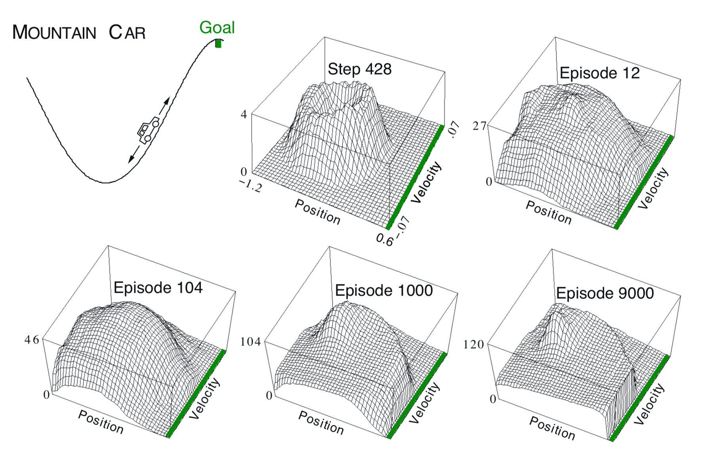

第10章 在策略控制近似方法
============================

在本章中，我们回到控制问题，现在使用动作-价值函数 :math:`\hat{q}(s,a,\mathbf{w})\approx q_{*}(s, a)` 的参数近似，
其中 :math:`\mathbf{w} \in \mathbb{R}^{d}` 是有限维权重向量。我们继续只关注在策略情况，将离策略方法留给第11章。
本章以半梯度Sarsa算法为特征，将半梯度TD(0)（最后一章）自然延伸到动作价值和策略控制。
在回合案例中，扩展是直截了当的，但在持续的情况下，我们必须向后退几步并重新审视我们如何使用折扣来定义最优策略。
令人惊讶的是，一旦我们有真正的函数近似，我们就必须放弃折扣并转而使用新的“差异”价值函数来控制问题的新“平均回报”表达式。

首先从回合案例开始，我们将上一章中提出的函数近似思想从状态值扩展到动作价值。
然后我们扩展它们以控制遵循策略GPI的一般模式，使用 :math:`\varepsilon` 贪婪进行动作选择。
我们在陡坡汽车问题上显示n步线性Sarsa的结果。然后我们转向持续的情况并对于具有不同价值的平均奖励案例重复开发这些想法。

10.1 回合半梯度控制
-----------------------

将第9章的半梯度预测方法扩展到动作价值是很简单的。在这种情况下，它是近似动作价值函数 :math:`\hat{q} \approx q_{\pi}`，
其表示为具有权重向量 :math:`\mathbf{w}` 的参数化函数形式。
而在我们考虑 :math:`S_{t} \mapsto U_{t}` 形式的随机训练示例之前，
现在我们考虑 :math:`S_{t}, A_{t} \mapsto U_{t}` 形式的例子。
更新目标 :math:`U_{t}` 可以是 :math:`q_{\pi}\left(S_{t}, A_{t}\right)` 的任何近似值，包括通常的备份值，
例如完整的蒙特卡罗回报（:math:`G_{t}`）或任何n步Sarsa回报（7.4）。动作价值预测的一般梯度下降更新是

.. math::

    \mathbf{w}_{t+1} \doteq \mathbf{w}_{t}+\alpha\left[U_{t}-\hat{q}\left(S_{t}, A_{t}, \mathbf{w}_{t}\right)\right] \nabla \hat{q}\left(S_{t}, A_{t}, \mathbf{w}_{t}\right)
    \tag{10.1}

例如，一步Sarsa方法的更新是

.. math::

    \mathbf{w}_{t+1} \doteq \mathbf{w}_{t}+\alpha\left[R_{t+1}+\gamma \hat{q}\left(S_{t+1}, A_{t+1}, \mathbf{w}_{t}\right)-\hat{q}\left(S_{t}, A_{t}, \mathbf{w}_{t}\right)\right] \nabla \hat{q}\left(S_{t}, A_{t}, \mathbf{w}_{t}\right)
    \tag{10.2}

我们将这种方法称为 *回合半梯度一步Sarsa*。对于常量策略，此方法以与TD(0)相同的方式收敛，
具有相同类型的误差边界（9.14）。

为了形成控制方法，我们需要将这些动作价值预测方法与策略改进和行动选择技术相结合。
适用于连续动作或来自大型离散集的动作的适当技术是正在进行的研究主题，但尚未明确解决。
另一方面，如果动作集是离散的并且不是太大，那么我们可以使用前面章节中已经开发的技术。
也就是说，对于当前状态 :math:`S_t` 中可用的每个可能动作，
我们可以计算 :math:`\hat{q}\left(S_{t}, a, \mathbf{w}_{t}\right)`，
然后找到贪婪动作 :math:`A_t^*=\arg\max _{a} \hat{q}(S_t,a,\mathbf{w}_{t-1})`。
然后通过将估计策略更改为贪婪策略（例如 :math:`\varepsilon` -贪婪策略）的软近似来完成策略改进
（在本章中处理的在策略案例中）。根据相同的策略选择动作。完整算法的伪代码于下框中给出。

.. admonition:: 回合半梯度Sarsa法估计 :math:`\hat{q} \approx q_*`
    :class: important

    输入：可微分的动作价值函数参数化 :math:`\hat{q} : \delta \times \mathcal{A} \times \mathbb{R}^{d} \rightarrow \mathbb{R}`

    算法参数：步长 :math:`\alpha>0`，小 :math:`\varepsilon>0`

    任意初始化价值函数权重 :math:`\mathbf{w} \in \mathbb{R}^{d}` （比如 :math:`\mathbf{w}=\mathbf{0}`）

    对每个回合循环：

        :math:`S, A \leftarrow` 初始回合状态和动作（比如 :math:`\varepsilon` -贪婪）

        对回合每一步循环：

            采取动作 :math:`A`，观察 :math:`R, S^{\prime}`

            如果 :math:`S^{\prime}` 不是终点：

                :math:`\mathbf{w} \leftarrow \mathbf{w}+\alpha[R-\hat{q}(S, A, \mathbf{w})] \nabla \hat{q}(S, A, \mathbf{w})`

                进入下一个回合

            选择 :math:`A^{\prime}` 作为 :math:`\hat{q}\left(S^{\prime}, \cdot, \mathbf{w}\right)` 的函数（比如 :math:`\varepsilon` -贪婪）

            :math:`\mathbf{w} \leftarrow \mathbf{w}+\alpha\left[R+\gamma \hat{q}\left(S^{\prime}, A^{\prime}, \mathbf{w}\right)-\hat{q}(S, A, \mathbf{w})\right] \nabla \hat{q}(S, A, \mathbf{w})`

            :math:`S \leftarrow S^{\prime}`

            :math:`A \leftarrow A^{\prime}`

**例10.1：陡坡汽车任务** 考虑如图10.1左上图所示，在陡峭的山路上驾驶动力不足的汽车的任务。
困难在于重力比汽车的发动机强，即使在全油门时，汽车也无法陡坡加速。
唯一的解决方案是首先远离目标并向左边相反的斜坡上移动。
然后，通过应用全油门，汽车可以建立足够的惯性，以便将其带到陡坡上，即使它在整个过程中减速。
这是一个连续控制任务的简单示例，在某种意义上，事物必须变得更糟（离目标更远）才能变得更好。
除非得到人类设计师的明确帮助，否则许多控制方法对于此类任务都有很大的困难。

    **图10.1：** 陡坡汽车任务（左上图）和一次运行中学习的成本函数 :math:`-\max _{a} \hat{q}(s, a, \mathbf{w})`。

这个问题的奖励在所有时步都是 :math:`-1`，直到汽车越过山顶的目标位置，结束了这一回合。
有三种可能的动作：全油门前进（:math:`+1`），全油门倒车（:math:`-1`）和零油门（:math:`0`）。
汽车根据简化的物理学运动。 它的位置 :math:`x_t` 和速度 :math:`\dot{x}_{t}`，由更新

.. math::

    \begin{array}{l}
    {x_{t+1} \doteq \text{bound}\left[x_{t}+\dot{x}_{t+1}\right]} \\
    {\dot{x}_{t+1} \doteq \text{bound}\left[\dot{x}_{t}+0.001 A_{t}-0.0025 \cos \left(3 x_{t}\right)\right]}
    \end{array}

其中 :math:`\text{bound}` 操作强制 :math:`-1.2 \leq x_{t+1} \leq 0.5`
和 :math:`-0.07 \leq \dot{x}_{t+1} \leq 0.07`。
另外，当 :math:`\dot{x}_{t+1}` 到达左边界时，:math:`\dot{x}_{t+1}` 被重置为零。
当它到达右边界时，达到了目标并且回合终止了。每回合从随机位置 :math:`x_{t} \in[-0.6,-0.4)` 和零速度开始。
为了将两个连续状态变量转换为二进制特征，我们使用了网格平铺，如图9.9所示。
我们使用8个铺片，每个铺片覆盖每个维度中有界距离的1/8，并且如第9.5.4节所述的非对称偏移 [1]_。
然后通过铺片编码创建的特征向量 :math:`\mathbf{x}(s, a)` 与线性组合，用于近似动作价值函数的参数向量：

.. math::

    \hat{q}(s, a, \mathbf{w}) \doteq \mathbf{w}^{\top} \mathbf{x}(s, a)=\sum_{i=1}^{d} w_{i} \cdot x_{i}(s, a)
    \tag{10.3}

对于每对状态 :math:`s` 和动作 :math:`a`。

图10.1显示了在学习使用这种形式的函数近似来解决此任务时通常会发生的情况 [2]_。
显示的是在单次运行中学习的价值函数（*成本（cost- to-go）* 函数）的负数。
初始动作值均为零，这是乐观的（在此任务中所有真值均为负值），即使探测参数 :math:`\varepsilon` 为0，也会导致进行大量探索。
这可以在中间的顶部面板中看到，图中标有“Step 428”。此时甚至没有一个回合完成，但是汽车在山谷中来回摆动，沿着状态空间的圆形轨迹。
所有经常访问的状态都比未开发状态更糟糕，因为实际的奖励比（不切实际的）预期更糟糕。
这会不断推动个体远离任何地方，探索新的状态，直到找到解决方案。

图10.2显示了此问题的半梯度Sarsa的几条学习曲线，具有不同的步长。

.. figure:: images/figure-10.2.png

    **图10.2：** 具有铺片编码函数近似和 :math:`\varepsilon` -贪婪动作选择的半梯度Sarsa方法的陡坡汽车任务学习曲线。

10.2 半梯度n步Sarsa
------------------------

10.3 平均奖励：持续任务的新问题设置
-------------------------------------

10.4 弃用折扣设置
--------------------

10.5 微分半梯度n步Sarsa
-----------------------------

10.6 总结
------------

书目和历史评论
---------------

.. [1]
    特别地，我们使用了铺片编码软件，可从http://incompleteideas.net/tiles/tiles3.html获得，
    其中 :math:`\text{int}=\operatorname{IHT}(4096)` 和
    :math:`\text{tiles}(\text{iht}, 8,[8*x/(0.5+1.2), 8*xdot/(0.07+0.07)], A)`
    得到状态 :math:`(x，xdot)` 和动作 :math:`A` 的特征向量中的索引。

.. [2]
    这个数据实际上来自“半梯度Sarsa(:math:`\lambda`)”算法，直到第12章我们都不会遇到，但是半梯度Sarsa的行为类似。
