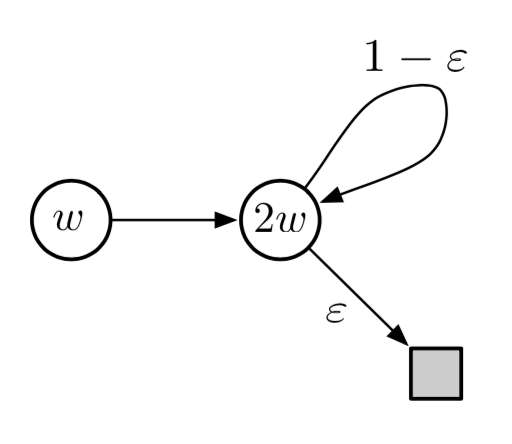
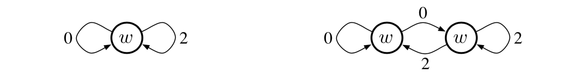
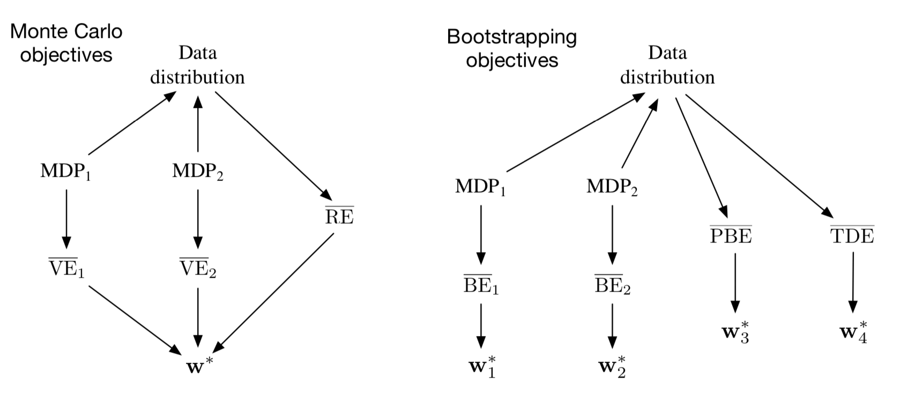

第11章 \*离策略近似方法
===============================================

自第5章以来，本书主要将处理在策略和离策略学习方法作为处理广义策略迭代学习形式中固有的利用与探索之间冲突的两种替代方法。
前面的两章已经用函数近似处理了在策略情况，在本章中我们用函数近似来处理离策略情况。
与在策略学习相比，函数近似的扩展与离策略学习相比显着不同且更难。
第6章和第7章中提出的表格式离策略方法很容易扩展到半梯度算法，但这些算法并没有像在策略训练下那样强大地收敛。
在本章中，我们将探讨收敛问题，仔细研究线性函数近似理论，引入可学性概念，然后讨论具有更强收敛性保证的新算法。
最后，我们将采用改进的方法，但理论结果不会像在策略学习那样强大，也不会像实验结果一样令人满意。
在此过程中，我们将更深入地了解强化学习中的近似值，以用于在策略学习和离策略学习。

回想一下，在离策略学习中，我们寻求学习 *目标策略* :math:`\pi` 的价值函数，给定数据由于不同的 *行为策略* :math:`b`。
在预测案例中，两个策略都是静态的并已知，我们试图学习状态价值 :math:`\hat{v} \approx v_{\pi}`
或动作值 :math:`\hat{q} \approx q_{\pi}`。
在控制案例中，学习动作价值，并且两种策略通常在学习过程中发生变化── :math:`\pi` 是关于 :math:`\hat{q}` 的贪婪策略，
而 :math:`b` 是更具探索性的东西，例如关于 :math:`\hat{q}` 的 :math:`\varepsilon` -贪婪策略。

离策略学习的挑战可以分为两部分，一部分出现在表格案例中，另一部分出现在函数近似中。
挑战的第一部分与更新的目标有关（不要与目标策略混淆），第二部分与更新的分布有关。
第5章和第7章中提出的与重要性采样相关的技术涉及第一部分；
这些可能会增加方差，但在所有成功的算法，不管是表格的还是近似的都需要。
这些技术在函数近似中的扩展将在本章的第一部分中快速讨论。

由于函数近似的离策略学习挑战的第二部分需要更多的东西，因为离策略情况下的更新分布不是根据在策略分布。
在策略分布对半梯度方法的稳定性很重要。已经探索了两种一般方法来解决这个问题。
一种是再次使用重要性抽样方法，这次将更新分布转回到在策略上的分布，以便保证半梯度方法收敛（在线性情况下）。
另一种是开发真正的梯度方法，不依赖于任何特殊的稳定性分布。
我们提出了基于这两种方法的方法。这是一个前沿的研究领域，目前尚不清楚这些方法中哪一个在实践中最有效。

11.1 半梯度方法
---------------

我们首先描述在前面的章节中为离策略案例开发的方法作为半梯度方法，如何容易地扩展到函数近似。
这些方法解决了离策略学习挑战的第一部分（更改更新目标），而不是第二部分（更改更新分布）。
因此，这些方法在某些情况下可能会发散，并且在这种意义上不是合理的，但它们仍然经常被成功使用。
请记住，对于表格情况，这些方法保证稳定且渐近无偏，这对应于函数近似的特殊情况。
因此，仍然可以将它们与特征选择方法相结合，使得组合系统可以保证稳定。无论如何，这些方法很简单，因此是一个很好的起点。

在第7章中，我们描述了各种表格式离策略算法。
为了将它们转换为半梯度形式，我们只需使用近似价值函数（:math:`\hat{v}` 或 :math:`\hat{q}`）
及其梯度将更新替换为数组（:math:`V` 或 :math:`Q`）以更新权重向量（:math:`\mathbf{w}`）。
其中许多的算法使用每步重要性采样率：

.. math::

    \rho_{t} \doteq \rho_{t : t}=\frac{\pi\left(A_{t} | S_{t}\right)}{b\left(A_{t} | S_{t}\right)}
    \tag{11.1}

例如，一步状态价值算法是半梯度离策略TD(0)，这与相应的在策略算法（第203页9.3节）类似，除了添加 :math:`\rho_t`：

.. math::

    \mathbf{w}_{t+1} \doteq \mathbf{w}_{t}+\alpha \rho_{t} \delta_{t} \nabla \hat{v}\left(S_{t}, \mathbf{w}_{t}\right)
    \tag{11.2}

其中 :math:`\rho_t` 的定义取决于问题是否是回合的和折扣的，还是使用平均奖励持续的和未折扣：

.. math::

    \delta_{t} \doteq R_{t+1}+\gamma \hat{v}\left(S_{t+1}, \mathbf{w}_{t}\right)-\hat{v}\left(S_{t}, \mathbf{w}_{t}\right), \text { 或者 }
    \tag{11.3}

.. math::

    \delta_{t} \doteq R_{t+1}-\overline{R}_{t}+\hat{v}\left(S_{t+1}, \mathbf{w}_{t}\right)-\hat{v}\left(S_{t}, \mathbf{w}_{t}\right)
    \tag{11.4}

对于动作价值，一步算法是半梯度预期Sarsa：

.. math::

    \begin{array}{l}
    {\mathbf{w}_{t+1} \doteq \mathbf{w}_{t}+\alpha \delta_{t} \nabla \hat{q}\left(S_{t}, A_{t}, \mathbf{w}_{t}\right), \text { 以及 }} \\
    {\delta_{t} \doteq R_{t+1}+\gamma \sum_{a} \pi\left(a | S_{t+1}\right) \hat{q}\left(S_{t+1}, a, \mathbf{w}_{t}\right)-\hat{q}\left(S_{t}, A_{t}, \mathbf{w}_{t}\right), \text { or } \quad \text { (回合的) }} \\
    {\delta_{t} \doteq R_{t+1}-\overline{R}_{t}+\sum_{a} \pi\left(a | S_{t+1}\right) \hat{q}\left(S_{t+1}, a, \mathbf{w}_{t}\right)-\hat{q}\left(S_{t}, A_{t}, \mathbf{w}_{t}\right) . \quad \text { (持续的) }}
    \end{array}

请注意，此算法不使用重要性采样。在表格情况下，很明显这是恰当的，因为唯一的示例动作是 :math:`A_t`，
在学习它的价值时，我们不必考虑任何其他动作。
对于函数近似，它不太清楚，因为一旦它们都对相同的整体近似有贡献，我们可能想要对不同的状态-动作对进行不同的加权。
正确解决这个问题等待对强化学习中函数近似理论的更透彻理解。

在这些算法的多步泛化中，状态价值和动作价值算法都涉及重要性采样。例如，半梯度Sarsa的n步版本是

.. math::

    \mathbf{w}_{t+n} \doteq \mathbf{w}_{t+n-1}+\alpha \rho_{t+1} \cdots \rho_{t+n-1}\left[G_{t : t+n}-\hat{q}\left(S_{t}, A_{t}, \mathbf{w}_{t+n-1}\right)\right] \nabla \hat{q}\left(S_{t}, A_{t}, \mathbf{w}_{t+n-1}\right)
    \tag{11.6}

以及

.. math::

    \begin{aligned}
    G_{t : t+n} &\doteq R_{t+1}+\cdots+\gamma^{n-1} R_{t+n}+\gamma^{n} \hat{q}\left(S_{t+n}, A_{t+n}, \mathbf{w}_{t+n-1}\right), \text { 或者 } &(\text { 持续的 })\\
    G_{t : t+n} &\doteq R_{t+1}-\overline{R}_{t}+\cdots+R_{t+n}-\overline{R}_{t+n-1}+\hat{q}\left(S_{t+n}, A_{t+n}, \mathbf{w}_{t+n-1}\right) &(\text { 持续的 })
    \end{aligned}

在这里，我们在处理回合的结尾时略显非正式。
在第一个等式中，:math:`k \geq T`（其中 :math:`T` 是该回合的最后一个时步）时
:math:`\rho_{k} \mathbf{S}` 应该取为1，
而如果 :math:`t+n \geq T`，:math:`G_{t:n}` 应该取 :math:`G_{t}`。

回想一下，我们在第7章中还提出了一种不涉及重要性采样的离策略算法：n步树备份算法。这是它的半梯度版本：

.. math::

    \mathbf{w}_{t+n} \doteq \mathbf{w}_{t+n-1}+\alpha\left[G_{t : t+n}-\hat{q}\left(S_{t}, A_{t}, \mathbf{w}_{t+n-1}\right)\right] \nabla \hat{q}\left(S_{t}, A_{t}, \mathbf{w}_{t+n-1}\right)
    \tag{11.7}

.. math::

    G_{t : t+n} \doteq \hat{q}\left(S_{t}, A_{t}, \mathbf{w}_{t-1}\right)+\sum_{k=t}^{t+n-1} \delta_{k} \prod_{i=t+1}^{k} \gamma \pi\left(A_{i} | S_{i}\right)
    \tag{11.8}

其中 :math:`\rho_t` 在本页顶部为预期的Sarsa定义。
我们还在第7章中定义了一种统一所有动作价值算法的算法：n步Q(:math:`\sigma`)。
我们保留该算法的半梯度形式，以及n步状态价值算法，作为读者的练习。

*练习11.1* 将n步离策略TD（7.9）的等式转换为半梯度形式。提供关于回合和持续情况的回报的附带定义。
*练习11.2* 将n步Q(:math:`\sigma`)（7.11和7.17）的方程转换为半梯度形式。给出涵盖情节和持续情况的定义。

11.2 离策略发散例子
--------------------

在本节中，我们将开始讨论使用函数近似的离策略学习挑战的第二部分──更新的分布与在策略上的分布不匹配。
我们描述了一些有针对性的离策略学习反例，即半梯度和其他简单算法不稳定和发散的情况。

为了建立直觉，最好先考虑一个非常简单的例子。假设，可能作为较大MDP的一部分，存在两个状态，
其估计价值是函数形式 :math:`w` 和 :math:`2w`，
其中参数矢量 :math:`\mathbf{w}` 仅由单个分量 :math:`w` 组成。
如果两个状态的特征向量都是简单数（单分量向量），在这种情况下为1和2，则在线性函数近似下发生这种情况。
在第一个状态中，只有一个动作可用，并且它在转移中确定性地导致第二个状态，奖励0：

.. image:: images/simple_MDP.png

其中两个圆圈内的表达式表示两个状态的值。

假设最初 :math:`w=10`，然后转变将从估计值10的状态变为估计值20的状态。
它将看起来像是良好的转变，并且将增加 :math:`w` 以提高第一状态的估计值。
如果 :math:`\gamma` 接近1，那么TD误差将接近10，并且，
如果 :math:`\alpha=0.1`，则在尝试减小TD误差时 :math:`w` 将增加到接近11。
然而，第二个状态的估计值也将增加到接近22。如果转移再次发生，那么它将从估计值 :math:`\approx 1` 的状态到
估计值 :math:`\approx 22` 的状态，TD误差为 :math:`\approx 11` ──比以前更大，而不是更小。
它看起来更像是第一个状态被低估了，它的价值将再次增加，这次是 :math:`\approx 12.1`。
这看起来很糟糕，事实上随着进一步的更新，:math:`w` 会发散到无穷大。

要明确地看到这一点，我们必须更仔细地查看更新顺序。两个状态之间转移的TD误差是

.. math::

    \delta_{t}=R_{t+1}+\gamma \hat{v}\left(S_{t+1}, \mathbf{w}_{t}\right)-\hat{v}\left(S_{t}, \mathbf{w}_{t}\right)=0+\gamma 2 w_{t}-w_{t}=(2 \gamma-1) w_{t}

并且离策略半梯度TD(0)更新（来自（11.2））是

.. math::

    w_{t+1}=w_{t}+\alpha \rho_{t} \delta_{t} \nabla \hat{v}\left(S_{t}, w_{t}\right)=w_{t}+\alpha \cdot 1 \cdot(2 \gamma-1) w_{t} \cdot 1=(1+\alpha(2 \gamma-1)) w_{t}

请注意，重要抽样比率 :math:`\rho_{t}` 在此转移时为1，因为第一个状态只有一个可用的操作，
因此其在目标和行为策略下的概率必须均为1。在上面的最后更新中，新参数是旧参数乘以标量常量 :math:`1+\alpha(2 \gamma-1)`。
如果此常数大于1，则系统不稳定，:math:`w` 将根据其初始值转为正或负无穷大。
每当 :math:`\gamma>0.5` 时，此常数大于1。请注意，稳定性不依赖于特定的步长，只要 :math:`\alpha>0`。
较小或较大的步长会影响 :math:`w` 变为无穷大时的速率，但不会影响它是否存在。

此示例的关键是一次转移重复发生，而 :math:`w` 不会在其他转移上更新。
这可以在离策略训练下进行，因为行为策略可能会选择针对目标策略永远不会进行的其他转移的操作。
对于这些转移，:math:`\rho_{t}` 将为零，不会进行更新。然而，在在策略训练下，:math:`\rho_{t}` 总是一。
每次从 :math:`w` 状态转移到 :math:`2w` 状态，增加 :math:`w` 时，也必须从 :math:`2w` 状态转移出来。
这种转变将减少 :math:`w`，除非它是一个价值高于（因为 :math:`\gamma=1`） :math:`2w` 的状态，
然后该状态必须接着一个更高价值的状态，否则 :math:`w` 将会再次减少。
每个状态只有通过创造更高的期望才能支持这个状态。最终费用必须承担（Eventually the piper must be paid）。
在在策略情况中，必须保留未来奖励的承诺，并对系统进行控制。
但是在离策略情况中，可以做出承诺，然后在采取行动后，目标策略永远不会，忘记和原谅。

这个简单的例子说明了离策略训练可能导致发散的大部分原因，但它并不完全令人信服，因为它不完整──它只是完整MDP的一个片段。
真的有一个完整的系统不稳定吗？发散的一个简单完整的例子是 *Baird的反例*。考虑图11.1中所示的回合七状态两动作MDP。
**虚线** 动作使系统以相同的概率进入六个上边状态中的一个，而 **实线** 动作将系统带到第七个状态。
行为策略 :math:`b` 以概率 :math:`\frac{6}{7}` 和 :math:`\frac{1}{7}` 选择虚线和实线动作，
使得其下的下一状态分布是均匀的（对于所有非终结状态相同），这也是每回合的起始分布。
目标政策 :math:`\pi` 总是采取实线的行动，因此在策略的分布（对于 :math:`\pi`）集中在第七个状态。
所有转移的奖励都是零。折扣率 :math:`\gamma=0.99`。

.. figure:: images/figure-11.1.png

    **图11.1：** Baird的反例。该马尔可夫过程的近似状态价值函数具有每个状态内的线性表达式所示的形式。
    **实线** 动作通常导致第七状态，并且 **虚线** 动作通常导致其他六个状态中的一个，每个状态具有相等的概率。奖励总是零。

考虑估计由每个状态圆中所示的表达式指示的线性参数化下的状态值。
例如，最左边状态的估计值是 :math:`2 w_{1}+w_{8}`，
其中下标对应于总权重向量 :math:`\mathbf{w} \in \mathbb{R}^{8}` 的分量；
这对应于第一状态的特征向量是 :math:`\mathbf{x}(1)=(2,0,0,0,0,0,0,1)^{\top}`。
所有转移的奖励为零，因此对于所有 :math:`s`，真值函数是 :math:`v_{\pi}(s)=0`，
如果 :math:`\mathbf{w}=\mathbf{0}`，则可以精确近似。
事实上，有许多解决方案，因为有更多的分量权重向量（8）比非终止状态（7）。
此外，该组特征向量的集合 :math:`\{\mathbf{x}(s) : s \in \mathcal{S}\}` 是线性独立。
在所有这些方面，该任务似乎是线性函数近似的有利情况。

如果我们将半梯度TD(0)应用于此问题（11.2），则权重会发散到无穷大，如图11.2（左）所示。
任何正步长都会出现不稳定性，无论多小。
事实上，如果在动态规划（DP）中完成预期的更新，甚至会发生这种情况，如图11.2（右）所示。
也就是说，如果使用DP（基于期望的）目标，以半梯度方式同时为所有状态更新权重向量 :math:`\mathbf{w}_{k}`：

.. math::

    \mathbf{w}_{k+1} \doteq \mathbf{w}_{k}+\frac{\alpha}{|\mathcal{S}|} \sum_{s}\left(\mathbb{E}_{\pi}\left[R_{t+1}+\gamma \hat{v}\left(S_{t+1}, \mathbf{w}_{k}\right) | S_{t}=s\right]-\hat{v}\left(s, \mathbf{w}_{k}\right)\right) \nabla \hat{v}\left(s, \mathbf{w}_{k}\right)
    \tag{11.9}

在这种情况下，没有随机性，也没有异步，就像在传统的DP更新中一样。
除了使用半梯度函数近似之外，该方法是常规的。但系统仍然不稳定。

.. figure:: images/figure-11.2.png

    **图11.2：** Baird反例的不稳定性证明。示出了两个半梯度算法的参数矢量 :math:`\mathbf{w}` 的分量的演变。
    步长为 :math:`\alpha=0.01`，初始重量为 :math:`\mathbf{w}=(1,1,1,1,1,1,10,1)^{\top}`。

如果我们只改变Baird反例中DP更新的分布，从均匀分布到在策略分布（通常需要异步更新），那么收敛就保证了一个误差受限于（9.14）的解决方案。
这个例子很引人注目，因为所使用的TD和DP方法可以说是最简单和最好理解的自举方法，所使用的线性，半梯度方法可以说是最简单和最容易理解的函数近似。
该示例表明，如果不根据策略分布进行更新，即使最简单的自举和函数近似组合也可能不稳定。

还有一些类似于Baird的反例，显示出Q-learning的发散。这引起关注，因为不然的话Q-learning具有所有控制方法的最佳收敛保证。
相当多的努力已经尝试找到解决这个问题的方法，或者获得一些较弱但仍然可行的保证。
例如，只要行为策略足够接近目标策略，例如，当它是 :math:`\varepsilon` -贪婪策略时，就有可能保证Q-learning的收敛。
据我们所知，在这种情况下，Q-learning从来没有发现过发散，但是没有理论分析。在本节的其余部分，我们提出了其他一些已被探索过的想法。

假设在Baird的反例中，我们实际上将价值函数一直改为最佳的最小二乘近似，而不是在每次迭代中只朝着预期的一步回报迈出一步。
这会解决不稳定问题吗？当然，如果特征向量 :math:`\{\mathbf{x}(s) : s \in \mathcal{S}\}` 形成一个线性独立的集合，
就像在Baird的反例中那样，因为那样在每次迭代时都可以进行精确逼近，并且该方法简化为标准的表格DP 。
但当然，这里的重点是考虑 *无法* 获得精确解决方案的情况。在这种情况下，即使在每次迭代时形成最佳近似值，也不能保证稳定性，如示例所示。

**例11.1：Tsitsiklis和Van Roy的反例** 这个例子表明，即使在每一步找到最小二乘解，线性函数近似也不适用于DP。
通过将 :math:`w \text{-to-} 2w` 示例（来自本节前面部分）扩展为具有终止状态来形成反例，如右图所示。
如前所述，第一状态的估计值是 :math:`w`，第二状态的估计值是 :math:`2w`。
所有转换的奖励为零，因此两个状态的真值均为零，:math:`w=0` 时可以正确表示。
如果我们在每一步设置 :math:`w_{k+1}`，
以便最小化估计值与预期的一步回报之间的 :math:`\overline{\mathrm{VE}}`，然后我们有

.. math::

    \begin{aligned}
    w_{k+1} &=\underset{w \in \mathbb{R}}{\arg\min} \sum_{s \in \mathcal{S}}\left(\hat{v}(s, w)-\mathbb{E}_{\pi}\left[R_{t+1}+\gamma \hat{v}\left(S_{t+1}, w_{k}\right) | S_{t}=s\right]\right)^{2} \\
    &=\underset{w \in \mathbb{R}}{\arg\min}\left(w-\gamma 2 w_{k}\right)^{2}+\left(2 w-(1-\varepsilon) \gamma 2 w_{k}\right)^{2} \\
    &=\frac{6-4 \varepsilon}{5} \gamma w_{k} & \text{(11.10)}
    \end{aligned}

当 :math:`\gamma>\frac{5}{6-4 \varepsilon}` 和 :math:`w_{0} \neq 0` 时
序列 :math:`\left\{w_{k}\right\}` 收敛。

另一种尝试防止不稳定的方法是使用特殊方法进行函数近似。
特别是，对于不从观察到的目标推断的函数近似方法，保证了稳定性。
这些方法称为 *平均器（averagers）*，包括最近邻方法和局部加权回归，但不是流行的方法，如铺片编码和人工神经网络（ANN）。

*练习11.3（编程）* 将一步半梯度Q-learning应用于Baird的反例，并凭经验证明其权重不同。

11.3 致命的三元组
------------------

到目前为止，我们的讨论可以总结为，只要我们将以下三个要素结合起来，构成我们称之为 *致命的三元组*，就会产生不稳定和分歧的危险：

**函数近似** 从比内存和计算资源（例如，线性函数近似或ANN）大得多的状态空间泛化的强大和可扩展的方式。

**自举** 更新目标包括现有估计（如动态编程或TD方法），而不是完全依赖实际奖励和完整回报（如MC方法）。

**离策略训练** 除了目标策略产生的转移分布之外的训练。扫描状态空间并统一更新所有状态，如动态规划，
不遵循目标策略，是离策略训练的一个例子。

特别要注意的是，危险 *不是* 由于控制或广义策略迭代造成的。
这些案例的分析比较复杂，但只要包含致命三元组的所有三个要素，就会在更简单的预测案例中产生不稳定性。
危险也 *不是* 由于学习或对环境的不确定性造成的，因为它在规划方法中同样强烈地发生，例如动态规划，其中环境是完全已知的。

如果存在致命三元组的任何两个元素，但不是全部三个元素，则可以避免不稳定。
那么，检查三者来看是否有任何可以放弃的东西是很自然的。

在这三者中，*函数近似* 最明显不能放弃。我们需要能够扩展到大问题和极具表现力的方法。
我们至少需要具有许多特征和参数的线性函数近似。
状态聚合或非参数方法的复杂性随着数据的增长而变得太弱或太昂贵。
诸如LSTD的最小二乘法具有二次复杂性，因此对于大问题而言太昂贵。

在没有 *自举* 的情况下，可以以计算和数据效率为代价。也许最重要的是计算效率的损失。
蒙特卡罗（非自举）方法需要内存来保存在进行每次预测和获得最终返回之间发生的所有结果，并且一旦获得最终返回就完成所有计算。
这些计算问题的成本在串行冯·诺依曼计算机上并不明显，但是在专用硬件上明显。
使用自举和资格迹（第12章），可以在生成数据的时间和地点处理数据，然后再也不需要再使用。
通过自举实现的通信和内存节省是非常好的。

放弃 *自举* 对数据效率的损失也很大。我们已经反复看到过这种情况，例如第7章（图7.2）和第9章（图9.2），
其中某些程度的自举比随机行走预测任务上的蒙特卡罗方法表现要好得多，
而在第10章中，相同的是在陡坡汽车控制任务中看到（图10.4）。
许多其他问题表明使用自举更快地学习（例如，见图12.14）。
自举通常会导致更快的学习，因为它允许学习利用状态属性，即在返回状态时识别状态的能力。
另一方面，自举可能会削弱对状态表示不佳的问题的学习并导致泛化效果差。
（例如，俄罗斯方块似乎就是这种情况，参见Şim̧sek，Alg orta和Kothiyal，2016）。
不佳的状态表示也可能导致偏差；这就是自举方法渐近近似质量较差的原因（公式9.14）。
总的来说，自举能力必须被认为是非常有价值的。
有时可能会选择不使用它而选择长n步更新（或大的自举参数，:math:`\lambda \approx 1`；参见第12章），但通常自举会大大提高效率。
这是我们非常希望保留在我们的工具包中的能力。

最后，是 *离策略学习*；我们可以放弃吗？在策略方法通常是充足的。
对于不基于模型的强化学习，人们可以简单地使用Sarsa而不是Q-learning。
离策略方法从目标策略中释放行为。这可以被认为是一种吸引人的便利，但不是必需的。
但是，离策略学习对于其他预期的用例至关重要，我们在本书中尚未提及但可能对创建强大智能个体的更大目标很重要。

在这些用例中，个体不仅学习单个价值函数和单个策略，而且并行学习大量这些数据。
有广泛的心理证据表明人和动物学会预测许多不同的感官事件，而不仅仅是奖励。
我们可以对不寻常的事件感到惊讶，并纠正我们对它们的预测，即使它们具有中性效价（既不好也不坏）。
这种预测可能是世界预测模型的基础，例如用于规划的模型。
我们预测在转动眼球后我们会看到什么，走回家需要多长时间，在篮球中跳投的可能性，以及我们从承担新项目中获得的满足感。
在所有这些情况下，我们想要预测的事件取决于我们以某种方式行事。要同时学习它们，需要从一种经验中学习。
有许多目标策略，因此一种行为策略不能与所有策略相等。
然而，并行学习在概念上是可能的，因为行为策略可能部分地与许多目标策略重叠。要充分利用这一点，需要进行离策略学习。

11.4 线性价值函数几何
-----------------------

为了更好地理解离策略学习的稳定性挑战，有必要更加抽象思考价值函数近似，以及学习是如何独立地完成的。
我们可以想象所有可能的状态价值函数的空间──从状态到实数的所有函数 :math:`v:\mathcal{S}\rightarrow\mathbb{R}`。
这些价值函数中的大多数都与任何策略都不对应。对我们来说更重要的是大多数都不能用函数近似器表示，它在设计上的参数远远少于状态。

给定状态空间的枚举 :math:`\mathcal{S}=\{s_{1}, s_{2}, \ldots, s_{|\mathcal{S}|}\}`，
任何值函数 :math:`v` 对应于按顺序列出每个状态的价值的向量
:math:`\left[v(s_{1}), v(s_{2}), \ldots, v(s_{|S|})\right]^{\top}`。
价值函数的这个向量表示具有与状态一样多的分量。在我们想要使用函数近似的大多数情况下，这将是太多的分量来明确地表示向量。
然而，这个向量的想法在概念上是有用的。在下文中，我们可以互换地处理价值函数及其向量表示。

为了发展直觉，考虑具有三个状态 :math:`\mathcal{S}=\left\{s_{1}, s_{2}, s_{3}\right\}`
和两个参数 :math:`\mathbf{w}=\left(w_{1}, w_{2}\right)^{\top}` 的情况。
然后，我们可以将所有价值函数/向量视为三维空间中的点。参数在二维子空间上提供替代坐标系。
任何权重向量 :math:`\mathbf{w}=\left(w_{1}, w_{2}\right)^{\top}` 是二维子空间中的点，
因此也是将值分配给所有三个状态的完整价值函数 :math:`v_{\mathbf{w}}`。
对于一般函数近似，可表示函数的全空间和子空间之间的关系可能很复杂，
但在 *线性* 价值-函数近似的情况下，子空间是一个简单的平面，如图11.3所示。

.. figure:: images/figure-11.3.png

    **图11.3：** 线性价值-函数近似几何。展示了三个状态上的所有价值函数的三维空间，而显示为平面的是所有价值函数的子空间，
    其可由具有参数 :math:`\mathbf{w}=\left(w_{1}, w_{2}\right)^{\top}` 的线性函数近似表示。
    真值函数 :math:`v_\pi` 在较大的空间中，
    可以向下投影（在子空间中，使用投影算子 :math:`\Pi`）到价值误差（VE）意义上的最佳近似值。
    Bellman误差（BE），投影Bellman误差（PBE）和时序差分误差（TDE）意义的最佳近似值都可能不同，并在右下方显示。
    （VE，BE和PBE都被视为该图中的相应向量。）Bellman算子将平面中的价值函数带到一个外部，然后可以将其投射回去。
    如果你在空间外迭代地应用Bellman算子（如上面的灰色所示），你将获得真值函数，就像在传统的动态规划中一样。
    相反，如果你在每个步骤中保持投射回子空间，如灰色所示的下部步骤，则不动点将是向量零PBE的点。

现在考虑一个单一的固定策略 :math:`\pi`。我们假设它的真值函数 :math:`v_\pi` 太复杂而不能完全表示为近似值。
因此 :math:`v_\pi` 不在子空间中；在图中，它被描绘为在可表示函数的平面子空间之上。

如果 :math:`v_\pi` 无法准确表示，那么最接近它的可表示的价值函数是什么？这是一个含有多个答案的微妙问题。
首先，我们需要测量两个价值函数之间的距离。给定两个值函数 :math:`v_1` 和 :math:`v_2`，
我们可以讨论它们之间的向量差 :math:`v=v_1-v_2`。如果 :math:`v` 很小，则两个价值函数彼此接近。
但是我们如何衡量这种差向量的大小呢？传统的欧几里德范数是不合适的，因为如9.2节所述，
某些状态比其他状态更重要，因为它们更频繁地发生或者因为我们对它们更感兴趣（第9.11节）。
如第9.2节所述，让我们使用分布 :math:`\mu : \mathcal{S} \rightarrow[0,1]`
指定我们关心不同状态被准确估价的程度（通常被视为在策略上的分布）。然后我们可以使用范数定义价值函数之间的距离

.. math::

    \|v\|_{\mu}^{2} \doteq \sum_{s \in \mathcal{S}} \mu(s) v(s)^{2}
    \tag{11.11}

请注意，9.2节中的 :math:`\overline{\mathrm{VE}}` 可以简单地使用此范数表示，
因为 :math:`\overline{\mathrm{VE}}(\mathbf{w})=\left\|v_{\mathbf{w}}-v_{\pi}\right\|_{\mu}^{2}`。
对于任何价值函数 :math:`v`，在可表示价值函数的子空间中找到其最接近的价值函数的操作是投影操作。
我们定义一个投影算子 :math:`\Pi`，它将任意价值函数带到我们范数中最接近的可表示函数：

.. math::

    \Pi v \doteq v_{\mathbf{w}} \quad \text { 其中 } \quad \mathbf{w}=\underset{\mathbf{w} \in \mathbb{R}^{d}}{\arg\min}\left\|v-v_{\mathbf{w}}\right\|_{\mu}^{2}
    \tag{11.12}

因此，最接近真值函数 :math:`v_\pi` 的可表示价值函数是其投影 :math:`\Pi_{v_\pi}`，如图11.3所示。
这是蒙特卡罗方法渐近发现的解决方案，尽管通常非常缓慢。投影操作将在下面的框中更全面地讨论。

.. admonition:: 投影矩阵
    :class: note

    对于线性函数近似器，投影操作是线性的，这意味着它可以表示为 :math:`|\mathcal{S}|\times|\mathcal{S}|` 矩阵：

    .. math::

        \Pi \doteq \mathbf{X}\left(\mathbf{X}^{\top} \mathbf{D} \mathbf{X}\right)^{-1} \mathbf{X}^{\top} \mathbf{D}
        \tag{11.14}

    其中，如9.4节所示，:math:`\mathbf{D}` 表示 :math:`|\mathcal{S}|\times|\mathcal{S}|` 对角线矩阵，:math:`\mu(s)` 在对角线上，
    :math:`\mathbf{X}` 表示 :math:`|\mathcal{S}|\times d` 矩阵，其行是特征向量 :math:`\mathbf{x}(s)^{\top}`，每个状态 :math:`s` 有一个。
    如果（11.14）中的逆不存在，则替换伪逆。使用这些矩阵，可以写出向量的平方范数

    .. math::

        \|v\|_{\mu}^{2}=v^{\top} \mathbf{D} v
        \tag{11.15}

    并且可以写出近似线性价值函数

    .. math::

        v_{\mathbf{w}}=\mathbf{X} \mathbf{w}
        \tag{11.16}

TD方法找到不同的解决方案。为了理解它们的基本原理，请回想一下价值函数 :math:`v_\pi` 的Bellman方程

.. math::

    v_{\pi}(s)=\sum_{a} \pi(a | s) \sum_{s^{\prime}, r} p\left(s^{\prime}, r | s, a\right)\left[r+\gamma v_{\pi}\left(s^{\prime}\right)\right], \quad \text { 对所有 } s \in \mathcal{S}
    \tag{11.13}

真值函数 :math:`v_\pi` 是唯一能够精确求解（11.13）的价值函数。
如果用近似价值函数 :math:`v_{\mathbf{w}}` 代替 :math:`v_\pi`，
则修改的方程的右侧和左侧之间的差可以用作 :math:`v_{\mathbf{w}}` 与 :math:`v_\pi` 的距离的度量。
我们称之为状态 :math:`s` 的 *Bellman误差*：

.. math::

    \begin{aligned}
    \overline{\delta}_{\mathbf{w}}(s) & \doteq\left(\sum_{a} \pi(a | s) \sum_{s^{\prime}, r} p\left(s^{\prime}, r | s, a\right)\left[r+\gamma v_{\mathbf{w}}\left(s^{\prime}\right)\right]\right)-v_{\mathbf{w}}(s) & \text{(11.17)} \\
    &=\mathbb{E}_{\pi}\left[R_{t+1}+\gamma v_{\mathbf{w}}\left(S_{t+1}\right)-v_{\mathbf{w}}\left(S_{t}\right) | S_{t}=s, A_{t} \sim \pi\right] & \text{(11.18)}
    \end{aligned}

这清楚地表明了Bellman误差与TD误差的关系（11.3）。Bellman误差是TD误差的期望。

在所有状态下，所有Bellman误差的向量
:math:`\overline{\delta}_{\mathbf{w}} \in \mathbb{R}^{|\mathcal{S}|}`
被称为 *Bellman误差向量* （在图11.3中显示为BE）。
这个向量的总体大小，在范数中，是价值函数中误差的总体度量，称为 *均方Bellman误差*：

.. math::

    \overline{\mathrm{BE}}(\mathbf{w})=\left\|\overline{\delta}_{\mathbf{w}}\right\|_{\mu}^{2}
    \tag{11.19}

通常不可能将 :math:`\overline{\mathrm{BE}}` 减小到零（此时 :math:`v_{\mathbf{w}}=v_\pi`），
但是对于线性函数近似，存在 :math:`\mathbf{w}` 的唯一值，:math:`\overline{\mathrm{BE}}` 被最小化。
可表示函数子空间中的这一点（图11.3中标记为 :math:`\min \overline{\mathrm{BE}}`）
与通常最小化 :math:`\overline{\mathrm{VE}}` （显示为 :math:`\Pi v_{\pi}`）的点不同。
寻求最小化 :math:`\overline{\mathrm{BE}}` 的方法将在接下来的两节中讨论。

Bellman误差向量如图11.3所示，作为应用 *Bellman算子*
:math:`B_{\pi}:\mathbb{R}^{|\mathcal{S}|}\rightarrow\mathbb{R}^{|\mathcal{S}|}`
到近似价值函数的结果。Bellman算子的定义是

.. math::

    \left(B_{\pi} v\right)(s) \doteq \sum_{a} \pi(a | s) \sum_{s^{\prime}, r} p\left(s^{\prime}, r | s, a\right)\left[r+\gamma v\left(s^{\prime}\right)\right]
    \tag{11.20}

对于所有 :math:`s\in\mathcal{S}` 和 :math:`v:\mathcal{S} \rightarrow \mathbb{R}`。
:math:`v` 的Bellman误差向量可以写成
:math:`\overline{\delta}_{\mathbf{w}}=B_{\pi} v_{\mathbf{w}}-v_{\mathbf{w}}`。

如果Bellman算子应用于可表示子空间中的价值函数，则通常会产生一个位于子空间之外的新价值函数，如图所示。
在动态规划中（没有函数近似），该算子被重复应用于可表示空间之外的点，如图11.3顶部的灰色箭头所示。
最终，该过程收敛于真值函数 :math:`v_\pi`，这是Bellman算子唯一的不动点，是唯一的价值函数

.. math::

    v_{\pi}=B_{\pi} v_{\pi}
    \tag{11.21}

这只是 :math:`\pi` （11.13）的Bellman方程的另一种写法。

然而，利用函数近似，不能表示位于子空间之外的中间价值函数。
无法遵循图11.3上半部分中的灰色箭头，因为在第一次更新（暗线）之后，必须将价值函数投影回可表示的内容。
然后，下一次迭代在子空间内开始；Bellman算子再次在子空间之外取价值函数，然后由投影算子映射回来，如图中下半部分灰色箭头和线所示。
在这些箭头之后是具有近似的类似DP的过程。

在这种情况下，我们感兴趣的是将Bellman误差向量投影回可表示的空间。
这是投影的Bellman误差向量 :math:`\Pi \overline{\delta}_{v_{\mathbf{w}}}`，如图11.3所示为PBE。
在正常情况下，该向量的大小是近似价值函数中的另一个误差度量。对于任何近似价值函数 :math:`v`，
我们定义 *均方投影Bellman误差*，表示为 :math:`\overline{\mathrm{PBE}}` 如下

.. math::

    \overline{\mathrm{PBE}}(\mathbf{w})=\left\|\Pi \overline{\delta}_{\mathbf{w}}\right\|_{\mu}^{2}
    \tag{11.22}

对于线性函数近似，总是存在具有零 :math:`\overline{\mathrm{PBE}}` 的近似价值函数（在子空间内）；
这是第9.4节中介绍的TD的不动点 :math:`\mathbf{w}_{TD}`。
正如我们所看到的，在半梯度TD方法和离策略训练下，这一点并不总是稳定的。
如图所示，该价值函数通常不同于最小化 :math:`\overline{\mathrm{VE}}`
或 :math:`\overline{\mathrm{BE}}` 的函数。
保证收敛于它的方法在第11.7节和第11.8节中讨论。

11.5 Bellman误差中的梯度下降
------------------------------

通过更好地理解价值函数近似及其各种目标，我们现在回到了离策略学习的稳定性挑战。
我们希望应用随机梯度下降（SGD，第9.3节）的方法，其中依据期望等于目标函数的负梯度进行更新。
这些方法总是在目标中下坡（期望），因此通常具有优异的收敛特性。
在本书到目前为止研究的算法中，只有蒙特卡罗方法才是真正的SGD方法。
这些方法在在策略和离策略训练以及一般非线性（可微分）函数近似器之间健壮地收敛，
尽管它们通常比不是SGD方法的具有自举的半梯度方法慢。
正如我们在本章前面所见，半梯度方法可能在离政策训练中，
以及在非线性函数近似的设计案例（Tsitsiklis和Van Roy，1997）中偏离。
使用真正的SGD方法，这种偏离是不可能的。

SGD的吸引力是如此之大，以至于已经付出了巨大的努力来寻找一种利用它进行强化学习的实用方法。
所有这些努力的起点是选择要优化的误差或目标函数。
在本节和下一节中，我们将探讨最受欢迎的目标函数的起源和局限，它基于上一节中介绍的 *Bellman误差*。
虽然这是一种流行且有影响力的方法，但我们在这里得出的结论是它是一个失误并且没有产生好的学习算法。
另一方面，这种方法以一种有趣的方式失败，提供了可能构成一种好方法的洞察力。

首先，让我们考虑不是Bellman错误，而是更直接和天真的东西。时序差分学习由TD误差驱动。
为什么不将TD误差的预期平方最小化作为目标？在一般函数近似的情况下，带折扣的一步TD误差是

.. math::

    \delta_{t}=R_{t+1}+\gamma \hat{v}\left(S_{t+1}, \mathbf{w}_{t}\right)-\hat{v}\left(S_{t}, \mathbf{w}_{t}\right)

那么一个可能的目标函数是人们可能称之为 *均方TD误差*：

.. math::

    \begin{aligned}
    \overline{\operatorname{TDE}}(\mathbf{w}) &=\sum_{s \in \mathcal{S}} \mu(s) \mathbb{E}\left[\delta_{t}^{2} | S_{t}=s, A_{t} \sim \pi\right] \\
    &=\sum_{s \in \mathcal{S}} \mu(s) \mathbb{E}\left[\rho_{t} \delta_{t}^{2} | S_{t}=s, A_{t} \sim b\right] \\
    &=\mathbb{E}_{b}\left[\rho_{t} \delta_{t}^{2}\right] & \text{(如果} \mu \text{是} b \text{下遇到的分布)}
    \end{aligned}

最后一个等式是SGD所需的形式；它将目标作为可以从经验中抽样的期望（记住经验是由于行为策略 :math:`b`）。
因此，遵循标准SGD方法，可以基于此预期值的样本推导出每步更新：

.. math::

    \begin{aligned}
    \mathbf{w}_{t+1} &=\mathbf{w}_{t}-\frac{1}{2} \alpha \nabla\left(\rho_{t} \delta_{t}^{2}\right) \\
    &=\mathbf{w}_{t}-\alpha \rho_{t} \delta_{t} \nabla \delta_{t} \\
    &=\mathbf{w}_{t}+\alpha \rho_{t} \delta_{t}\left(\nabla \hat{v}\left(S_{t}, \mathbf{w}_{t}\right)-\gamma \nabla \hat{v}\left(S_{t+1}, \mathbf{w}_{t}\right)\right)
    \end{aligned}

你将认识到与半梯度TD算法（11.2）相同，除了额外的最终项。
该项完成了梯度，使其成为真正的SGD算法，具有出色的收敛保证。
让我们称这个算法为 *朴素残差梯度* 算法（在Baird，1995之后）。
尽管朴素残差梯度算法健壮地收敛，但它不一定会收敛到理想的位置。

.. admonition:: 例11.2：A分裂示例，显示了朴素残差梯度算法的天真
    :class: note

    .. figure:: images/example-11.2.png
        :width: 250px
        :align: right

    考虑右侧所示的三态情景MRP。回合从状态 **A** 开始，然后随机“分裂”，
    一半时间到达 **B** （然后总是以奖励1结束）和一半时间进入状态 **C** （然后总是以零奖励结束）。
    **A** 中的第一次转移的奖励总是为零，无论回合如何。由于这是一个回合问题，我们可以认为 :math:`\gamma` 是1。
    我们还假设在在策略上进行训练，因此 :math:`\rho_t` 总是1，并且使用表格函数近似，
    因此学习算法可以自由地给所有三个状态提供任意的，独立的价值。因此，这应该是一个容易的问题。

    这些价值应该是什么？从 **A** 开始，一半的时间回报是1，一半的时间回报是0；**A** 应该具有值 :math:`\frac{1}{2}`。
    从 **B** 开始，回报始终为1，因此其值应为1，类似于 **C**，回报始终为0，因此其值应为0。
    这些是真值，因为这是一个表格问题，所有方法都呈现以前完全收敛于他们。

    然而，朴素残差梯度算法找到 **B** 和 **C** 的不同值。
    它收敛于值为 :math:`\frac{3}{4}` 的B和值为 :math:`\frac{1}{4}` 的C（A正确收敛到 :math:`\frac{1}{2}`）。
    事实上，这些是最小化 :math:`\overline{\mathrm{TDE}}` 的值。

    让我们计算这些值的 :math:`\overline{\mathrm{TDE}}`。
    每回合的第一次转移是向上从 **A** 的 :math:`\frac{1}{2}` 到 **B** 的 :math:`\frac{3}{4}`，变化为 :math:`\frac{1}{4}`，
    或向下从 **A** 的  :math:`\frac{1}{2}` 到 **C** 的 :math:`\frac{1}{4}`，变化为 :math:`-\frac{1}{4}`。
    因为在这些转移上奖励为零，并且 :math:`\gamma=1`，所以这些改变 *是* TD误差，因此在第一次转移时平方TD误差始终为 :math:`\frac{1}{16}`。
    第二次转移是类似的；它要么从 **B** 的 :math:`\frac{3}{4}` 升到1的奖励（终止状态值0），
    或从 **C** 的 :math:`\frac{1}{4}` 下降到0的奖励（同样具有值0的终端状态）。
    因此，TD误差总是 :math:`\pm\frac{1}{4}`，第二步的平方误差为 :math:`\frac{1}{16}`。
    因此，对于这组值，两个步骤的TDE均为 :math:`\frac{1}{16}`。

    现在让我们计算真实值的 :math:`\overline{\mathrm{TDE}}` （**B** 为1，**C** 为0，**A** 为1）。
    在这种情况下，第一次转移是从 :math:`\frac{1}{2}` 到在 **B** 的1，，或从 :math:`\frac{1}{2}` 到在 **C** 的0；
    在任何一种情况下，绝对误差为 :math:`\frac{1}{2}`，平方误差为 :math:`\frac{1}{4}`。
    第二个转移的误差为零，因为起始值（1或0取决于转移是来自 **B** 还是 **C**）始终与立即奖励和回报完全匹配。
    因此，平方TD误差在第一次转移时为 :math:`\frac{1}{4}`，在第二次转移时为0，对于两次转移为 :math:`\frac{1}{8}` 的平均奖励。
    由于 :math:`\frac{1}{8}` 大于 :math:`\frac{1}{16}`，根据 :math:`\overline{\mathrm{TDE}}`，这种解决方案更糟糕。
    在这个简单的问题上，真值没有最小的 :math:`\overline{\mathrm{TDE}}`。

在A分裂示例中使用表格表示，因此可以精确地表示真实状态值，但是朴素残差梯度算法找到不同的值，
并且这些值具有比真实值更低的 :math:`\overline{\mathrm{TDE}}`。
最小化 :math:`\overline{\mathrm{TDE}}` 是天真的；通过惩罚所有TD误差，它实现了比准确预测更像时序平滑的东西。

一个更好的想法似乎是最小化Bellman误差。如果学习了确切的值，则Bellman误差在任何地方都为零。
因此，Bellman误差最小化算法应该没有A分裂示例的麻烦。
我们不能指望一般实现Bellman误差，因为它将涉及找到真值函数，我们假设它在可表示值函数的空间之外。
但接近这个理想是一个看似自然的目标。正如我们所看到的，Bellman误差也与TD误差密切相关。
状态的Bellman误差是该状态下的预期TD误差。因此，让我们用预期的TD误差重复上面的推导
（这里的所有期望都隐含地以 :math:`S_t` 为条件）：

.. math::

    \begin{aligned}
    \mathbf{w}_{t+1} &=\mathbf{w}_{t}-\frac{1}{2} \alpha \nabla\left(\mathbb{E}_{\pi}\left[\delta_{t}\right]^{2}\right) \\
    &=\mathbf{w}_{t}-\frac{1}{2} \alpha \nabla\left(\mathbb{E}_{b}\left[\rho_{t} \delta_{t}\right]^{2}\right) \\
    &=\mathbf{w}_{t}-\alpha \mathbb{E}_{b}\left[\rho_{t} \delta_{t}\right] \nabla \mathbb{E}_{b}\left[\rho_{t} \delta_{t}\right] \\
    &=\mathbf{w}_{t}-\alpha \mathbb{E}_{b}\left[\rho_{t}\left(R_{t+1}+\gamma \hat{v}\left(S_{t+1}, \mathbf{w}\right)-\hat{v}\left(S_{t}, \mathbf{w}\right)\right)\right] \mathbb{E}_{b}\left[\rho_{t} \nabla \delta_{t}\right] \\
    &=\mathbf{w}_{t}+\alpha\left[\mathbb{E}_{b}\left[\rho_{t}\left(R_{t+1}+\gamma \hat{v}\left(S_{t+1}, \mathbf{w}\right)\right)\right]-\hat{v}\left(S_{t}, \mathbf{w}\right)\right]\left[\nabla \hat{v}\left(S_{t}, \mathbf{w}\right)-\gamma \mathbb{E}_{b}\left[\rho_{t} \nabla \hat{v}\left(S_{t+1}, \mathbf{w}\right)\right]\right]
    \end{aligned}

该更新和各种采样方法被称为 *残差梯度算法*。如果你只是在所有预期中使用样本值，那么上面的等式几乎精确地减少到（11.23），即朴素残差梯度算法 [1]_。
但这是天真的，因为上面的等式涉及下一个状态 :math:`S_{t+1}`，出现在两个相乘法的期望中。
为了获得乘积的无偏差样本，需要两个下一状态的独立样本，但在与外部环境的正常交互期间，仅获得一个。
可以对一个期望或另一个期望进行采样，但不能同时采样。

有两种方法可以使残差梯度算法起作用。
一种是确定性环境。如果到下一状态的转换是确定性的，那么两个样本必然是相同的，并且朴素算法是有效的。
另一种方法是从 :math:`S_t` 获得下一个状态 :math:`S_{t+1}` 的 *两个* 独立样本，一个用于第一个期望，另一个用于第二个期望。
在与环境的真实交互中，这似乎是不可能的，但是当与模拟环境交互时，它就是可能的。
可以简单地回滚到先前的状态并在从第一个下一个状态前进之前获得备用的下一个状态。
在这些情况中的任何一种情况下，保证残差梯度算法在步长参数的通常条件下收敛到 :math:`\overline{\mathrm{BE}}` 的最小值。
作为一种真正的SGD方法，这种收敛是健壮的，适用于线性和非线性函数近似器。
在线性情况下，始终收敛到最小化 :math:`\overline{\mathrm{BE}}` 的唯一 :math:`\mathbf{w}`。

然而，仍然存在至少三种方式，其中残余梯度方法的收敛不令人满意。
第一个是经验上它是缓慢的，比半梯度方法慢得多。实际上，这种方法的支持者已经提出通过最初将其与更快的半梯度方法相结合来提高其速度，
然后逐渐切换到残差梯度以获得收敛保证（Baird和Moore，1999）。
残差梯度算法不令人满意的第二种方式是它似乎仍然收敛到错误的值。
它确实在所有表格情况下得到了正确的值，例如A分裂示例，正如对于那些可能的Bellman方程的精确解决方案。
但是如果我们用真正的函数近似来检验例子，
那么残差梯度算法，实际上是 :math:`\overline{\mathrm{BE}}` 目标，似乎找到了错误的值函数。
其中一个最有说服力的例子是A分裂示例的变化，称为A *预* 分割示例，如下面的框所示，
其中残差梯度算法找到与其朴素版本相同的差劲的解决方案。
该示例直观地示出了最小化 :math:`\overline{\mathrm{BE}}` （残差梯度算法确实如此）可能不是期望的目标。

.. admonition:: 例11.3：A预分割示例，:math:`\overline{\mathrm{BE}}` 的反例
    :class: note

    .. figure:: images/example-11.3.png
        :width: 250px
        :align: right

    考虑右侧所示的三状态回合MRP：回合以 **A1** 或 **A2** 开始，概率相等。
    这两个状态看起来与函数近似器完全相同，就像单个状态 **A** 一样，
    其特征表示与其他两个状态 **B** 和 **C** 的特征表示不同且无关，它们也彼此不同。
    具体地，函数近似器的参数具有三个分量，一个给出状态 **B** 的值，一个给出状态 **C** 的值，一个给出状态 **A1** 和 **A2** 的值。
    除了选择初始状态之外，系统是确定性的。如果它从 **A1** 开始，那么它转换为 **B**，奖励为0，然后转为终止，奖励为1。
    如果它从 **A2** 开始，则转换为 **C**，然后转为终止，两个奖励均为零。

    对于仅查看特征的学习算法，系统看起来与A分裂示例相同。系统似乎总是从 **A** 开始，
    然后是概率相等的 **B** 或 **C**，然后以1或0终止，具体取决于先前的状态。
    如在A分裂示例中，**B** 和 **C** 的真实值是1和0，并且通过对称性，**A1** 和 **A2** 的最佳共享值是 :math:`\frac{1}{2}`。

    因为此问题在外部与A分裂示例相同，所以我们已经知道算法将找到哪些值。
    半梯度TD收敛到刚刚提到的理想值，而朴素残差梯度算法分别收敛于 **B** 和 **C** 的值 :math:`\frac{3}{4}` 和 :math:`\frac{1}{4}`。
    所有状态转换都是确定性的，因此非朴素残差梯度算法也将收敛到这些值（在这种情况下是相同的算法）。
    接下来，这种“天真”的解决方案也必须是最小化 :math:`\overline{\mathrm{BE}}` 的解决方案，因此它也是如此。
    在确定性问题上，Bellman误差和TD误差都是相同的，
    因此 :math:`\overline{\mathrm{BE}}` 总是与 :math:`\overline{\mathrm{TDE}}` 相同。
    在此示例中优化 :math:`\overline{\mathrm{BE}}` 会产生与A分裂示例中的朴素残差梯度算法相同的失败模式。

残差梯度算法的收敛性不令人满意的第三种方法将在下一节中解释。
与第二种方式一样，第三种方式也是 :math:`\overline{\mathrm{BE}}` 目标本身的问题，而不是用于实现它的任何特定算法。

11.6 Bellman误差是不可学习的
------------------------------

我们在本节中介绍的可学习性概念与机器学习中常用的概念不同。
在机器学习中，如果一个假设具有 *高效（effciently）* 可学性，则可以说它是“可学习的”，这意味着它可以在多项式而不是指数个例子中学习。
在这里，我们以更基本的方式使用该术语，意味着可以学习，具有任何经验。
事实证明，即使从无限量的经验数据中也无法学习许多对强化学习的明显兴趣。
这些数量是明确定义的，并且可以在了解环境内部结构的情况下计算，但不能从观察到的特征向量，动作和奖励序列中计算或估计 [2]_。
我们说它们不可 *学习*。
事实证明，在这两个部分中引入的Bellman误差目标（:math:`\overline{\mathrm{BE}}`）在这个意义上是不可学习的。
无法从可观察数据中学习Bellman误差目标可能是不寻求它的最强烈理由。

为了明确可学习性的概念，让我们从一些简单的例子开始。考虑下面的两个马尔科夫奖励过程 [3]_ （MRP）：

在两条边离开状态的情况下，假设两个转换以相同的概率发生，并且数字表示所获得的奖励。
所有的状态都是一样的；它们都产生相同的单分量特征向量 :math:`x=1` 并具有近似值 :math:`w`。
因此，数据轨迹的唯一变化部分是奖励序列。左MRP保持相同状态并随机发出0和2的无穷无尽的流，每个具有0.5概率。
在每一步中，正确的MRP要么保持当前状态，要么以相同的概率切换到另一个状态。
奖励在该MRP中是确定性的，从一个状态始终是0并且从另一个状态始终是2，
但是因为每个步骤的每个状态都是相同的，所以可观察数据再次是随机的0和2的无穷无尽的流，相同由左MRP产生的。
（我们可以假设正确的MRP以相同的概率随机地以两种状态之一开始。）
因此，即使给出无限量的数据，也不可能分辨出这两个MRP中的哪一个正在生成它。
特别是，我们无法判断MRP是否有一个或两个状态，是随机的还是确定的。这些东西是不可学习的。

这对MRP还说明 :math:`\overline{\mathrm{VE}}` 目标（9.1）是不可学习的。
如果 :math:`\gamma=0`，则从左到右的三个状态（在两个MRP中）的真实值分别为1,0和2。
假设 :math:`w = 1`。然后左侧MRP的 :math:`\overline{\mathrm{VE}}` 为0，右侧MRP的VE为1。
由于 :math:`\overline{\mathrm{VE}}` 在这两个问题上不同，
但生成的数据具有相同的分布，因此无法学习 :math:`\overline{\mathrm{VE}}`。
:math:`\overline{\mathrm{VE}}` 不是数据分布的唯一函数。
如果无法学习，那么 :math:`\overline{\mathrm{VE}}` 怎么可能有用作学习的目标？

如果无法学习目标，那确实会使其效用受到质疑。然而，就 :math:`\overline{\mathrm{VE}}` 而言，还有一条出路。
注意，对于上述两个MRP，相同的解决方案 :math:`w=1` 是最佳的（假设对于右MRP中的两个不可区分的状态，:math:`\mu` 是相同的）。
这是巧合，还是通常情况下，具有相同数据分布的所有MDP也具有相同的最佳参数向量？
如果这是真的──我们接下来会证明它是──那么 :math:`\overline{\mathrm{VE}}` 仍然是一个可用的目标。
:math:`\overline{\mathrm{VE}}` 是不可学习的，但优化它的参数是！

要理解这一点，引入另一个自然目标函数是有用的，这次是一个明显可以学习的函数。
始终可观察到的一个错误差是每次的估计值与该时间的返回值之间的误差。
*均方根回报误差* （表示为 :math:`\overline{\mathrm{RE}}`）是该误差平方在 :math:`\mu` 的期望。
在在策略案例中，:math:`\overline{\mathrm{RE}}` 可以被写成

.. math::

    \begin{aligned}
    \overline{\operatorname{RE}}(\mathbf{w}) &=\mathbb{E}\left[\left(G_{t}-\hat{v}\left(S_{t}, \mathbf{w}\right)\right)^{2}\right] \\
    &=\overline{\operatorname{VE}}(\mathbf{w})+\mathbb{E}\left[\left(G_{t}-v_{\pi}\left(S_{t}\right)\right)^{2}\right] & \text{(11.24)}
    \end{aligned}

因此，除了不依赖于参数向量的方差项之外，这两个目标是相同的。
因此，这两个目标必须具有相同的最佳参数值 :math:`\mathbf{w}^{*}`。总体关系总结在图11.4的左侧。

    **图11.4：** 数据分布，MDP和各种目标之间的因果关系。
    **左，蒙特卡洛目标：** 两个不同的MDP可以产生相同的数据分布，但也产生不同的 :math:`\overline{\mathrm{VE}}`，
    证明 :math:`\overline{\mathrm{VE}}` 目标不能从数据中确定并且不可学习。
    但是，所有这些 :math:`\overline{\mathrm{VE}}` 必须具有相同的最佳参数向量，:math:`\mathbf{w}^{*}`！
    此外，这个相同的 :math:`\mathbf{w}^{*}` 可以从另一个目标 :math:`\overline{\mathrm{RE}}` 确定，该目标是从数据分布中唯一确定的。
    因此即使 :math:`\overline{\mathrm{VE}}` 不是，:math:`\mathbf{w}^{*}` 和 :math:`\overline{\mathrm{RE}}` 也是可学习的。
    **右，引导目标：** 两个不同的MDP可以产生相同的数据分布，但也产生不同的 :math:`\overline{\mathrm{BE}}` 并具有不同的最小化参数向量；
    这些都无法从数据分布中学习。:math:`\overline{\mathrm{PBE}}` 和 :math:`\overline{\mathrm{TDE}}` 目标及其（不同的）最小值可以直接根据数据确定，因此是可学习的。

*练习11.4* 证明（11.24）。提示：将 :math:`\overline{\mathrm{RE}}` 写为
对 :math:`S_t=s` 的平方误差期望的可能状态 :math:`s` 的期望。
然后从误差中加上和减去状态 :math:`s` 的真值（在平方之前），将减去的真值与返回分组，并将增加的真值与估计值分组。
然后，如果你展开平方，最复杂的项将最终为零，剩下则是（11.24）。

现在让我们回到 :math:`\overline{\mathrm{BE}}`。
:math:`\overline{\mathrm{BE}}` 就像 :math:`\overline{\mathrm{VE}}` 一样，
它可以根据MDP的知识进行计算，但不能从数据中学习。
但它不像 :math:`\overline{\mathrm{RE}}`，因为它的最小解决方案是不可学习的。
下面的框显示了一个反例──两个MRP生成相同的数据分布，但其最小化参数向量不同，证明最佳参数向量不是数据的函数，因此无法从中学习。
我们已经考虑的其他引导目标，
即 :math:`\overline{\mathrm{PBE}}` 和 :math:`\overline{\mathrm{TDE}}`，
可以从数据（可学习的）确定，并确定通常彼此不同的最佳解决方案和 :math:`\overline{\mathrm{BE}}` 最小值。
一般情况总结在图11.4的右侧。

.. admonition:: 例11.4：Bellman误差可学习性的反例
    :class: note

    为了展示各种可能性，我们需要一个稍微复杂的马尔可夫奖励过程（MRP），而不是之前考虑的那些。考虑以下两个MRP：

    .. figure:: images/example-11.4.png

    在两条边离开状态的情况下，假设两个转换以相同的概率发生，并且数字表示所接收的奖励。
    左边的MRP有两个明确表示的状态。右边的MRP有三种状态，其中两种状态 **B** 和 **B'** 看起来相同，必须给出相同的近似值。
    具体而言，:math:`\mathbf{w}` 具有两个分量，状态 **A** 的值由第一个分量给出，**B** 和 **B'** 的值由第二个给出。
    第二个MRP被设计成在所有三个状态中花费相等的时间，因此对于所有 :math:`s`，我们可以取 :math:`\mu(s)=1`。

    请注意，两个MRP的可观察数据分布是相同的。在这两种情况下，个体都会看到单次出现的 **A** 后跟一个0，
    然后是一些明显的B，每个后跟一个 -1，除了最后一个，然后是1，然后我们再次从 **A** 后跟一个0重新开始，等等。
    所有的统计细节都是一样的；在两个MRP中，一串 :math:`k` 个B的概率是 :math:`2^{-k}`。

    现在假设 :math:`\mathbf{w}=\mathbf{0}`。在第一个MRP中，这是一个精确解，并且 :math:`\overline{\mathrm{BE}}` 为零。
    在第二MRP中，该解决方案在 **B** 和 **B'** 均产生1的平方误差，
    使得 :math:`\overline{\mathrm{BE}}=\mu(\mathrm{B}) 1+\mu\left(\mathrm{B}^{\prime}\right) 1=\frac{2}{3}`。
    这两个产生相同个数据分布的MRP具有不同的 :math:`\overline{\mathrm{BE}}`；:math:`\overline{\mathrm{BE}}` 不可学习。

    此外（并且与 :math:`\overline{\mathrm{VE}}` 的早期示例不同），对于两个MRP，:math:`\mathbf{w}` 的最小值是不同的。
    对于第一个MRP，:math:`\mathbf{w}=\mathbf{0}` 可以最小化任何 :math:`\overline{\mathrm{BE}}`。
    对于第二个MRP，最小化 :math:`\mathbf{w}` 是一个复杂的函数 :math:`\gamma`，
    但在极限情况下，为 :math:`\gamma \rightarrow 1`，它是 :math:`\left(-\frac{1}{2}, 0\right)^{\top}`。
    因此，不能仅从数据中估计出最小化 :math:`\overline{\mathrm{BE}}` 的解决方案；需要超出数据中显示的MRP知识。
    从这个意义上说，原则上不可能将BE作为学习的目标。

    令人惊讶的是，在第二MRP中，**A** 的 :math:`\overline{\mathrm{BE}}` 最小化值远离零。
    回想一下 **A** 具有专用权重，因此其值不受函数近似的约束。**A** 之后是0的奖励并转换到值接近0的状态，
    这表明 :math:`v_{\mathbf{w}}(A)` 应为0；为什么它的最佳值基本上是负的而不是0？
    答案是当从 **B** 到达 **A** 时，使 :math:`v_{\mathbf{w}}(A)` 为负减少了误差。
    这个确定性转变的回报是1，这意味着 **B** 应该具有比 **A** 大1的值。
    因为 **B** 的值近似为零，所以 **A** 的值被驱动为 -1。
    :math:`\overline{\mathrm{BE}}` 最小化 **A** 的值为 :math:`\approx-\frac{1}{2}` 是在减少离开和进入 **A** 时的误差之间的折衷。

因此，:math:`\overline{\mathrm{BE}}` 是不可学习的；它不能从特征向量和其他可观察数据估计。
这将 :math:`\overline{\mathrm{BE}}` 限制为基于模型的设置。
可能没有算法可以最小化 :math:`\overline{\mathrm{BE}}` 而无法访问特征向量之外的基础MDP状态。
残差梯度算法只能最小化 :math:`\overline{\mathrm{BE}}`，
因为它允许从同一状态加倍采样──不是具有相同特征向量的状态，而是保证为相同基础状态的状态。
我们现在可以看到，没有办法解决这个问题。最小化 :math:`\overline{\mathrm{BE}}` 需要对名义上的MDP进行一些此类访问。
这是超出第例11.3中A预分割示例中所确定的 :math:`\overline{\mathrm{BE}}` 的一个重要限制。
所有这些都引起了对 :math:`\overline{\mathrm{PBE}}` 的更多关注。

11.7 梯度TD方法
-----------------

11.8 强调TD方法
---------------

11.9 减小误差
---------------

11.10 总结
---------------

书目和历史评论
---------------

.. [1]
    对于状态价值，重要性采样率 :math:`\rho_t` 的处理仍存在小的差异。
    在类似于动作价值的情况下（这是控制算法最重要的情况），残差梯度算法将精确地减少到朴素版本。

.. [2]
    当然，如果观察到 *状态* 序列而不是仅观察相应的特征向量，则可以估计它们。

.. [3]
    所有状态都可以将所有MRP视为单一行动的MDP；我们对MRP的总结也适用于MDP。
