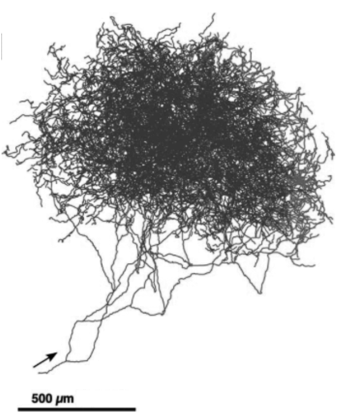
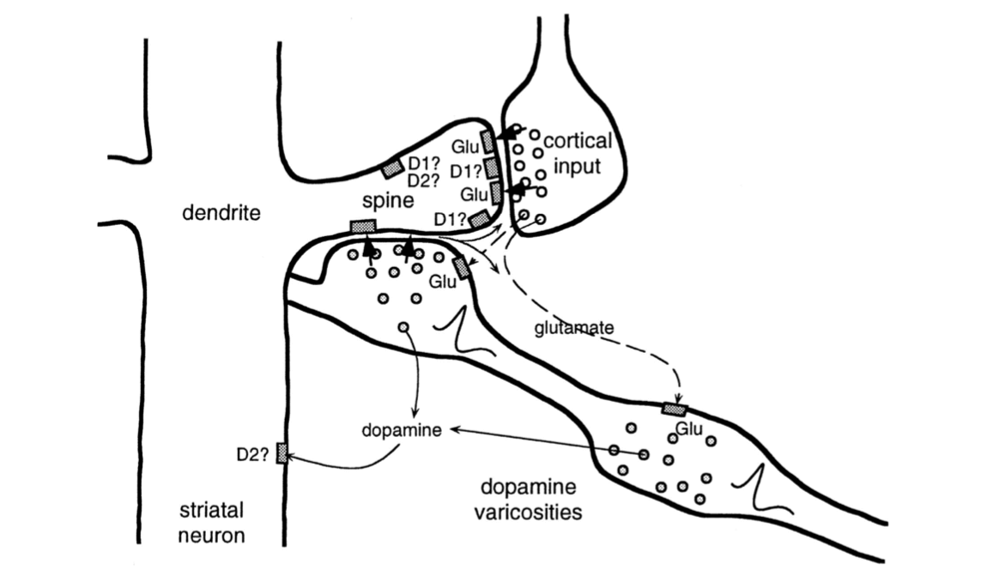
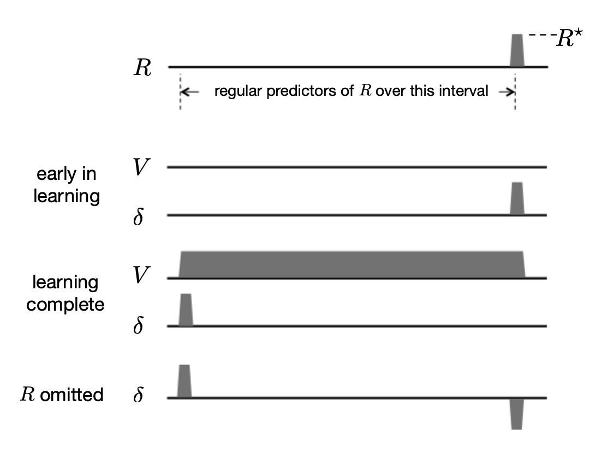
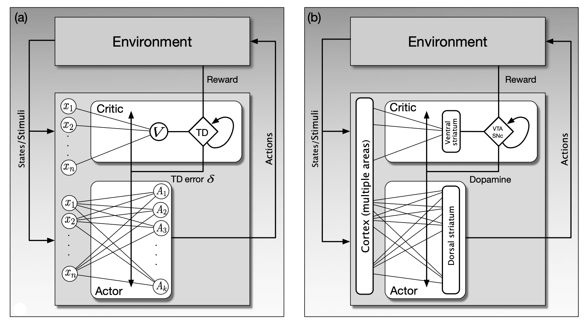

第15章 神经科学
====================

神经科学是对神经系统的多学科研究的总称，主要包括：如何调节身体功能，如何控制行为，
由发育、学习和老化所引起的随着时间的变化，以及细胞和分子机制如何使这些功能成为可能。
强化学习的最令人兴奋的方面之一是来自神经科学的越来越多的证据表明，
人类和许多其他动物的神经系统实施的算法和强化学习算法在很多方面是一一对应的。
本章主要解释这些相似之处，以及他们对动物的基于收益的学习的神经基础的看法。

强化学习和神经科学之间最显著的联系就是多巴胺，它是一种哺乳动物大脑中与收益处理机制紧密相关的化学物质。
多巴胺的作用就是将TD误差传达给进行学习和决策的大脑结构。
这种相似的关系被表示为 *多巴胺神经元活动的收益预测误差假说*，这是由强化学习和神经科学实验结果引出的一个假设。
在本章中我们将讨论这个假设，引出这个假设的神经科学发现，以及为什么它对理解大脑收益系统有重要作用。
我们还会讨论强化学习和神经科学之间的相似之处，虽然这种相似不如多巴胺／TD误差之间的相似那么明显，
但它提供了有用的概念工具，用于研究动物的基于收益的学习机制。
强化学习的其他元素也有可能会影响神经系统的研究，但是本章对它们与神经科学之间的联系相对讨论得不多。
我们在本章只讨论一些我们认为随着时间的推移会变得重要的联系。

正如我们在本书第1章的强化学习的早期历史部分（1.7节）所概述的，强化学习的许多方面都受到神经科学的影响。
本章的第二个目标是向读者介绍有关脑功能的观点，这些观点对强化学习方法有所贡献。
从脑功能的理论来看，强化学习的一些元素更容易理解。
对于“资格迹”这一概念尤其如此，资格迹是强化学习的基本机制之一起源于突触的一个猜想性质（突触是神经细胞与神经元之间相互沟通的结构）。

在本章，我们并没有深入研究动物的基于收益学习的复杂神经系统，因为我们不是神经科学家。
我们并不试图描述（甚至没有提及）许多大脑结构，或任何分子机制，即使它们都被认为参与了这些过程。
我们也不会对与强化学习非常吻合的假设和模型做出评判。神经科学领域的专家之间有不同的看法是很正常的。
我们仅仅想给读者讲好有吸引力和建设性的例子。
我们希望这一章给读者展现多种将强化学习及其理论基础与动物的基于收益学习的神经科学理论联系起来的渠道。

许多优秀的著作介绍了强化学习与神经科学之间的联系，我们在本章的最后一节中引用了其中的一些。
我们的方法和这些方法不太相似因为我们假设读者熟悉本书前面几章所介绍的强化学习，但是不了解有关神经科学的知识。
因此我们首先简要介绍神经科学的概念，以便让你有基本的理解。

15.1 神经科学基础
------------------

了解一些关于神经系统的基本知识有助于理解本章的内容。我们后面提到的术语用楷体表示。
如果你已经有神经科学方面的基本知识，则可以跳过这一节。

*神经元* 是神经系统的主要组成部分，是专门用于电子和化学信号的处理及信息传输的细胞。
它们以多种形式出现，但神经元通常具有细胞体、*树突* 和单个 *轴突*。
树突是从细胞体分叉出来，以接收来自其他神经元的输入（或者在感觉神经元的情况下还接收外部信号）的结构。
神经元的轴突是将神经元的输出传递给其他神经元（或肌肉、腺体）的纤维。
神经元的输出由被称为 *动作电位* 的电脉冲序列构成，这些电脉冲沿着轴突传播。
动作电位也被称为 *尖峰*，而神经元在产生尖峰时被认为是触发的。
在神经网络模型中，通常使用实数来表示神经元的 *放电速率*，即每单位时间的平均放电次数。

神经元的轴突可以分很多叉，使神经元的动作电位达到许多目标。神经元轴突的分叉结构部分被称为神经元的 *轴突中枢*。
因为动作电位的传导是一个主动过程，与导火索的燃烧不同，所以当动作电位到达轴突的分叉点时，
它会“点亮”所有输出分支上的动作电位（尽管有时会无法传播到某个分支）。
因此，具有大型轴突中枢的神经元的活动可以影响许多目标位置。

*突触* 通常是轴突分叉终止处的结构，作为中介调整一个神经元与另一个神经元之间的通信。
突触将信息从 *突触前* 神经元的轴突传递到 *突触后* 神经元的树突或细胞体。
除少数例外，当动作电位从突触前神经元传输到突触的时候突触会释放化学 *神经递质*
（但有时神经元之间有直接电耦合的情况，但是在这里我们不涉及这些）从突触的前侧释放的神经递质分子会弥漫在 *突触间隙*，
即突触前侧的末端和突触后神经元之间的非常小的空间，
然后与突触后神经元表面的受体结合，以激发或抑制其产生尖峰的活性，或以其他方式调节其行为。
一种特定的神经递质可能与几种不同类型的受体结合，每种受体在突触后神经元上产生不同的反应。
例如，神经递质多巴胺至少可以通过五种不同类型的受体来影响突触后神经元。
许多不同的化学物质已被确定为动物神经系统中的神经递质。

神经元的 *背景* 活动指的是“背景”情况下的活动水平，通常是它的放电速率。
所谓“背景情况”是指神经元的活动不是由实验者指定的任务相关的突触输入所驱动的，
例如，当神经元的活动与作为实验的一部分传递给被试者的刺激无关时，我们就认为其活动是背景活动。
背景活动可能由于输入来自于更广泛的网络而具有不规则性，或者由于神经或突触内的噪声而显得不规则。
有时背景活动是神经元固有的动态过程的结果。与其背景活动相反，神经元的 *阶段性* 活动通常由突触输入引起的尖峰活动冲击组成。
对于那些变化缓慢、经常以分级的方式进行的活动，无论是否是背景活动，都被称为神经元的 *增补* 活动。

突触释放的神经递质对突触后神经元产生影响的强度或有效性就是突触的 *效能*。
一种利用经验改变神经系统的方式就是通过改变突触的效能来改变神经系统，
这个“效能”是突触前和突触后神经元的活动的组合产生的结果，有时也来自于神经调节剂产生的结果。
所谓 *神经调节剂*，就是除了实现直接的快速兴奋或抑制之外，还会产生其他影响的神经递质。

大脑含有几个不同的神经调节系统，由具有广泛分叉的树状轴突神经元集群组成，每个系统使用不同的神经递质。
神经调节可以改变神经回路的功能、中介调整的动因、唤醒、注意力、记忆、心境、情绪、睡眠和体温。
这里重要的是，神经调节系统可以分配诸如强化信号之类的标量信号以改变突触的操作，
这些突触往往广泛分布在不同地方但对神经元的学习具有关键作用。

突触效能变化的能力被称为 *突触的可塑性*。
这是学习活动的主要机制之一通过学习算法调整的参数或权重对应于突触的效能（synaptic efficacies）正如我们下面要详细描述的，
通过神经调节剂多巴胺对突触可塑性进行调节是大脑实现学习算法的一种机制，就像本书所描述的那些算法一样。

15.2 收益信号、强化信号、价值和预测误差
----------------------------------------

神经科学和计算型的强化学习之间的联系始于大脑信号和在强化学习理论与算法中起重要作用的信号之间的相似性。
在第3章中，我们提到，任何对目标导向的行为进行学习的问题描述都可以归结为具有代表性的三种信号：动作、状态和收益。
然而，为了解释神经科学和强化学习之间的联系，我们必须更加具体地考虑其他强化学习的信号，这些信号以特定的方式与大脑中的信号相对应。
除了收益信号以外，还包含强化学习信号（我们认为这些信号不同于收益信号）、价值信号和传递预测误差的信号。
当我们以某种方式用对应函数来标记一个信号的时候，我们就在强化学习理论的语境之下把信号和某个公式或算法中的一项对应起来。
另一方面，当我们提到大脑中的一个信号时，也是想表示一个生理事件，比如动作电位的突变或者神经递质的分泌。
把一个神经信号标记为对应函数，比如把一个多巴胺神经元相位活动称为一个强化信号，意味着我们推测这个神经信号的作用与强化学习理论中的信号作用类似。

找到这些对应关系的证据面临诸多挑战。与收益处理过程相关的神经活动几乎可以在大脑的每一个部分找到，
但是由于不同的信号通常具有高度相关性，因此我们很难清楚地解释结果。
我们需要设计严谨的实验来把一种类型的收益相关信号和其他类型的收益信号区别开来，或者和其他与收益过程无关的大量信号区别开来。
尽管存在这些困难，但我们已经进行了许多实验来使强化学习理论和算法与神经信号对应起来，并建立一些具有说服力的联系。
为了在后续章节中说明这些联系，在本节的后面我们将告诉读者各种收益相关的信号与强化学习理论中信号的对应关系。

在第14章末介绍术语时，我们说到的 :math:`R_{t}` 更像动物大脑中的收益信号，而非动物环境中的物体或事件。
收益信号（以及智能体的环境）定义了强化学习智能体正试图解决的问题。
就这一点而言，:math:`R_{t}` 就像动物大脑中的一个信号，定义收益在大脑各个位置的初始分布。
但是在动物的大脑中不可能存在像 :math:`R_{t}` 这样的统一的收益信号。
我们最好把 :math:`R_{t}` 看作一个概括了大脑中许多评估感知和状态奖惩性质的系统产生的大量神经信号整体效应的抽象。

强化学习中的 *强化信号* 与收益信号不同。强化信号的作用是在一个智能体的策略、价值估计或环境模型中引导学习算法做出改变。
对于时序差分方法，例如，:math:`t` 时刻的强化信号是TD误差 :math:`\delta_{t-1}=R_{t}+\gamma V(S_{t})-V(S_{t-1})` [1]_。
某些算法的强化信号可能仅仅是收益信号，但是大多数是通过其他信息调整过的收益信号，例如TD误差中的价值估计。

状态价值函数或动作价值函数的估计，即 :math:`V` 或 :math:`Q`，指明了在长期内对智能体来说什么是好的，什么是坏的。
它们是对智能体未来期望积累的总收益的预测。智能体做出好的决策，
就意味着选择合适的动作以到达具有最大估计状态价值的状态，或者直接选择具有最大估计动作价值的动作。

.. [1]
    如我们在6.1节中介绍的，在我们的符号体系下 :math:`\delta_{t}` 被定义为 :math:`R_{t+1}+\gamma V(S_{t+1})-V(S_{t})`，
    所以，只有到了 :math:`t+1` 时刻才能得到 :math:`\delta_{t}`。
    则 :math:`t` 时刻的TD误差实际是 :math:`\delta_{t-1}=R_{t}+\gamma V\left(S_{t}\right)-V\left(S_{t-1}\right)`。
    因为我们通常认为每个时间步长是非常小甚至有时可以认为是无限小的，以对于定义上面这样的单个时刻的偏移不需要过分解读它的重要性。

预测误差衡量期望和实际信号或感知之间的差异。收益预测误差（reward prediction errors，RPE）衡量期望和实际收到的收益信号之的差异，
当收益信号大于期望时为正值，否则为负值。像式（6.5）中的TD误差是特殊类的RE，它表示当前和早先的长期回报期望之间的差异。
当神经科学家提到RPE时，他们一般（但不总是）指 TD RPE，在本章中我们简单地称之为TD误差。
在本章中TD误差通常不依赖于动作，不同于在 Sarsa和Q－学习算法中学习动作价值时的TD误差。
这是因为最明显的与神经科学的联系是用动作无关的TD误差来表述的，但是这并不意味着不存在与动作相关的TD误差的联系
（用于预测收益以外信号的TD误差也是有用的，但我们不加以考虑，这类例子可以参考 Modayil、 White和 Sutton，2014）。

关于神经科学数据与这些从理论上定义的信号之间的联系，我们可以提很多问题。
比如，观测到的信号更像一个收益信号、价值信号预测误差、强化信号，还是一个完全不同的东西？
如果是误差信号，那是收益预测误差（RE）、TD误差，还是像 Rescorla－Wagner误差（式14.3）这样的更简单的误差？
如果是TD误差，那是否是动作相关的“Q学习”或 Sarsa 等误差？如上所述，通过探索大脑来回答这样的问题是非常困难的。
但实验证据表明，一种神经递质，特别是多巴胺，表示RPE信号，而且生产多巴胺的神经元的相位活动事实上会传递TD误差（见15.1节节关于相位活动的定义）。
这个证据引出了 *多巴胺神经元活动的收益预测误差假说*，我们将在下面描述。

15.3 收益预测误差假说
-----------------------

*多巴胺神经元活动的收益预测误差假说* 认为，哺乳动物体内产生多巴胺的神经元的相位活动的功能之一，
就是将未来的期望收益的新旧估计值之间的误差传递到整个大脑的所有目标区域。
Montague、 Dayan和 Sejnowski1996）首次明确提出了这个假说（虽然没有用这些确切的词语），
他们展示了强化学习中的TD误差概念是如何解释哺乳动物中多巴胺神经元相位活动各种特征的。
引出这一假说的实验于20世纪80年代、90年代初在神经科学家沃尔夫拉姆·舒尔茨的实验室进行。
15.4节描述了这些重要实验，15.6节解释了这些实验的结果与TD误差的一致性，
本章末尾的参考文献和历史评注部分包含了记录这个重要假设发展历程的文献。

Montague等人（1996）比较了经典条件反射下时序差分模型产生的TD误差和经典条件反射环境下产生多巴胺的神经元的相位活动。
回顾14.2节，经典条件反射下的时序差分模型基本上是线性函数逼近的半梯度下降TD（:math:`\lambda`）算法。
Montague等人做了几个假设来进行对比。首先，由于TD误差可能是负值，但神经元不能有负的放电速率，
所以他们假设与多巴胺神经元活动相对应的量是 :math:`\delta_{t-1}+b_{t}`，其中 :math:`b_t` 是神经元的背景放电速率。
负的TD误差对应于多巴胺神经元低于其背景放电速率的放电速率降低量 [2]_。

第二个假说是关于每次经典条件反射试验所访问到的状态以及它们作为学习算法的输入量的表示方式的。
我们在14.2.4中针对时序差分模型讨论过这个问题。
Montague等人选择了全串行复合刺激表示（CSC），如图141左边一列所示，但略有不同的是，
短期内部信号的序列一直持续到US开始出现，而这里就是非零收益信号到达的地方。
这种表示方式使得TD误差能够模仿这样一种现象：多巴胺神经元活动不仅能预测未来收益，也对收到预测线索之后，收益 *何时* 可以达成是敏感的。
我们必须有一些方法来追踪感官线索和收益达成之间的间隔时间。
如果一个刺激对其后会继续产生的内部信号的序列进行了初始化，并且它们在刺激结束之后的每个时刻都产生不同的信号，
那么在每个时刻，我们可以用不同的状态来表示这些信号。因此，依赖于状态的TD误差对试验中事件发生的时间是敏感的。

有了这些关于背景放电速率和输入表示的假说，在15.5节的模拟试验中，时序差分模型的TD误差与多巴胺神经元的相位活动就十分相似了。
在15.5节中我们对这些相似性细节进行了描述，TD误差与多巴胺神经元的下列特征是相似的：
1）多巴胺神经元的相位反应只发生在收益事件不可预测时；
2）在学习初期，在收益之前的中性线索不会引起显著的相位多巴胺反应，但是随着持续的学习，这些线索获得了预测值并随即引起了相位多巴胺反应；
3）如果存在比已经获得预测值的线索更早的可靠线索，则相位多巴胺反应将会转移到更早的线索，并停止寻找后面的线索；
4）如果经过学习之后，预测的收益事件被遗漏，则多巴胺神经元的反应在收益事件的期望时间之后不久就会降低到其基准水平之下。

虽然在 Schultz等人的实验中，并不是每一个被监测到的多巴胺神经元都有以上这些行为，
但是大多数被监测神经元的活动和TD误差之间惊人的对应关系为收益预测误差假说提供了强有力的支持。
然而，仍存在一些情况基于假设的预测与实验中观察到的不一致。
输入表示的选择对于TD误差与多巴胺神经元活动某些细节之间的匹配程度来说至关重要，特别是多巴胺神经元的反应时间的细节。
为了使二者更加吻合，有一些关于输入表示和时序差分学习其他特征的不同思想被提了出来，
我们会在下面讨论一些，但主流的表示方法还是 Montague等人的CSC表示方法。
总体而言，收益预测误差假说已经在研究收益学习的神经科学家中被广泛接受，并且已经被证明能适应来自神经科学实验的更多结果。

为描述支持收益预测误差假说的神经科学实验，我们会提供一些背景使得假设的重要性更容易被理解。
我们接下来介绍一些关于多巴胺的知识，和它影响的大脑结构，以及它们是如何参与收益学习过程的。

.. [2]
    多巴胺神经元活动相关的TD误差中的 :math:`\delta_t` 与
    我们的 :math:`\delta_{t-1}=R_{t}+\gamma V(S_{t})-V(S_{t-1})` 是类似的。

15.4 多巴胺
-----------------

多巴胺是神经元产生的一种神经递质，其细胞体主要位于哺乳动物大脑的两个神经元群中：黑质致密部（SNpc）和腹侧被盖区（VTA）。
多巴胺在哺乳动物大脑的许多活动中起着重要的作用。其中突出的是动机、学习、行动选择、大多数形式的成瘾、精神分裂症和帕金森病。
多巴胺被称为神经调节剂，因为除了直接快速使靶向神经元兴奋或抑制靶向神经元之外，多巴胺还具有许多功能。
虽然多巴胺的很多功能和细胞效应的细节我们仍不清楚，但显然它在哺乳动物大脑收益处理过程中起着基础性的作用。
多巴胺不是参与收益处理的唯一神经调节剂，其在厌恶情况下的作用（惩罚）仍然存在争议。
多巴胺也可以在非哺乳动物中发挥作用。但是在包括人类在内的哺乳动物的收益相关过程中，多巴胺起到的重要作用毋庸置疑。

一个早期的传统观点认为，多巴胺神经元会向涉及学习和动机的多个大脑区域广播收益信号。
这种观点来自詹姆斯·奥尔德斯（James Olds）和彼得米尔纳（Peter Milner）他们在1954年著名的论文中描述了电刺激对老鼠大脑某些区域的影响。
他们发现，对特定区域的电刺激对控制老鼠的行为方面有极强的作用：
“……通过这种收益对动物的行为进行控制是极有效的，可能超过了以往所有用于动物实验的收益”（olds和 Milner，1954）。
后来的研究表明，这些对最敏感的位点的刺激所激发的多巴胺通路，
通常就是直接或间接地被自然的收益刺激所激发的多巴胺通路在人类被试者中也观察到了与老鼠类似的效应。
这些观察结果有效表明多巴胺神经元活动携带了收益信息。

但是，如果收益预测误差假说是正确的，即使它只解释了多巴胺神经元活动的某些特征，
那么这种关于多巴胺神经元活动的传统观点也不完全正确：多巴胺神经元的相位反应表示了收益预测误差，而非收益本身。
在强化学习的术语中，时刻 :math:`t` 的多巴胺神经元相位反应
对应于 :math:`\delta_{t-1}=R_{t}+\gamma V(S_{t})-V(S_{t-1})`，而不是 :math:`R_t`。

强化学习的理论和算法有助于一致性地解释“收益-预测-误差”的观点与传统的信号收益的观点之间的关系。
在本书讨论的许多算法中，作为一个强化信号，:math:`\delta` 是学习的主要驱动力。
例如，:math:`\delta` 是经典条件反射时序差分模型中的关键因素，
也是在“行动器-评判器”框架中学习价值函数和策略的强化信号（13.5节和15.7节）。
:math:`\delta` 的动作相关的形式是Q学习和Sarsa的强化信号。
收益信号 :math:`R_t` 是 :math:`\delta_{t-1}` 的重要组成部分，但不是这些算法中强化效应的完全决定因素。
附加项 :math:`\gamma V(S_{t})-V(S_{t-1})` 是 :math:`\delta_{t-1}` 的次级强化部分，
即使有收益（:math:`R_{t} \neq 0`）产生，如果收益可以被完全预测，则TD误差也可以是没有任何影响的（15.6节详细解释）。

事实上，仔细研究Olds和 Milner1 1954年的论文可以发现，这主要是工具性条件反射任务中电刺激的强化效应。
电刺激不仅能激发老鼠的行为通过多巴胺对动机的作用，还导致老鼠很快学会通过按压杠杆来刺激自己，而这种刺激会长时间频繁进行。
电刺激引起的多巴胺神经元活动强化了老鼠的杠杆按压动作。

最近使用光遗传学方法的实验证实了多巴胺神经元的相位反应作为强化信号的作用。
这些方法允许神经科学家在清醒的动物中以毫秒的时间尺度精确地控制所选的特定类型的神经元活动。
光遗传学方法将光敏蛋白质引入选定类型的神经元中，使这些神经元可以通过激光闪光被激活或静默。
第一个使用光遗传学方法研究多巴胺神经元的实验显示，使小鼠产生多巴胺神经元相位激活的光遗传刺激会使小鼠更喜欢房间里接受刺激的一侧
（在房间的另一侧它们没有收到或只收到低频率的刺激（Tsai et al，2009）。
在另一个例子中， Steinberg等人（2013）利用多巴胺神经元的光遗传对老鼠身上的多巴胺神经元活动进行人为激活，
这时本该发生收益刺激但实际没有，多巴胺神经元活动通常暂停。
人为激活后，响应持续并由于缺少强化信号（在消退试验中）而正常地衰减，
由于收益已经被正确预测，所以学习通常会被阻塞（阻塞示例见本书14.2.1节）。

    单个神经元的轴突生成多巴胺作为神经递质。这些轴突通过突触和脑中目标区域的大量神经元树突进行信息传递。

    引自： The Journal of Neurosctence, Matsuda, Furuta, Nakamura, Hioki. Fujiyama,
    Arai, and Kaneko, volume 29, 2009, page 451.

多巴胺强化作用的另外证据来自果蝇的光遗传学实验，尽管这些动物中多巴胺的作用与哺乳动物中的作用相反：
至少对多巴胺神经元活化的群体来说，多巴胺神经元活性的光学触发像对脚电击一样来强化“回避行为”（Claridge－Chang－等，2009）。
虽然这些光遗传学实验都没有显示多巴胺神经元相位活动特别像TD误差，
但是它们有力地证明了多巴胺神经元相位活动像 :math:`\delta` 在强化信号预测（经典条件反射）和
控制（工具性条件反射）中那样起着重要作用（或许对果蝇来说像 :math:`minus \delta` 的作用）。

多巴胺神经元特别适合于向大脑的许多区域广播强化信号。
这些神经元具有巨大的轴突，每一个都能在比普通轴突多100~1000倍的突触位点上释放多巴胺。
右图显示了单个多巴胺神经元的轴突，其细胞体位于老鼠大脑的SNpc中。
每个spc或VTA多巴胺神经元的轴突在靶向大脑区域中的神经元树突上产生大约500 000个突触。

如果多巴胺神经元像强化学习 :math:`\delta` 那样广播强化信号，那么由于这是一个标量信号，即单个数字，
所以在SNpc和VTA中的所有多巴胺神经元会被预期以相同的方式激活，并以近似同步的方式发送相同的信号到所有轴突的目标位点。
尽管人们普遍认为多巴胺神经元确实能够像这样一起行动，但最新证据指出，
多巴胺神经元的不同亚群对输入的响应取决于它们向其发送信号的目标位点的结构，以及信号对目标位点结构的不同作用方式。
多巴胺具有传导RPE以外的功能。而且即使是传导RPE信号的多巴胺神经元，多巴胺也会将不同的RPE发送到不同的结构去，
这个发送过程是根据这些结构在产生强化行为中所起的作用来进行的。
这超出了我们讨论的范围，但无论如何，矢量值RPE信号从强化学习的角度看是有意义的，
尤其是当决策可以被分解成单独的子决策时，或者更一般地说，处理结构化的功劳分配问题时就更是如此。
所谓 *结构化功劳分配问题* 是指：如何为众多影响决策的结构成分分配成功的功劳收益（或失败的惩罚）？
我们会在15.10节中详细讨论这一点。

大多数多巴胺神经元的轴突与额叶皮层和基底神经节中的神经元发生突触接触，涉及自主运动、决策、学习和认知功能的大脑区域。
由于大多数关于多巴胺强化学习的想法都集中在基底神经节，而多巴胺神经元的连接在那里特密集，所以我们主要关注基底神经节。
基底神经节是很多神经元组（又称“神经核”）的集合，位置在前脑的基底。基底节的主要输入结构称为纹状体。
基本上所有的大脑皮层以及其他结构，都为纹状体提供输入。皮层神经元的活动传导关于感官输入、内部状态和运动活动的大量信息。
皮层神经元的轴突在纹状体的主要输入／输出神经元的树突上产生突触接触，称为中棘神经元。
纹状体的输出通过其他基底神经核和丘脑回到皮质的前部区域和运动区域，使得纹状体可能影响运动、抽象决策过程和收益处理。
纹状体的两个主要分叉对于强化学习来说十分重要：背侧纹状体，主要影响动作选择；和腹侧纹状体，在收益处理的不同方面起关键作用，包括为各类知觉分配有效价值。

中棘神经元的树突上覆盖着“棘”，该皮质神经元的尖端轴突有突触之间信息传递的功能。
这些棘也会参与突触之间的信息传递──在这种情况下连接的是脊柱茎，其是多巴胺神经元的轴突（图15.1）。
这样就将皮层神经元的突触前活动、中棘神经元的突触后活动和多巴胺神经元的输入汇集在一起。
实际上这些发生在脊柱茎上的过程很复杂，还没有被完全弄清楚。
图15.1通过显示两种类型的多巴胺受体──谷氨酸受体（谷氨酸受体的神经递质），以及各种信号相互作用的方式说明了这种活动的复杂性。
但有证据表明，神经科学家称之为皮质纹状体突触的从皮层到纹状体突触相关性的变化，取决于恰当时机的多巴胺信号。

    **图15.1** 纹状神经元的脊柱茎的输入来自于皮层神经元和多巴胺神经元。
    皮层神经元轴突通过纹状体突触影响纹状神经元，神经递质谷氨酸在棘端覆盖纹状神经元树突。
    一个VTA或SNpc多巴胺神经元的轴突在脊柱茎旁边（图的右下方）。
    轴突上的“多巴胺膨体”在脊柱茎或附近释放多巴胺，在将皮层突触前输入、纹状体神经元突触后活动和多巴胺结合起来的组织方式中，
    这使得可能有几种类型的学习规则共同支配皮质纹状突触的可塑性。
    多巴胺神经元的每个轴突与大约500 000个脊柱茎的突触发生信息传递。
    其他神经递质传递途径和多种受体类型不在我们讨论范围，如D1和D2多胺受，多巴胺可以在脊柱和其他突触后位点产生不同的效应。
    引自： Journal of Neurophysiology，w. Schultz vol.80，1998，page10.

15.5 收益预测误差假说的实验支持
---------------------------------

多巴胺神经元以激烈、新颖或意想不到的视觉、听觉刺激来触发眼部和身体的运动，但它们的活动很少与运动本身有关。
这非常令人惊讶，因为多巴胺神经元的功能衰退是帕金森病的一个原因，其症状包括运动障碍，尤其是自发运动中的缺陷。
Romo和 Schultz（1990）以及Schultz和Romo（1990）通过记录猴子移动手臂时多巴胺神经元和肌肉的活动开始向收益预测误差假说迈出第一步。

他们训练了两只猴子，当猴子看见并听到门打开的时候，会把手从静止的地方移动到一个装有苹果、饼干或葡萄干的箱子里。
然后猴子可以抓住食物并吃到嘴里。当猴子学会这么做之后，它又接受另外两项任务的训练。
第一项任务的目的是看当运动是自发时多巴胺神经元的作用。箱子是敞开的，但上面被覆盖着，猴子不能看到箱子里面的东西，但可以从下面伸手进去。
预先没有设置触发刺激当猴子够到并吃完食物后，实验者通常（虽然并非总是）在猴子没看见的时候悄悄将箱中的食物粘到一根坚硬的电线上。
在这里，Romo和 Schultz观察到的多巴胺神经元活动与猴子的运动无关，但是当猴子首先接触到食物时，这些神经元中的大部分会产生相位反应。
当猴子碰到电线或碰到没有食物的箱子时这些神经元没有响应。这是表明神经元只对食物，而非任务中的其他方面有反应的很好的证据。

Romo和 Schultz第二个任务的目的是看看当运动被刺激触发时会发生什么。
这个任务使用了另外一个有可移动盖子的箱子。箱子打开的画面和声音会触发朝向箱子的移动。
在这种情况下，Romo和 Schultz发现，经过一段时间的训练后，多巴胺神经元不再响应食物的触摸，
而是响应食物箱开盖的画面和声音这些神经元的相位反应已经从收益本身转变为预测收益可用性的刺激。
在后续研究中，Romo和 Schultz发现，他们所监测的大多数多巴胺神经元对行为任务背景之外的箱子打开的视觉和声音没有反应。
这些观察结果表明，多巴胺神经元既不响应于运动的开始，也不响应于刺激的感觉特性，而是表示收益的期望。

Schultz的小组进行了许多涉及SNpc和VT多巴胺神经元的其他研究。
一系列特定的实验表明，多巴胺神经元的相位反应对应于TD误差，而不是像 Rescorla－Wagner模型（式（14.3）那样的简单误差。
在第一个实验中（Ljungberg、 Apicella Schultz，1992），训练猴子们在打开光照（作为“触发线索”）之后按压杠杆来获得一滴苹果汁。
正如Romo和 Schultz早些时候所观察到的，许多多巴胺神经元最初都对收益果汁滴下来有所回应（图15.2，上图）。
但是许多神经元在训练继续下去后失去了收益反应，而是转而对预测收益的光照有所反应（图15.2，中图）。
在持续的训练中，随着响应触发线索的多巴胺神经元变少，按压杠杆变得更快。

.. figure:: images/figure-15.2.png

    **图15.2** 多胺神经元的反应从最初的反应到初级收益再到早期的预测刺激的转变。
    图中展示的是在细微时间间隔内被监测的多巴胺神经元产生的动作电位（这些数据是23~4个神经元产生的）。
    顶部图：多巴胺神经元被无规律产生的苹果汁激活。中间图：随着学习，多巴胺神经元对收益预测触发线索产生反应，对收益传递失去反应。
    底部图：通过在触发脉冲之前增加1s的指示线索，多巴胺神经元将它们的响应从触发线索转移到较早的指示线索。
    引自： Schultz et al.（1995）， MIT Press.

在这项研究之后，同样的猴子接受了新的任务训练（Schultz、 Apicella和 Ljungberg，1993）。
这次猴子面临两个杠杆，每个杠杆上面都有一盏灯。点亮其中一个灯是一个“指示线索”，指示两个手柄中的哪一个会产生一滴苹果汁。
在这个任务中，指示线索先于触发提示产生，提前产生的间隔固定为1秒。
猴子要学着在看到触发线索之前保持不动，多巴胺神经元活动增加，
但是现在监测到多巴胺神经元的反应几乎全部发生在较早的指示线索上，而不是触发线索（图15.2，下图）。
在这个任务被充分学习时，再次响应指示线索的多巴胺神经元数量也大大减少了。
在学习这些任务的过程中，多巴胺神经元活动从最初的响应收益转变为响应较早的预测性刺激，首先响应触发刺激，然后响应更早的指示线索。
随着响应时间的提前，它在后面的刺激中消失。这种对后来的预测因子失去反应，而转移到对早期收益预测有所反应，是时序差分学习的一个标志（见图14.2）。

刚刚描述的任务也揭示了时序差分学习与多巴胺神经元活动共同具有的另一个属性。
猴子有时会按下错误的按键，即指示按键以外的按键因此没有收到任何收益。
在这些试验中，许多多巴胺神经元在收益正常给出后不久就显示其基线放电速率急剧下降，
这种情况发生时没有任何外部线索来标记通常的收益传送时间（图15.3）。
不知何故猴子在内部也能追踪收益传送的时间（响应时间是最简单的时序差分学习版本需要修改的一个地方，
以解释多巴胺神经元反应时间的一些细节，我们在下一节会考虑这个问题）。

上述研究的观察结果使 Schultz和他的小组得出结论：多巴胺神经元对不可预测的收益，最早的收益预测因子做出反应，
如果没有发现收益或者收益的预测因子，那么多巴胺神经元活性会在期望时间内降低到基线以下。
熟悉强化学习的研究人员很快就认识到，这些结果与时序差分算法中时序差分强化信号的表现非常相似。
下一节通过一个具体的例子来详细探讨这种相似性。

.. figure:: images/figure-15.3.png

    **图15.3** 多巴胺神经元的反应在预期收益衰退发生后不久就低于基线。
    顶部图：多巴胺神经元被无规律产生的苹果汁激活。中间图；多巴胺神经元对预测收益的条件刺激（CS）做出反应，并不对收益本身做出反应。
    底部图：当预测收益的条件刺激停止产生时，多巴胺神经元的活动会在期望的收益产生后的短时间内低于基线值。
    这些图的上部分显示的是所监测的多巴胺神经元在所指示的细微时间间隔内产生的动作电位的平均数目。
    这些图的下部分的光栅图显示了监测的单个多巴胺神经元的活动模式，每个点代表动作电位。
    引自： Schultz, Dayan, and Montague, A Neural Substrate of Prediction and Reward,
    Science, vol. 275, issue 5306, pages 1593-1598, March 14, 1997.
    经AAAS许可转载。

15.6 TD误差／多巴胺对应
----------------------------

这一节解释TD误差 :math:`\delta` 与实验中观察到的多巴胺神经元的相位反应之间的联系。
我们观察在学习的过程中如何变化，如上文中提到的任务一样，一只猴子首先看到指令提示，
然后在一个固定的时间之后必须正确地响应一个触发提示以获得收益。
我们采用种这个任务的简化理想版本，但是我们会更深入地研究细节，
因为我们想要强调TD误差与多巴胺神经元活动对应关系的理论基础。

第一个最基本的简化假设是智能体已经学习了获得收益的动作。接下来它的任务就是根据它经历的状态序列学习对于未来收益的准确预测。
这就是一个预测任务了，或者从更技术化的角度描述，是一个策略评估任务：针对一个固定的策略学习价值函数（4.1节和6.1节）。
要学习的价值函数对每一个状态分配一个值，这个值预测了如果智能体根据给定的策略选择动作则接下来状态的回报值，
这个回报值是所有未来收益的（可能是带折扣的）总和。
这对于猴子的情境来说是不实际的因为猴子很可能在学习正确行动的同时学习到了这些预测
（就像强化学习算法同时学习策略和价值函数，例如“行动器-评判器”算法），但是这个情境相比同时学习策略和价值函数更易于描述。

现在试想智能体的经验可以被分为多个试验，在每个试验中相同的状态序列重复出现，但在每个时刻的状态都不相同。
进一步设想被预测的收益仅限于一次试验，这使我们的每次试验类似于强化学习的一幕，正如我们之前所定义的。
在现实中，被预测的回报值不仅限于单个试验，且两个试验之间的时间间隔是决定动物学习到什么的重要影响因素。
这对于时序差分学习来说同样是真实的，但是在这里我们假设回报值不会随着多个试验逐渐积累。
在这种情况下，如 Schultz和他的同事们做的，一次实验中的一个试验等价于强化学习的一幕
（尽管在这个讨论中，我们用术语“试验”而不是“幕”来更好地与实验相联系）。

通常，我们同样需要对状态怎样被表示为学习算法的输入做出假设，这是一个影响TD误差与多巴胺神经元的活动联系有多紧密的假设。
我们稍后讨论这个问题，但是我们现在假设与 Montague相同的CSC表示，在实验中的每一个时刻，访问过的每一个状态都有一个单独的内部刺激。
这使得整个过程被简化到本书第I部分讨论的表格型的情况。
最终，我们假设智能体使用TD(0)来学习一个价值函数 :math:`V`，将其存储在一个所有状态初始值为零的查询表中。
我们同样假设这是一个确定的任务且折扣因子 :math:`\gamma` 非常接近于1，以至于我们可以忽略它。

图15.4展示了在这个策略评估任务中几个学习阶段中的 :math:`R`、:math:`V` 和 :math:`\delta` 的时间过程。
时间轴表示在一个试验中一系列状态被访问的时间区间（为了表达清楚，我们没有展示单独状态）。
除了在智能体到达收益状态外收益信号在整个试验中始终为零，如图中时间线右末端所示，收益信号成为一个正数，如 :math:`R^{\star}`。
时序差分学习的目标是预测在试验中访问过的每一个状态的回报值，
在没有折扣的情况下并且假设预测值被限制为针对单独试验，对于每个状态就是 :math:`R^{\star}`。

    **图15.4** 时序差分学习中的TD误差 :math:`\delta` 的表现与多巴胺神经元相位活动特征完全一致。
    （这里的TD误差 :math:`\delta` 指的是 :math:`t` 时刻的误差：:math:`\delta_{t-1}`）。
    一个状态序列，通常情况下表示预测线索到收益之间的间隔，后面是非零收益R学习早期：初始化价值函数V和δ，一开始初始化为 :math:`R^{\star}`。
    学习完成：价值函数精确地预测未来收益，在早期的预测状态，:math:`\delta` 是正值，在非零收益时 :math:`\delta=0`。
    省略 :math:`R`：当省略预测收益时，:math:`\delta` 是负值。文中有这一现象的完整解释。

在得到真实收益的每个状态之前是一系列的收益预测状态，*最早收益预测状态* 被展示在时间线的最左端。
这个状态就像是接近试验开始时的状态，例如在上文中描述的 Schultz的猴子实验中的指令线索状态。
这是在试验中可以用来可靠预测试验收益的首个状态（当然，在现实中，在先前试验中访问过的状态可能是更早的收益预测状态，但是我们限制预测针地单独的试验，它们不能作为这个试验的收益的预测。
在下面我们给出一个更加令人满意的，尽管更抽象的，对于最早收益预测状态的描述）。
一个试验中的 *最近收益预测状态* 是指试验中收益状态的前一个状态。这个状态被表示为图15.4中时间线上最右端的状态。
注意一个试验的收益状态不能预测该试验的回报值：这个状态的值将被用来预测接下来所有试验的累积回报值，在当前分幕式的框架里我们假设这个回报值是零。

图15.4展示了 :math:`V` 和 :math:`\delta` 的首次试验的时间过程，在图中被标记为“学习早期”。
因为除了到达收益状态时的收益以外，试验中的所有信号都是零，且所有 :math:`V` 值都是零，
TD误差在它在收益状态变为 :math:`R^{\star}` 前都是零。
这个结果是由于 :math:`\delta_{t-1}=R_{t}+V_{t}-V_{t-1}=R_{t}+0-0=R_{t}`，
这个值在获得收益变为 :math:`R^{\star}` 前都是零。
在这里 :math:`V_t` 和 :math:`V_{t－1}`是在试验中时刻 :math:`t` 和 :math:`t－1` 访问状态的预测价值。
在这个学习阶段中的TD误差与多巴胺神经元对一个不可预知的收益的响应类似，例如在训练起始时的一滴苹果汁。

在首个试验和所有接下来的试验中，TD(0)更新发生在第6章中描述的每次状态转移中。
这样会随着收益状态的价值更新的反向传递，不断地增加收益预测状态的价值，直到收到正确的回报预测。
在这种情况下（假设没有折扣），正确的预测值对于所有收益预测状态都等于 :math:`R^{\star}`。
这可以在图15.4看出，在V的标有“学习完成”的图中，从最早到最晚的收益预测状态的价值都等于 :math:`R^{\star}`。
在最早收益预测状态前的状态的价值都很小（在图15.4中显示为0），因为它们不是收益的可靠预测者。

当学习完成时，也即当V达到正确的值时，因为预测现在是准确的，所以从任意收益预测状态出发的转移所关联的TD误差都是零，
这是因为对一个从收益预测状态到另一个收益预测状态的转移来说，
我们有 :math:`\delta_{t-1}=R_{t}+V_{t}-V_{t-1}=0+R^{\star}-R^{\star}=0`。
且对于最新的收益预测状态到收益状态来说，
我们有 :math:`\delta_{t-1}=R_{t}+V_{t}-V_{t-1}=R^{\star}+0-R^{\star}=0`。
在另一方面，从任意状态到最早收益预测状态转移的TD误差都是正的，这是由这个状态的低值与接下来收益预测状态的高值的不匹配造成的。
实际上，如果在最早收益预测状态前的状态价值为零，则在转移到最早收益预测状态后，
我们有 :math:`\delta_{t-1}=R_{t}+V_{t}-V_{t-1}=0+R^{\star}-0=R^{\star}`。
图15.4中的的“学习完成”图在最早收益预测状态为正值，在其他地方为零。

转移到最早收益预测状态时的正的TD误差类似于多巴胺对最早刺激的持续性反应，用以预测收益。
同样道理，当学习完成时，从最新的收益预测状态到收益状态的转移产生一个值为零的TD误差，因为最新收益预测状态的值是正确的，抵销了收益。
这与相比一个不可预测的收益，对一个完全可预测的收益，更少的多巴胺神经元产生相位响应的观察是相符的。

在学习后，如果收益突然被取消了，那么TD误差在收益的通常时间都是负的，
因为最新收益预测状态的值太大了：:math:`\delta_{t-1}=R_{t}+V_{t}-V_{t-1}=0+0-R^{\star}=-R^{\star}`，
正如图15.4中所示的标有“省略 :math:`R`”的 :math:`\delta` 图所示。
这就像在 Schultz et al.（1993）实验和图15.3中的多巴胺神经元行为，其在一个预测的收益被取消时会降低到基线以下。

需要更多地注意 *最早收益预测状态* 的概念。
在上文所提到的情境中，由于整个实验经历是被分为多次试验的，且我们假设预测被限制于单次试验，则最早收益预测状态总是试验中的第一个状态。
明显这不符合真实情况。一种考虑最早收益预测状态的更一般的方式是，认为它是一个不可预知的收益预估器，且可能有非常多这样的状态。
在动物的生活中，很多不同的状态都在最早收益预测状态之前。
然而，由于这些状态通常跟随着不能预测收益的其他状态，因此它们的收益的预测力，也就是说，它们的值，很低。
一个TD算法，如果在动物的一生中始终运行，也会更新这些状态的价值，但是这些更新并不会一直累积，
因为根据假设，这些状态中没有一个能保证出现在最早收益预测状态之前。
如果它们中的任意一个能够保证，它们也会是收益预测状态。
这也许解释了为什么经过过度训练，在试验中多巴胺的反应甚至降低到了最早的收益预测刺激水平。
经过过度训练，可以预料，就算是以前不能预测的状态都会被某些与更早的状态联系起来的刺激预测出来：
在实验任务的内部和外部，动物与环境的相互作用将变成平常的、完全可预测的事情。
但是，当我们通过引入新的任务来打破这个常规时我们会观察到TD误差重新出现了，正如在多巴胺神经元活动中观察到的那样。

上面描述的例子解释了为什么当动物学习与我们例子中的理想化的任务类似的任务时，TD误差与多巴胺神经元的相位活动有着共同的关键特征。
但是并非多巴胺神经元的相位活动的所有性质都能与 :math:`\delta` 的性质完美对应起来。
最令人不安的一个差异是，当收益比预期提前发生时会发生什么。
我们观察到一个预期收益的省略会在收益预期的时间产生一个负的预测误差，这与多巴胺神经元降至基线以下相对应。
如果收益在预期之后到达它就是非预期收益并产生一个正的预测误差。这在TD误差和多巴胺神经元反应中同时发生。
但是如果收益提前于预期发生，则多巴胺神经元与TD误差的反应不同──至少在 Montague et al.（1996）使用的CSC表示与我们的例子中不同。
多巴胺神经元会对提前的收益进行反应，反应与正的TD误差一致，因为收益没有被预测会在那时发生。
然而，在后面预期收益出现却没有出现的时刻，TD误差将为负，
但多巴胺神经元的反应却并没有像负的TD误差的那样降到基线以下（Hollerman和 Schultz，198）。
在动物的大脑中发生了相比于简单的用CSC表示的TD学习更加复杂的事情。

一些TD误差与多巴胺神经元行为的不匹配可以通过选择对时序差分算法合适的参数并利用除CSC表示外的其他刺激表示来解决。
例如，为了解决刚才提到的提前收益不匹配的问题，Suri和 Schultz（199）提出了一种CSC的表示，
在这种表示中由较早刺激产生的内部信号序列被出现的收益取消。
另一个由Daw、 Courville Touretzky（2006）提出的解决方法
是大脑的TD系统使用在感觉皮层进行的统计建模所产生的表示，而不是基于原始感官输入的简单表示。
Ludvig、 Sutton和 Kehoe2008）发现采用微刺激表示的TD学习比CSC表示更能在收益早期和其他情形下模拟多巴胺神经元的行为（见图14.1）。
Pan、 Schmidt、 Wickens和 Hyland（205）发现即使使用CSC表示，
延迟的资格迹可以改善TD误差与多巴胺神经元活动的某些方面的匹配情况。
一般来说，TD误差的许多行为细节取决于资格迹、折扣和刺激表示之间微妙的相互作用。
这些发现在不否定多巴胺神经元的相位行为被TD误差信号很好地表征的核心结论下细化了收益预测误差在另一方面，
在TD理论和实验数据之间有一些不能通过选择参数和刺激表示轻易假说。

在另一方面，在TD理论和实验数据之间有一些不能通过选择参数和刺激表示轻易解决的差异
（我们将在章末参考文献和历史评注的部分介绍某些差异），随着神经科学家进行更多细化的实验，更多的差异会被发现。
但是收益预测误差假说作为提升我们对于大脑收益系统理解的催化剂已经表现得非常有效。
人们设计了复杂的实验来证明或否定通过假设获得的预测，实验的结果也反过来优化并细化了TD误差／多巴胺假设。

一个明显的发展方向是，与多巴胺系统的性质如此契合的强化学习算法和理论完全是从一个计算的视角开发的，
没有考虑到任何多巴胺神经元的相关信息──注意，TD学习和它与最优化控制及动态规划的联系
是在任何揭示类似TD的多巴胺神经元行为本质的实验进行前很多年提出的。
这些意外的对应关系，尽管还并不完美，却也说明了TD误差和多巴胺的相似之处抓住了大脑收益过程的某些关键环节。

除了解释了多巴胺神经元相位行为的很多特征外，收益预测误差假说将神经科学与强化学习的其他方面联系起来，
特别地，与采用TD误差作为强化信号的学习算法联系起来。
神经科学仍然距离完全理解神经回路、分子机制和多巴胺神经元的相位活动的功能十分遥远，
但是支持收益预测误差假说的证据和支持多巴胺相位反应是用于学习强化信号的证据，
暗示了大脑可能实施类似的“行动器-评判器”算法，在其中TD误差起着至关重要的作用。
其他的强化学习算法也是可行的候选，但是“行动器-评判器”算法特别符合哺乳动物的大脑解剖学和生理学，我们在下面两节中进行阐述。

15.7 神经“行动器-评判器”
------------------------------

“行动器-评判器”算法同时对策略和价值函数进行学习。行动器是算法中用于学习策略的组件，
评判器是算法中用于学习对行动器的动作选择进行“评价”的组件，这个“评价”是基于行动器所遵循的策略来进行的，
无论这个策略是什么评判器采用TD算法来学习行动器当前策略的状态价值函数。
价值函数允许评判器通过向行动器发送TD误差来评价一个行动器的动作。
一个正的 :math:`\delta` 意味着这个动作是好的，因为它导向了一个好于预期价值的状态；
一个负的 :math:`\delta` 意味着这个动作是坏的，因为它导向了一个差于预期价值的状态。
根据这些评价，行动器会持续更新其策略。

“行动器-评判器”算法有两个鲜明特征让我们认为大脑也许采用了类似的算法。
第一个是，“行动器-评判器”算法的两个部分（行动器和评判器）代表了纹状体的两部分（背侧和腹侧区）（15.4节）。
对于基于收益的学习来说，这两部分都非常重要──也许分别起着行动器和评判器的作用。
暗示大脑的实现是基于“行动器-评判器”算法的第二个特也许分别征是，TD误差有着同时作为行动器和评判器的强化信号的双重作用。
这与神经回路的一些性质是吻合的：多巴胺神经元的轴突同时以纹状体背侧和腹侧区为目标；
多巴胺对于调节两个结构的可塑性都非常重要；且像多巴胺一样的神经调节器如何作用在目标结构上取决于目标结构的特征而不仅取决于调节器的特征。

13.5节展示了作为策略梯度方法的“行动器-评判器”算法，
但是Bart，Sutton和 Anderson（1983）的“行动器-评判器”算法更加简单并且是用人工神经网络来表达的。
在这里，我们描述一种类似于 Barto等人的人工神经网络的实现，且我们基于 Takahashi Schoenbaum和Niv（2008）的工作，
给出一个这样的人工神经网络如何通过真正的大脑神经网络实现的原理方案。我们把对“行动器-评判器”学习规则的讨论推后到15.8节，
在这一节我们会将它们作为策略梯度公式的特殊情况，来讨论它们所暗示的多巴胺调节突触可塑性的原理。

图15.5a展示了“行动器-评判器”算法的人工神经网络实现，神经网络的不同部分分别实现了评判器和行动器。
评判器由一个单独的神经单元 :math:`V`（它的输出代表了状态价值）和如图所示的菱形的TD计算组件组成，
这个组件通过 :math:`V` 的输出、收益信号和过去的状态价值来计算TD误差（正如从TD菱形框出的自环一样）。
行动器网络由一层 :math:`k` 个行动器单元组成，
标记为 :math:`A_i, i=1, \ldots, k`，每个行动器单元的输出是一个 :math:`k` 维的动作向量。
另一种替代性选择是有 :math:`k` 个分开的动作，每一个指挥一个单独的单元，每一个都为了被执行而与其他的进行竞争。
但是在这里，我们把整个 :math:`A` 向量视为一个动作。

    **图15.5** “行动器-评判器”算法的人工神经网络实现和模拟神经实现。
    a）将“行动器-评判器”算法用人工神经网络来表示。行动器会根据从评判器获取的TD误差来更新策略，
    同时评判器也用相同的δ来调整状态价值函数的参数。评判器通过收益信号R和估计的状态价值来求得TD误差。
    行动器不会直接得到收益信号，评判器也不会直接得到动作。
    b）“行动器-评判器”算法的模拟神经实现。行动器和评判器的状态价值学习部分分别位于纹状体的腹侧和背侧。
    TD误差由位于VTA和SNp的多巴胺神经元传递，以调节从皮质区到腹侧和背侧纹状体的突触效应的变化。
    引自： Frontiers in Neuroscience, vol. 2(1), 2008, Y. Takahashi, G. Schoenbaum, and Y. Niv, Silencing the critics: Understanding the e↵ects of cocaine sensitization on dorsolateral and ventral striatum in the context of an Actor/Critic model.

评判器和行动器网络都可以接收多个特征，它们表示了智能体所在的环境的状态
（回顾第1章，在这一章中提到的强化学习智能体的“环境”包括了很多组成部分，有的在容纳智能体的整体系统的外部，有的在这些系统的内部）。
图中将这些特征表示为标有 :math:`x_{1}, x_{2}, \ldots, x_{n}` 的圈，为了使图更加简单，我们重复了两次。
从每个特征 :math:`x_i` 到评判器单元 :math:`V` 的连接，
以及它们到每个动作单元 :math:`A_i` 的连接都有一个对应的权重参数，表示突触的效能。
在评判器网络中的权重参数化了价值函数，在行动器网络中的权重参数化了策略。
网络根据我们下一章中描述的“行动器－评判器”学习规则来改变权重进行学习。

在评判器神经回路产生的TD误差是改变的评判器和行动器网络权值的增强信号。
这在图15.5a中用标有“TD误差 :math:`\delta`”的线表示，它穿过了所有评判器和行动器网络的连接。
将这种网络实现的方式与收益预测误差假说以及多巴胺神经元广泛分布的事实（通过大量的神经元的轴突树）联系在一起考虑，
我们认为将这样的“行动器-评判器”网络作为基于收益的学习在大脑中发生机制的假设是比较合理的。

图15.5b揭示了在图左侧的人工神经网络根据 Takahashi et al.（2008）的假设如何与大脑中的结构对应。
这个假设分别把行动器和评判器的价值学习部分对应到了纹状体的背侧和腹侧区基底神经节的输入结构。
回顾15.4节中的介绍：背侧纹状体主要与动作的选择关系密切，腹侧纹状体被认为对收益处理的不同方面极为关键，包括对感觉的情感值的分配。
大脑皮层以及其他结构将输入送到纹状体传达关于刺激、内部状态和神经活动的信息。

在这个假想的“行动器-评判器”大脑实现中，腹侧纹状体发送信息到VTA和SNpc，
在这些核中，多巴胺神经元结合收益信息生成TD误差相应的活动（尽管仍然不能解释多巴胺神经元如何计算这些误差）。
在图15.5a中的“TD误差δ”线在图15.5b中变为“多巴胺”线，它代表了细胞体在VTA和SNpc中的多巴胺神经元的广泛分叉。
回顾图15.1，这些轴突与中棘神经元的树突棘突触接触在一起，它们是两个纹状体背侧和腹侧部位的主要输入／输出神经元。
发送输入到纹状体的大脑皮层神经元的轴突在这些刺尖使突触接触在一起。
根据这些假设，正是在这些刺尖处，突触从皮质区域到纹状体的功效的变化受到学习规则的支配，这些规则严格依赖于多巴胺提供的强化信号。

在图15.5b中展示的假设的一个重要的含义是：多巴胺信号不是像强化学习量 :math:`R_t` 这样的主要收益信号。
事实上，这个假设暗示了人并不一定能探测大脑并从任何单个神经元的活动中找出类似R的信号。
收益相关的信息是由许多相互联系的神经系统产生的，并根据不同的收益采用不同的结构。
多巴胺神经元从许多不同的大脑区域收集信息，所以对SNpc和VTA的输入（在图15.5b中标为“收益”）
应该被认为是从多个输入通道一起到达核中的神经元的收益相关信息的向量。
理论上的收益标量信号值 :math:`R_t` 应该与对多巴胺神经活动有关的所有收益相关信息的贡献相联系。
这是横跨不同大脑区域的许多神经元的综合活动模式的结果。

尽管在图15.5b中展示的“行动器-评判器”神经实现在某些问题下可能是正确的，
但它明显需要提炼、扩展、修改，才有资格作为一个完整的多巴胺神经元相位活动的功能模型。
在本章末的参考文献和历史评注部分引用了更详细的支持这一假说和反对这一假说的实证。
我们现在具体来看看行动器和评判器的学习算法是如何揭示控制突触功能变化的规则的。

15.8 行动器与评判器学习规则
------------------------------------

如果大脑真的实现了类似于“行动器-评判器的算法，并且如同图15.5b（如前所述，这可能是一个过于简单化的假设）
一样假设大量的多巴胺神经元广播一个共同的强化信号到背侧和腹侧纹状体的皮质突触处，那么这个强化号对于这两种结构的突触的影响是不同的。
行动器和评判器的学习规则使用的是同样的强化信号，即TD误差 :math:`\delta`，但是这两个部分对学习的影响是不同的。
TD误差（资格迹结合）告诉行动器如何更新动作的概率以到达具有更高价值的状态。
行动器的学习有些类似于采用效应定律的工具性条件反射（1.7节），行动器的目标是使得 :math:`\delta` 尽可能为正。
另一方面，TD误差（当与资格迹结合时）告诉评判器价值函数参数改变的方向与幅度以提高其预测准确性。
评判器致力于减小 :math:`\delta` 的幅度，采用类似于经典条件反射（14.2节）中的TD模型的学习规则使幅度尽量接近于零。
行动器和评判器学习规则之间的区别相对简单，但是这个区别对于“行动器-评判器”算法本质上如何起作用有着显著的影响。
区别仅仅在于每种学习规则使用的资格迹的类型。

如图15.5b所示，多于一类以上的学习规则可以被用来训练“行动器-评判器”网络但具体来说，
在这里我们集中讨论13.6节中针对持续性问题的带资格迹的“行动器-评判器”算法。
在每个从状态 :math:`S_t` 到状态 :math:`S_{t+1}` 的转移过程中，智能体选取动作 :math:`A_t`，
并且得到收益值 :math:`R_{t+1}`，算法会计算TD误差，然后更新资格迹向量
（:math:`\mathbf{z}_{t}^{\mathbf{w}}` 和 :math:`\mathbf{z}_{t}^{\mathbf{\theta}}`）
和评判器与行动器的参数（ :math:`\mathbf{w}` 和 :math:`\mathbf{\theta}`），更新方式如下

.. math::

    \begin{aligned}
        \delta_{t} &=R_{t+1}+\gamma \hat{v}\left(S_{t+1}, \mathbf{w}\right)-\hat{v}\left(S_{t}, \mathbf{w}\right) \\
        \mathbf{z}_{t}^{\mathbf{w}} &=\lambda^{\mathbf{w}} \mathbf{z}_{t-1}^{\mathbf{w}}+\nabla \hat{v}\left(S_{t}, \mathbf{w}\right) \\
        \mathbf{z}_{t}^{\theta} &=\lambda^{\theta} \mathbf{z}_{t-1}^{\theta}+\nabla \ln \pi\left(A_{t} | S_{t}, \boldsymbol{\theta}\right) \\
        \mathbf{w} & \leftarrow \mathbf{w}+\alpha^{\mathbf{w}} \delta_{t} \mathbf{z}_{t}^{\mathbf{w}} \\
        \boldsymbol{\theta} & \leftarrow \boldsymbol{\theta}+\alpha^{\boldsymbol{\theta}} \delta \mathbf{z}_{t}^{\boldsymbol{\theta}}
    \end{aligned}

其中，:math:`\gamma \in[0,1)` 是折扣率，:math:`\lambda^{w} c \in[0,1]`
和 :math:`\lambda^{w} a \in[0,1]` 分别是评判器与行动器的自举参数。
:math:`\alpha^{\mathbf{w}}>0` 和 :math:`\alpha^{\theta}>0` 是步长参数。

可以把估计价值函数 :math:`\hat{v}` 看作一个线性神经元的输出，称为 *评判器单元*，在图15.5a中被标记为 :math:`V`。
从而，价值函数就是表示状态 :math:`s` 的特征向量的线性函数，
:math:`\mathbf{x}(s)=\left(x_{1}(s), \ldots, x_{n}(s)\right)^{\top}` 价值函数
被权重向量 :math:`\mathbf{w}=\left(w_{1}, \dots, w_{n}\right)^{\top}` 参数化为

.. math::

    \hat{v}(s, \mathbf{w})=\mathbf{w}^{\top} \mathbf{x}(s)
    \tag{15.1}

每个 :math:`x_{i}(s)` 就像神经元突触的突触前信号，其功效为 :math:`w_{i}`。
权重由上面公式的规则更新：:math:`\alpha^{\mathbf{w}} \delta_{t} \mathbf{z}_{t}^{\mathbf{w}}`，
这里强化信号 :math:`\delta_t` 对应于广播到所有评判器单元的多巴胺信号。
资格迹向量 :math:`\mathbf{z}_{t}^{\mathbf{w}}`
对于评判器单元是 :math:`\nabla \hat{v}(S_{t}, \mathbf{w})` 的一个迹（最近几个值的平均）。
由于 :math:`\hat{v}(s, \mathbf{w})` 对于权重是线性的，
所以 :math:`\nabla \hat{v}(S_{t}, \mathbf{w})=\mathbf{x}(S_{t})`。

从神经方面来说，这意味着每一个突触有着自己的资格迹，而且是向量 :math:`\mathbf{z}_{t}^{\mathbf{w}}` 的一个分量。
一个突触的资格迹根据到达突触的活动水平，即突触前活动的水平，不断地累积，
在这里由到达突触的特征向量 :math:`\mathbf{x}(S_{t})` 的分量所表示。
此外这个资格迹由分数 :math:`\lambda^{\mathbf{w}}` 所支配的速率向零衰减。当一个突触的资格迹非零时，称其为 *可修改的*。
突触的功效如何被修改取决于突触可修改时到达的强化信号。
我们称这些评判器单元的突触的资格迹为 *非偶发资格迹*，这是因为它们仅仅依赖于突触前活动并且不以任何方式影响突触后活动。

评判器单元的突触的非偶发资格迹意味着评判器单元的学习规则本质上是14.2节中描述的经典条件反射的TD模型。
使用我们在上文对评判器单元和它的学习规则的定义，
图15.5a中的评判器与 Barto et al.（1983）中的神经网络“行动器-评判器”算法中的评判器是相同的。
显然，这样只有一个线性类神经单元的评判器只是一个最简单的起点，
这样的评判器单元是一个更复杂的有能力学习更复杂价值函数的神经网络的一个代理。

图15.5a中的行动器是一个有 :math:`k` 个类神经行动器单元的单层网络，
并且在时刻 :math:`t` 接收和评判器单元一样的特征向量 :math:`\mathbf{x}(S_{t})`。
每一个行动器单元 :math:`j, j=1, \ldots, k`，有自己的权重向量 :math:`\boldsymbol{\theta}_{j}`，
但是由于所有的行动器单元都是相同的，所以我们只描述其中一个，并省略其下标。
这些单元遵循上面的“行动器-评判器算法的一种实现是：每一个单元均为 *伯努利逻辑单元*。
这意味着，每一个行动器单元的输出是一个取值为0或1的随机变量 :math:`A_t`。
把值1看作神经元的放电，即放出一个动作电位。
一个单元的输入向量的加权和 :math:`\boldsymbol{\theta}^{\top} \mathbf{x}(S_{t})`
通过柔性最大化分布（式13.2）决定了这个单元的动作被选择的概率，对于两个动作的情况即为逻辑回归函数

.. math::

    \pi(1 | s, \boldsymbol{\theta})=1-\pi(0 | s, \boldsymbol{\theta})=\frac{1}{1+\exp (-\boldsymbol{\theta}^{\top} \mathbf{x}(s))}
    \tag{15.2}

每一个行动器单元的权重通过上面的规则更新：:math:`\boldsymbol{\theta} \leftarrow \boldsymbol{\theta}+\alpha^{\boldsymbol{\theta}} \delta_{t} \mathbf{z}_{t}^{\boldsymbol{\theta}}`，
这里 :math:`\delta` 依然对应多巴胺信号：送往所有行动器单位突触的相同的强化信号。
图15.5a中展示了 :math:`\delta_t` 广播到了每一个行动器单位的突触
（这使得整个行动器网络形成了一个强化学习智能体团队，我们将在15.10节中论这个问题）。
行动器的资格迹向量 :math:`\mathbf{z}_{t}^{\boldsymbol{\theta}}` 是
:math:`\nabla \ln \pi(A_{t} | S_{t}, \boldsymbol{\theta})` 的资格迹。
为了理解这个资格迹，请参看练习13.5，在该练习中定义了这种类型的单元并要求给出它的强化学习规则。
练习要求你通过计算梯度用 :math:`a`、:math:`\mathbf{x}(s)` 和 :math:`\pi(a|s,\boldsymbol{\theta})`
这些项表示 :math:`\nabla \ln \pi(a|s, \boldsymbol{\theta})`。
对于在时刻 :math:`t` 的动作和状态，答案是

.. math::

    \nabla \ln \pi(A_{t} | S_{t}, \boldsymbol{\theta})=(A_t - \pi(\boldsymbol{1}|S_{t},\boldsymbol{\theta})) \mathbf{x}(S_{t})
    \tag{15.3}

与评判器突触只累积突触前活动 :math:`\mathbf{x}(S_{t})` 的非偶发资格迹不同，
行动器单元的资格迹还取决于行动器单元本身的活动，我们称其为 *偶发资格迹*。
资格迹在每一个突触都会持续衰减，但是会根据突触前活动以及突触后神经元是否放电增加或减少。
式（15.3）中的因子 :math:`\pi(\boldsymbol{1}|S_{t},\boldsymbol{\theta})` 在 :math:`A_t=1` 时为正，反之亦然。
*行动器单元资格迹的突触后偶发性是评判器与行动器学习规则唯一的区别*。
由于保持了在哪个状态采取了怎样的动作这样的信息，
偶发资格迹允许收益产生的奖励（正 :math:`\delta`）或者接受的惩罚（负 :math:`\delta`）根据策略参数（对行动器单元突触的功效）进行分配，
其依据是这些参对之后的 :math:`\delta` 值的影响的贡献。
偶发资格迹标记了这些突触应该如何修改才能更有效地导向正值的 :math:`\delta`。

评判器与行动器的学习规则是如何改变皮质突触的功效的呢？
两个学习规则都与唐纳德，赫伯的经典推论相关，即当一个突触前信号参与了激活一个突触后神经元时，突触的功效应该增加（Hebb，1949）。
评判器与行动器的学习规则与 Hebbian的推论共同使用了这么一个观点，那就是突触的功效取决于几个素的相互作用。
在评判器学习规则中，这种相互作用是在强化信号 :math:`\delta` 与只依赖于突触前信号的资格迹之间的。
神经科学家称其为 *双因素学习规则*，这是因为相互作用在两个信号或量之间进行。
另一方面，行动器学习规则是 *三因素学习规则*，这是因为除了依赖于 :math:`\delta`，
其资格迹还同时依赖于突触前和突触后活动。
然而，与赫伯的推论不同的是，不同因素的相对发生时间对突触功效的改变是至关重要的，资格迹的介入允许强化信号影响最近活跃的突触。

评判器与行动器学习规则的信号之间的一些细微之处更加值得关注。
在定义类神经评判器与行动器单元时，我们忽略了突触的输入需要少量的时间来影响真正的神经元的放电。
当一个突触前神经元的动作电位到达突触时，神经递质分子被释放并跨越突触间隙到达突触后神经元，并与突触后神经元表面上的受体结合；
这会激活使得突触后神经元放电的分子机制（或者在抑制突触输入情况下抑制其放电）。
这个过程可能持续几十毫秒。但是，根据式（15.1）与式（15.2），对评判器与行动器单元进行输入，会瞬间得到单元的输出。
像这样忽略激活时间在 Hebbian式可塑性的抽象模型中是很常见的，这种模型里突触的功效的改变由同时发生的突触前与突触后活动决定。
更加真实的模型则必须要将激活时间考虑进去。

激活时间对于更真实的行动器单元更为重要，这是因为它会影响偶发资格迹如何将强化信号分配到适当的突触。
表达式 :math:`(A_t - \pi(A_t|S_{t},\boldsymbol{\theta})) \mathbf{x}(S_{t})` 定义了行动器单元的学习规则所对应的偶发资格迹，
它包括了突触后因子 :math:`(A_t - \pi(A_t|S_{t},\boldsymbol{\theta}))` 与突触前因子 :math:`\mathbf{x}(S_{t})` 这个能够起作用，
是因为在忽略了激活时间的情况下，触前活动 :math:`\mathbf{x}(S_{t})` 参与了引起在 :math:`(A_t - \pi(A_t|S_{t},\boldsymbol{\theta}))` 中出现的突触后活动。
为了正确地分配强化信号，在资格迹中定义的突触前因子必须是同样定义在资格迹中的突触后因子的产生动因。
更真实的行动器单元的偶发资格迹不得不将激活时间考虑进来（激活时间不应该与神经元获取其活动导致的强化信号所需的时间所混淆。
资格迹的功能是跨越这个一般来说比激活时间更长的间隔，我们会在后面的章节进一步讨论这个问题）。

神经科学已经提示了这个过程可能是如何在大脑中起作用的。
神经科学家发现了一种被称为 *尖峰时间依赖可塑性* （STDP）的赫布式可塑性，
这似乎有助于解释类行动器的突触可塑性在大脑中的存在。STDP是一种 Hebbian式可塑性，
但是其突触功效的变化依赖于突触前与突触后动作电位的相对时间。
这种依赖可以采取不同的形式，但是最重要的研究发现，若尖峰通过突触到达且时间在突触后神经元放电不久之前，则突触的强度会增加。
如果时间顺序颠倒，那么突触的强度会减弱。STDP是一种需要考虑神经元激活时间的 Hebbian式可塑性，这是类行动器学习所需要的一点。

STDP的发现引导神经科学家去研究一种可能的STDP的三因素形式，这里的神经调节输入必须遵循适当的突触前和突触后尖峰时间。
这种形式的突触可塑性，被称为收益调制STDP，其与行动器学习规则十分类似。
常规的STDP产生的突触变化，只会发生在一个突触前尖峰紧接着突触后尖峰的时间窗口内神经调节输入的时候。
越来越多的证据证明，基于收益调制的STDP发生在背侧纹状体的中棘神经元的脊髓中，
这表示行动器学习在如图15.5b中所示的“行动器-评判器算法的假想神经实现中确实发生了。
实验已经证明基于收益调制的STDP中，皮质纹状体突触的功效变化只在神经调节脉冲在突触前尖峰以及紧接着的突触后尖峰之间的10s的时间窗口内到达才会发生（etal.2014）。
尽管证据都是间接的，但这些实验指出了偶发资格迹的存在延续了时间的进程。
产生这些迹的分子机制以及可能属于STD的迹都要短得多，而且尚未被理解，但是侧重于时间依赖性以及神经调节依赖性的突触可塑性的研究依然在继续。

我们这里讨论的使用效应定律学习规则的类神经行动器单元，在 Barto et al（1983的“行动器-评判器”网络中以一种比较简单的形式出现。
这个网络受到一种由生理学家A.H. Klopf（1972，1982）提出的“享乐主义神经元”假说的启发。
注意，不是所有的 Klopf的假说的细节都与我们已知的突触可塑性的知识一致，
但是STDP的发现和越来越多的基于收益调制的STDP的证据说明 Klopf的想法并不太离谱。
我们接下来将讨论 Klopf的享乐主义神经元假说。

15.9 享乐主义神经元
-----------------------

在享乐主义神经元假说中，Klopf（1972，192）猜测，每一个独立的神经元会寻求将作为奖励的突触输入与作为惩罚的突触输入之间的差异最大化，
这种最大化是通过调整它们的突触功效来实现的，调整过程基于它们自己的动作电位所产生的奖励或惩罚的结果。
换言之，如同可以训练动物来完成工具性条件反射任务一样，单个神经元用基于条件性反应的强化信号来训练。
他的假说包括这样的思想：奖励或者惩罚通过相同的突触被输入到神经元，并且会激发或者抑制神经元的尖峰产生活动
（如果 Klopf知道我们今天对神经调节系统的了解，他可能会将强化作用分配给神经调节输入，但是他尝试避免任何中心化的训练信息来源）。
过去的突触前与突触后活动的突触局部迹在 Klopf的假说中，是决定突触是否 *具备资格* （就是他引入的“资格”一词）可以对之后的奖励或者惩罚进行修改的关键。
他猜测，这些迹是由每个突触局部的分子机制实现的，因而与突触前与突触后神经元的电生理活动是不同的。
在本章后面的参考文献和历史评注部分我们给出了一些其他人的 Klopf推断突触功效通过如下的方式变化：当一个神经元发射出一个动作电位时，它类似的想法。

Klopf推断突触功效通过如下的方式变化：当一个神经元发射出一个动作电位时，
它的所有促进这个动作电位的突触会变得有资格来经历其功效的变化。
如果一个动作电位在奖励值提升的一个适当的时间内被触发，那么所有 *有资格* 的突触的功效都会提升。
对应地，如果一个动作电位在惩罚值提升的一个适当时间内被触发，那么所有有资格的突触功效都会下降。
这是通过在突触那里触发资格迹来实现的，这种触发只在突触前与突触后的活动碰巧一致的时候才会发生
（或者更确切地说，是在突触前活动和该突触前活动所参与引发的突触后活动同时出现的时候才会发生）。
这实际上就是我们在前一节描述的行动器单元的三因素学习规则。

Klopf理论中资格迹的形状与时间因素反映了神经元所处的许多反馈回路的持续时间，
其中的一些完全位于机体的大脑和身体内，而另一些则通过运动与感知系统延伸到机体外部的环境中。
他的想法是资格迹的形状是神经元所处的反馈回路的持续时间的直方图。
资格迹的高峰会出现在神经元参与的最常见的反馈回路发生的持续时间内本书中的算法使用的资格迹是 Klopf原始想法的一个简化版本，
通过由参数 :math:`\lambda` 和 :math:`\gamma` 控制的指数（或者说几何）下降的函数实现。
这简化了仿真模拟与理论，但是我们认为这些简单的资格迹是 Klopf原始的迹概念的一个代替，
后者在完善功劳分配过程的复杂强化学习系统中可能拥有计算优势。

Klopf的享乐主义神经元假说并不像它最初出现时那样，似乎不合情理。
*大肠杆菌* 是一个已经被充分研究的单细胞的例子，它会寻求某些特定刺激但同时避免其他刺激。
这个单细胞机体的移动动作会受到其环境的化学刺激的影响，这种行为被称为趋化性。
它通过附着于表面的称为鞭毛的毛状结构的旋转在液体环境中游泳（是的，它旋转它们）。
细菌环境中的分子会与其表面上的受体结合。结合事件调节细菌逆转鞭毛旋转的概率。
每一次逆转会使得细菌进行翻滚并朝向一个随机的新方向。
一点点的化学记忆与计算使得鞭毛逆转的频率在细菌游向高浓度的、它需要的分子（引诱剂）时会减少，在游向高浓度的、对它有害的分子（驱逐剂）时会增加。
结果便是细菌趋向于游向引诱剂且排斥游向驱逐剂。

刚刚描述的趋化行为被称为调转运动。这是一种试错行为，尽管可能这并不涉及学习：
细菌需要一点点短期记忆来检测分子浓度的梯度，但是很有可能是它并不保有长期记忆。
人工智能先驱奥利弗·塞尔弗里奇称这个策略为“跑动与旋转”，指出其实用的基本的适应性策略：
“如果事情变好则保持同样的方式，否则四处游走”（Selfridge，1978，1984）。
同样，可以想象一个神经元在其嵌入的反馈回路的复杂集合组成的媒介中“游泳”（当然不是字面意思），尝试获取一种输入信号并避免其他的。
然而，与细菌不同，神经元的突触强度保持了之前试错行为的信息。如果这种对神经元（或是一类神经元）的看法是可信的，
那么这个神经元与环境交互的整个闭环性质对于理解其行为是十分重要的，其中神经元的环境由其余的动物以及所交互的环境组成。

Klopf的享乐主义神经元假说超出了单个神经元是强化学习智能体的观点。
他认为智能的许多方面可以被理解为是具有自私享乐主义的神经元群体的集体行为的结果，
这些神经元在构成动物神经系统的巨大的社会和经济系中相互作用。
无论这个观点对神经系统是否有用，强化学习智能体的集体行为对神经科学是有影响的。接下来我们讨论这个问题。

15.10 集体强化学习
----------------------

强化学习智能体群体的行为与社会以及经济系统的研究高度相关。
如果 Klopf的享乐主义神经元假设是正确的，则其与神经科学也是相关的。
上文描述的人类大脑实现“行动器-评判器”算法的假说，仅仅在狭窄的范围内契合了纹状体的背侧与腹侧的细分根据假说，
它们分别对应行动器与评判器，每一个都包括数以百万计的中棘神经元，这些中棘神经元的突触改变是由多巴胺神经元活动的相位调制引起的。

图15.5a中的行动器是一个有 :math:`k` 个行动器单元的单层网络。
由这个网络产生的动作向量 :math:`(A_1, A_2, \dots , A_k)^{\top}` 推测用于驱动动物的行为。
所有这些单元的突触的功效的变化取决于强化信号 :math:`\delta`。由于动作单元试图让 :math:`\delta` 尽可能地大，
故 :math:`\delta` 从效果上说就是它们的收益信号（这种情况下，强化信号与收益信号是相同的）。
所以，每一个动作单元本身就是一个强化学习智能体──或者你可以认为是一个享乐主义神经元。
现在，为了尽可能简化情况，假设这些单元在同一时间收到同样的收益信号
（尽管前文所述，多巴胺在同一时间以同样的情况释放到皮质突触的假设有些过于简单化）。

当强化学习智能体群体的所有成员都根据一个共同的收益信号学习时，强化学习理论可以告诉我们什么？
*多智能体强化学习领域* 考虑了强化学习智能体群体学习的很多方面尽管讨论这个领域已经超出了本书的范围，
但是我们认为知道一些基本的概念与结果有助于思考在大脑中广泛分布的神经调节系统。
在多智能体强化学习（以及博弈论）中，所有的智能体会尝试最大化一个同时收到的公共收益信号，
这种问题一般被称为 *合作游戏* 或者 *团队问题*。

团队问题有趣且具有挑战性的原因是送往每个智能体的公共收益信号评估了整个群体产生的模式，
即评估整个团队成员的集体动作这意味着每一个单独的智能体只有有限的能力来影响收益信号，
因为任何单个的智能体的贡献仅仅是由公共收益信号评估的集体动作的一个部分。
在这种情境下，有效的学习需要解决一个结构化 *功劳分配问题*：
哪些团队成员，或者哪组团队成员，值得获得对应于有利的收益信号的功劳，或者受到对应于不利的收益信号的惩罚？
这是一个合作游戏，或者说是团队问题，因为这些智能体联合起来尝试增加同一个收益信号：智能体之间是没有冲突的。
竞争游戏的情境则是不同的智能体收到不同的收益信号，然后每一个收益信号再一起评估群体的集体动作，且每一个智能体的目标是增加自己的收益信号。
在这种情况下，可能会出现有冲突的智能体，这意味着对于一些智能体有利的动作可能对其他智能体是有害的。
甚至决定什么是最好的集体动作也是博弈论的一个重要问题。这种竞争的设定也可能与神经科学相关（例如，多巴胺神经元活动异质性的解释），
但是在这里我们只关注合作或者说团队配合的情况。

如何使得一个团队中每一个强化学习智能体学会“做正确的事情”，进而使得团队的集体动作得到高额回报？
一个有趣的结果是如果每一个智能体都能有效地学习，尽管其收益信号可能被大量的噪声干扰破坏，
尽管缺乏完整的状态信息，但整个群体将会学习到产生集体动作来改进公共的收益信号，即使在智能体无法互相沟通时也能做到。
每一个智能体面对自己的强化学习任务，而且它对收益信号的影响被掩盖在其他智能体影响的噪声中。
事实上，对于任意一个智能体，所有其他的智能体都是其环境的一部分，这是因为其输入，包括传递的状态信息以及收益，都依赖于其他智能体的表现。
此外，由于缺乏其他智能体的动作，实际上是缺乏其他智能体确定它们策略的参数，使得每一个智能体只能部分地观察其所在环境的状态。
这使得每一个团队成员的学习任务非常难，但是如果使用个即使在这种情况下依然能够增加收益信号的强化学习算法，
则强化学习智能体的团队可以学习产生能够随着时间推移改进团队公共评估信号的集体动作。

如果团队成员是类神经单元，那么每个单元必须有一个增加随着时间的推移收到的收益的目标，
就像我们在15.8节中提及的行动器单元一样。每个单元的学习算法必须有两个必要的特征。
首先，它必须使用偶发资格迹。回想偶发资格迹，在神经方面，在一个突触的突触前输入参与影响了突触后神经元放电时，其迹会被初始化（或者增加）。
一个非偶发资格迹，相反，由突触前输入独立初始化或增加，与突触后神经元无关。
如15.8节解释的，为了保持在何种状态采取了何种动作的信息偶发资格迹允许根据这个智能体的策略参数对智能体动作的贡献值，来对这个参数分配功劳或施加惩罚。
同理，一个团队成员必须记住其最近的动作，这样它能够根据其随后获取的收益信号来增加或者减少产生这个动作的似然度。
偶发资格迹的动作部分地实现了这个动作记忆。然而，由于学习任务的复杂性，偶发资格迹只是功劳分配的一个初步步骤：
单个团队成员的动作与整个团队收益信号的变化之间的关系是一种统计相关性，需要在大量的尝试中进行估计。
偶发资格迹是这一过程中不可或缺的但又很基础的一步。

使用非偶发资格迹的学习在团队情况下完全不起作用这是因为它无法提供一种方法来联系动作与接下来的收益信号的变化。
非偶发资格迹有能力学习如何进行预测，就如同“行动器-评判器”算法中的评判器部分，但是不支持学习如何进行控制，即行动器部分必须做的事情。
一个群体中的类评判器成员智能体可能仍然可以获得公共的强化信号，但是它们都会学习预测一个相同的量（在“行动器-评判器”的情况下，是当前策略的期望回报）。
集体的每个成员能够多成功地学习到预测其期望回报依赖于其获取的信息，而这对于集体中不同的成员而言可能相差非常大。
这里智能体集体并不需要产生差异化的活动模式。根据定义这不是一个团队问题。

团队问题中的集体学习的第二个要求是团队成员的动作要有变化性，这样才能使得整个团队能够试探整个集体行动的空间。
最简单的方法是团队中的每一个强化学习智能体分别在自己的动作空间中独立地试探，这样其输出就有持久的变化性。
这会使得整个团队改变其集体动作。
比如，一组在15.8节中描述的行动器单元可以试探整个合作动作的空间，这是因为每一个单元的输出（一个伯努利逻辑单元）在概率上取决于其输入向量的加权和。
加权和会使得放电的概率向上或向下偏移，但其依然具有变化性。由于每一个单元使用 REINFORCE策略梯度算法（第13章），
所以每一个单元都会调整自己的权重，使得它在自己的动作空间内随机试探所经历的平均收益最大化。
正如 Williams（1992）所做的那样，一个由基于伯努利逻辑的REINFORCE单元组成的团队
*从整体来看* 实现了一个公共强化信号平均速率意义下的策略梯度算法，这里的动作是团队的集体动作。

此外， Williams（1992）证明，一个由伯努利逻辑单元组成的团队，在团队的单元互联成为多层神经网络时，使用 REINFORCE算法可以提高平均收益。
在这种情况下，尽管收益只依赖于网络输出单元的集体动作，但是收益信号会被广播给网络中的所有单元。
这表示一个多层的基于伯努利逻辑的 REINFORCE单元团队可以如广泛使用的基于误差反向传播的多层神经网络一样进行训练，
只不过在这种情况下，反向传播过程被收益信号的广播所取代。
实际上，误差反向传播算法速度相当快，但是强化学习团队算法作为一种神经机制更为合理，特别是在15.8节所描述的收益调制STDP的学习中就更是如此。
通过团队成员独立试探的团队试探只是最简单的方式。如果团队成员可以协调动作去关注集体动作空间的一些特定部分，
则更加复杂的方法也是可行的，这种协调可以通过互相通信或者对公共的输入进行响应来完成。
同样存在一些比解决结构性功劳分配的偶发资格迹更复杂的机制，这些机制在集体动作受到某种限制的团队问题中可能更加简单。
一个极端的例子是赢家通吃安排（比如，大脑横向抑制的结果），其限制集体动作为一个或少数几个团队成员做贡献的动作。
在这种情况下，只有通吃的赢家才会获得功劳或受到惩罚。合作游戏（或者团队问题）以及非合作游戏的学习过程的细节超出了本书讨论的范围。
本章末尾的参考文献和历史评注部分列出了一系列公开的研究，包括涉及神经科学的集体强化学习的广泛的资料。
