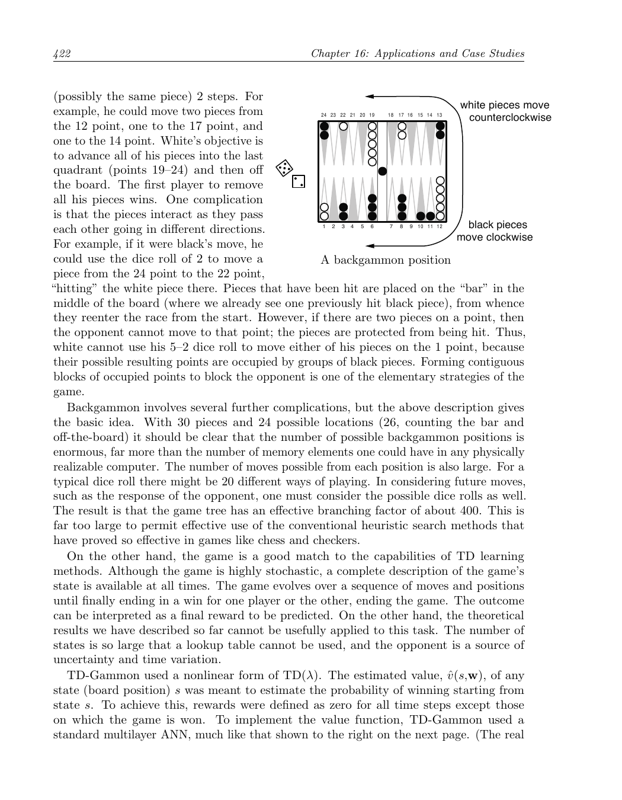
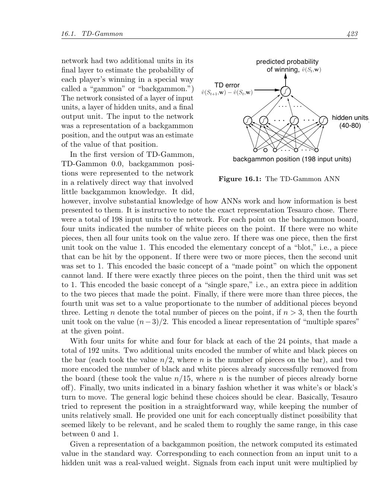
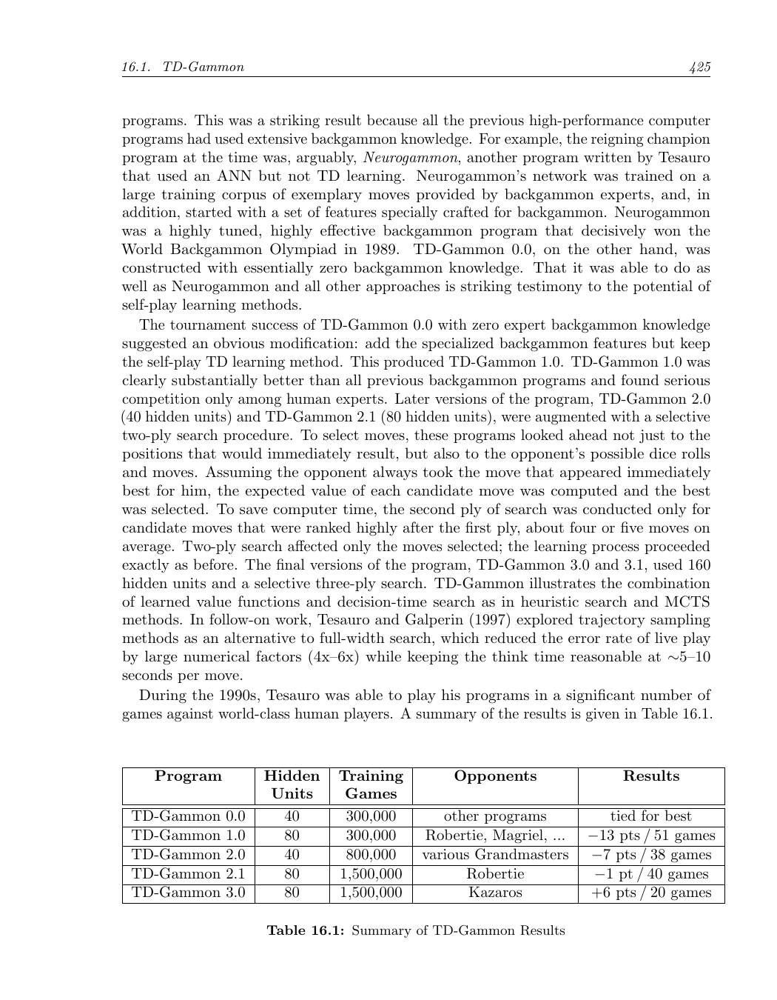
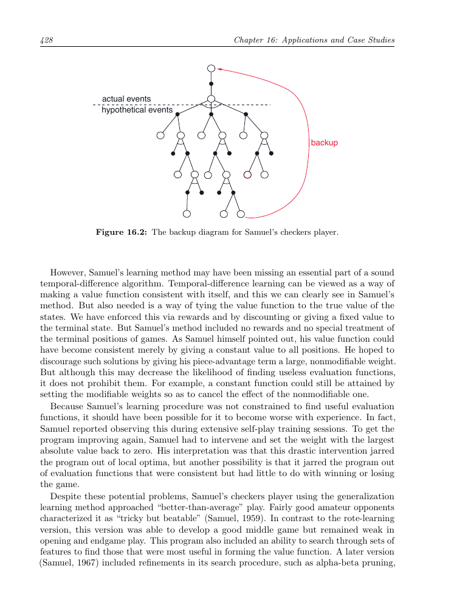
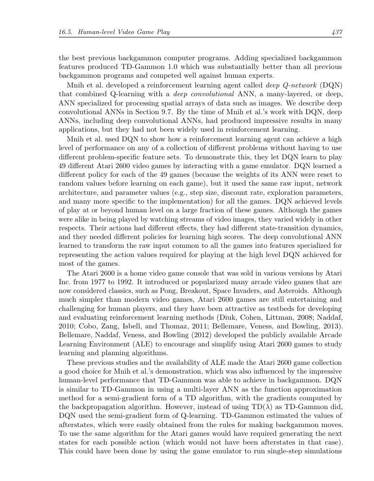
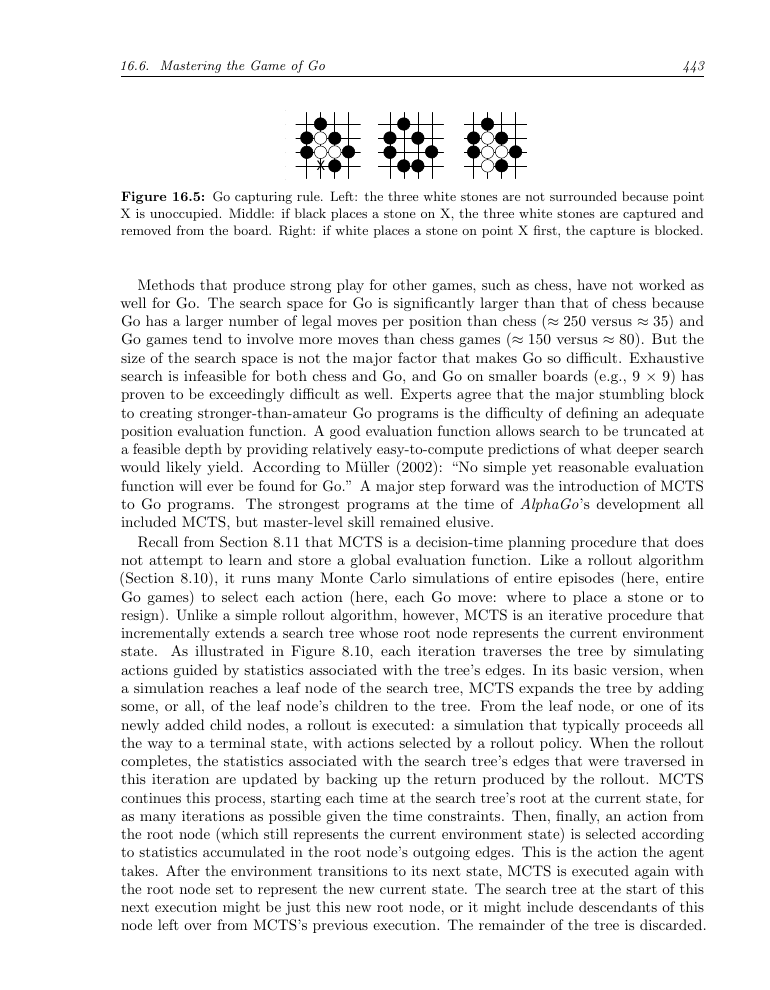
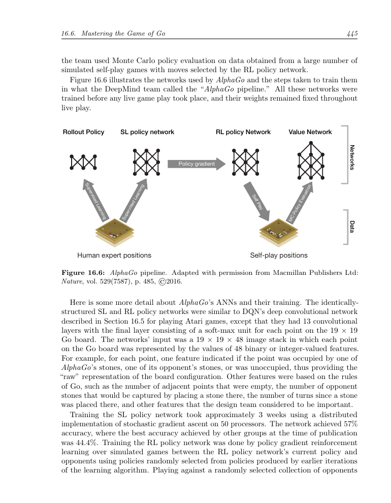
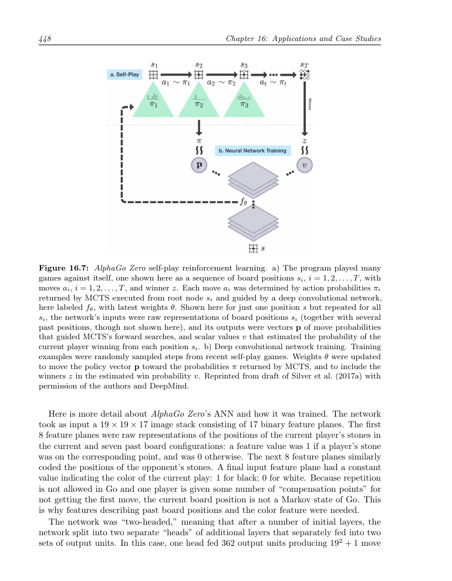
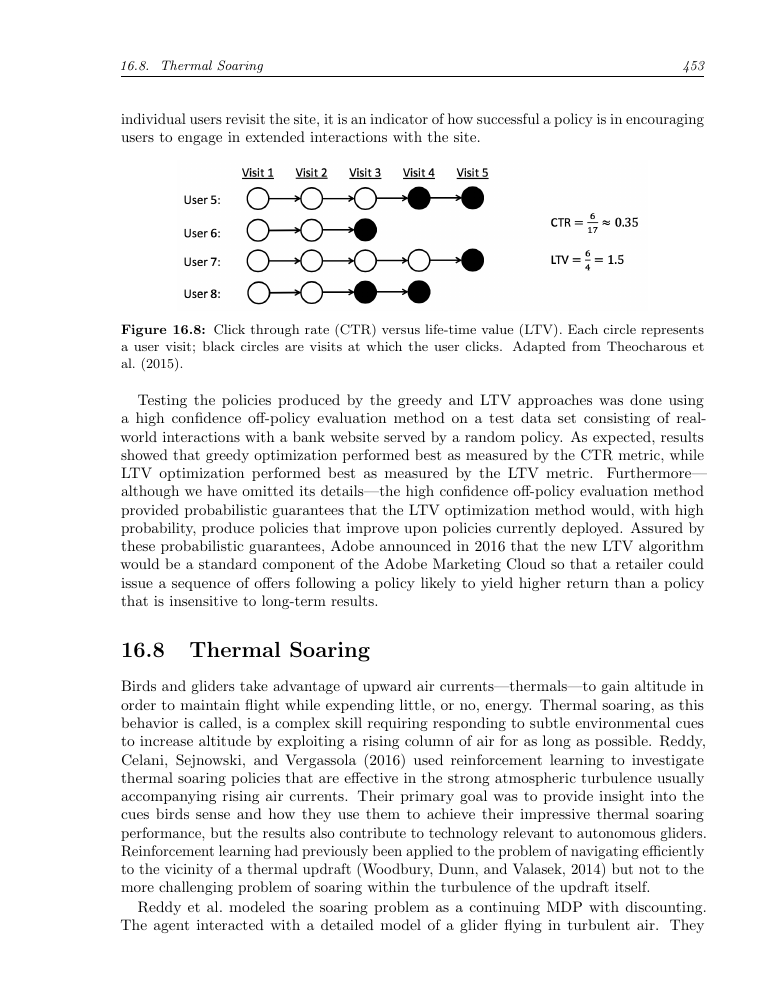
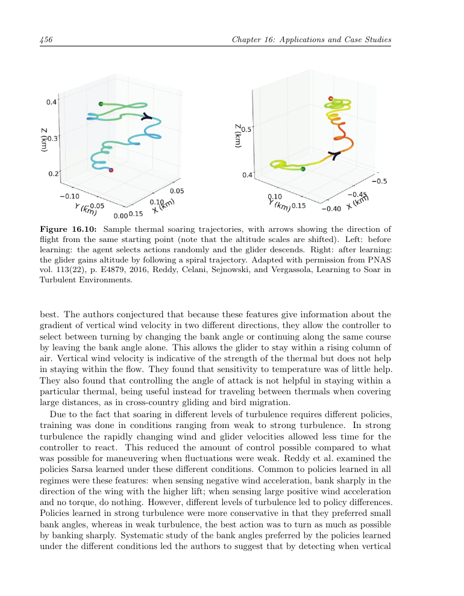

第16章 应用及案例分析
====================================

本章介绍几个强化学习案例。其中一些是具有潜在经济价值的大型应用；Samuel 的跳棋程序则主要具有历史意义。我们希望借此说明真实应用中常见的权衡与问题，特别是领域知识如何融入问题的形式化与求解，以及状态表示为何常常决定应用能否成功。

16.1 TD-Gammon
----------------------

迄今最令人印象深刻的强化学习应用之一，是 Gerald Tesauro 将强化学习用于西洋双陆棋（Tesauro, 1992, 1994, 1995, 2002）。Tesauro 的程序 TD-Gammon 几乎不需要双陆棋知识，却学会了非常高水平的棋艺，接近世界顶尖大师。它将 TD(λ) 与非线性函数近似结合起来，用反向传播 TD 误差训练多层人工神经网络。

双陆棋有 24 个位置（称为“点”），双方各有 15 枚棋子。白方要将所有棋子推进到最后一个区域（19--24 点），再移出棋盘；首先移出全部棋子的一方获胜。双方棋子朝相反方向移动，因此会相互击打。被击中的棋子放到棋盘中央的“杆”上，之后必须从起点重新进入。如果某一点已有两枚对手棋子，对手就不能走到那里。用连续占据的点阻挡对手，是双陆棋的基本策略。

   双陆棋局面（原书第 422 页截图）。

双陆棋的局面数极其庞大，传统启发式搜索难以直接使用。另一方面，它非常适合 TD 学习：任意时刻都可以获得完整状态，游戏由一系列局面组成，最终以一方获胜结束，结果可以看作需要预测的最终奖励。TD-Gammon 用非线性值函数估计从局面 ``s`` 开始获胜的概率；除获胜时刻外，所有奖励均为 0。

在 TD-Gammon 0.0 中，局面表示几乎不包含双陆棋专门知识。每个点用四个单元表示白棋数量，再用四个单元表示黑棋数量；另外两个单元表示杆上的棋子，两个单元表示已经移出棋盘的棋子，最后两个单元表示轮到哪一方走，共 198 个输入单元。网络包含输入层、隐藏层和输出层，输出是局面的胜率估计。

   TD-Gammon 的人工神经网络结构（原书第 423 页截图）。

隐藏单元使用 sigmoid 非线性函数：

.. math::

   h(j)=\sigma\left(\sum_i w_{ij}x_i\right)=\frac{1}{1+e^{-\sum_i w_{ij}x_i}}.

TD-Gammon 使用半梯度 TD(λ)，并通过反向传播计算梯度：

.. math::

   \mathbf w_{t+1}\doteq\mathbf w_t+\alpha\left[R_{t+1}+\gamma\hat v(S_{t+1},\mathbf w_t)-\hat v(S_t,\mathbf w_t)\right]\mathbf z_t,

其中 :math:`\mathbf z_t` 是资格迹向量，按 :math:`\mathbf z_t\doteq\gamma\lambda\mathbf z_{t-1}+\nabla\hat v(S_t,\mathbf w_t)` 更新，且 :math:`\mathbf z_0=0`。双陆棋中 :math:`\gamma=1`，除获胜外奖励为 0，因此 TD 误差通常就是相邻两个局面估计值之差。

Tesauro 让程序与自己对弈生成训练数据。每次掷骰后，程序评估约 20 种走法及其结果局面，选择估计价值最高的走法；双方都由程序执子，所以可以自动生成大量棋局。每局是一个情节，连续局面是 :math:`S_0,S_1,S_2,\ldots`，程序在每一步后增量更新网络。

网络权重初始为很小的随机值，初期走法很差，棋局常持续数百甚至数千步。但几十局后性能迅速提升。自我对弈约 30 万局后，TD-Gammon 0.0 已达到当时最好的双陆棋程序的大致水平。此前的高性能程序都依赖大量专家知识；例如 Neurogammon 使用专家示范走法和专门设计的特征进行训练。TD-Gammon 几乎没有双陆棋知识却取得相当水平，显示了自我对弈学习的潜力。

加入专门特征后得到 TD-Gammon 1.0，它明显优于此前程序，真正的竞争者只剩人类专家。TD-Gammon 2.0 和 2.1 增加选择性的两层搜索：除查看当前走法后的局面，还考虑对手下一次掷骰和走法；第二层只用于第一层排名靠前的候选走法。TD-Gammon 3.0 和 3.1 使用更多隐藏单元及选择性的三层搜索。这说明学习到的值函数可以与决策时搜索结合。后续轨迹采样工作使实战错误率降低约 4--6 倍，同时将每步思考时间保持在约 5--10 秒。

   TD-Gammon 的训练与比赛结果（原书第 425 页截图）。

20 世纪 90 年代，Tesauro 让这些程序与世界级人类选手进行了大量比赛。TD-Gammon 0.0 用 40 个隐藏单元训练 30 万局，已与其他最佳程序相当；TD-Gammon 1.0 用 80 个隐藏单元训练 30 万局，在 51 局比赛中对 Robertie、Magriel 等取得约 +13 分；2.0 用 40 个隐藏单元训练 80 万局，对多位大师取得约 +7 分（38 局）；2.1 用 80 个隐藏单元训练 150 万局，对 Robertie 约 +1 分（40 局）；3.0 用 80 个隐藏单元训练 150 万局，对 Kazaros 取得 +6 分（20 局）。

基于这些结果以及双陆棋大师的分析，TD-Gammon 3.0 的棋力接近、甚至可能超过当时世界上最强的人类棋手。Tesauro 后来比较了 TD-Gammon 3.1 与顶尖人类棋手在走子和加倍决策上的表现：程序在走子上具有“压倒性优势”，在加倍上也有“轻微优势”。

16.2 Samuel 的跳棋程序
----------------------------

Arthur Samuel 的跳棋程序是强化学习早期最重要的案例之一。程序用博弈树搜索选择走法，并为每个局面计算一个评估分数。轮到程序走时，它枚举合法走法，递归地假定对手会选择使程序得分最低的走法；程序则选择能使这个最坏情形得分最大的走法。这就是极大极小（minimax）思想。搜索到根节点时，得到的是在假定对手使用相同评估标准下的最佳走法。

Samuel 将搜索树中通过后继局面得到的分数称为局面的“回溯分数”（backed-up score）。有些版本还使用类似 alpha-beta 剪枝的搜索控制方法。Samuel 主要使用两种学习方法，其中最简单的一种称为“记忆学习”（rote learning）：将局面及其搜索得到的分数存入表中，在以后再次遇到相同局面时直接查表。

   Samuel 跳棋程序的回溯图（原书第 428 页截图）。

记忆学习可以保存搜索结果，但不能充分利用相似局面之间的关系。Samuel 后来使用监督式的“棋谱学习”（book learning）以及分层查找表（signature tables）来表示值函数。该版本比 1959 年的程序强得多，虽然还未达到大师水平。Samuel 的跳棋程序被普遍认为是人工智能和机器学习史上的重要成就。

16.3 Watson 的 Daily Double 押注
--------------------------------------

IBM Watson 在 Jeopardy! 问答节目中的成功，是另一个将强化学习用于复杂决策的案例。这里的关键决策包括 Daily Double（DD）格子的选择以及押注金额。每当 Watson 选择 DD 格子时，它为每个合法的整美元押注计算动作价值 :math:`\hat q(s,\mathrm{bet})`，该值估计在当前游戏状态 ``s`` 下最终获胜的概率；除风险控制措施外，程序选择动作价值最大的押注。

Watson 的动作价值由两类估计共同得到：一类估计答对当前问题的概率，另一类估计答错后对最终胜负的影响。系统必须综合当前分数、剩余题目、对手分数和可能的答题结果，而不能只追求立即收益。

为什么不采用 TD-Gammon 式自我对弈来学习值函数？因为 Watson 与人类选手差异很大，自我对弈会探索不符合人类比赛的状态区域；而且 Jeopardy! 是不完全信息游戏，选手不知道影响对手行为的全部信息。因而 Watson 主要依赖历史比赛数据、模拟和离策略评估，并将风险与置信度显式纳入决策。

16.4 优化内存控制
----------------------------

大多数计算机使用动态随机存取存储器（DRAM）作为主存，因为它成本低、容量大。内存控制器负责在处理器和片外 DRAM 之间高效安排访问请求。控制器维护一个事务队列，并在大量时序和资源约束下发出命令。调度策略会显著影响平均访问延迟和系统吞吐量。

Ipek 等人将内存控制建模为 MDP。状态包含队列中的请求、正在处理的事务、DRAM 行状态以及时序信息；动作是从当前合法命令中选择一个。为保证系统完整性，任何会违反时序或资源约束的动作都被排除，即合法动作集合 :math:`A(S_t)` 随状态变化。

他们使用线性函数近似和 tile coding 表示动作价值，并在硬件仿真中在线更新。典型的 4 GHz 四核处理器每个 DRAM 周期约有 10 个处理器周期可用，最多可以评估约 12 个动作；合法命令通常不超过这个数量，因此即使不能在每个周期评估所有动作，性能损失也很小。

在线学习的控制器在九个基准应用上的平均性能比预先固定策略高约 8%，说明在线适应是方法的重要组成部分。虽然该控制器最终没有投入物理硬件（主要因为制造成本很高），但实验有力地说明了强化学习能够优化复杂硬件调度。

16.5 达到人类水平的电子游戏
--------------------------------------

Mnih 等人提出深度 Q 网络（DQN），将 Q-learning 与深度卷积人工神经网络结合起来，用于处理 Atari 游戏画面。输入不是人工设计的棋盘特征，而是连续的像素帧。为减少部分可观测性，程序将相邻的四帧堆叠为一个 :math:`84\times84\times4` 的输入；除裁剪、缩放和灰度化外，不使用游戏专门知识。

DQN 使用卷积层提取空间特征，输出每个可行动作的 Q 值。它采用经验回放，将过去的转移随机抽样组成小批量，以打破连续样本的相关性；还使用独立的目标网络，周期性复制在线网络参数，从而稳定 Q-learning 的目标。梯度通过小批量累积后更新，并使用 RMSProp 为不同权重调整步长。

   DQN 案例页面截图（原书第 437 页）。

实验表明，经验回放和目标网络各自都能显著提升性能，同时使用时效果更明显。深度卷积网络还显著优于较浅的网络和手工特征。DQN 在多款 Atari 游戏上达到或超过人类测试者水平，展示了从原始视觉输入中学习控制策略的可能性。

16.6 掌握围棋
----------------------

围棋每个局面的合法走法约 250 个，远大于国际象棋的约 35 个；棋盘更大、局面更复杂，传统搜索方法难以达到职业水平。AlphaGo 将蒙特卡洛树搜索（MCTS）与深度卷积网络学习到的策略和值函数结合起来，并先用大量人类专家棋谱进行监督学习，再通过自我对弈强化学习改进。

   围棋提子规则示意图（原书第 443 页截图）。

AlphaGo 的策略网络给出候选走法概率，值网络估计局面胜率。MCTS 使用策略网络优先扩展有希望的走法，并用值网络和快速 rollout 共同评估叶节点。训练流程包括：用专家棋谱训练监督式策略网络；让策略网络相互对弈，得到强化学习策略网络；用自我对弈结果训练值网络。

   AlphaGo 的训练流程截图（原书第 445 页）。

强化学习策略网络通过大量并行自我对弈训练。奖励为获胜 +1、失败 -1、其他情况为 0。最终策略在测试中击败监督式策略超过 80%，并击败每步模拟 100,000 局的围棋程序约 85%。实验还显示，值网络与 rollout 的结合比仅使用 rollout 更强：值网络负责评估高性能但速度较慢的策略，快速 rollout 则为具体局面提供额外精度。

AlphaGo Zero 进一步去掉了人类棋谱和人工特征。它从随机网络权重开始，直接以原始棋盘为输入；网络同时输出走法概率向量和当前玩家获胜概率。MCTS 生成的搜索概率作为策略训练目标，最终胜负作为值训练目标。网络采用残差卷积结构和随机梯度下降，在自我对弈中不断更新。

   AlphaGo Zero 自我对弈训练示意图（原书第 448 页截图）。

AlphaGo Zero 的较大网络达到约 5,185 的 Elo 评分，并在 100 局比赛中以 89 比 11 击败使用人类数据和特征的 AlphaGo Master。这是从随机初始化开始、仅靠自我对弈强化学习获得超强棋力的有力证据。

16.7 个性化 Web 服务
--------------------------------

个性化推荐可以建模为 MDP，目标是在用户多次访问网站的过程中最大化总点击数。上下文 bandit 方法通常是贪心的：它只考虑当前访问的点击概率，把每次访问当作从总体中独立抽取的新用户，因此忽略了长期影响。

更合理的目标是用户生命周期价值（LTV）：一次访问中的动作可能影响用户未来是否继续访问。状态可以包含用户最近访问时间、历史访问次数、最近一次点击、地理位置、兴趣和人口统计特征；点击奖励为 1，否则为 0。研究者在银行营销数据上比较了贪心策略与 LTV 策略，并使用高置信度的离策略评估，而不是直接在线冒险。

   点击率（CTR）与生命周期价值（LTV）的关系（原书第 453 页截图）。

结果表明，单纯提高当前点击率并不总能带来更高的长期价值；有些动作会牺牲一次点击，却增加用户后续访问。将长期用户参与度纳入目标，能够得到更稳定的个性化策略。

16.8 热气流翱翔
----------------------------

滑翔机可以利用热气流上升，但真实环境中的气流、湍流和风速变化很复杂。Reddy 等人建立了三维物理模拟，在一公里见方的空间中用包含速度、温度和压力的偏微分方程生成热气流及湍流。智能体的状态包括滑翔机相对于气流的运动信息，动作是调整飞行方向和倾角。

最初的奖励只在情节结束时根据获得的高度给出，触地时给予大额负奖励，其余为 0；对于真实长度的情节，这种稀疏奖励难以学习。研究者随后设计了更及时的奖励和低维状态表示，使智能体能够学会围绕上升气流盘旋并持续获得高度。

   学习前后的热气流翱翔轨迹：学习后滑翔机沿螺旋轨迹获得高度（原书第 456 页截图）。

实验还研究了折扣率 :math:`\gamma` 的影响。一个情节中获得的高度随 :math:`\gamma` 增大而提高，在 :math:`\gamma=0.99` 左右达到最大，说明有效的热气流翱翔必须考虑控制决策的长期后果。该案例说明，真实物理系统中的强化学习不仅依赖算法，也高度依赖状态表示、奖励塑形和模拟器的质量。
