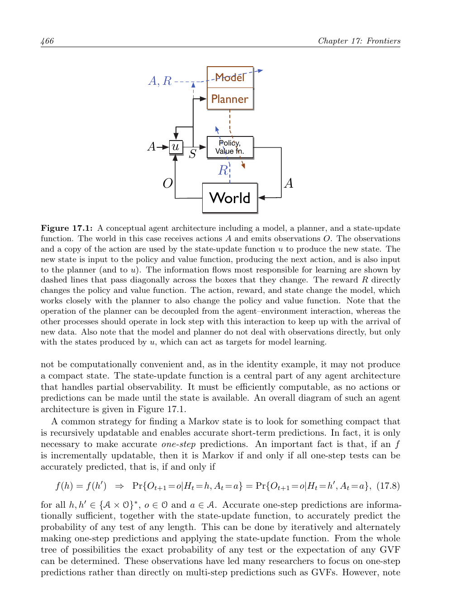

第17章 前沿技术
==================

本章最后讨论一些超出本书范围、但对强化学习未来尤其重要的主题。它们有些超出了目前可靠的知识边界，有些甚至超出了 MDP 框架。

17.1 广义价值函数与辅助任务
------------------------------------

贯穿全书，我们对价值函数的理解逐渐变得非常一般。离策略学习允许价值函数以任意目标策略为条件；第 12.8 节又把折扣推广为终止函数。因此，一个预测问题可以由四个要素描述：状态、目标策略、伪奖励信号和终止函数。这样的价值函数称为广义价值函数（GVF），它可以预测任何在策略下累积的、带终止机制的信号，而不必局限于外部长期奖励。

GVF 仍然是价值函数的形式，因此可以用本书介绍的近似价值函数方法学习。除了学习预测，智能体还可以用广义策略迭代或演员--评论家方法学习最大化这些预测的策略。这样，智能体就能同时预测和控制许多信号，而不仅仅是长期奖励。

这些额外预测是“辅助任务”：它们服务于主任务之外的目标。多样化的预测可以改善表示学习，使智能体获得关于环境结构的丰富知识，也能为控制提供更及时的信号。例如，自动驾驶汽车可以预测继续前进是否会碰撞，并在预测超过阈值时自动刹车或转向；扫地机器人可以预测在返回充电器前是否会耗尽电量，并在预测变为非零时返回充电器。正确的预测必须考虑房屋大小、机器人所在房间和电池年龄，这些因素很难由设计者预先写死。

预测和控制辅助信号的统一框架，是把“预测什么”与“如何行动”结合起来的一种方式。设计者可以指定伪奖励和终止条件，智能体则用统一的学习算法获得预测与策略。未来的重要问题包括：如何自动发现有用的辅助任务，如何避免辅助任务彼此冲突，以及如何让辅助预测真正促进主任务的泛化和样本效率。

17.2 通过 Options 实现时间抽象
----------------------------------------

普通动作只执行一个时间步，但很多有用行为会持续多个时间步，例如“向充电器移动”“沿走廊行走”或“把球运到篮下”。Options 形式化把这类持续行为加入动作空间。一个 option :math:`\omega` 由三个部分组成：内部策略 :math:`\pi_\omega`、终止函数 :math:`\beta_\omega`，以及可启动该 option 的状态集合 :math:`I_\omega`。当 option 被选中后，内部策略持续选择底层动作，直到终止函数决定结束。

底层动作本身也可以看作特殊 option：其内部策略总是选择同一个动作，终止函数在一步后终止。因而 agent 可以在一个时间步选择普通动作，也可以选择执行许多时间步的扩展动作。Options 有效地扩展了动作空间，同时保留了与底层动作互换的形式。

每个 option 还可以用模型描述：模型给出终止时到达各状态的概率，以及从启动到终止期间累计奖励的期望。由此可以写出适用于普通动作和扩展 option 的 Bellman 方程，并发展层次化策略的动态规划算法。层次化策略在每个状态选择 option，option 内部再执行低层策略。

Options 带来了时间抽象：高层策略不必在每一步重新决定，而可以调用已经学会的行为单元。关键研究问题包括如何发现 option、如何学习 option 的内部策略和终止条件、如何进行 option 内学习，以及如何在函数近似下稳定地完成离策略更新。

17.3 观察与状态
----------------------------

本书通常把价值函数和策略写成环境状态的函数，但这限制了方法的适用范围。现实智能体通常只能看到观察，而看不到完整状态；环境可能是部分可观测的。设在时间 ``t`` 的观察为 :math:`O_t`，动作和观察的历史定义为

.. math::

   H_t\doteq A_0,O_1,\ldots,A_{t-1},O_t.

历史包含数据流中关于过去的全部信息，但会随时间增长，难以直接使用。状态的思想就是把历史压缩成对预测未来有用的摘要：:math:`S_t=f(H_t)`。如果摘要保留了预测未来所需的全部信息，它就是 Markov 状态。

在部分可观测 MDP 中，环境有一个隐藏状态 :math:`X_t`，它产生观察但不能被 agent 直接访问。Bayesian belief state 用历史计算隐藏状态的后验分布，因此理论上是 Markov 的；但 belief state 往往是高维连续对象，精确计算和表示都很困难。实践中通常必须接受近似状态，例如只使用最近一次观察，或使用最近 ``k`` 次观察和动作。

   观察与状态表示的关系示意图（原书第 466 页截图）。

近似状态会使单步预测和长期预测产生误差。若单步模型有一点误差，反复迭代可能导致长期预测急剧偏离真实结果；而从单步预测计算长期预测本身也可能随预测长度呈指数级复杂。未来需要能从观察学习紧凑、稳定且可泛化的状态表示，并在不完全信息下同时学习预测和控制。

17.4 设计奖励信号
----------------------------

强化学习相对于监督学习的优势之一，是不需要详细指定正确动作。然而应用成败高度依赖奖励信号是否准确表达设计者的目标，以及是否合理衡量目标进展。因此，设计奖励信号是强化学习应用的关键环节。奖励信号是环境的一部分，应该描述 agent 真正希望优化的结果，而不是设计者认为方便测量的替代指标。

稀疏奖励会使探索困难，但简单地为设计者认为重要的子目标增加奖励，可能导致 agent 找到与总体目标不一致的策略。更安全的指导方式是保持奖励不变，改为给价值函数近似提供合理的初始估计。例如，可以初始化为对最优价值函数的粗略猜测，或为某些区域提供先验值，让学习从有意义的估计开始，而不改变最终优化目标。

另一条路线是逆强化学习：从专家行为反推出能够解释这些行为的奖励函数。它有时比直接监督学习更能利用专家示范，因为它试图恢复专家在长期决策中真正优化的目标。但该方法通常需要环境动力学、特征表示和多次求解 MDP 等假设，计算代价较高。

奖励也可能依赖 agent 内部因素，例如动机、记忆、想法、学习进度，甚至内部模拟或幻觉。由此产生了“内在动机强化学习”：agent 不只为了外部结果，也会为了信息增益、新奇性、预测误差或能力提升而行动。如何让内在奖励帮助探索、又不压过外部任务，是重要的设计问题。

17.5 尚未解决的问题
----------------------------

深度学习扩展了强化学习能处理的感知规模，但表示学习仍是瓶颈。我们需要学习能够支持后续泛化的特征，而不仅仅是拟合当前任务；这与表示学习、构造归纳和元学习密切相关。理想的 agent 应从经验中学习“如何学习”，使未来任务更快、更可靠。

另一个问题是模型和规划。学习完整环境模型可能很昂贵，模型中的小误差在长规划中会累积；但完全不使用模型又会浪费可预测结构。未来需要选择性地构造模型，只学习对当前规划真正有用的部分，并控制模型复杂度。

还需要自动选择任务。传统机器学习由人类预先指定任务，代码可以围绕固定任务设计。更长期的目标是让 agent 自己决定要掌握哪些子任务，既可以为当前任务建立行为积木，也可以学习可能对未来未知任务有用的能力。任务发现、课程学习和技能组合将成为持续学习的重要组成部分。

最后，强化学习仍需要更可靠的离策略学习、更好的探索机制、更稳定的函数近似，以及能在数据和计算有限时工作的算法。不同问题往往需要不同的表示、奖励和时间抽象，如何自动获得这些结构，是通向更通用智能体的核心挑战。

17.6 强化学习与人工智能的未来
----------------------------------------

第一版写作时，人工智能的许多影响还只是愿景；如今机器学习已经成为人工智能的核心技术，并正在改变数百万人的生活。强化学习在决策支持、机器人、游戏和资源管理中显示出巨大潜力，尤其适合处理连续决策、延迟结果和长期权衡。

但能力提升也带来风险。优化系统可能找到设计者没有预料到的方式来获得奖励，其中一些方式可能不希望、甚至危险。当我们只通过奖励信号间接说明目标时，在学习完成之前无法知道 agent 会多大程度满足真正意图。这是奖励设计中的“目标错配”问题，也与更广泛的 AI 安全问题相连。

因此，未来系统需要更好的目标表达、约束、监督和可解释性；需要把人类反馈、安全规则和不确定性估计纳入学习过程；还需要在真实物理环境中采用经过验证的控制与缓解措施。控制工程中的安全设计、故障保护和自适应控制可以为强化学习提供重要基础。

强化学习最终要嵌入真实环境，就必须让探索和优化在可接受的风险范围内进行。我们既是未来的设计者，也是技术后果的承担者。通过谨慎选择目标、奖励和部署方式，可以让强化学习的能力服务于更广泛、更可靠的人工智能。
